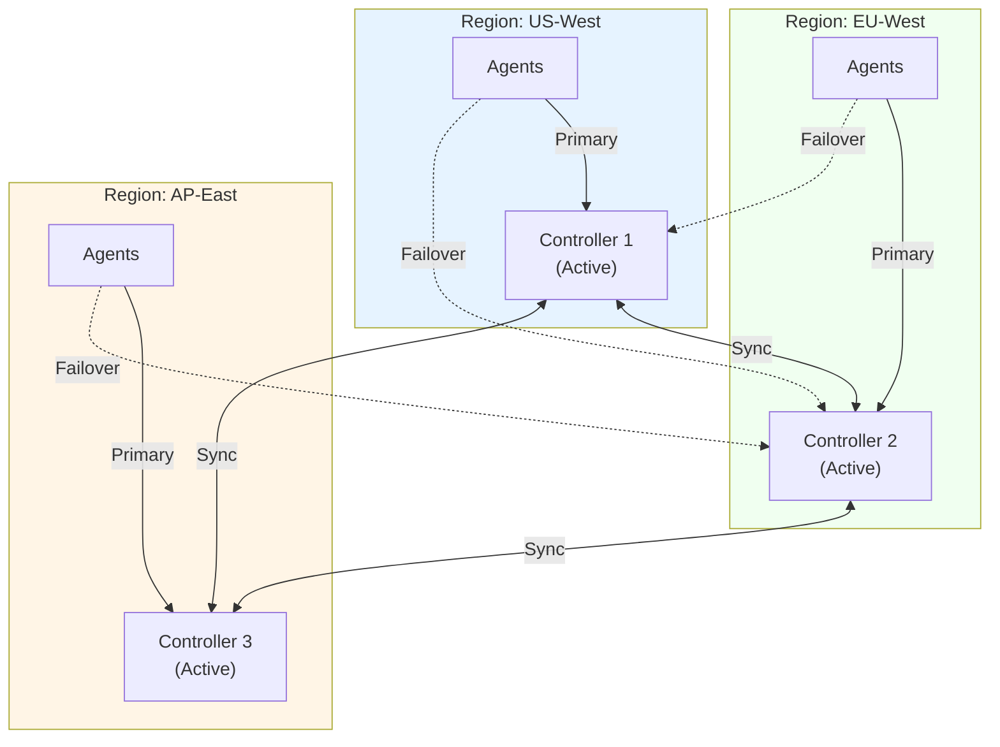
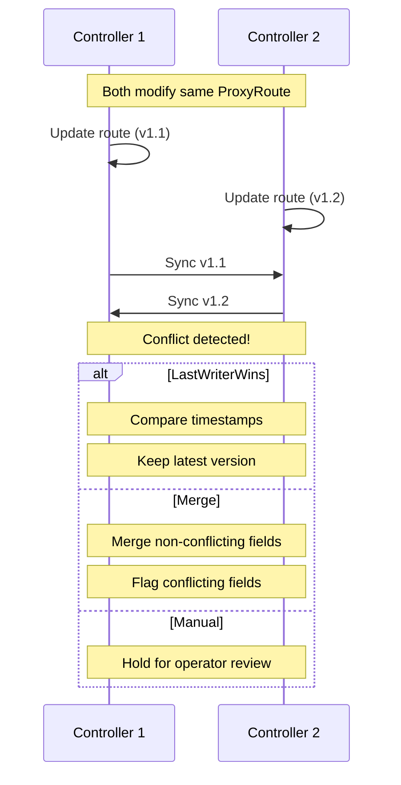
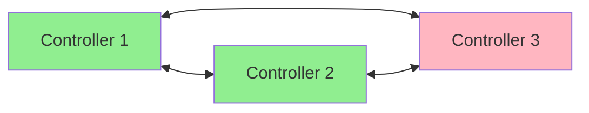
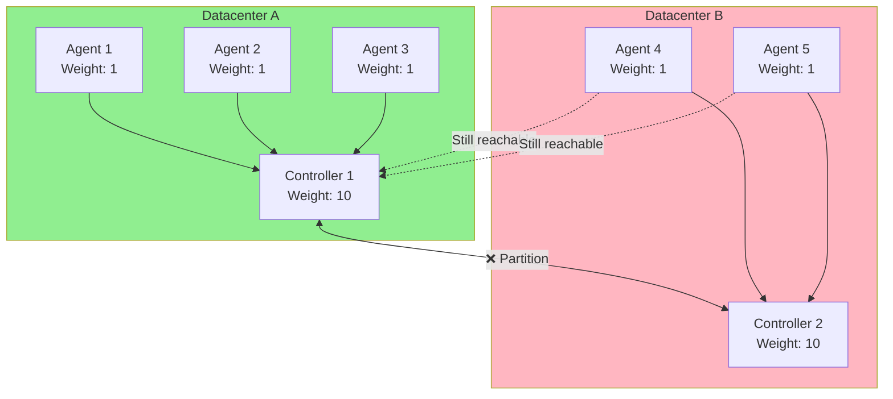

# Federation Setup Guide

This guide provides step-by-step instructions for deploying a federated NovaEdge control plane with multiple active controllers that synchronize configuration in real-time.

## Overview

A federated deployment enables:

- **Active-Active Controllers**: All controllers accept configuration changes
- **Automatic Synchronization**: Changes propagate to all federation members
- **Agent Failover**: Agents automatically connect to healthy controllers
- **Split-Brain Protection**: Quorum-based write fencing during partitions
- **Disaster Recovery**: Continue operating even when regions are unavailable

!!! info "When to Use Federation"
    Use federation when you need:

    - High availability across geographic regions
    - No single point of failure for the control plane
    - Active-active configuration management
    - Automatic disaster recovery

    For simpler deployments with a single control plane, see [Multi-Cluster Guide](multi-cluster.md).

## Prerequisites

- Kubernetes 1.29+ on all clusters
- NovaEdge v0.1.0+ installed on each cluster
- Network connectivity between controllers (gRPC port 9090)
- TLS certificates for secure controller-to-controller communication
- cert-manager (recommended) for certificate management

## Architecture



## Step 1: Deploy Controllers in Each Region

First, deploy NovaEdge on each cluster that will participate in the federation:

=== "US-West Cluster"

    ```bash
    # Switch to us-west cluster
    kubectl config use-context us-west-cluster

    # Install the operator
    helm install novaedge-operator ./charts/novaedge-operator \
      --namespace novaedge-system \
      --create-namespace

    # Create NovaEdgeCluster
    kubectl apply -f - <<EOF
    apiVersion: novaedge.io/v1alpha1
    kind: NovaEdgeCluster
    metadata:
      name: novaedge
      namespace: novaedge-system
    spec:
      version: "v0.1.0"
      controller:
        replicas: 1
        grpcPort: 9090
      agent:
        hostNetwork: true
        vip:
          enabled: true
          mode: L2
      tls:
        enabled: true
        certManager:
          enabled: true
          issuerRef:
            name: novaedge-ca-issuer
            kind: ClusterIssuer
    EOF
    ```

=== "EU-West Cluster"

    ```bash
    # Switch to eu-west cluster
    kubectl config use-context eu-west-cluster

    # Install the operator
    helm install novaedge-operator ./charts/novaedge-operator \
      --namespace novaedge-system \
      --create-namespace

    # Create NovaEdgeCluster
    kubectl apply -f - <<EOF
    apiVersion: novaedge.io/v1alpha1
    kind: NovaEdgeCluster
    metadata:
      name: novaedge
      namespace: novaedge-system
    spec:
      version: "v0.1.0"
      controller:
        replicas: 1
        grpcPort: 9090
      agent:
        hostNetwork: true
        vip:
          enabled: true
          mode: L2
      tls:
        enabled: true
        certManager:
          enabled: true
          issuerRef:
            name: novaedge-ca-issuer
            kind: ClusterIssuer
    EOF
    ```

=== "AP-East Cluster"

    ```bash
    # Switch to ap-east cluster
    kubectl config use-context ap-east-cluster

    # Install the operator
    helm install novaedge-operator ./charts/novaedge-operator \
      --namespace novaedge-system \
      --create-namespace

    # Create NovaEdgeCluster
    kubectl apply -f - <<EOF
    apiVersion: novaedge.io/v1alpha1
    kind: NovaEdgeCluster
    metadata:
      name: novaedge
      namespace: novaedge-system
    spec:
      version: "v0.1.0"
      controller:
        replicas: 1
        grpcPort: 9090
      agent:
        hostNetwork: true
        vip:
          enabled: true
          mode: L2
      tls:
        enabled: true
        certManager:
          enabled: true
          issuerRef:
            name: novaedge-ca-issuer
            kind: ClusterIssuer
    EOF
    ```

## Step 2: Expose Controllers for Federation

Each controller needs to be accessible from other federation members:

```yaml
# Apply on each cluster
apiVersion: v1
kind: Service
metadata:
  name: novaedge-controller-federation
  namespace: novaedge-system
spec:
  type: LoadBalancer
  ports:
    - name: grpc
      port: 9090
      targetPort: 9090
    - name: federation
      port: 9091
      targetPort: 9091
  selector:
    app.kubernetes.io/name: novaedge-controller
```

Get the external endpoints:

```bash
# On each cluster, get the external IP/hostname
kubectl get svc novaedge-controller-federation -n novaedge-system \
  -o jsonpath='{.status.loadBalancer.ingress[0].ip}'
```

Record the endpoints:
- US-West: `controller.us-west.example.com:9090`
- EU-West: `controller.eu-west.example.com:9090`
- AP-East: `controller.ap-east.example.com:9090`

## Step 3: Generate Federation TLS Certificates

Create mTLS certificates for controller-to-controller authentication:

```yaml
# Federation CA (apply on one cluster, then distribute)
apiVersion: cert-manager.io/v1
kind: Certificate
metadata:
  name: novaedge-federation-ca
  namespace: novaedge-system
spec:
  isCA: true
  secretName: novaedge-federation-ca
  commonName: novaedge-federation-ca
  duration: 87600h  # 10 years
  privateKey:
    algorithm: ECDSA
    size: 256
  issuerRef:
    name: selfsigned-issuer
    kind: ClusterIssuer
---
apiVersion: cert-manager.io/v1
kind: Issuer
metadata:
  name: novaedge-federation-issuer
  namespace: novaedge-system
spec:
  ca:
    secretName: novaedge-federation-ca
```

Generate certificates for each controller:

=== "US-West Certificate"

    ```yaml
    apiVersion: cert-manager.io/v1
    kind: Certificate
    metadata:
      name: novaedge-federation-us-west
      namespace: novaedge-system
    spec:
      secretName: novaedge-federation-us-west-tls
      duration: 8760h  # 1 year
      renewBefore: 720h  # 30 days
      subject:
        organizations:
          - NovaEdge Federation
      commonName: us-west-controller
      dnsNames:
        - controller.us-west.example.com
        - us-west-controller
      usages:
        - server auth
        - client auth
      issuerRef:
        name: novaedge-federation-issuer
        kind: Issuer
    ```

=== "EU-West Certificate"

    ```yaml
    apiVersion: cert-manager.io/v1
    kind: Certificate
    metadata:
      name: novaedge-federation-eu-west
      namespace: novaedge-system
    spec:
      secretName: novaedge-federation-eu-west-tls
      duration: 8760h
      renewBefore: 720h
      subject:
        organizations:
          - NovaEdge Federation
      commonName: eu-west-controller
      dnsNames:
        - controller.eu-west.example.com
        - eu-west-controller
      usages:
        - server auth
        - client auth
      issuerRef:
        name: novaedge-federation-issuer
        kind: Issuer
    ```

=== "AP-East Certificate"

    ```yaml
    apiVersion: cert-manager.io/v1
    kind: Certificate
    metadata:
      name: novaedge-federation-ap-east
      namespace: novaedge-system
    spec:
      secretName: novaedge-federation-ap-east-tls
      duration: 8760h
      renewBefore: 720h
      subject:
        organizations:
          - NovaEdge Federation
      commonName: ap-east-controller
      dnsNames:
        - controller.ap-east.example.com
        - ap-east-controller
      usages:
        - server auth
        - client auth
      issuerRef:
        name: novaedge-federation-issuer
        kind: Issuer
    ```

### Distribute Certificates

Export the CA and peer certificates, then create secrets on each cluster:

```bash
# Export Federation CA (from the cluster where it was created)
kubectl get secret novaedge-federation-ca -n novaedge-system \
  -o jsonpath='{.data.ca\.crt}' | base64 -d > federation-ca.crt

# Export each controller's certificate
kubectl get secret novaedge-federation-us-west-tls -n novaedge-system \
  -o jsonpath='{.data.tls\.crt}' | base64 -d > us-west.crt
kubectl get secret novaedge-federation-us-west-tls -n novaedge-system \
  -o jsonpath='{.data.tls\.key}' | base64 -d > us-west.key

# Repeat for other regions...
```

Create CA secret on each cluster:

```bash
# On each cluster
kubectl create secret generic novaedge-federation-ca \
  --from-file=ca.crt=federation-ca.crt \
  -n novaedge-system
```

Create peer certificate secrets:

```bash
# On US-West cluster - create secrets for connecting to EU-West and AP-East
kubectl create secret tls novaedge-peer-eu-west \
  --cert=eu-west.crt --key=eu-west.key \
  -n novaedge-system

kubectl create secret tls novaedge-peer-ap-east \
  --cert=ap-east.crt --key=ap-east.key \
  -n novaedge-system
```

## Step 4: Create Federation Configuration

Apply the `NovaEdgeFederation` resource on each cluster. Each cluster needs its own configuration with the local member defined:

=== "US-West Cluster"

    ```yaml
    apiVersion: novaedge.io/v1alpha1
    kind: NovaEdgeFederation
    metadata:
      name: global-federation
      namespace: novaedge-system
    spec:
      federationID: "prod-global"

      # This controller's identity
      localMember:
        name: "us-west-controller"
        region: "us-west"
        zone: "us-west-2a"
        endpoint: "controller.us-west.example.com:9090"
        priority: 0  # Primary for local agents

      # Other federation members
      members:
        - name: "eu-west-controller"
          region: "eu-west"
          zone: "eu-west-1a"
          endpoint: "controller.eu-west.example.com:9090"
          priority: 100
          tls:
            enabled: true
            serverName: "eu-west-controller"
            caSecretRef:
              name: novaedge-federation-ca
            clientCertSecretRef:
              name: novaedge-peer-eu-west

        - name: "ap-east-controller"
          region: "ap-east"
          zone: "ap-east-1a"
          endpoint: "controller.ap-east.example.com:9090"
          priority: 200
          tls:
            enabled: true
            serverName: "ap-east-controller"
            caSecretRef:
              name: novaedge-federation-ca
            clientCertSecretRef:
              name: novaedge-peer-ap-east

      # Sync configuration
      sync:
        interval: "5s"
        timeout: "30s"
        batchSize: 100
        compression: true

      # Conflict resolution
      conflictResolution:
        strategy: "LastWriterWins"
        vectorClocks: true

      # Health checking
      healthCheck:
        interval: "10s"
        timeout: "5s"
        failureThreshold: 3
        successThreshold: 1
    ```

=== "EU-West Cluster"

    ```yaml
    apiVersion: novaedge.io/v1alpha1
    kind: NovaEdgeFederation
    metadata:
      name: global-federation
      namespace: novaedge-system
    spec:
      federationID: "prod-global"

      localMember:
        name: "eu-west-controller"
        region: "eu-west"
        zone: "eu-west-1a"
        endpoint: "controller.eu-west.example.com:9090"
        priority: 0

      members:
        - name: "us-west-controller"
          region: "us-west"
          zone: "us-west-2a"
          endpoint: "controller.us-west.example.com:9090"
          priority: 100
          tls:
            enabled: true
            serverName: "us-west-controller"
            caSecretRef:
              name: novaedge-federation-ca
            clientCertSecretRef:
              name: novaedge-peer-us-west

        - name: "ap-east-controller"
          region: "ap-east"
          zone: "ap-east-1a"
          endpoint: "controller.ap-east.example.com:9090"
          priority: 200
          tls:
            enabled: true
            serverName: "ap-east-controller"
            caSecretRef:
              name: novaedge-federation-ca
            clientCertSecretRef:
              name: novaedge-peer-ap-east

      sync:
        interval: "5s"
        timeout: "30s"
        batchSize: 100
        compression: true

      conflictResolution:
        strategy: "LastWriterWins"
        vectorClocks: true

      healthCheck:
        interval: "10s"
        timeout: "5s"
        failureThreshold: 3
        successThreshold: 1
    ```

=== "AP-East Cluster"

    ```yaml
    apiVersion: novaedge.io/v1alpha1
    kind: NovaEdgeFederation
    metadata:
      name: global-federation
      namespace: novaedge-system
    spec:
      federationID: "prod-global"

      localMember:
        name: "ap-east-controller"
        region: "ap-east"
        zone: "ap-east-1a"
        endpoint: "controller.ap-east.example.com:9090"
        priority: 0

      members:
        - name: "us-west-controller"
          region: "us-west"
          zone: "us-west-2a"
          endpoint: "controller.us-west.example.com:9090"
          priority: 100
          tls:
            enabled: true
            serverName: "us-west-controller"
            caSecretRef:
              name: novaedge-federation-ca
            clientCertSecretRef:
              name: novaedge-peer-us-west

        - name: "eu-west-controller"
          region: "eu-west"
          zone: "eu-west-1a"
          endpoint: "controller.eu-west.example.com:9090"
          priority: 200
          tls:
            enabled: true
            serverName: "eu-west-controller"
            caSecretRef:
              name: novaedge-federation-ca
            clientCertSecretRef:
              name: novaedge-peer-eu-west

      sync:
        interval: "5s"
        timeout: "30s"
        batchSize: 100
        compression: true

      conflictResolution:
        strategy: "LastWriterWins"
        vectorClocks: true

      healthCheck:
        interval: "10s"
        timeout: "5s"
        failureThreshold: 3
        successThreshold: 1
    ```

## Step 5: Configure Agent Failover

Update agents to support controller failover:

```yaml
apiVersion: novaedge.io/v1alpha1
kind: NovaEdgeCluster
metadata:
  name: novaedge
  namespace: novaedge-system
spec:
  agent:
    controllers:
      primary:
        endpoint: "controller.us-west.example.com:9090"
        tls:
          secretRef:
            name: novaedge-agent-cert

      secondary:
        - endpoint: "controller.eu-west.example.com:9090"
          priority: 100
          tls:
            secretRef:
              name: novaedge-agent-cert

        - endpoint: "controller.ap-east.example.com:9090"
          priority: 200
          tls:
            secretRef:
              name: novaedge-agent-cert

      failover:
        timeout: "30s"
        healthCheckInterval: "10s"
        failureThreshold: 3
        recoveryDelay: "60s"
        latencyAware: true

    # Autonomous mode configuration
    autonomousMode:
      enabled: true
      configPath: "/var/lib/novaedge/config.json"
```

## Step 6: Verify Federation Status

Check the federation status on each cluster:

```bash
# Check federation resource status
kubectl get novaedgefederation -n novaedge-system

# Output:
# NAME                FEDERATION-ID   PHASE     MEMBERS   SYNCED   AGE
# global-federation   prod-global     Healthy   3         3        5m

# Get detailed status
kubectl describe novaedgefederation global-federation -n novaedge-system
```

Use `novactl` for federation management:

```bash
# Check federation status
novactl federation status

# Output:
# Federation: prod-global
# Local Member: us-west-controller
# Phase: Healthy
#
# Members:
#   NAME                  REGION    STATUS    SYNC LAG   LAST SYNC   AGENTS
#   us-west-controller    us-west   Local     -          -           5
#   eu-west-controller    eu-west   Healthy   1.2s       3s ago      3
#   ap-east-controller    ap-east   Healthy   2.1s       5s ago      4

# List pending conflicts
novactl federation conflicts

# Force sync with a specific peer
novactl federation sync --peer eu-west-controller
```

## Step 7: Test Configuration Synchronization

Create a resource on one cluster and verify it syncs:

```bash
# On US-West cluster
kubectl apply -f - <<EOF
apiVersion: novaedge.io/v1alpha1
kind: ProxyRoute
metadata:
  name: test-route
  namespace: default
spec:
  parentRefs:
    - name: default-gateway
  hostnames:
    - test.example.com
  rules:
    - matches:
        - path:
            type: PathPrefix
            value: /
      backendRef:
        name: test-backend
EOF

# Wait a few seconds, then check on EU-West cluster
kubectl config use-context eu-west-cluster
kubectl get proxyroute test-route -n default

# The route should exist and be identical
```

## Conflict Resolution

### Understanding Conflicts

Conflicts occur when the same resource is modified on multiple controllers simultaneously:



### Resolution Strategies

Configure the resolution strategy in the federation spec:

```yaml
conflictResolution:
  # LastWriterWins - Newest timestamp wins (default)
  strategy: "LastWriterWins"

  # Merge - Attempt to merge changes
  # strategy: "Merge"

  # Manual - Require operator intervention
  # strategy: "Manual"

  # Enable vector clocks for proper ordering
  vectorClocks: true
```

### Handling Manual Conflicts

When using manual resolution:

```bash
# List pending conflicts
novactl federation conflicts

# Output:
# RESOURCE                    LOCAL VERSION   REMOTE VERSION   DETECTED
# ProxyRoute/default/api      v1.5 (local)    v1.6 (eu-west)   2m ago

# View conflict details
novactl federation conflicts describe ProxyRoute/default/api

# Resolve by keeping local version
novactl federation conflicts resolve ProxyRoute/default/api --keep local

# Resolve by accepting remote version
novactl federation conflicts resolve ProxyRoute/default/api --keep remote
```

## Split-Brain Protection

NovaEdge includes automatic split-brain detection and protection with two modes:

### Quorum Modes

#### Controller-Only Quorum (Default)

Traditional quorum requiring 3+ controllers:



- Requires minimum 3 controllers for effective split-brain prevention
- Quorum = majority of controllers (n/2 + 1)
- Simple but requires more infrastructure

#### Agent-Assisted Quorum (2-Datacenter Deployments)

Uses agents as quorum participants, enabling split-brain prevention with only 2 controllers:



**How it works:**
- Each controller gets a weight (default: 10)
- Each agent gets a weight (default: 1)
- Agents report ALL controllers they can reach
- Controller with majority of weighted votes wins quorum
- Losing controller fences writes

**Example calculation:**
- DC-A: Controller (10) + 3 local agents (3) + 2 DC-B agents reachable (2) = 15 votes
- DC-B: Controller (10) + 2 local agents (2) = 12 votes
- Quorum threshold: (15+12)/2 + 1 = 14 votes
- DC-A has quorum (15 ≥ 14), DC-B fences writes (12 < 14)

### Configuration

#### Controller-Only Mode (3+ Controllers)

```yaml
spec:
  splitBrain:
    enabled: true
    mode: Controllers
    quorumSize: 2  # n/2 + 1
    detectionDelay: "30s"
    fenceWrites: true
```

#### Agent-Assisted Mode (2 Controllers)

```yaml
spec:
  splitBrain:
    enabled: true
    mode: AgentAssisted

    # Weight assigned to each controller in quorum calculation
    controllerWeight: 10

    # Weight assigned to each agent in quorum calculation
    agentWeight: 1

    # Minimum agents required for quorum (prevents zero-agent scenarios)
    minAgentsForQuorum: 1

    # How long to wait before confirming partition
    detectionDelay: "30s"

    # Fence writes during partition (recommended)
    fenceWrites: true
```

### Agent Reachability Reporting

Agents automatically probe and report reachability to all configured controllers:

```yaml
# Agent configuration
agent:
  controllers:
    primary:
      endpoint: "controller-dc-a.example.com:9090"
    secondary:
      - endpoint: "controller-dc-b.example.com:9090"
        priority: 100

  # Enable reachability probing for all controllers
  reachabilityProbe:
    enabled: true
    interval: "10s"
    timeout: "5s"
```

### Monitoring Split-Brain State

```bash
# Check partition status
novactl federation status --verbose

# Output during partition (Controller mode):
# Phase: Partitioned
# Partition State: Confirmed
# Reachable Peers: 0/2
# Writes Fenced: Yes
# Reads Allowed: Yes

# Output during partition (Agent-Assisted mode):
# Phase: Partitioned
# Quorum Mode: AgentAssisted
# Our Votes: 15 / 27 total
# Quorum Threshold: 14
# Have Quorum: Yes
# Reachable Agents: 5
# Writes Fenced: No
```

### Best Practices for Agent-Assisted Quorum

1. **Deploy agents across both datacenters** - Agents in both DCs provide visibility
2. **Ensure network paths** - Agents should be able to reach both controllers
3. **Use appropriate weights** - Controller weight should be high enough to prevent agent-only majority
4. **Monitor agent connectivity** - Alert on agents that can't reach expected controllers
5. **Test failover scenarios** - Verify quorum behavior during planned network tests

## Anti-Entropy Synchronization

NovaEdge uses Merkle trees for efficient state comparison:

### How It Works

1. **Merkle Tree Construction**: Each controller builds a hash tree of resources
2. **Root Comparison**: Compare tree roots to detect drift
3. **Efficient Diff**: Only descend into differing subtrees
4. **Incremental Sync**: Sync only the resources that differ

### Configuration

```yaml
spec:
  antiEntropy:
    # Enable anti-entropy mechanism
    enabled: true

    # How often to run anti-entropy checks
    interval: "5m"

    # Max resources to sync per run
    batchSize: 100

    # Repair mode: pull, push, or bidirectional
    repairMode: "bidirectional"
```

## Monitoring and Observability

### Prometheus Metrics

```promql
# Sync lag between controllers (seconds)
novaedge_federation_sync_lag_seconds{peer="eu-west-controller"}

# Sync operations per second
rate(novaedge_federation_sync_total[5m])

# Sync failures
rate(novaedge_federation_sync_failures_total[5m])

# Conflicts detected
rate(novaedge_federation_conflicts_total[5m])

# Federation member health
novaedge_federation_member_healthy{member="eu-west-controller"}

# Agent failover events
rate(novaedge_agent_failover_total[5m])

# Current controller connections by agent
novaedge_agent_controller_connection{controller="us-west-controller"}

# Split-brain state
novaedge_federation_partition_state{state="healthy"}
```

### Grafana Dashboard

Import the federation dashboard:

```bash
# The federation dashboard is included in the novaedge-operator chart
kubectl get configmap novaedge-federation-dashboard -n novaedge-system -o yaml
```

### Alerts

Recommended alerts for federation:

```yaml
groups:
  - name: novaedge-federation
    rules:
      - alert: FederationMemberUnhealthy
        expr: novaedge_federation_member_healthy == 0
        for: 5m
        labels:
          severity: warning
        annotations:
          summary: "Federation member {{ $labels.member }} is unhealthy"

      - alert: FederationSyncLagHigh
        expr: novaedge_federation_sync_lag_seconds > 30
        for: 5m
        labels:
          severity: warning
        annotations:
          summary: "Sync lag with {{ $labels.peer }} is {{ $value }}s"

      - alert: FederationPartitioned
        expr: novaedge_federation_partition_state{state="confirmed"} == 1
        for: 1m
        labels:
          severity: critical
        annotations:
          summary: "Federation is experiencing network partition"

      - alert: FederationConflictsPending
        expr: novaedge_federation_conflicts_pending > 0
        for: 10m
        labels:
          severity: warning
        annotations:
          summary: "{{ $value }} unresolved federation conflicts"
```

## Troubleshooting

### Controllers Not Syncing

```bash
# Check federation status
kubectl describe novaedgefederation global-federation -n novaedge-system

# Check controller logs
kubectl logs -n novaedge-system -l app.kubernetes.io/name=novaedge-controller \
  --tail=100 | grep -i federation

# Verify network connectivity
kubectl exec -n novaedge-system <controller-pod> -- \
  nc -zv controller.eu-west.example.com 9090

# Check TLS certificates
kubectl exec -n novaedge-system <controller-pod> -- \
  openssl s_client -connect controller.eu-west.example.com:9090 \
  -CAfile /etc/novaedge/federation/ca.crt
```

### Agent Failover Issues

```bash
# Check agent logs
kubectl logs -n novaedge-system -l app.kubernetes.io/name=novaedge-agent \
  --tail=100 | grep -i failover

# Check agent connection status
novactl agents list

# Force agent reconnection
kubectl rollout restart daemonset/novaedge-agent -n novaedge-system
```

### Split-Brain Recovery

```bash
# Check partition status
novactl federation status

# If stuck in partitioned state after network recovery:
kubectl annotate novaedgefederation global-federation -n novaedge-system \
  novaedge.io/force-reconcile=$(date +%s)

# View anti-entropy logs
kubectl logs -n novaedge-system -l app.kubernetes.io/name=novaedge-controller \
  --tail=100 | grep -i "anti-entropy"
```

## Best Practices

### Network

1. **Low-latency connections** between controllers (< 100ms recommended)
2. **Dedicated network path** for federation traffic if possible
3. **Firewall rules** allowing bidirectional gRPC (port 9090)
4. **DNS or stable IPs** for controller endpoints

### Security

1. **Always use mTLS** between controllers
2. **Rotate certificates** regularly (automate with cert-manager)
3. **Separate CA** for federation vs agent certificates
4. **Network policies** restricting federation traffic

### Reliability

1. **Odd number of controllers** (3 or 5) for clean quorum
2. **Geographic distribution** across failure domains
3. **Monitor sync lag** and alert on high values
4. **Test failover** regularly in staging environments

### Performance

1. **Tune sync interval** based on change frequency
2. **Enable compression** for cross-region traffic
3. **Batch size** based on average resource count
4. **Anti-entropy interval** based on drift tolerance

## Next Steps

- [Federation Architecture](../architecture/federation.md) - Deep dive into federation internals
- [Multi-Cluster Guide](multi-cluster.md) - Hub-spoke alternative
- [CLI Reference](../reference/cli-reference.md) - Federation commands
- [CRD Reference](../reference/crd-reference.md) - NovaEdgeFederation spec
