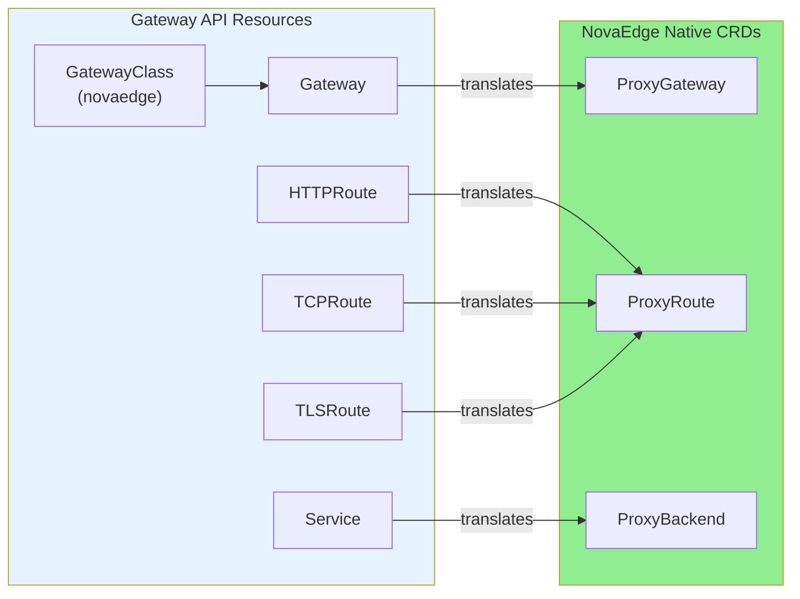
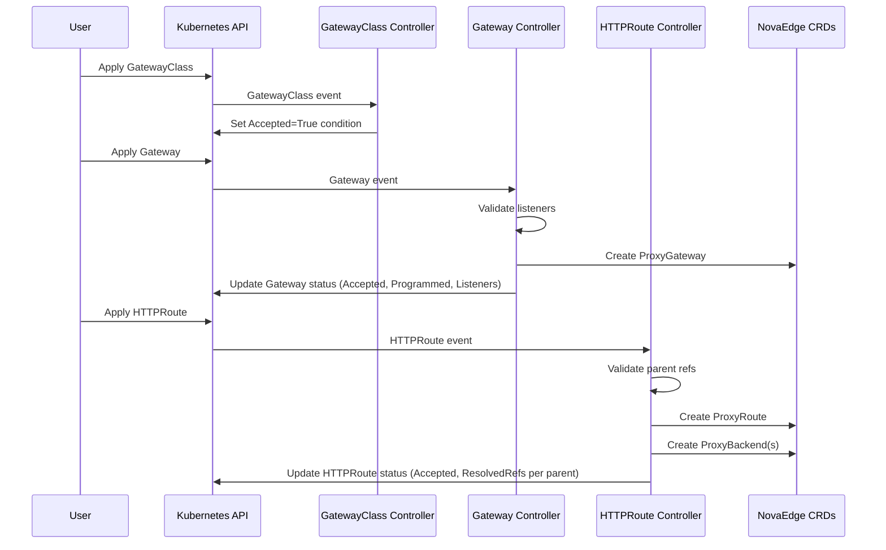
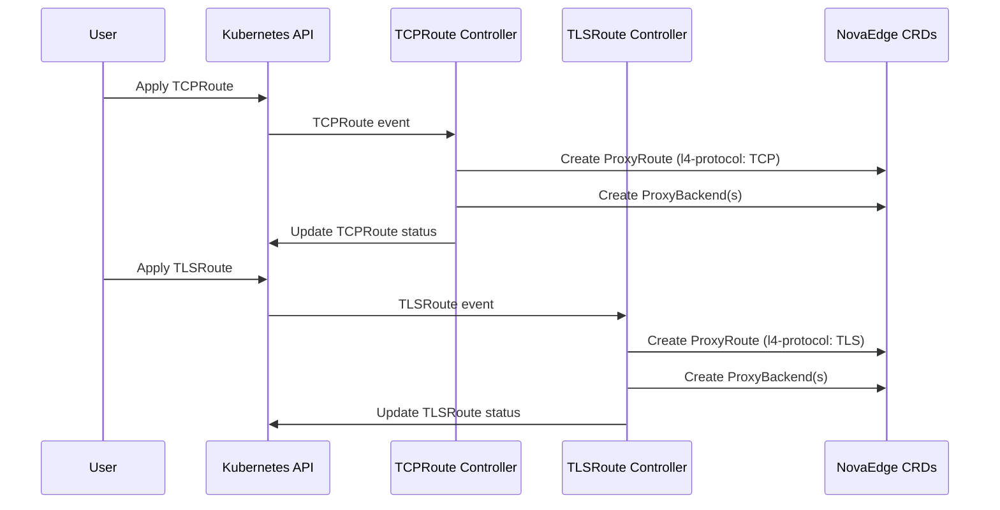

# Gateway API Support in NovaEdge

NovaEdge provides native support for the Kubernetes Gateway API, allowing you to use standard Gateway and HTTPRoute resources alongside NovaEdge's custom CRDs.

## Overview

The Gateway API implementation in NovaEdge translates Gateway API resources into NovaEdge's native CRDs:



- **GatewayClass** - Accepted and managed by the NovaEdge controller
- **Gateway** → **ProxyGateway**
- **HTTPRoute** → **ProxyRoute**
- **TCPRoute** → **ProxyRoute** (with `novaedge.io/l4-protocol: TCP` annotation)
- **TLSRoute** → **ProxyRoute** (with `novaedge.io/l4-protocol: TLS` annotation)
- **Service references** → **ProxyBackend**

## Conformance Profile

NovaEdge implements the **GATEWAY-HTTP** conformance profile of the Gateway API specification.

### Conformance Status

| Profile | Status |
|---------|--------|
| GATEWAY-HTTP | Core + Extended |
| GATEWAY-TLS | Planned |
| GATEWAY-GRPC | Planned |

### Core Features

| Feature | Status |
|---------|--------|
| Gateway | Supported |
| HTTPRoute | Supported |
| HTTPRouteHostRewrite | Supported |
| HTTPRoutePathRewrite | Supported |
| HTTPRoutePathRedirect | Supported |
| HTTPRouteSchemeRedirect | Supported |
| HTTPRouteRequestHeaderModification | Supported |
| HTTPRouteResponseHeaderModification | Supported |
| HTTPRouteRequestMirror | Supported |

### Extended Features

| Feature | Status |
|---------|--------|
| GatewayPort8080 | Supported |
| GatewayHTTPListenerIsolation | Supported |

### Running Conformance Tests

```bash
# Run the full conformance test suite
make test-conformance

# Or using novactl
novactl conformance
```

See [test/conformance/README.md](../../test/conformance/README.md) for detailed instructions.

## Supported Features

### GatewayClass Resource

NovaEdge watches for GatewayClass resources with `controllerName: novaedge.io/gateway-controller` and sets the following status conditions:

- **Accepted** - Set to `True` when the GatewayClass is recognized by the controller
- **SupportedVersion** - Set to `True` to indicate the installed Gateway API version is supported

### Gateway Resources

- HTTP, HTTPS, TCP, and TLS protocol listeners
- Multiple listeners per Gateway
- TLS termination with Kubernetes Secret certificate references
- Hostname-based routing per listener
- Listener conflict detection (port/protocol/hostname conflicts)
- Full status reporting:
  - **Accepted** - Gateway has been accepted by the controller
  - **Programmed** - Gateway is configured and ready to accept traffic
  - Per-listener conditions: Accepted, Programmed, ResolvedRefs, Conflicted
  - SupportedKinds per listener based on protocol

### HTTPRoute Resources

- All path match types: **Exact**, **PathPrefix**, **RegularExpression**
- Header-based matching (Exact, RegularExpression)
- Query parameter matching (Exact, RegularExpression)
- HTTP method matching (GET, POST, PUT, DELETE, etc.)
- Request filters:
  - **RequestHeaderModifier** - Add, Set, Remove request headers
  - **ResponseHeaderModifier** - Add, Set, Remove response headers
  - **RequestRedirect** - Redirect with scheme, hostname, port, path, and status code
  - **URLRewrite** - Rewrite path (full or prefix) and hostname
  - **RequestMirror** - Mirror traffic to additional backends
- Backend references with weights for traffic splitting
- Multi-rule routing with precedence
- Full parent status per Gateway reference:
  - **Accepted** - Route is accepted by the parent Gateway
  - **ResolvedRefs** - All backend references are resolved
  - **NoMatchingParent** - SectionName does not match any listener

### TCPRoute Resources (v1alpha2)
- Raw TCP connection forwarding
- Backend references with weights
- Round-robin load balancing across backends

### TLSRoute Resources (v1alpha2)
- SNI-based TLS passthrough routing
- Hostname matching (exact and wildcard)
- Backend references with weights
- End-to-end encryption preservation

## Quick Start

### 1. Install Gateway API CRDs

```bash
kubectl apply -f https://github.com/kubernetes-sigs/gateway-api/releases/download/v1.4.0/standard-install.yaml
```

### 2. Create GatewayClass

```bash
kubectl apply -f config/samples/gatewayclass.yaml
```

This creates a GatewayClass named `novaedge` that NovaEdge will process.

### 3. Verify GatewayClass Acceptance

```bash
kubectl get gatewayclass novaedge
# or
novactl gateway-api gatewayclasses
```

### 4. Create a Gateway

```yaml
apiVersion: gateway.networking.k8s.io/v1
kind: Gateway
metadata:
  name: example-gateway
  namespace: default
spec:
  gatewayClassName: novaedge
  listeners:
  - name: http
    protocol: HTTP
    port: 80
  - name: https
    protocol: HTTPS
    port: 443
    tls:
      mode: Terminate
      certificateRefs:
      - kind: Secret
        name: example-tls-secret
```

### 5. Create an HTTPRoute

```yaml
apiVersion: gateway.networking.k8s.io/v1
kind: HTTPRoute
metadata:
  name: example-httproute
  namespace: default
spec:
  parentRefs:
  - name: example-gateway
  hostnames:
  - "example.com"
  rules:
  - matches:
    - path:
        type: PathPrefix
        value: /api
    backendRefs:
    - name: api-service
      port: 8080
```

## Architecture

### Translation Process



### Status Conditions

NovaEdge sets comprehensive status conditions as required by the Gateway API specification:

#### GatewayClass Status

| Condition | Description |
|-----------|-------------|
| Accepted | `True` when the controller recognizes the GatewayClass |
| SupportedVersion | `True` when the Gateway API version is supported |

#### Gateway Status

| Condition | Description |
|-----------|-------------|
| Accepted | `True` when the Gateway is accepted by the controller |
| Programmed | `True` when the Gateway is ready to accept traffic |

Each listener also has individual status conditions:

| Listener Condition | Description |
|-------------------|-------------|
| Accepted | `True` when the listener configuration is valid |
| Programmed | `True` when the listener is ready |
| ResolvedRefs | `True` when all TLS references are resolved |
| Conflicted | `True` when the listener conflicts with another |

#### HTTPRoute Parent Status

Each parent (Gateway) reference has its own status:

| Condition | Description |
|-----------|-------------|
| Accepted | `True` when the route is accepted by the Gateway |
| ResolvedRefs | `True` when all backend references resolve |

### Cleanup

Resources are automatically cleaned up using Kubernetes owner references:
- Deleting a Gateway removes its ProxyGateway
- Deleting an HTTPRoute removes its ProxyRoute and ProxyBackends

## CLI Support (novactl)

### Gateway API Commands

```bash
# List GatewayClasses
novactl gateway-api gatewayclasses

# List Gateway API Gateways
novactl gateway-api gateways

# List HTTPRoutes
novactl gateway-api httproutes

# Describe a Gateway with full status
novactl gateway-api describe-gateway example-gateway

# Check conformance status
novactl conformance
```

## L4 Routes

NovaEdge also supports Gateway API **v1alpha2** (experimental) resources:
- `gateway.networking.k8s.io/v1alpha2.TCPRoute`
- `gateway.networking.k8s.io/v1alpha2.TLSRoute`

NovaEdge supports Gateway API L4 route resources for TCP forwarding and TLS passthrough.

### TCPRoute

TCPRoute enables raw TCP connection forwarding through a Gateway listener.

```yaml
apiVersion: gateway.networking.k8s.io/v1
kind: Gateway
metadata:
  name: tcp-gateway
spec:
  gatewayClassName: novaedge
  listeners:
    - name: mysql
      port: 3306
      protocol: TCP
    - name: postgres
      port: 5432
      protocol: TCP
---
apiVersion: gateway.networking.k8s.io/v1alpha2
kind: TCPRoute
metadata:
  name: mysql-tcproute
spec:
  parentRefs:
    - name: tcp-gateway
      sectionName: mysql
  rules:
    - backendRefs:
        - name: mysql-service
          port: 3306
```

### TLSRoute

TLSRoute enables SNI-based TLS passthrough routing. The Gateway reads the SNI from the TLS ClientHello without decrypting, then routes the connection to the appropriate backend.

```yaml
apiVersion: gateway.networking.k8s.io/v1
kind: Gateway
metadata:
  name: tls-gateway
spec:
  gatewayClassName: novaedge
  listeners:
    - name: tls
      port: 443
      protocol: TLS
      tls:
        mode: Passthrough
---
apiVersion: gateway.networking.k8s.io/v1alpha2
kind: TLSRoute
metadata:
  name: api-tlsroute
spec:
  parentRefs:
    - name: tls-gateway
      sectionName: tls
  hostnames:
    - "api.example.com"
  rules:
    - backendRefs:
        - name: api-service
          port: 443
```

### L4 Route Translation

When NovaEdge processes TCPRoute and TLSRoute resources, it:

1. Translates each route into a NovaEdge `ProxyRoute` with an L4 protocol annotation
2. Creates corresponding `ProxyBackend` resources for service references
3. Sets owner references for automatic cleanup
4. Updates route status with acceptance conditions

The translated ProxyRoute includes the annotation `novaedge.io/l4-protocol` set to either `TCP` or `TLS`, which signals the agent to use L4 proxying instead of HTTP proxying.



For more details on L4 proxying behavior (connection handling, session affinity, metrics), see [Layer 4 TCP/UDP Proxying](../user-guide/l4-proxying.md).

## Limitations

3. **Backend Types**: Only Service backend refs are supported. ReferenceGrant and cross-namespace routing require additional RBAC.

4. **Gateway Addresses**: Static address assignment via Gateway.spec.addresses is not yet implemented.

### Planned Enhancements

- Support for weighted load balancing across multiple backend refs
- UDPRoute support
- GRPCRoute support
- ReferenceGrant for cross-namespace references
- Gateway address assignment

## Examples

### Path-Based Routing

```yaml
apiVersion: gateway.networking.k8s.io/v1
kind: HTTPRoute
metadata:
  name: path-based-route
spec:
  parentRefs:
  - name: example-gateway
  rules:
  - matches:
    - path:
        type: PathPrefix
        value: /api/v1
    backendRefs:
    - name: api-v1-service
      port: 8080
  - matches:
    - path:
        type: PathPrefix
        value: /api/v2
    backendRefs:
    - name: api-v2-service
      port: 8080
```

### Header-Based Routing

```yaml
apiVersion: gateway.networking.k8s.io/v1
kind: HTTPRoute
metadata:
  name: header-based-route
spec:
  parentRefs:
  - name: example-gateway
  rules:
  - matches:
    - headers:
      - name: X-API-Version
        value: v2
    backendRefs:
    - name: api-v2-service
      port: 8080
  - backendRefs:
    - name: api-v1-service
      port: 8080
```

### Request Filters

```yaml
apiVersion: gateway.networking.k8s.io/v1
kind: HTTPRoute
metadata:
  name: filtered-route
spec:
  parentRefs:
  - name: example-gateway
  rules:
  - matches:
    - path:
        type: PathPrefix
        value: /api
    filters:
    - type: RequestHeaderModifier
      requestHeaderModifier:
        add:
        - name: X-Custom-Header
          value: added-by-gateway
        set:
        - name: X-Forwarded-Proto
          value: https
        remove:
        - X-Legacy-Header
    backendRefs:
    - name: api-service
      port: 8080
```

### Response Header Modification

```yaml
apiVersion: gateway.networking.k8s.io/v1
kind: HTTPRoute
metadata:
  name: response-header-route
spec:
  parentRefs:
  - name: example-gateway
  rules:
  - matches:
    - path:
        type: PathPrefix
        value: /static
    filters:
    - type: ResponseHeaderModifier
      responseHeaderModifier:
        add:
        - name: X-Cache-Status
          value: HIT
        set:
        - name: Cache-Control
          value: "public, max-age=3600"
        remove:
        - Server
    backendRefs:
    - name: static-service
      port: 80
```

### URL Rewrite

```yaml
apiVersion: gateway.networking.k8s.io/v1
kind: HTTPRoute
metadata:
  name: rewrite-route
spec:
  parentRefs:
  - name: example-gateway
  rules:
  - matches:
    - path:
        type: PathPrefix
        value: /old-api
    filters:
    - type: URLRewrite
      urlRewrite:
        path:
          type: ReplacePrefixMatch
          replacePrefixMatch: /api/v2
        hostname: internal-api.example.com
    backendRefs:
    - name: api-service
      port: 8080
```

### Traffic Splitting

```yaml
apiVersion: gateway.networking.k8s.io/v1
kind: HTTPRoute
metadata:
  name: canary-route
spec:
  parentRefs:
  - name: example-gateway
  rules:
  - matches:
    - path:
        type: PathPrefix
        value: /
    backendRefs:
    - name: stable-service
      port: 8080
      weight: 90
    - name: canary-service
      port: 8080
      weight: 10
```

### Request Mirror

```yaml
apiVersion: gateway.networking.k8s.io/v1
kind: HTTPRoute
metadata:
  name: mirror-route
spec:
  parentRefs:
  - name: example-gateway
  rules:
  - matches:
    - path:
        type: PathPrefix
        value: /api
    filters:
    - type: RequestMirror
      requestMirror:
        backendRef:
          name: shadow-service
          port: 8080
    backendRefs:
    - name: production-service
      port: 8080
```

## Migration from Ingress

If you are currently using Kubernetes Ingress resources with NovaEdge, you can migrate to Gateway API:

1. Keep using Ingress resources (NovaEdge supports both)
2. Install Gateway API CRDs and create a GatewayClass
3. Create Gateway resources to replace your IngressClass
4. Gradually migrate routes to HTTPRoute
5. Eventually remove Ingress resources

Both APIs can coexist and are translated to the same NovaEdge internal resources.

## Troubleshooting

### GatewayClass Not Accepted

Check the GatewayClass status conditions:

```bash
kubectl describe gatewayclass novaedge
```

Common issues:
- NovaEdge controller is not running
- Multiple GatewayClasses with the same controller name

### Gateway Not Programmed

Check the Gateway status conditions:

```bash
kubectl describe gateway example-gateway
novactl gateway-api describe-gateway example-gateway
```

Common issues:
- GatewayClass `novaedge` not found
- Invalid listener configuration
- Missing TLS secret references
- Port/hostname conflicts between listeners

### HTTPRoute Not Accepted

Check the HTTPRoute status:

```bash
kubectl describe httproute example-httproute
```

Common issues:
- Parent Gateway not found or not a NovaEdge Gateway
- SectionName does not match any Gateway listener
- Backend Service not found
- Invalid path or header match configuration

### View Generated Resources

To see the NovaEdge resources created from Gateway API resources:

```bash
# View generated ProxyGateway
kubectl get proxygateway example-gateway -o yaml

# View generated ProxyRoute
kubectl get proxyroute example-httproute -o yaml

# View generated ProxyBackends
kubectl get proxybackend -l novaedge.io/gateway-api-owner
```

## API Version Support

| Resource | API Version | Status |
|----------|-------------|--------|
| GatewayClass | `gateway.networking.k8s.io/v1` | Supported |
| Gateway | `gateway.networking.k8s.io/v1` | Supported |
| HTTPRoute | `gateway.networking.k8s.io/v1` | Supported |
| GRPCRoute | `gateway.networking.k8s.io/v1` | Planned |
| TLSRoute | `gateway.networking.k8s.io/v1alpha2` | Planned |
| TCPRoute | `gateway.networking.k8s.io/v1alpha2` | Planned |
| UDPRoute | `gateway.networking.k8s.io/v1alpha2` | Planned |

## Further Reading

- [Gateway API Documentation](https://gateway-api.sigs.k8s.io/)
- [Gateway API Conformance](https://gateway-api.sigs.k8s.io/concepts/conformance/)
- [Architecture Overview](../architecture/overview.md)
- [CRD Reference](../reference/crd-reference.md)
