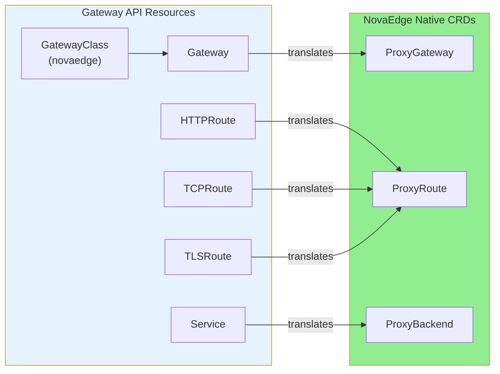
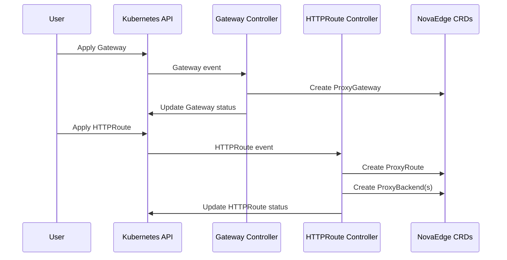
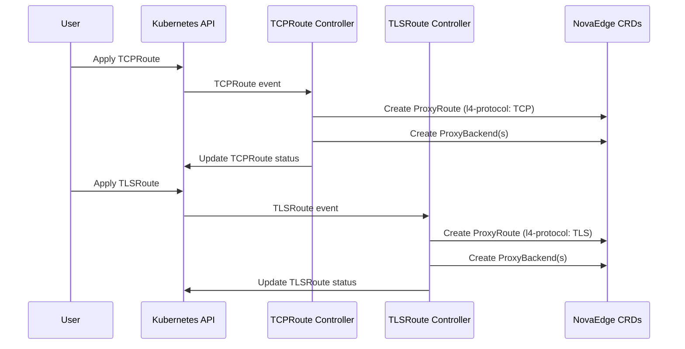
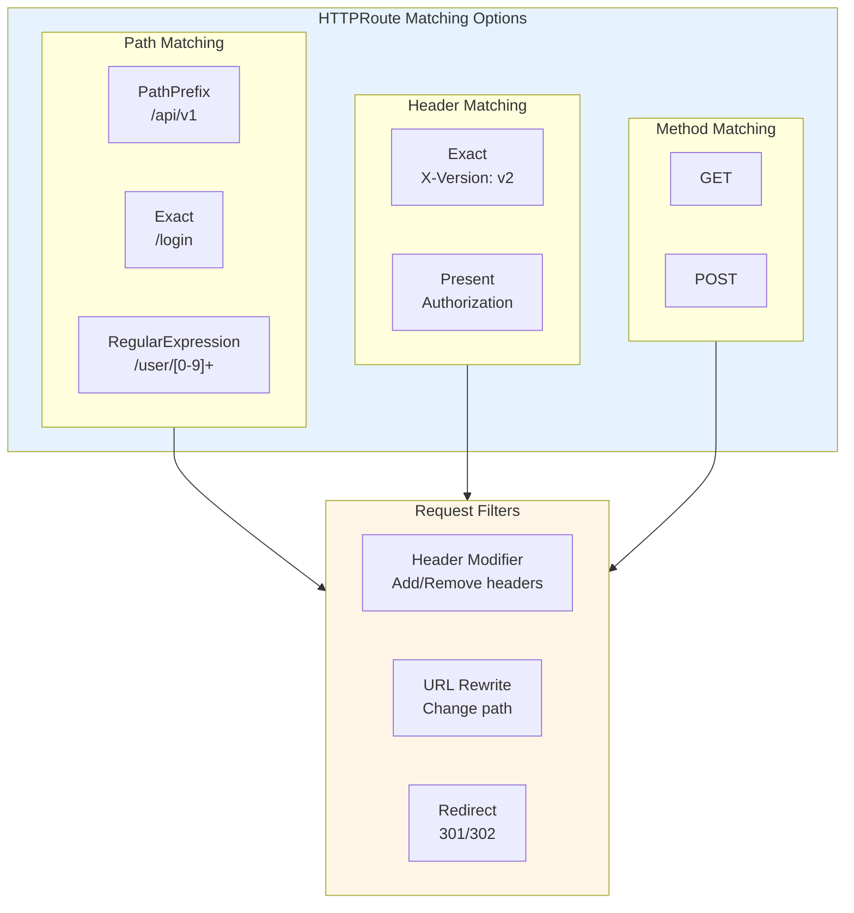

# Gateway API Support in NovaEdge

NovaEdge provides native support for the Kubernetes Gateway API, allowing you to use standard Gateway and HTTPRoute resources alongside NovaEdge's custom CRDs.

## Overview

The Gateway API implementation in NovaEdge translates Gateway API resources into NovaEdge's native CRDs:



- **Gateway** → **ProxyGateway**
- **HTTPRoute** → **ProxyRoute**
- **TCPRoute** → **ProxyRoute** (with `novaedge.io/l4-protocol: TCP` annotation)
- **TLSRoute** → **ProxyRoute** (with `novaedge.io/l4-protocol: TLS` annotation)
- **Service references** → **ProxyBackend**

## Supported Features

### Gateway Resources
- HTTP, HTTPS, TCP, and TLS protocols
- Multiple listeners per Gateway
- TLS termination with certificate references
- Hostname-based routing

### HTTPRoute Resources
- Path-based routing (Exact, PathPrefix, RegularExpression)
- Header-based matching
- HTTP method matching
- Request filters:
  - Header modification (add/remove)
  - Request redirects
  - URL rewrites
- Backend references with weights
- Multi-rule routing

### TCPRoute Resources (v1alpha2)
- Raw TCP connection forwarding
- Backend references with weights
- Round-robin load balancing across backends

### TLSRoute Resources (v1alpha2)
- SNI-based TLS passthrough routing
- Hostname matching (exact and wildcard)
- Backend references with weights
- End-to-end encryption preservation

## Quick Start

### 1. Install Gateway API CRDs

```bash
kubectl apply -f https://github.com/kubernetes-sigs/gateway-api/releases/download/v1.2.1/standard-install.yaml
```

### 2. Create GatewayClass

```bash
kubectl apply -f config/samples/gatewayclass.yaml
```

This creates a GatewayClass named `novaedge` that NovaEdge will process.

### 3. Create a Gateway

```yaml
apiVersion: gateway.networking.k8s.io/v1
kind: Gateway
metadata:
  name: example-gateway
  namespace: default
spec:
  gatewayClassName: novaedge
  listeners:
  - name: http
    protocol: HTTP
    port: 80
  - name: https
    protocol: HTTPS
    port: 443
    tls:
      mode: Terminate
      certificateRefs:
      - kind: Secret
        name: example-tls-secret
```

### 4. Create an HTTPRoute

```yaml
apiVersion: gateway.networking.k8s.io/v1
kind: HTTPRoute
metadata:
  name: example-httproute
  namespace: default
spec:
  parentRefs:
  - name: example-gateway
  hostnames:
  - "example.com"
  rules:
  - matches:
    - path:
        type: PathPrefix
        value: /api
    backendRefs:
    - name: api-service
      port: 8080
```

## Architecture

### Translation Process



1. **Gateway Controller** watches Gateway resources with `gatewayClassName: novaedge`
2. For each Gateway, it creates a corresponding ProxyGateway with:
   - Same name and namespace
   - Translated listeners
   - TLS configuration from certificate refs
   - Owner reference for automatic cleanup

3. **HTTPRoute Controller** watches HTTPRoute resources
4. For each HTTPRoute referencing a NovaEdge Gateway, it:
   - Creates a ProxyRoute with translated routing rules
   - Creates ProxyBackend resources for each unique Service reference
   - Updates HTTPRoute status with acceptance conditions

### Status Updates

NovaEdge updates Gateway and HTTPRoute status to reflect:
- Acceptance status (Accepted/Invalid)
- Programmed status (Ready/NotReady)
- Backend resolution status
- Listener-specific conditions

### Cleanup

Resources are automatically cleaned up using Kubernetes owner references:
- Deleting a Gateway removes its ProxyGateway
- Deleting an HTTPRoute removes its ProxyRoute and ProxyBackends

## API Version Support

NovaEdge supports Gateway API **v1** (stable) resources:
- `gateway.networking.k8s.io/v1.Gateway`
- `gateway.networking.k8s.io/v1.HTTPRoute`
- `gateway.networking.k8s.io/v1.GatewayClass`

NovaEdge also supports Gateway API **v1alpha2** (experimental) resources:
- `gateway.networking.k8s.io/v1alpha2.TCPRoute`
- `gateway.networking.k8s.io/v1alpha2.TLSRoute`

## L4 Routes

NovaEdge supports Gateway API L4 route resources for TCP forwarding and TLS passthrough.

### TCPRoute

TCPRoute enables raw TCP connection forwarding through a Gateway listener.

```yaml
apiVersion: gateway.networking.k8s.io/v1
kind: Gateway
metadata:
  name: tcp-gateway
spec:
  gatewayClassName: novaedge
  listeners:
    - name: mysql
      port: 3306
      protocol: TCP
    - name: postgres
      port: 5432
      protocol: TCP
---
apiVersion: gateway.networking.k8s.io/v1alpha2
kind: TCPRoute
metadata:
  name: mysql-tcproute
spec:
  parentRefs:
    - name: tcp-gateway
      sectionName: mysql
  rules:
    - backendRefs:
        - name: mysql-service
          port: 3306
```

### TLSRoute

TLSRoute enables SNI-based TLS passthrough routing. The Gateway reads the SNI from the TLS ClientHello without decrypting, then routes the connection to the appropriate backend.

```yaml
apiVersion: gateway.networking.k8s.io/v1
kind: Gateway
metadata:
  name: tls-gateway
spec:
  gatewayClassName: novaedge
  listeners:
    - name: tls
      port: 443
      protocol: TLS
      tls:
        mode: Passthrough
---
apiVersion: gateway.networking.k8s.io/v1alpha2
kind: TLSRoute
metadata:
  name: api-tlsroute
spec:
  parentRefs:
    - name: tls-gateway
      sectionName: tls
  hostnames:
    - "api.example.com"
  rules:
    - backendRefs:
        - name: api-service
          port: 443
```

### L4 Route Translation

When NovaEdge processes TCPRoute and TLSRoute resources, it:

1. Translates each route into a NovaEdge `ProxyRoute` with an L4 protocol annotation
2. Creates corresponding `ProxyBackend` resources for service references
3. Sets owner references for automatic cleanup
4. Updates route status with acceptance conditions

The translated ProxyRoute includes the annotation `novaedge.io/l4-protocol` set to either `TCP` or `TLS`, which signals the agent to use L4 proxying instead of HTTP proxying.



For more details on L4 proxying behavior (connection handling, session affinity, metrics), see [Layer 4 TCP/UDP Proxying](../user-guide/l4-proxying.md).

## Limitations

### Current Limitations

1. **Multiple Backend Refs**: Only the first backend ref in a rule is used. Weighted load balancing across multiple backends in a single rule is planned.

2. **Route Filters**: The following Gateway API filters are not yet supported:
   - RequestMirror
   - ExtensionRef

3. **Backend Types**: Only Service backend refs are supported. ReferenceGrant and cross-namespace routing require additional RBAC.

4. **Gateway Addresses**: Static address assignment via Gateway.spec.addresses is not yet implemented.

### Planned Enhancements

- Support for weighted load balancing across multiple backend refs
- UDPRoute support
- GRPCRoute support
- ReferenceGrant for cross-namespace references
- Gateway address assignment

## Examples

### Routing Types Overview



### Path-Based Routing

```yaml
apiVersion: gateway.networking.k8s.io/v1
kind: HTTPRoute
metadata:
  name: path-based-route
spec:
  parentRefs:
  - name: example-gateway
  rules:
  - matches:
    - path:
        type: PathPrefix
        value: /api/v1
    backendRefs:
    - name: api-v1-service
      port: 8080
  - matches:
    - path:
        type: PathPrefix
        value: /api/v2
    backendRefs:
    - name: api-v2-service
      port: 8080
```

### Header-Based Routing

```yaml
apiVersion: gateway.networking.k8s.io/v1
kind: HTTPRoute
metadata:
  name: header-based-route
spec:
  parentRefs:
  - name: example-gateway
  rules:
  - matches:
    - headers:
      - name: X-API-Version
        value: v2
    backendRefs:
    - name: api-v2-service
      port: 8080
  - backendRefs:
    - name: api-v1-service
      port: 8080
```

### Request Filters

```yaml
apiVersion: gateway.networking.k8s.io/v1
kind: HTTPRoute
metadata:
  name: filtered-route
spec:
  parentRefs:
  - name: example-gateway
  rules:
  - matches:
    - path:
        type: PathPrefix
        value: /api
    filters:
    - type: RequestHeaderModifier
      requestHeaderModifier:
        add:
        - name: X-Custom-Header
          value: added-by-gateway
        remove:
        - X-Legacy-Header
    backendRefs:
    - name: api-service
      port: 8080
```

### URL Rewrite

```yaml
apiVersion: gateway.networking.k8s.io/v1
kind: HTTPRoute
metadata:
  name: rewrite-route
spec:
  parentRefs:
  - name: example-gateway
  rules:
  - matches:
    - path:
        type: PathPrefix
        value: /old-api
    filters:
    - type: URLRewrite
      urlRewrite:
        path:
          type: ReplacePrefixMatch
          replacePrefixMatch: /api/v2
    backendRefs:
    - name: api-service
      port: 8080
```

## Troubleshooting

### Gateway Not Accepted

Check the Gateway status conditions:

```bash
kubectl describe gateway example-gateway
```

Common issues:
- GatewayClass `novaedge` not found
- Invalid listener configuration
- Missing TLS secret references

### HTTPRoute Not Working

Check the HTTPRoute status:

```bash
kubectl describe httproute example-httproute
```

Common issues:
- Parent Gateway not found or not a NovaEdge Gateway
- Backend Service not found
- Invalid path or header match configuration

### View Generated Resources

To see the NovaEdge resources created from Gateway API resources:

```bash
# View generated ProxyGateway
kubectl get proxygateway example-gateway -o yaml

# View generated ProxyRoute
kubectl get proxyroute example-httproute -o yaml

# View generated ProxyBackends
kubectl get proxybackend -l novaedge.io/gateway-api-owner
```

## Migration from Ingress

If you're currently using Kubernetes Ingress resources with NovaEdge, you can migrate to Gateway API:

1. Keep using Ingress resources (NovaEdge supports both)
2. Gradually migrate routes to HTTPRoute
3. Eventually replace IngressClass with GatewayClass

Both APIs can coexist and are translated to the same NovaEdge internal resources.

## Further Reading

- [Gateway API Documentation](https://gateway-api.sigs.k8s.io/)
- [Architecture Overview](../architecture/overview.md)
- [CRD Reference](../reference/crd-reference.md)
