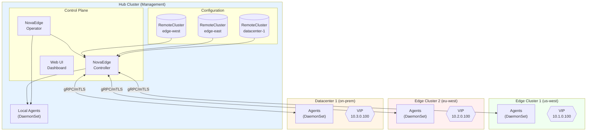
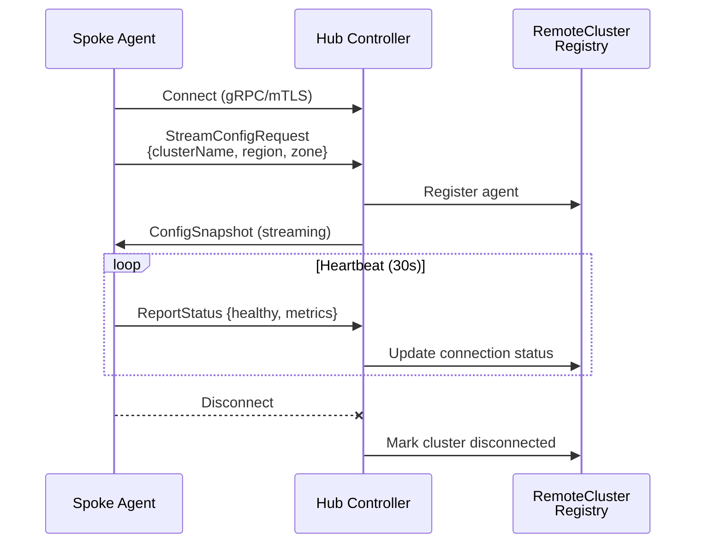
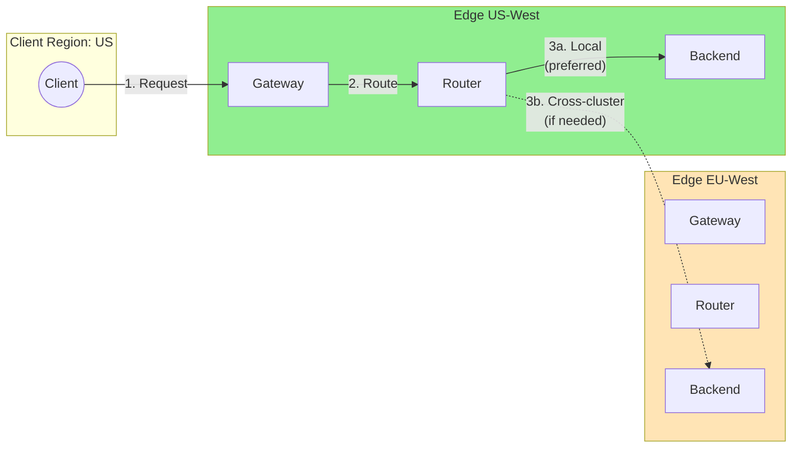

# Multi-Cluster Deployment Guide

This guide covers deploying NovaEdge across multiple Kubernetes clusters using a hub-spoke architecture.

## Overview

NovaEdge supports multi-cluster deployments where:

- **Hub Cluster**: Runs the control plane (operator, controller, web UI)
- **Spoke Clusters**: Run only data plane agents that connect back to the hub

This architecture enables:
- Centralized configuration management
- Unified observability across all clusters
- Cross-cluster load balancing and failover
- Edge/remote location support

## Architecture

### Hub-Spoke Overview



### Connection Flow



### Cross-Cluster Traffic Flow



## Prerequisites

- Kubernetes 1.29+ on all clusters
- Helm 3.0+
- Network connectivity from spoke clusters to hub (direct or tunnel)
- TLS certificates for secure communication

## Deployment Steps

### Step 1: Deploy Hub Cluster

First, deploy the full NovaEdge stack on the hub cluster:

```bash
# On the hub cluster

# Install the operator
helm install novaedge-operator ./charts/novaedge-operator \
  --namespace nova-system \
  --create-namespace

# Create NovaEdgeCluster with external access enabled
kubectl apply -f - <<EOF
apiVersion: novaedge.io/v1alpha1
kind: NovaEdgeCluster
metadata:
  name: novaedge-hub
  namespace: nova-system
spec:
  version: "v0.1.0"
  controller:
    replicas: 3  # HA for production
    leaderElection: true
    grpcPort: 9090
  agent:
    hostNetwork: true
    vip:
      enabled: true
      mode: L2
  webUI:
    enabled: true
    service:
      type: LoadBalancer  # For external access
  tls:
    enabled: true
    certManager:
      enabled: true
      issuerRef:
        name: novaedge-ca-issuer
        kind: ClusterIssuer
EOF
```

### Step 2: Expose Controller for Remote Access

The controller needs to be accessible from spoke clusters:

```yaml
# Option 1: LoadBalancer Service
apiVersion: v1
kind: Service
metadata:
  name: novaedge-controller-external
  namespace: nova-system
spec:
  type: LoadBalancer
  ports:
    - name: grpc
      port: 9090
      targetPort: 9090
  selector:
    app.kubernetes.io/name: novaedge-controller
---
# Option 2: Ingress with TLS passthrough
apiVersion: networking.k8s.io/v1
kind: Ingress
metadata:
  name: novaedge-controller
  namespace: nova-system
  annotations:
    nginx.ingress.kubernetes.io/ssl-passthrough: "true"
    nginx.ingress.kubernetes.io/backend-protocol: "GRPCS"
spec:
  ingressClassName: nginx
  rules:
    - host: novaedge-controller.example.com
      http:
        paths:
          - path: /
            pathType: Prefix
            backend:
              service:
                name: novaedge-controller
                port:
                  number: 9090
  tls:
    - hosts:
        - novaedge-controller.example.com
      secretName: novaedge-controller-tls
```

### Step 3: Generate Agent Certificates

Generate mTLS certificates for agent authentication:

```yaml
# Using cert-manager
apiVersion: cert-manager.io/v1
kind: Certificate
metadata:
  name: novaedge-agent-cert
  namespace: nova-system
spec:
  secretName: novaedge-agent-cert
  duration: 8760h  # 1 year
  renewBefore: 720h  # 30 days
  subject:
    organizations:
      - NovaEdge
  commonName: novaedge-agent
  usages:
    - client auth
  issuerRef:
    name: novaedge-ca-issuer
    kind: ClusterIssuer
```

Export certificates for spoke clusters:

```bash
# Export CA certificate
kubectl get secret novaedge-ca -n nova-system \
  -o jsonpath='{.data.ca\.crt}' | base64 -d > ca.crt

# Export agent certificate and key
kubectl get secret novaedge-agent-cert -n nova-system \
  -o jsonpath='{.data.tls\.crt}' | base64 -d > tls.crt
kubectl get secret novaedge-agent-cert -n nova-system \
  -o jsonpath='{.data.tls\.key}' | base64 -d > tls.key
```

### Step 4: Deploy Agents on Spoke Clusters

On each spoke cluster:

```bash
# Switch to spoke cluster context
kubectl config use-context spoke-cluster-1

# Create namespace
kubectl create namespace nova-system

# Create TLS secrets
kubectl create secret generic novaedge-ca \
  --from-file=ca.crt=ca.crt \
  -n nova-system

kubectl create secret tls novaedge-agent-cert \
  --cert=tls.crt \
  --key=tls.key \
  -n nova-system

# Install agent chart
helm install novaedge-agent ./charts/novaedge-agent \
  --namespace nova-system \
  --set cluster.name=edge-west-1 \
  --set cluster.region=us-west \
  --set connection.controllerEndpoint=novaedge-controller.example.com:9090 \
  --set tls.enabled=true \
  --set tls.caSecretName=novaedge-ca \
  --set tls.clientCertSecretName=novaedge-agent-cert \
  --set vip.enabled=true \
  --set vip.mode=L2
```

### Step 5: Register Remote Cluster in Hub

Back on the hub cluster, create a `NovaEdgeRemoteCluster` resource:

```yaml
apiVersion: novaedge.io/v1alpha1
kind: NovaEdgeRemoteCluster
metadata:
  name: edge-west-1
  namespace: nova-system
spec:
  clusterName: edge-west-1
  region: us-west
  zone: us-west-2a
  labels:
    environment: production
    tier: edge

  connection:
    mode: Direct
    controllerEndpoint: novaedge-controller.nova-system.svc.cluster.local:9090
    tls:
      enabled: true

  routing:
    enabled: true
    priority: 100
    weight: 100
    localPreference: true
    allowCrossClusterTraffic: true

  healthCheck:
    enabled: true
    interval: 30s
    timeout: 10s
    healthyThreshold: 2
    unhealthyThreshold: 3
    failoverEnabled: true
```

### Step 6: Verify Deployment

Check the status of remote clusters:

```bash
# On hub cluster
kubectl get novaedgeremoteclusters -n nova-system

# Output:
# NAME          CLUSTER       REGION    PHASE       CONNECTED   AGENTS   AGE
# edge-west-1   edge-west-1   us-west   Connected   true        3        5m
# edge-east-1   edge-east-1   eu-west   Connected   true        2        3m

# Describe for details
kubectl describe novaedgeremotecluster edge-west-1 -n nova-system

# Check status with novactl
novactl status
```

## Cross-Cluster Routing

### Global Backend Definition

Create backends that span multiple clusters:

```yaml
apiVersion: novaedge.io/v1alpha1
kind: ProxyBackend
metadata:
  name: api-backend
  namespace: default
spec:
  # Endpoints are automatically discovered from all clusters
  serviceRef:
    name: api-service
    port: 8080

  lbPolicy: P2C  # Power of Two Choices for optimal latency

  # Multi-cluster settings
  multiCluster:
    enabled: true
    # Prefer local endpoints
    localityAware: true
    # Weight by cluster
    clusterWeights:
      edge-west-1: 50
      edge-east-1: 30
      hub: 20

  healthCheck:
    interval: 10s
    httpHealthCheck:
      path: /health
```

### Geo-Aware Routing

Route traffic based on client location:

```yaml
apiVersion: novaedge.io/v1alpha1
kind: ProxyRoute
metadata:
  name: geo-route
  namespace: default
spec:
  parentRefs:
    - name: global-gateway
  hostnames:
    - api.example.com
  rules:
    # Route US traffic to US cluster
    - matches:
        - headers:
            - name: X-Client-Region
              value: us-*
              type: RegularExpression
      backendRef:
        name: api-backend
        clusterSelector:
          matchLabels:
            region: us-west

    # Route EU traffic to EU cluster
    - matches:
        - headers:
            - name: X-Client-Region
              value: eu-*
              type: RegularExpression
      backendRef:
        name: api-backend
        clusterSelector:
          matchLabels:
            region: eu-west

    # Default: nearest cluster
    - backendRef:
        name: api-backend
```

## Failover Configuration

Configure automatic failover between clusters:

```yaml
apiVersion: novaedge.io/v1alpha1
kind: NovaEdgeRemoteCluster
metadata:
  name: edge-west-1
  namespace: nova-system
spec:
  clusterName: edge-west-1
  region: us-west

  connection:
    mode: Direct
    controllerEndpoint: novaedge-controller.example.com:9090

  routing:
    enabled: true
    priority: 100  # Primary
    weight: 100

  healthCheck:
    enabled: true
    interval: 10s
    timeout: 5s
    unhealthyThreshold: 3
    failoverEnabled: true  # Enable automatic failover
---
apiVersion: novaedge.io/v1alpha1
kind: NovaEdgeRemoteCluster
metadata:
  name: edge-west-2
  namespace: nova-system
spec:
  clusterName: edge-west-2
  region: us-west

  routing:
    enabled: true
    priority: 200  # Secondary (higher number = lower priority)
    weight: 0  # Standby - no traffic unless primary fails

  healthCheck:
    enabled: true
    failoverEnabled: true
```

## Tunnel Mode for NAT/Firewall Traversal

For spoke clusters behind NAT or firewalls:

### WireGuard Tunnel

```yaml
# On hub: Deploy tunnel relay
apiVersion: apps/v1
kind: Deployment
metadata:
  name: novaedge-tunnel-relay
  namespace: nova-system
spec:
  replicas: 2
  selector:
    matchLabels:
      app: novaedge-tunnel-relay
  template:
    spec:
      containers:
        - name: wireguard
          image: linuxserver/wireguard
          # ... WireGuard configuration
---
# On spoke: Configure tunnel connection
# values.yaml for novaedge-agent chart
connection:
  mode: Tunnel
  controllerEndpoint: via-tunnel

tunnel:
  type: WireGuard
  relayEndpoint: tunnel.example.com:51820
  wireGuard:
    publicKey: "HUB_WIREGUARD_PUBLIC_KEY"
    endpoint: "tunnel.example.com:51820"
    allowedIPs:
      - 10.0.0.0/8
    persistentKeepalive: 25
```

## Monitoring Multi-Cluster Deployments

### Centralized Metrics

All clusters export metrics to the hub's Prometheus:

```yaml
# On hub cluster
apiVersion: monitoring.coreos.com/v1
kind: Prometheus
metadata:
  name: novaedge
  namespace: nova-system
spec:
  # Federate metrics from remote clusters
  additionalScrapeConfigs:
    name: remote-cluster-scrape-configs
    key: prometheus.yaml
---
apiVersion: v1
kind: Secret
metadata:
  name: remote-cluster-scrape-configs
  namespace: nova-system
stringData:
  prometheus.yaml: |
    - job_name: 'novaedge-edge-west-1'
      static_configs:
        - targets: ['edge-west-1-metrics.example.com:9090']
      tls_config:
        ca_file: /etc/prometheus/certs/ca.crt
      bearer_token_file: /etc/prometheus/tokens/edge-west-1
```

### Web UI Dashboard

The NovaEdge web UI provides a unified view of all clusters:

```bash
# Access the web UI
kubectl port-forward -n nova-system svc/novaedge-webui 9080:9080

# Open http://localhost:9080
# Navigate to: Clusters > Overview
```

## Best Practices

### Security

1. **Always use mTLS** for agent-controller communication
2. **Rotate certificates** regularly (automate with cert-manager)
3. **Use network policies** to restrict agent communication
4. **Audit remote cluster access** via controller logs

### High Availability

1. **Run 3+ controller replicas** in the hub cluster
2. **Use anti-affinity** to spread controllers across nodes/zones
3. **Configure health checks** with appropriate thresholds
4. **Test failover** regularly

### Performance

1. **Enable locality-aware routing** to prefer local backends
2. **Use appropriate LB algorithms** (P2C or EWMA for latency-sensitive)
3. **Monitor latency** between clusters
4. **Size agents appropriately** based on traffic

### Operations

1. **Use GitOps** for configuration management
2. **Version control** all cluster configurations
3. **Implement gradual rollouts** for agent updates
4. **Monitor certificate expiration**

## Troubleshooting

### Agent Connection Issues

```bash
# Check agent logs
kubectl logs -n nova-system -l app.kubernetes.io/name=novaedge-agent --tail=100

# Verify network connectivity
kubectl exec -n nova-system <agent-pod> -- \
  nc -zv novaedge-controller.example.com 9090

# Check TLS certificates
kubectl exec -n nova-system <agent-pod> -- \
  openssl s_client -connect novaedge-controller.example.com:9090 \
  -CAfile /etc/novaedge/tls/ca.crt
```

### Remote Cluster Not Connecting

```bash
# Check remote cluster status
kubectl get novaedgeremotecluster -n nova-system

# View detailed status
kubectl describe novaedgeremotecluster edge-west-1 -n nova-system

# Check controller logs for connection attempts
kubectl logs -n nova-system -l app.kubernetes.io/name=novaedge-controller \
  --tail=100 | grep "edge-west-1"
```

### Cross-Cluster Routing Not Working

```bash
# Verify backend endpoints
novactl describe backend api-backend

# Check routing configuration
novactl describe route api-route

# Test connectivity manually
kubectl exec -n nova-system <agent-pod> -- \
  curl -v http://backend-service.remote-ns.svc.cluster.local:8080/health
```

## Next Steps

- [Operator Guide](../installation/operator.md) - Managing the hub cluster
- [CRD Reference](../reference/crd-reference.md) - NovaEdgeRemoteCluster details
- [Helm Values Reference](../reference/helm-values.md) - Agent chart configuration
- [Observability Guide](../operations/observability.md) - Monitoring multi-cluster deployments
