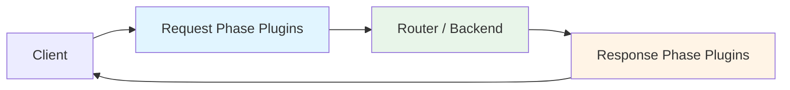

# WASM Plugin System

NovaEdge supports custom middleware through WebAssembly (WASM) plugins. Plugins run in a sandboxed environment with no filesystem or network access, ensuring safe execution of untrusted code.

## Overview

WASM plugins can intercept HTTP requests and responses at configurable phases:

- **request** — Called before routing/backend selection. Can modify request headers or short-circuit with a response.
- **response** — Called after the backend responds. Can modify response headers.
- **both** — Called in both phases.

## Architecture



## Built-in Plugins

NovaEdge ships with 13 ready-to-use WASM plugins covering security, traffic management, observability, and protocol transformation.

### Security Plugins

| Plugin | Phase | Description |
|--------|-------|-------------|
| [Custom Auth](#custom-authentication) | request | API key and HMAC signature authentication |
| [Schema Validation](#schema-validation) | request | Request header and content-type validation |
| [GraphQL Protection](#graphql-protection) | request | Depth limiting, alias control, introspection blocking |
| [PII Masking](#pii-data-masking) | response | Detect and redact PII patterns in response headers |

### Traffic Management Plugins

| Plugin | Phase | Description |
|--------|-------|-------------|
| [A/B Testing](#ab-testing) | both | Experiment bucketing with deterministic assignment |
| [Canary Analysis](#canary-analysis) | both | Traffic splitting with success/failure tracking |
| [Multi-tenant Routing](#multi-tenant-routing) | request | Tenant extraction and isolation enforcement |
| [Cache Invalidation](#cache-invalidation) | both | Surrogate-key based cache purging |

### Observability Plugins

| Plugin | Phase | Description |
|--------|-------|-------------|
| [Request ID](#request-id-propagation) | both | Generate and propagate unique request identifiers |
| [GeoIP Enrichment](#geoip-header-enrichment) | request | Add geographic headers from IP address |
| [Business Metrics](#business-metrics) | both | Extract business-relevant data for metric collection |

### Transformation Plugins

| Plugin | Phase | Description |
|--------|-------|-------------|
| [Body Rewrite](#response-body-rewrite) | response | String replacement rules for response content |
| [Protocol Transform](#protocol-transformation) | both | SOAP/XML to REST/JSON conversion hints |

---

## Plugin Reference

### GeoIP Header Enrichment

Reads client IP address and enriches requests with geographic information based on configurable IP-to-location mappings.

**Phase:** request

**Configuration:**

| Key | Default | Description |
|-----|---------|-------------|
| `country_header` | `X-Geo-Country` | Header name for country code |
| `city_header` | `X-Geo-City` | Header name for city |
| `region_header` | `X-Geo-Region` | Header name for region |
| `ip_header` | `X-Real-IP` | Header to read client IP from |
| `default_country` | *(empty)* | Fallback country code |
| `mapping_N` | — | IP prefix to location: `prefix=CC,City,Region` |

**Example:**

```yaml
apiVersion: novaedge.io/v1alpha1
kind: ProxyPolicy
metadata:
  name: geoip-enrichment
spec:
  type: WASMPlugin
  targetRef:
    kind: ProxyRoute
    name: api-route
  wasmPlugin:
    source: novaedge-geoip-plugin
    phase: request
    config:
      ip_header: "X-Forwarded-For"
      default_country: "US"
      mapping_0: "10.0=US,NewYork,NY"
      mapping_1: "192.168=DE,Berlin,BE"
```

---

### Request ID Propagation

Generates unique request identifiers if not present and propagates them through request and response headers.

**Phase:** both

**Configuration:**

| Key | Default | Description |
|-----|---------|-------------|
| `header_name` | `X-Request-ID` | Header name for the request ID |
| `prefix` | `req` | Prefix for generated IDs |
| `propagate` | `true` | Copy request ID to response headers |

**Example:**

```yaml
wasmPlugin:
  source: novaedge-requestid-plugin
  phase: both
  config:
    header_name: "X-Request-ID"
    prefix: "edge"
    propagate: "true"
```

---

### Response Body Rewrite

Sets rewrite rule headers for the host middleware to apply string replacements on response bodies.

**Phase:** response

**Configuration:**

| Key | Default | Description |
|-----|---------|-------------|
| `match_N` | — | String to match (N=0,1,2,...) |
| `replace_N` | — | Replacement string for match_N |
| `content_types` | *(all)* | Comma-separated content types to process |
| `max_rules` | `32` | Maximum number of rewrite rules |

**Example:**

```yaml
wasmPlugin:
  source: novaedge-bodyrewrite-plugin
  phase: response
  config:
    match_0: "http://internal.example.com"
    replace_0: "https://api.example.com"
    match_1: "staging"
    replace_1: "production"
    content_types: "text/html,application/json"
```

---

### Custom Authentication

Validates API keys or HMAC signatures on incoming requests. Supports header-based and query-parameter-based key extraction.

**Phase:** request

**Configuration:**

| Key | Default | Description |
|-----|---------|-------------|
| `mode` | `apikey` | Authentication mode: `apikey` or `hmac` |
| `api_keys` | — | Comma-separated list of valid API keys |
| `key_header` | `X-API-Key` | Header containing the API key |
| `key_query_param` | `api_key` | Query parameter containing the API key |
| `hmac_header` | `X-HMAC-Signature` | Header containing the HMAC signature |
| `hmac_secret` | — | Shared secret for HMAC verification |
| `reject_status` | `401` | HTTP status code for rejected requests |
| `reject_body` | `{"error":"unauthorized"}` | Response body for rejected requests |
| `realm` | `novaedge` | Authentication realm for WWW-Authenticate |

**Example:**

```yaml
wasmPlugin:
  source: novaedge-customauth-plugin
  phase: request
  priority: 10
  config:
    mode: "apikey"
    api_keys: "sk-abc123,sk-def456,sk-ghi789"
    key_header: "Authorization"
    reject_status: "403"
```

---

### Schema Validation

Validates incoming requests against configurable rules including required headers, header value patterns, content type enforcement, and method restrictions.

**Phase:** request

**Configuration:**

| Key | Default | Description |
|-----|---------|-------------|
| `required_headers` | — | Comma-separated list of required headers |
| `header_pattern_N` | — | `header_name:wildcard_pattern` (N=0,1,...) |
| `content_type` | — | Required Content-Type (prefix match) |
| `max_content_length` | — | Maximum Content-Length in bytes |
| `allowed_methods` | — | Comma-separated allowed HTTP methods |
| `reject_status` | `400` | HTTP status for rejected requests |
| `max_patterns` | `32` | Max number of header pattern entries |

**Example:**

```yaml
wasmPlugin:
  source: novaedge-schemavalidation-plugin
  phase: request
  config:
    required_headers: "Authorization,Content-Type"
    content_type: "application/json"
    allowed_methods: "GET,POST,PUT,DELETE"
    max_content_length: "1048576"
    header_pattern_0: "Authorization:Bearer *"
```

---

### PII Data Masking

Scans response headers for personally identifiable information (email addresses, phone numbers, SSNs, credit card numbers) and masks them.

**Phase:** response

**Configuration:**

| Key | Default | Description |
|-----|---------|-------------|
| `mask_email` | `true` | Mask email address patterns |
| `mask_phone` | `true` | Mask phone number patterns |
| `mask_ssn` | `true` | Mask Social Security Number patterns |
| `mask_creditcard` | `true` | Mask credit card number patterns |
| `mask_char` | `*` | Character used for masking |

**Example:**

```yaml
wasmPlugin:
  source: novaedge-piimask-plugin
  phase: response
  config:
    mask_email: "true"
    mask_phone: "true"
    mask_ssn: "true"
    mask_creditcard: "true"
```

---

### GraphQL Protection

Protects GraphQL endpoints from abuse by enforcing query depth limits, alias restrictions, introspection blocking, and field-level access control.

**Phase:** request

**Configuration:**

| Key | Default | Description |
|-----|---------|-------------|
| `max_depth` | `10` | Maximum nesting depth allowed |
| `max_aliases` | `5` | Maximum number of aliases per query |
| `blocked_fields` | — | Comma-separated list of blocked field names |
| `introspection` | `false` | Allow introspection queries (`true`/`false`) |
| `graphql_path` | `/graphql` | Path that identifies GraphQL endpoints |

**Example:**

```yaml
wasmPlugin:
  source: novaedge-graphqlprotect-plugin
  phase: request
  config:
    max_depth: "5"
    max_aliases: "3"
    blocked_fields: "__schema,__type,_debug"
    introspection: "false"
```

---

### A/B Testing

Assigns users to experiment variants deterministically based on request fingerprinting (User-Agent + IP hash), with cookie-based sticky sessions.

**Phase:** both

**Configuration:**

| Key | Default | Description |
|-----|---------|-------------|
| `experiment_name` | `default` | Name of the experiment |
| `variants` | `control,variant_a` | Comma-separated variant names |
| `cookie_name` | `ab_bucket` | Cookie name for sticky assignment |
| `header_name` | `X-AB-Variant` | Header for variant assignment |
| `traffic_split` | `50` | Percentage of traffic for first variant |

**Example:**

```yaml
wasmPlugin:
  source: novaedge-abtesting-plugin
  phase: both
  config:
    experiment_name: "checkout-redesign"
    variants: "control,new_checkout"
    traffic_split: "80"
    cookie_name: "ab_checkout"
```

---

### Business Metrics

Extracts business-relevant data from requests and responses, setting metric label headers for the Prometheus metrics collector to consume.

**Phase:** both

**Configuration:**

| Key | Default | Description |
|-----|---------|-------------|
| `metric_prefix` | `business` | Prefix for metric names |
| `extract_headers` | — | Comma-separated headers to extract as labels |
| `path_pattern` | — | Path prefix to match for metric collection |

**Example:**

```yaml
wasmPlugin:
  source: novaedge-businessmetrics-plugin
  phase: both
  config:
    metric_prefix: "api"
    extract_headers: "X-Customer-ID,X-Plan-Tier"
    path_pattern: "/api/v1"
```

---

### Canary Analysis

Tags requests with canary version headers based on traffic split configuration, and tracks success/failure on responses for canary analysis.

**Phase:** both

**Configuration:**

| Key | Default | Description |
|-----|---------|-------------|
| `canary_header` | `X-Canary-Version` | Header for version assignment |
| `canary_version` | *(required)* | Version identifier for canary (e.g., `v2`) |
| `stable_version` | `v1` | Version identifier for stable |
| `traffic_percent` | `10` | Percentage of traffic to canary |
| `error_threshold` | `5` | Error percentage threshold for alerting |

**Example:**

```yaml
wasmPlugin:
  source: novaedge-canaryanalysis-plugin
  phase: both
  config:
    canary_version: "v2.1.0"
    stable_version: "v2.0.0"
    traffic_percent: "10"
    error_threshold: "5"
```

---

### Multi-tenant Routing

Extracts tenant identifiers from headers, path prefixes, or subdomains and enforces tenant isolation through request header enrichment and access control.

**Phase:** request

**Configuration:**

| Key | Default | Description |
|-----|---------|-------------|
| `tenant_header` | `X-Tenant-ID` | Header for tenant identification |
| `tenant_source` | `header` | Source: `header`, `path`, or `subdomain` |
| `path_prefix_strip` | `true` | Strip tenant prefix from path |
| `allowed_tenants` | — | Comma-separated list of allowed tenants |
| `default_tenant` | — | Fallback tenant if none found |

**Example:**

```yaml
wasmPlugin:
  source: novaedge-multitenant-plugin
  phase: request
  config:
    tenant_source: "subdomain"
    allowed_tenants: "acme,globex,initech"
```

---

### Cache Invalidation

Handles PURGE requests by validating source IPs and extracting surrogate keys. On responses, propagates surrogate keys from backends for the cache layer.

**Phase:** both

**Configuration:**

| Key | Default | Description |
|-----|---------|-------------|
| `purge_methods` | `PURGE` | Comma-separated methods that trigger purge |
| `surrogate_header` | `Surrogate-Key` | Header containing surrogate keys |
| `cache_tags_header` | `Cache-Tag` | Header for cache tags |
| `allowed_purge_ips` | `127.0.0.1` | Comma-separated IPs allowed to purge |

**Example:**

```yaml
wasmPlugin:
  source: novaedge-cacheinvalidation-plugin
  phase: both
  config:
    allowed_purge_ips: "10.0.0.1,10.0.0.2"
    surrogate_header: "Surrogate-Key"
```

---

### Protocol Transformation

Detects SOAP/XML requests and sets transformation hint headers for the host middleware to convert between SOAP/XML and REST/JSON formats.

**Phase:** both

**Configuration:**

| Key | Default | Description |
|-----|---------|-------------|
| `mode` | `soap-to-rest` | Transformation mode: `soap-to-rest` or `xml-to-json` |
| `soap_action_header` | `SOAPAction` | Header containing the SOAP action |
| `target_content_type` | `application/json` | Target content type after transformation |
| `strip_namespace` | `true` | Remove XML namespaces during transformation |

**Example:**

```yaml
wasmPlugin:
  source: novaedge-protocoltransform-plugin
  phase: both
  config:
    mode: "soap-to-rest"
    strip_namespace: "true"
```

---

## Guest ABI

WASM plugins must export the following functions:

| Export | Signature | Description |
|--------|-----------|-------------|
| `on_request_headers` | `() -> ()` | Called during request phase |
| `on_response_headers` | `() -> ()` | Called during response phase |
| `malloc` | `(size: i32) -> ptr: i32` | Allocate guest memory |
| `free` | `(ptr: i32) -> ()` | Free guest memory |

## Host Functions

The host exposes these functions under the `novaedge` module:

| Function | Signature | Description |
|----------|-----------|-------------|
| `get_request_header` | `(name_ptr, name_len, val_ptr, val_cap) -> val_len` | Read a request header |
| `set_request_header` | `(name_ptr, name_len, val_ptr, val_len)` | Set a request header |
| `get_response_header` | `(name_ptr, name_len, val_ptr, val_cap) -> val_len` | Read a response header |
| `set_response_header` | `(name_ptr, name_len, val_ptr, val_len)` | Set a response header |
| `get_method` | `(buf_ptr, buf_cap) -> method_len` | Get HTTP method |
| `get_path` | `(buf_ptr, buf_cap) -> path_len` | Get request path |
| `get_config_value` | `(key_ptr, key_len, val_ptr, val_cap) -> val_len` | Read plugin config value |
| `log_message` | `(level, msg_ptr, msg_len)` | Log a message (0=debug, 1=info, 2=warn, 3=error) |
| `send_response` | `(status_code, body_ptr, body_len)` | Short-circuit with a response |

## Writing a Custom Plugin

### TinyGo Template

```go
//go:build tinygo.wasm

package main

import "unsafe"

//go:wasmimport novaedge get_request_header
func getRequestHeader(namePtr, nameLen, valPtr, valCap uint32) uint32

//go:wasmimport novaedge set_request_header
func setRequestHeader(namePtr, nameLen, valPtr, valLen uint32)

//go:wasmimport novaedge get_config_value
func getConfigValue(keyPtr, keyLen, valPtr, valCap uint32) uint32

//go:wasmimport novaedge log_message
func logMessage(level, msgPtr, msgLen uint32)

//go:wasmimport novaedge send_response
func sendResponse(statusCode, bodyPtr, bodyLen uint32)

//export on_request_headers
func onRequestHeaders() {
    // Your request-phase logic here
    name := "X-Custom-Header"
    value := "hello"
    np, nl := ptrLen(name)
    vp, vl := ptrLen(value)
    setRequestHeader(np, nl, vp, vl)
}

//export on_response_headers
func onResponseHeaders() {
    // Your response-phase logic here
}

//export malloc
func wasmMalloc(size uint32) uint32 {
    buf := make([]byte, size)
    return uint32(uintptr(unsafe.Pointer(&buf[0])))
}

//export free
func wasmFree(_ uint32) {}

func ptrLen(s string) (uint32, uint32) {
    if len(s) == 0 {
        return 0, 0
    }
    b := []byte(s)
    return uint32(uintptr(unsafe.Pointer(&b[0]))), uint32(len(b))
}

func main() {}
```

### Building

```bash
# Install TinyGo (https://tinygo.org/getting-started/install/)

# Build a single plugin
tinygo build -o plugin.wasm -target=wasi -scheduler=none -gc=conservative -opt=z -no-debug ./

# Build all built-in plugins
cd plugins/wasm && make all
```

## Deploying a Plugin

### 1. Store the WASM binary in a ConfigMap

```bash
kubectl create configmap my-wasm-plugin \
  --from-file=plugin.wasm=./plugin.wasm
```

### 2. Create a ProxyPolicy

```yaml
apiVersion: novaedge.io/v1alpha1
kind: ProxyPolicy
metadata:
  name: my-wasm-plugin
spec:
  type: WASMPlugin
  targetRef:
    kind: ProxyRoute
    name: api-route
  wasmPlugin:
    source: my-wasm-plugin  # ConfigMap name
    phase: request
    priority: 50
    failClosed: true
    config:
      key1: value1
      key2: value2
```

### 3. Reference in a route pipeline

```yaml
apiVersion: novaedge.io/v1alpha1
kind: ProxyRoute
metadata:
  name: api-route
spec:
  hostnames: ["api.example.com"]
  rules:
    - matches:
        - path:
            type: PathPrefix
            value: /api
      backendRefs:
        - name: api-backend
  pipeline:
    middleware:
      - type: wasm
        name: my-wasm-plugin
        priority: 50
```

## Sandbox Constraints

- **Memory**: Limited to configurable max pages (default 256 pages = 16 MB)
- **No filesystem access**: WASM modules cannot read/write files
- **No network access**: WASM modules cannot make outbound connections
- **No system calls**: Only NovaEdge host functions are available
- **Timeout**: Plugin execution is bounded (default 5 seconds)
- **Instance pooling**: 4 instances per plugin for concurrent request handling

## Plugin Configuration

Plugin configuration is passed as a `map[string]string` via the `config` field in the ProxyPolicy. Plugins read configuration values using the `get_config_value` host function. This design keeps plugins stateless and configuration-driven.

### Resource Limits

| Setting | Default | Description |
|---------|---------|-------------|
| `maxMemoryPages` | 256 (16 MB) | Maximum WASM linear memory |
| `executionTimeout` | 5s | Per-invocation execution timeout |
| `failClosed` | false | Return 503 on plugin errors (vs. fail-open) |

## Metrics

WASM plugin metrics are exposed via Prometheus:

| Metric | Type | Description |
|--------|------|-------------|
| `novaedge_wasm_plugin_execution_duration_seconds` | Histogram | Plugin execution duration |
| `novaedge_wasm_plugin_execution_total` | Counter | Total executions by plugin/phase/status |
| `novaedge_wasm_plugin_errors_total` | Counter | Total errors by plugin/phase |
| `novaedge_wasm_plugins_loaded` | Gauge | Number of loaded plugins |
| `novaedge_wasm_plugin_instance_pool_size` | Gauge | Instance pool size per plugin |
| `novaedge_wasm_plugin_timeouts_total` | Counter | Total execution timeouts |
