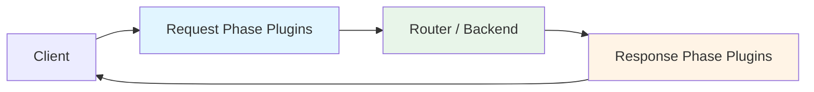

# WASM Plugin Development Guide

NovaEdge supports custom middleware through WebAssembly (WASM) plugins. Plugins run in a sandboxed environment with no filesystem or network access, ensuring safe execution of untrusted code.

## Overview

WASM plugins can intercept HTTP requests and responses at configurable phases:

- **request** — Called before routing/backend selection. Can modify request headers or short-circuit with a response.
- **response** — Called after the backend responds. Can modify response headers.
- **both** — Called in both phases.

## Architecture



## Guest ABI

WASM plugins must export the following functions:

| Export | Signature | Description |
|--------|-----------|-------------|
| `on_request_headers` | `() -> ()` | Called during request phase |
| `on_response_headers` | `() -> ()` | Called during response phase |
| `malloc` | `(size: i32) -> ptr: i32` | Allocate guest memory |
| `free` | `(ptr: i32, size: i32) -> ()` | Free guest memory |

## Host Functions

The host exposes these functions under the `novaedge` module:

| Function | Signature | Description |
|----------|-----------|-------------|
| `get_request_header` | `(name_ptr, name_len, val_ptr, val_cap) -> val_len` | Read a request header |
| `set_request_header` | `(name_ptr, name_len, val_ptr, val_len)` | Set a request header |
| `get_response_header` | `(name_ptr, name_len, val_ptr, val_cap) -> val_len` | Read a response header |
| `set_response_header` | `(name_ptr, name_len, val_ptr, val_len)` | Set a response header |
| `get_method` | `(buf_ptr, buf_cap) -> method_len` | Get HTTP method |
| `get_path` | `(buf_ptr, buf_cap) -> path_len` | Get request path |
| `get_config_value` | `(key_ptr, key_len, val_ptr, val_cap) -> val_len` | Read plugin config value |
| `log_message` | `(level, msg_ptr, msg_len)` | Log a message (0=debug, 1=info, 2=warn, 3=error) |
| `send_response` | `(status_code, body_ptr, body_len)` | Short-circuit with a response |

## Writing a Plugin (TinyGo)

```go
package main

import "unsafe"

//go:wasmimport novaedge get_request_header
func getRequestHeader(namePtr, nameLen, valPtr, valCap uint32) uint32

//go:wasmimport novaedge set_request_header
func setRequestHeader(namePtr, nameLen, valPtr, valLen uint32)

//go:wasmimport novaedge log_message
func logMessage(level, msgPtr, msgLen uint32)

//export on_request_headers
func onRequestHeaders() {
    // Add a custom header
    name := "X-WASM-Plugin"
    value := "hello-from-wasm"

    setRequestHeader(
        uint32(uintptr(unsafe.Pointer(unsafe.StringData(name)))),
        uint32(len(name)),
        uint32(uintptr(unsafe.Pointer(unsafe.StringData(value)))),
        uint32(len(value)),
    )
}

//export malloc
func malloc(size uint32) uint32 {
    buf := make([]byte, size)
    return uint32(uintptr(unsafe.Pointer(&buf[0])))
}

//export free
func free(ptr, size uint32) {}

func main() {}
```

Build with TinyGo:

```bash
tinygo build -o plugin.wasm -target=wasi -no-debug ./main.go
```

## Deploying a Plugin

### 1. Store the WASM binary in a ConfigMap

```bash
kubectl create configmap my-wasm-plugin \
  --from-file=plugin.wasm=./plugin.wasm
```

### 2. Create a ProxyPolicy

```yaml
apiVersion: novaedge.io/v1alpha1
kind: ProxyPolicy
metadata:
  name: my-wasm-plugin
spec:
  type: WASMPlugin
  targetRef:
    kind: ProxyRoute
    name: api-route
  wasmPlugin:
    source: my-wasm-plugin  # ConfigMap name
    phase: request
    priority: 50
    config:
      key1: value1
      key2: value2
```

### 3. Reference in a route pipeline

```yaml
apiVersion: novaedge.io/v1alpha1
kind: ProxyRoute
metadata:
  name: api-route
spec:
  hostnames: ["api.example.com"]
  rules:
    - matches:
        - path:
            type: PathPrefix
            value: /api
      backendRefs:
        - name: api-backend
  pipeline:
    middleware:
      - type: wasm
        name: my-wasm-plugin
        priority: 50
```

## Sandbox Constraints

- **Memory**: Limited to configurable max pages (default 16MB)
- **No filesystem access**: WASM modules cannot read/write files
- **No network access**: WASM modules cannot make outbound connections
- **No system calls**: Only NovaEdge host functions are available
- **Timeout**: Plugin execution is bounded by request context timeout

## Metrics

WASM plugin metrics are exposed via Prometheus:

| Metric | Type | Description |
|--------|------|-------------|
| `novaedge_wasm_plugin_execution_duration_seconds` | Histogram | Plugin execution duration |
| `novaedge_wasm_plugin_execution_total` | Counter | Total executions by plugin/phase/status |
| `novaedge_wasm_plugin_errors_total` | Counter | Total errors by plugin/phase |
| `novaedge_wasm_plugins_loaded` | Gauge | Number of loaded plugins |
