# Component Details

Deep dive into each NovaEdge component, their responsibilities, and configuration options.

## Operator

The NovaEdge Operator manages the lifecycle of NovaEdge deployments using the `NovaEdgeCluster` CRD.

### Responsibilities

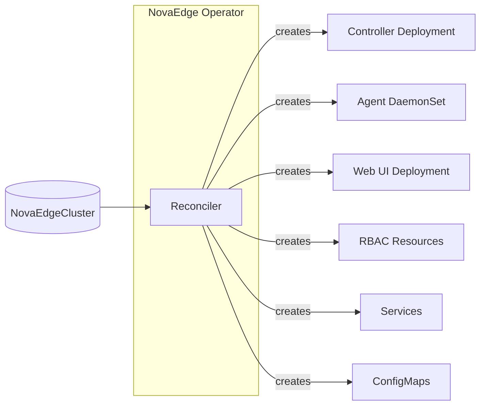

| Responsibility | Description |
|----------------|-------------|
| **Deployment** | Creates controller, agent, and web UI workloads |
| **Configuration** | Manages ConfigMaps and Secrets |
| **RBAC** | Creates ServiceAccounts, Roles, and RoleBindings |
| **Upgrades** | Rolling updates when version changes |
| **Status** | Reports component health in cluster status |

### Reconciliation Loop

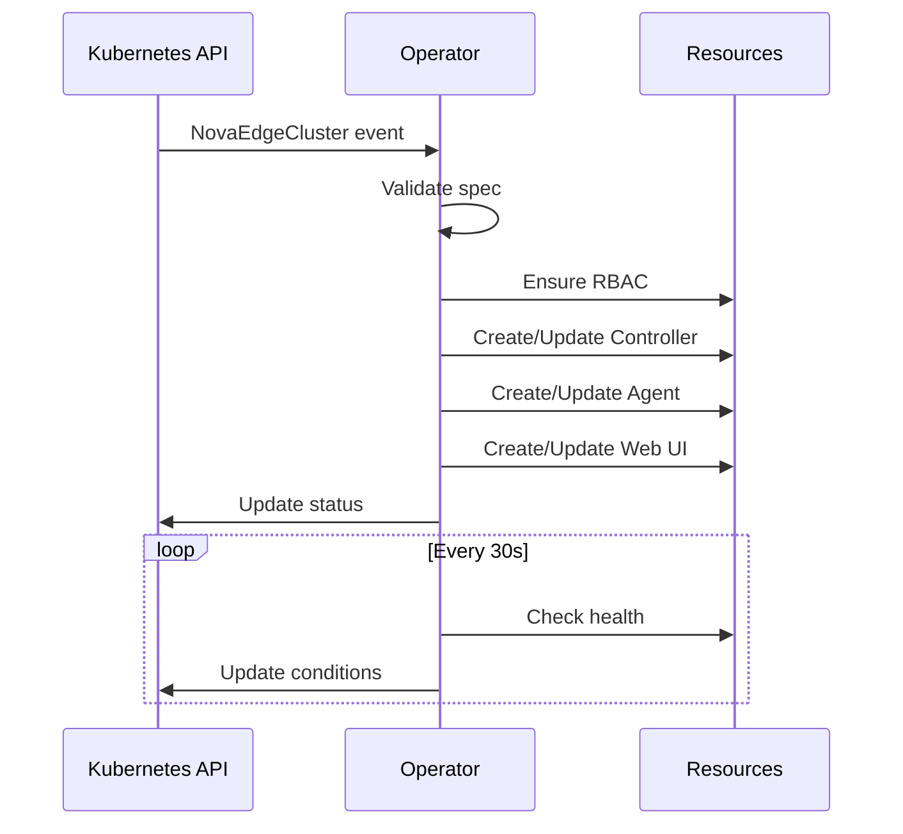

### Configuration

The Operator is configured via the `NovaEdgeCluster` CRD:

```yaml
apiVersion: novaedge.io/v1alpha1
kind: NovaEdgeCluster
metadata:
  name: novaedge
  namespace: nova-system
spec:
  version: "v0.1.0"
  controller:
    replicas: 3
    leaderElection: true
  agent:
    hostNetwork: true
    vip:
      enabled: true
      mode: BGP
  webUI:
    enabled: true
```

## Controller

The Controller is the control plane component that watches Kubernetes resources and distributes configuration to Agents.

### Internal Architecture

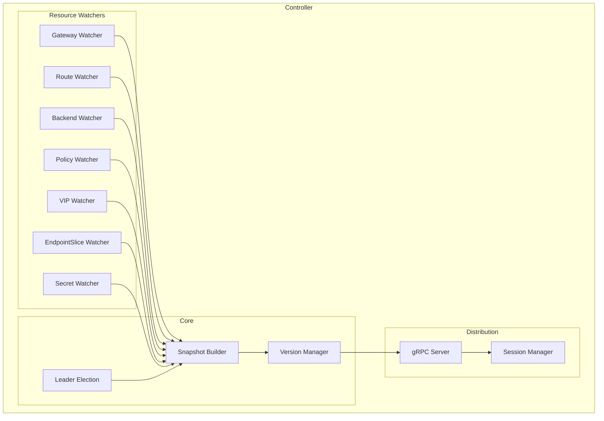

### Responsibilities

| Component | Purpose |
|-----------|---------|
| **Resource Watchers** | Watch CRDs, EndpointSlices, Secrets via informers |
| **Snapshot Builder** | Build versioned ConfigSnapshots |
| **Version Manager** | Track snapshot versions, detect changes |
| **gRPC Server** | Stream snapshots to Agents |
| **Session Manager** | Track connected Agents |
| **Leader Election** | Ensure single active controller |

### ConfigSnapshot Structure

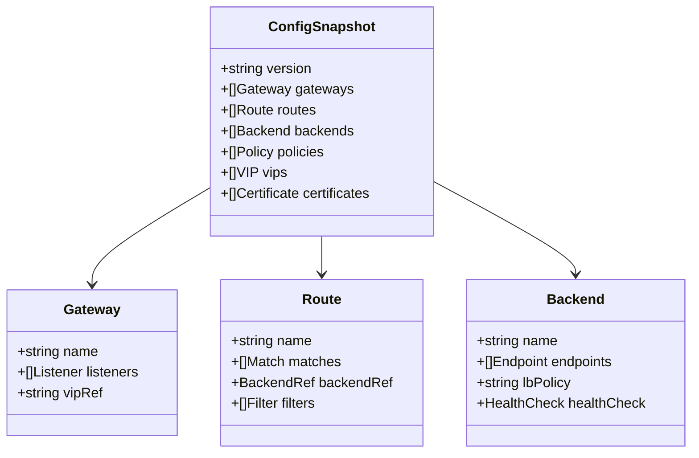

### Configuration

```yaml
# Controller command-line flags
--grpc-port=9090        # gRPC server port (CRD default: 9090, Helm chart default: 8082)
--metrics-port=8080     # Prometheus metrics port
--health-port=8081      # Health probe port
--log-level=info        # Log level
--leader-election=true  # Enable leader election
```

## Agent (Config Agent)

The Go Agent is a **config-only agent** that manages VIPs, receives configuration from the controller, and pushes it to the Rust Dataplane. It does NOT handle user traffic.

### Internal Architecture

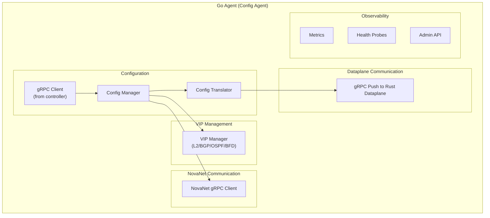

## Rust Dataplane (Traffic Handler)

The Rust Dataplane is the **actual data plane** that handles all L4/L7 traffic. It runs as a DaemonSet sidecar alongside the Go Agent.

### Internal Architecture

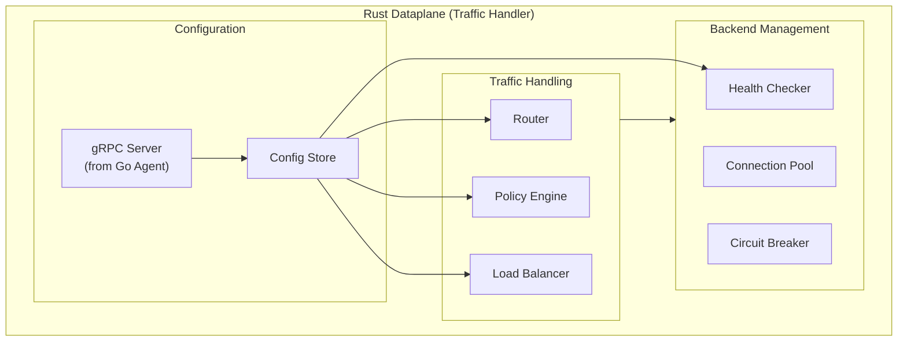

### Subcomponents

#### VIP Manager (Go Agent)

Manages virtual IP addresses on the node (part of the Go config agent):

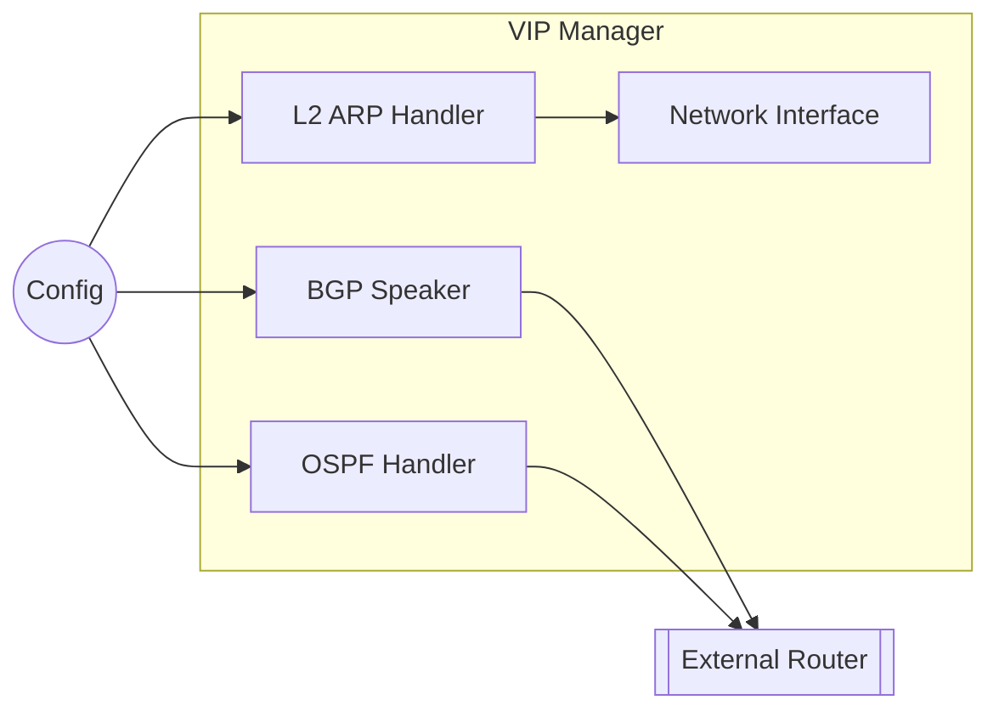

| Mode | Implementation |
|------|----------------|
| L2 ARP | Bind VIP to interface, send GARP |
| BGP | Announce VIP via GoBGP |
| OSPF | Advertise via OSPF LSAs |

#### Router (Rust Dataplane)

Matches incoming requests to routes (part of the Rust dataplane):

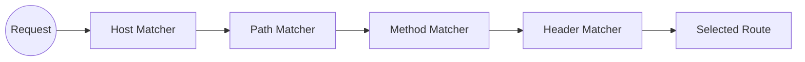

Matching order:
1. Hostname (exact > suffix > prefix > wildcard)
2. Path (exact > prefix > regex)
3. Method
4. Headers

#### Policy Engine (Rust Dataplane)

Applies policies to requests (part of the Rust dataplane):

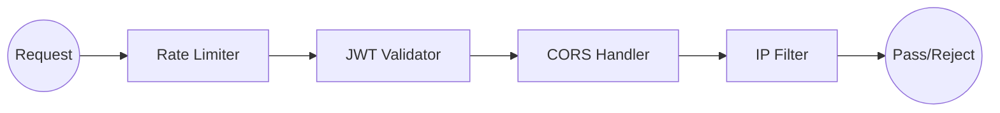

| Policy | Function |
|--------|----------|
| Rate Limit | Token bucket per key (client IP, header) |
| JWT | Validate tokens against JWKS |
| CORS | Handle preflight, set headers |
| IP Filter | Allow/deny by CIDR |

#### Load Balancer (Rust Dataplane)

Selects backend endpoints (part of the Rust dataplane):

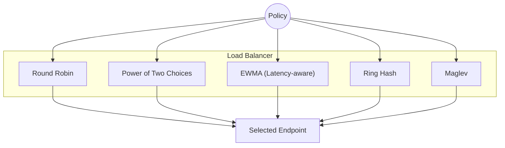

| Algorithm | Use Case |
|-----------|----------|
| Round Robin | Equal distribution |
| P2C | Low latency |
| EWMA | Latency-aware |
| Ring Hash | Session affinity |
| Maglev | High-performance consistent hashing |

#### Health Checker (Rust Dataplane)

Monitors backend health (part of the Rust dataplane):

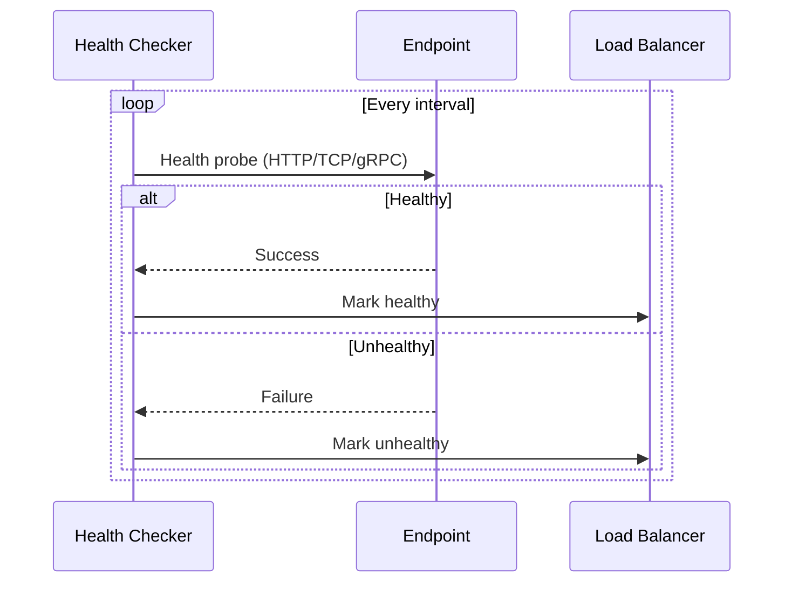

Supports:
- HTTP health checks
- TCP connection checks
- gRPC health protocol
- Passive failure detection

#### Connection Pool (Rust Dataplane)

Manages backend connections (part of the Rust dataplane):

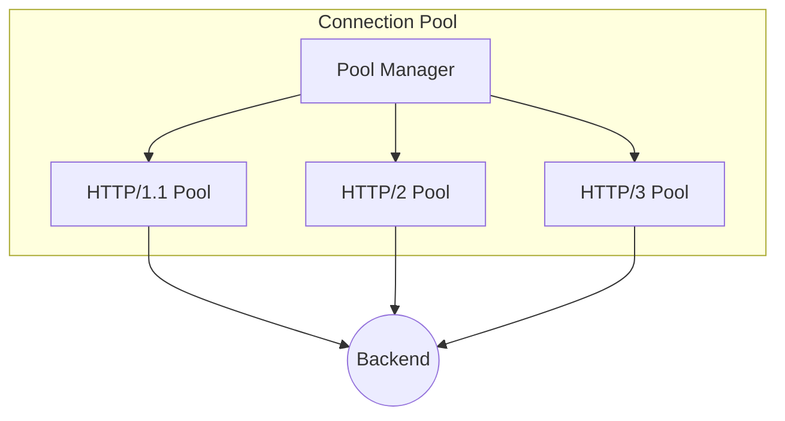

Features:
- Connection reuse
- Keep-alive management
- Automatic protocol detection
- Connection limits

#### SD-WAN Engine

Manages multi-link WAN connectivity and application-aware path selection:

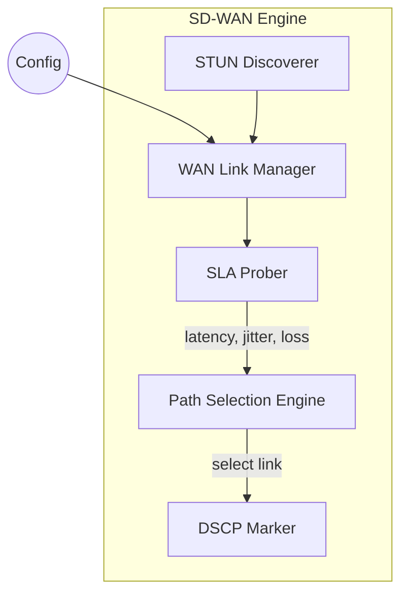

| Component | Purpose |
|-----------|---------|
| WAN Link Manager | Tracks WAN link state (up/down/degraded) and manages WireGuard tunnels |
| SLA Prober | Measures latency, jitter, and packet loss with EWMA smoothing |
| Path Selection Engine | Selects optimal WAN path using 4 strategies (lowest-latency, highest-bandwidth, most-reliable, lowest-cost) |
| STUN Discoverer | Discovers public endpoints for NAT traversal in tunnel establishment |
| DSCP Marker | Applies DSCP markings for QoS enforcement on outbound traffic |

#### eBPF Acceleration (via NovaNet)

eBPF acceleration services (SOCKMAP bypass, mesh redirect, rate limiting, health monitoring) are provided by [NovaNet](https://github.com/azrtydxb/novanet), the Nova CNI component. NovaEdge no longer loads or manages eBPF programs directly. Instead, the Go agent communicates with NovaNet via a gRPC client over a Unix domain socket at `/run/novanet/ebpf-services.sock`.

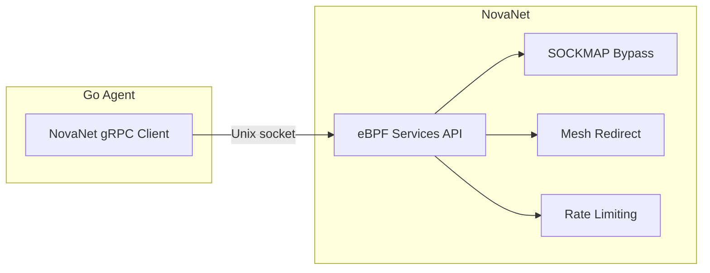

If NovaNet is not available, NovaEdge continues to operate without eBPF acceleration (graceful degradation). See [eBPF Acceleration (NovaNet)](../user-guide/ebpf-acceleration.md) for details.

### Configuration

```yaml
# Agent command-line flags
--controller-addr=controller:9090  # Controller address
--node-name=$NODE_NAME             # Node name (from downward API)
--http-port=80                     # HTTP traffic port
--https-port=443                   # HTTPS traffic port
--metrics-port=9090                # Prometheus metrics port
--health-port=8080                 # Health probe port
--log-level=info                   # Log level
--novanet-socket=/run/novanet/ebpf-services.sock  # NovaNet eBPF services socket
```

## Web UI

Optional dashboard for monitoring and management.

### Features

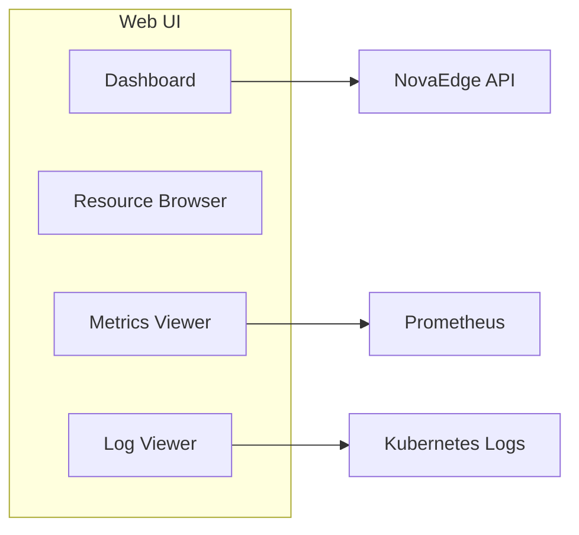

| Feature | Description |
|---------|-------------|
| Dashboard | Overview of cluster health |
| Resource Browser | View/edit CRDs |
| Metrics Viewer | Prometheus integration |
| Topology | Visual service map |

### Security

- Authentication via Kubernetes ServiceAccount
- RBAC-based authorization
- Read-only mode available
- TLS support

## Inter-Component Communication

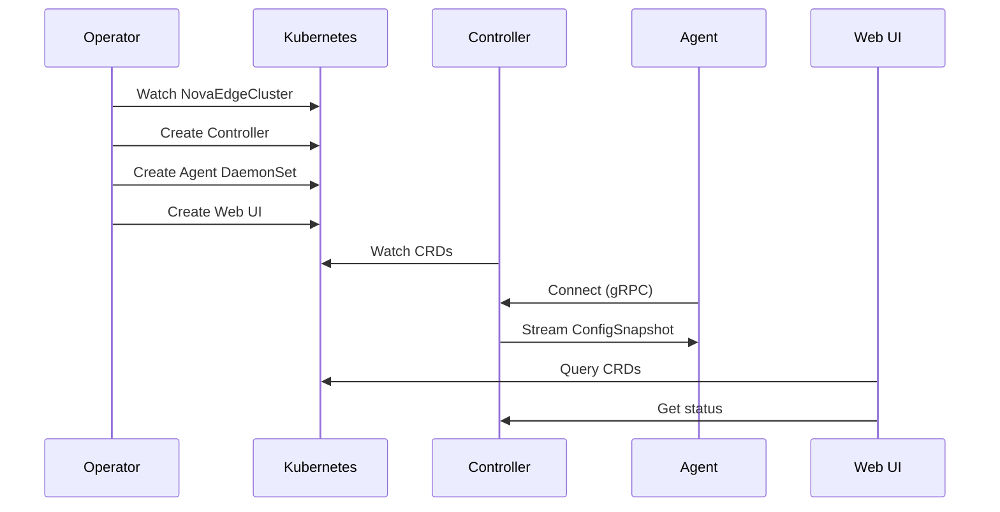

## Resource Requirements

| Component | CPU Request | Memory Request | Notes |
|-----------|------------|----------------|-------|
| Operator | 100m | 128Mi | Single instance |
| Controller | 200m | 256Mi | Per replica |
| Agent | 200m | 256Mi | Per node |
| Web UI | 100m | 128Mi | Optional |

## Next Steps

- [Installation](../installation/kubernetes.md) - Deploy NovaEdge
- [Routing](../user-guide/routing.md) - Configure routes
- [Load Balancing](../user-guide/load-balancing.md) - LB algorithms
