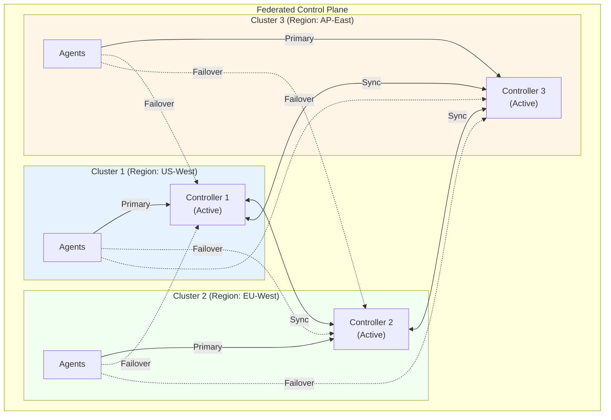
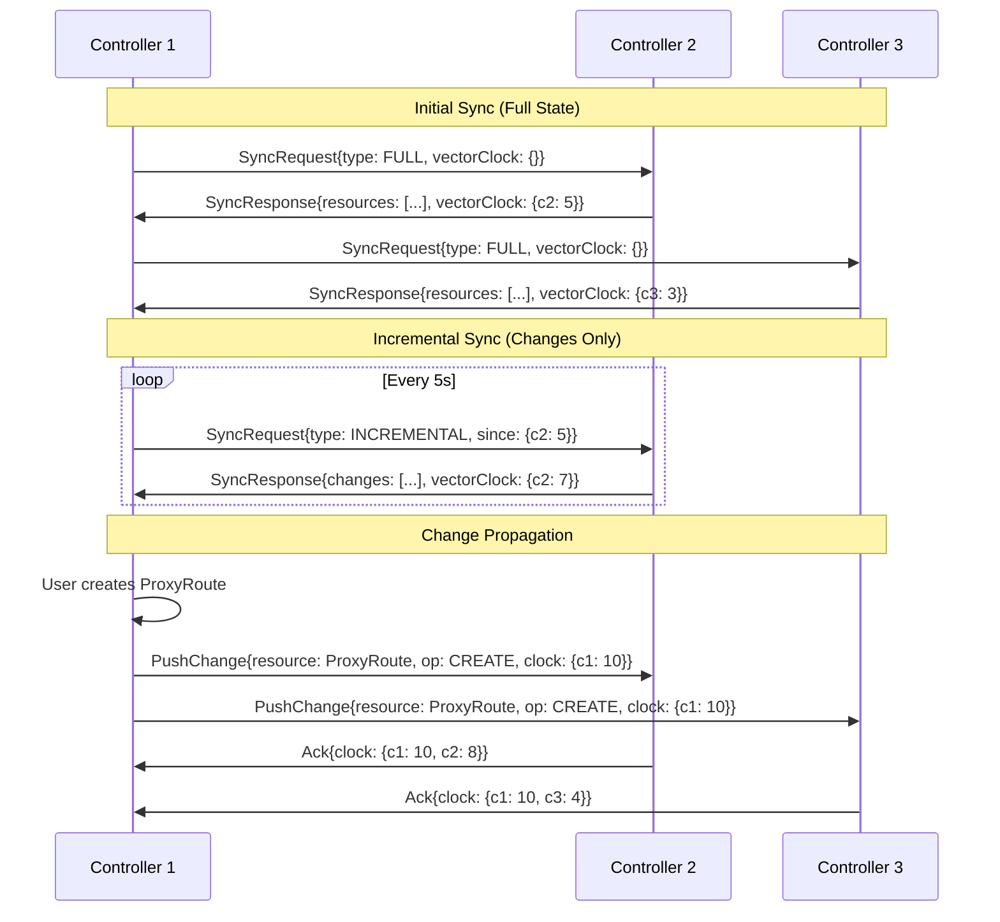
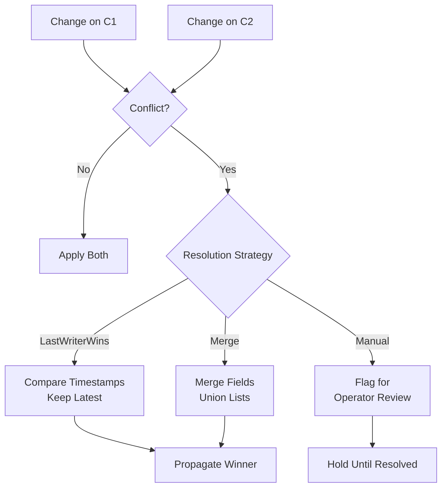
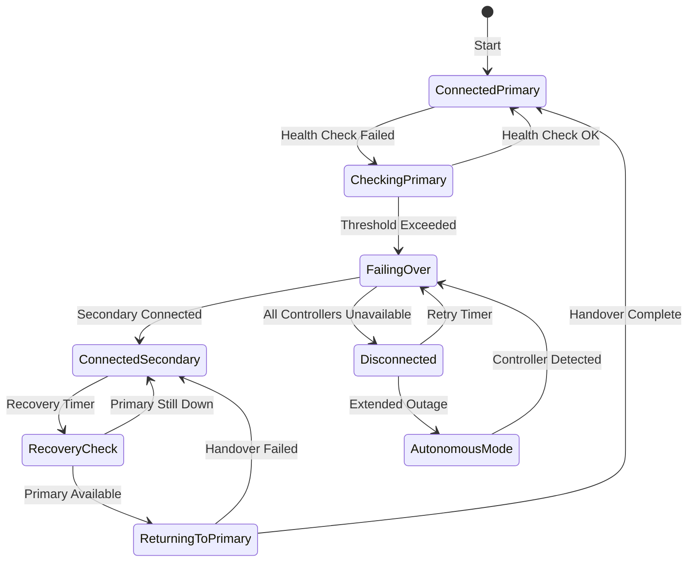

# Federated Control Plane Architecture

NovaEdge supports a federated active/active control plane architecture that eliminates single points of failure by distributing the management plane across multiple clusters.

## Overview

In a federated deployment:

- **Multiple controllers** run in different clusters, all active simultaneously
- **Controllers sync configuration** bidirectionally in real-time
- **Agents connect to a primary controller** but can failover to secondary controllers
- **Changes can be made on any controller** and propagate to all others



## Key Concepts

### Federation Member

A Federation Member is a NovaEdge controller that participates in the federation. Each member:

- Has a unique identifier within the federation
- Maintains a complete copy of all configuration
- Can accept configuration changes from users/operators
- Syncs changes to other federation members
- Serves configuration to agents (local and remote)

### Agent Controller Preferences

Each agent is configured with:

1. **Primary Controller**: The preferred controller (usually in the same cluster)
2. **Secondary Controllers**: Ordered list of failover controllers
3. **Failover Policy**: When and how to failover

### Configuration Sync

Controllers use a CRDT-based (Conflict-free Replicated Data Type) sync protocol:

- **Last-Writer-Wins** for simple fields (with vector clocks)
- **Merge semantics** for lists (routes, backends, etc.)
- **Tombstones** for deletions (with TTL cleanup)

## Architecture Components

### NovaEdgeFederation CRD

Defines the federation and its members:

```yaml
apiVersion: novaedge.io/v1alpha1
kind: NovaEdgeFederation
metadata:
  name: global-federation
  namespace: novaedge-system
spec:
  # Unique federation identifier
  federationID: "prod-global"

  # This controller's identity in the federation
  localMember:
    name: "us-west-controller"
    region: "us-west"
    zone: "us-west-2a"
    endpoint: "controller.us-west.novaedge.example.com:9090"

  # Other federation members
  members:
    - name: "eu-west-controller"
      region: "eu-west"
      zone: "eu-west-1a"
      endpoint: "controller.eu-west.novaedge.example.com:9090"
      tls:
        secretRef:
          name: federation-eu-west-tls

    - name: "ap-east-controller"
      region: "ap-east"
      zone: "ap-east-1a"
      endpoint: "controller.ap-east.novaedge.example.com:9090"
      tls:
        secretRef:
          name: federation-ap-east-tls

  # Sync configuration
  sync:
    # How often to sync with peers
    interval: "5s"
    # Timeout for sync operations
    timeout: "30s"
    # Batch size for incremental sync
    batchSize: 100
    # Enable compression for sync traffic
    compression: true

  # Conflict resolution strategy
  conflictResolution:
    # Strategy: LastWriterWins, Merge, or Manual
    strategy: "LastWriterWins"
    # Use vector clocks for ordering
    vectorClocks: true

  # Health check configuration
  healthCheck:
    interval: "10s"
    timeout: "5s"
    failureThreshold: 3
```

### Agent Controller Configuration

Agents are configured with controller preferences:

```yaml
apiVersion: novaedge.io/v1alpha1
kind: NovaEdgeCluster
metadata:
  name: novaedge
  namespace: novaedge-system
spec:
  agent:
    # Controller connection configuration
    controllers:
      # Primary controller (highest priority)
      primary:
        endpoint: "controller.us-west.novaedge.example.com:9090"
        tls:
          secretRef:
            name: controller-us-west-tls

      # Secondary controllers (ordered by priority)
      secondary:
        - endpoint: "controller.eu-west.novaedge.example.com:9090"
          priority: 100
          tls:
            secretRef:
              name: controller-eu-west-tls

        - endpoint: "controller.ap-east.novaedge.example.com:9090"
          priority: 200
          tls:
            secretRef:
              name: controller-ap-east-tls

      # Failover behavior
      failover:
        # How long to wait before failing over
        timeout: "30s"
        # How often to check primary availability
        healthCheckInterval: "10s"
        # Number of failures before failover
        failureThreshold: 3
        # How long to wait before trying to return to primary
        recoveryDelay: "60s"
        # Prefer lower latency controller during failover
        latencyAware: true
```

## Sync Protocol

### State Synchronization



### Conflict Resolution

When the same resource is modified on multiple controllers simultaneously:



### Vector Clocks

Each resource carries a vector clock for ordering:

```protobuf
message ResourceVersion {
  // Logical clock per controller
  map<string, uint64> vector_clock = 1;

  // Wall clock timestamp (for tie-breaking)
  int64 timestamp = 2;

  // Controller that last modified
  string last_writer = 3;
}
```

## Agent Failover

### Failover State Machine



### Autonomous Mode

When all controllers are unavailable, agents enter Autonomous Mode:

1. **Continue serving traffic** with last known configuration
2. **Persist configuration to disk** for restart resilience
3. **Local VIP coordination** via agent-to-agent communication
4. **Queue local changes** (health status, metrics) for later sync

```yaml
agent:
  autonomousMode:
    # Enable autonomous operation when disconnected
    enabled: true
    # Path to persist configuration
    configPath: "/var/lib/novaedge/config.json"
    # Enable agent-to-agent VIP coordination
    localVIPCoordination: true
    # How long to keep queued updates
    queueRetention: "24h"
```

## gRPC Service Extensions

### Federation Service

New gRPC service for controller-to-controller communication:

```protobuf
service FederationService {
  // Full state sync (initial connection)
  rpc FullSync(FullSyncRequest) returns (FullSyncResponse);

  // Incremental sync (ongoing)
  rpc IncrementalSync(IncrementalSyncRequest) returns (IncrementalSyncResponse);

  // Push change to peer (real-time)
  rpc PushChange(stream ChangeEvent) returns (stream ChangeAck);

  // Health check
  rpc Ping(PingRequest) returns (PingResponse);

  // Get federation status
  rpc GetFederationStatus(GetFederationStatusRequest) returns (FederationStatus);
}

message FullSyncRequest {
  string federation_id = 1;
  string member_id = 2;
  map<string, uint64> vector_clock = 3;
}

message FullSyncResponse {
  repeated ResourceSnapshot resources = 1;
  map<string, uint64> vector_clock = 2;
}

message ChangeEvent {
  string resource_type = 1;  // ProxyGateway, ProxyRoute, etc.
  string namespace = 2;
  string name = 3;
  ChangeOperation operation = 4;
  bytes resource_data = 5;
  ResourceVersion version = 6;
}

enum ChangeOperation {
  CREATE = 0;
  UPDATE = 1;
  DELETE = 2;
}

message ChangeAck {
  string resource_id = 1;
  bool accepted = 2;
  string error = 3;
  map<string, uint64> vector_clock = 4;
}
```

### Extended Config Service

Agent-facing service extended for failover:

```protobuf
service ConfigService {
  // Existing: Stream configuration updates
  rpc StreamConfig(StreamConfigRequest) returns (stream ConfigSnapshot);

  // New: Get controller info for failover
  rpc GetControllerInfo(GetControllerInfoRequest) returns (ControllerInfo);

  // New: Report failover event
  rpc ReportFailover(FailoverEvent) returns (FailoverAck);

  // New: Handover to new controller
  rpc InitiateHandover(HandoverRequest) returns (HandoverResponse);
}

message StreamConfigRequest {
  string node_name = 1;
  string cluster_name = 2;
  map<string, string> labels = 3;
  string config_version = 4;

  // New: Agent's controller preferences
  ControllerPreferences preferences = 5;
}

message ControllerPreferences {
  string primary_controller = 1;
  repeated string secondary_controllers = 2;
  string current_controller = 3;
  bool is_failover = 4;
}

message ControllerInfo {
  string controller_id = 1;
  string federation_id = 2;
  repeated FederationMember federation_members = 3;
  bool is_primary_for_agent = 4;
}

message FederationMember {
  string id = 1;
  string endpoint = 2;
  string region = 3;
  bool healthy = 4;
  int64 last_sync = 5;
}
```

## Deployment Patterns

### Pattern 1: Regional Federation

One controller per region, agents prefer local controller:

```
┌─────────────────────────────────────────────────────────────┐
│                     Global Federation                        │
├───────────────────┬───────────────────┬─────────────────────┤
│    US-West        │     EU-West       │      AP-East        │
│                   │                   │                     │
│  ┌───────────┐    │  ┌───────────┐    │  ┌───────────┐     │
│  │Controller │◄──►│  │Controller │◄──►│  │Controller │     │
│  └─────┬─────┘    │  └─────┬─────┘    │  └─────┬─────┘     │
│        │          │        │          │        │           │
│  ┌─────▼─────┐    │  ┌─────▼─────┐    │  ┌─────▼─────┐     │
│  │  Agents   │    │  │  Agents   │    │  │  Agents   │     │
│  │ (Primary) │    │  │ (Primary) │    │  │ (Primary) │     │
│  └───────────┘    │  └───────────┘    │  └───────────┘     │
└───────────────────┴───────────────────┴─────────────────────┘
```

### Pattern 2: Active/Standby Federation

Two controllers, one primary datacenter:

```
┌─────────────────────────────────────────────────────────────┐
│                     Federation                               │
├─────────────────────────────┬───────────────────────────────┤
│      Primary DC             │        Standby DC             │
│                             │                               │
│  ┌───────────┐              │  ┌───────────┐               │
│  │Controller │◄────────────►│  │Controller │               │
│  │ (Active)  │    Sync      │  │ (Standby) │               │
│  └─────┬─────┘              │  └─────┬─────┘               │
│        │                    │        │                     │
│  ┌─────▼─────┐              │  ┌─────▼─────┐               │
│  │  Agents   │              │  │  Agents   │               │
│  │ (Primary) │──────────────│──│(Failover) │               │
│  └───────────┘              │  └───────────┘               │
└─────────────────────────────┴───────────────────────────────┘
```

### Pattern 3: Mesh Federation

All controllers peer with all others:

```
                    ┌───────────┐
                    │Controller │
                    │     A     │
                    └─────┬─────┘
                         ╱│╲
                        ╱ │ ╲
                       ╱  │  ╲
      ┌───────────┐◄──╱   │   ╲──►┌───────────┐
      │Controller │       │       │Controller │
      │     B     │◄──────┴──────►│     C     │
      └─────┬─────┘               └─────┬─────┘
            │                           │
      ┌─────▼─────┐               ┌─────▼─────┐
      │  Agents   │               │  Agents   │
      └───────────┘               └───────────┘
```

## Consistency Guarantees

### Eventual Consistency

The federation provides **eventual consistency**:

- Changes propagate to all controllers within sync interval
- During network partitions, controllers operate independently
- After partition heals, state converges automatically

### Read-Your-Writes

Within a single controller:

- Changes are immediately visible
- Agents connected to that controller see updates in real-time

### Conflict Windows

Potential conflict window = sync_interval + network_latency

Recommendations:

| Sync Interval | Conflict Risk | Network Cost |
|---------------|---------------|--------------|
| 1s            | Very Low      | High         |
| 5s            | Low           | Medium       |
| 30s           | Medium        | Low          |

## Monitoring and Observability

### Federation Metrics

```promql
# Sync lag between controllers
novaedge_federation_sync_lag_seconds{peer="eu-west"}

# Sync failures
rate(novaedge_federation_sync_failures_total[5m])

# Conflicts detected
rate(novaedge_federation_conflicts_total[5m])

# Federation member health
novaedge_federation_member_healthy{member="eu-west"}

# Agent failover events
rate(novaedge_agent_failover_total[5m])

# Current controller per agent
novaedge_agent_controller{agent="worker-1", controller="us-west"}
```

### Federation Status

```bash
# Check federation status
novactl federation status

# Output:
# Federation: prod-global
# Local Member: us-west-controller
#
# Members:
#   NAME                  REGION    STATUS    SYNC LAG   LAST SYNC
#   us-west-controller    us-west   Local     -          -
#   eu-west-controller    eu-west   Healthy   1.2s       5s ago
#   ap-east-controller    ap-east   Healthy   2.5s       5s ago
#
# Agents:
#   CLUSTER       AGENTS   PRIMARY          FAILOVER
#   us-west       5        us-west (5)      eu-west (0)
#   eu-west       3        eu-west (3)      us-west (0)
#   ap-east       4        ap-east (4)      eu-west (0)
```

## Security Considerations

### mTLS Between Controllers

All federation traffic uses mTLS:

```yaml
spec:
  members:
    - name: "eu-west-controller"
      tls:
        # CA for validating peer certificate
        caSecretRef:
          name: federation-ca
        # Client cert for authenticating to peer
        clientCertSecretRef:
          name: federation-client-cert
        # Expected server name
        serverName: "controller.eu-west.novaedge.example.com"
```

### RBAC for Federation

Dedicated service account for federation:

```yaml
apiVersion: rbac.authorization.k8s.io/v1
kind: ClusterRole
metadata:
  name: novaedge-federation
rules:
  - apiGroups: ["novaedge.io"]
    resources: ["*"]
    verbs: ["get", "list", "watch", "create", "update", "patch", "delete"]
  - apiGroups: [""]
    resources: ["secrets"]
    verbs: ["get", "list", "watch"]
    resourceNames: ["federation-*"]
```

### Audit Logging

All federation operations are logged:

```json
{
  "level": "info",
  "ts": "2024-01-15T10:30:00.123Z",
  "msg": "federation sync completed",
  "peer": "eu-west-controller",
  "changes_sent": 5,
  "changes_received": 3,
  "conflicts": 0,
  "duration_ms": 45
}
```

## Migration Guide

### From Hub-Spoke to Federation

1. **Deploy additional controllers** in other clusters
2. **Create NovaEdgeFederation** resource on each controller
3. **Wait for initial sync** to complete
4. **Update agent configuration** with secondary controllers
5. **Verify failover** by testing controller failure scenarios

### Rollback

To rollback to hub-spoke:

1. Remove `NovaEdgeFederation` resources
2. Update agent configuration to single controller
3. Decommission additional controllers

## Limitations

1. **Network connectivity required** between controllers for sync
2. **Conflict resolution** may require manual intervention for complex cases
3. **Increased resource usage** for sync traffic and state storage
4. **Eventual consistency** means brief inconsistency windows

## Next Steps

- [Installation Guide](../installation/operator.md) - Deploy NovaEdge
- [Multi-Cluster Guide](multi-cluster.md) - Hub-spoke architecture
- [CRD Reference](../reference/crd-reference.md) - Federation CRD details
