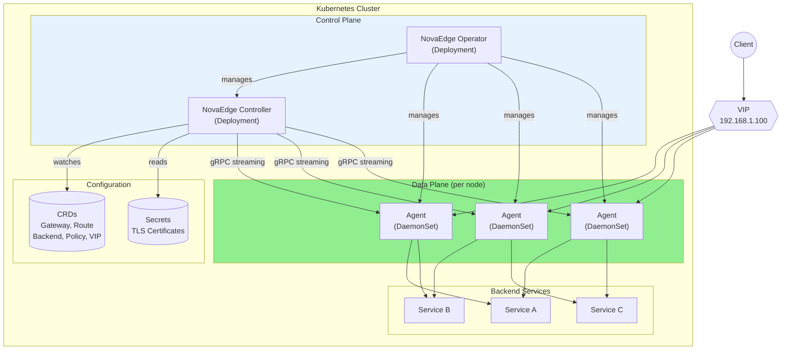
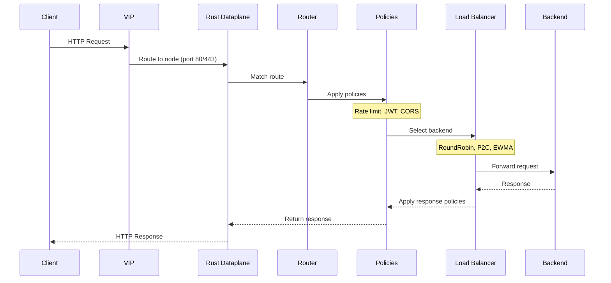
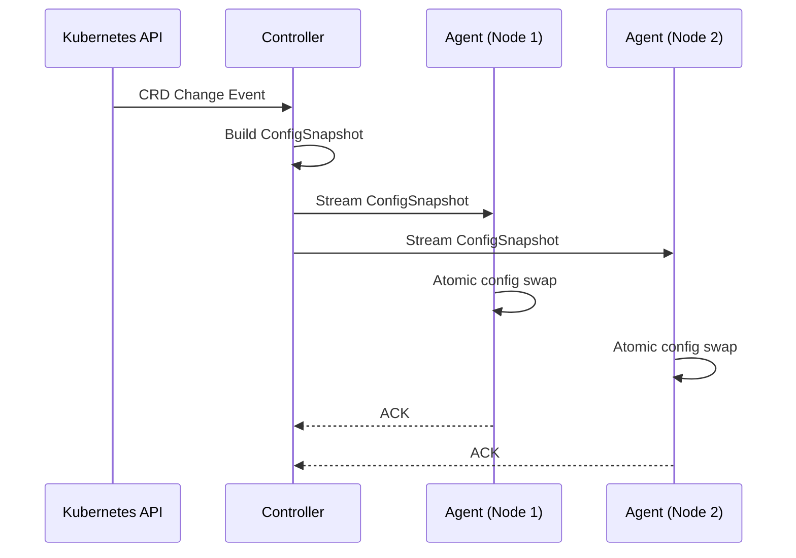
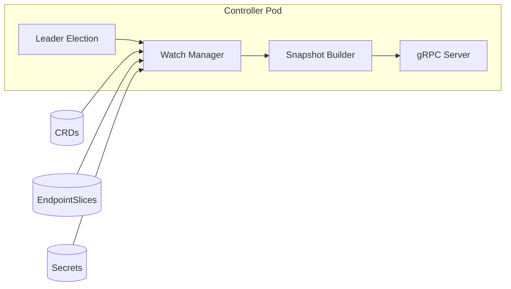
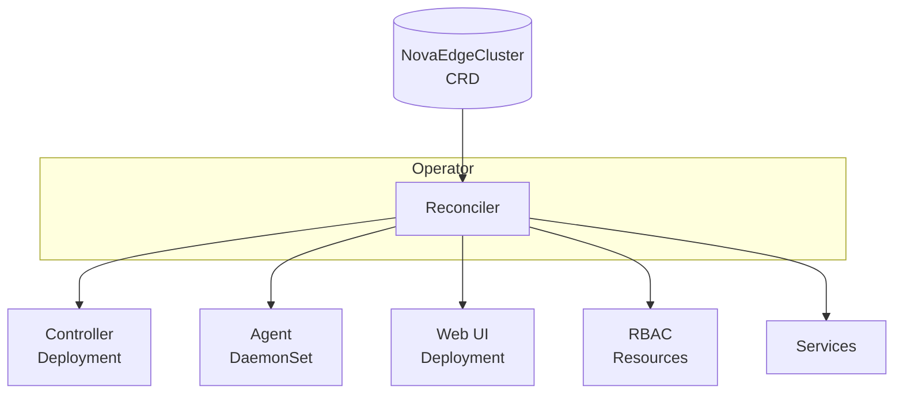
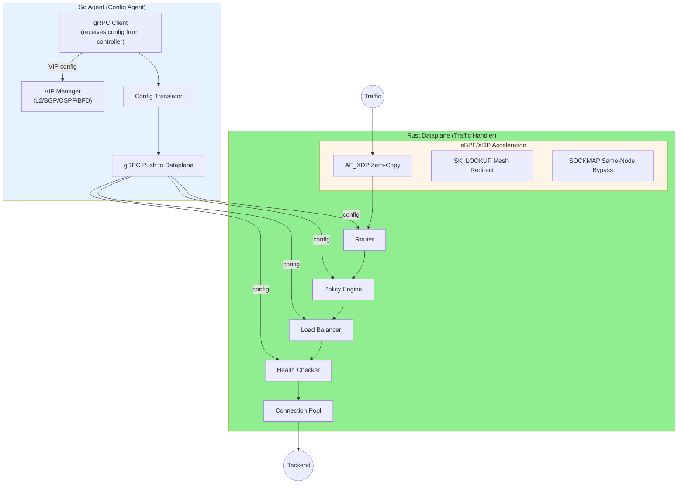
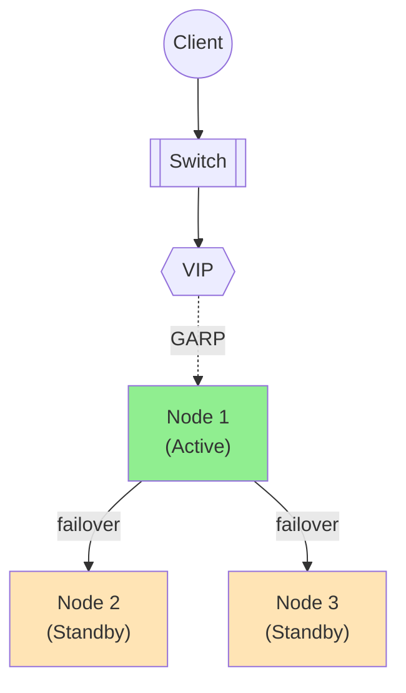
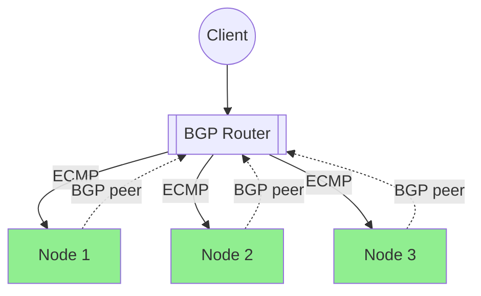
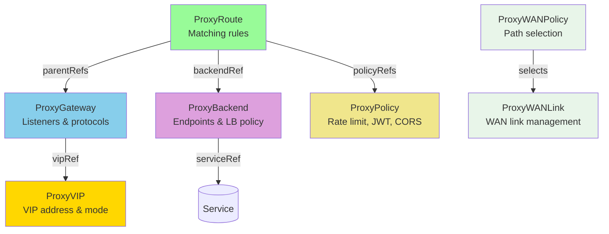

# Architecture Overview

NovaEdge is a distributed system designed to provide L7 load balancing, VIP management, and policy enforcement for Kubernetes environments.

## System Architecture

## Core Components

| Component | Type | Purpose |
|-----------|------|---------|
| **Operator** | Deployment | Manages NovaEdge lifecycle via `NovaEdgeCluster` CRD |
| **Controller** | Deployment | Watches CRDs, builds config snapshots, distributes via gRPC |
| **Agent** | DaemonSet | Config agent: receives config from controller, manages VIPs, pushes config to Rust dataplane |
| **Rust Dataplane** | DaemonSet sidecar | Traffic handler: binds ports 80/443, handles all L4/L7 traffic, routing, policies, load balancing |

## Request Flow

Note: The Go Agent does not appear in the request flow. It runs alongside the Rust Dataplane as a config agent, managing VIPs and pushing configuration updates via gRPC.

## Configuration Distribution

The Controller builds configuration snapshots and distributes them to Agents via gRPC streaming:

### ConfigSnapshot Contents

Each snapshot contains:

- **Gateways** - Listeners, protocols, TLS config
- **Routes** - Matching rules, filters, backend refs
- **Backends** - Endpoints from EndpointSlices, LB policy
- **Policies** - Rate limits, JWT config, CORS rules
- **VIPs** - VIP assignments for this node
- **Certificates** - TLS certificates from Secrets

## Control Plane Details

### Controller

The Controller runs as a Kubernetes Deployment with leader election:

**Responsibilities:**

1. Watch CRDs, EndpointSlices, and Secrets
2. Build versioned ConfigSnapshots
3. Stream snapshots to connected Agents
4. Handle leader election for HA

### Operator

The Operator manages the NovaEdge deployment lifecycle:

## Data Plane Details

### Agent

Each node runs two DaemonSet pods: the Go Agent (config agent) and the Rust Dataplane (traffic handler), both with `hostNetwork: true`:

**Agent Responsibilities (Config Agent):**

1. Receive config from controller via gRPC streaming
2. Bind/unbind VIPs on node interface (L2 ARP/BGP/OSPF/BFD)
3. Translate config and push to Rust dataplane via gRPC
4. Manage iptables/nftables rules
5. Manage eBPF program lifecycle

**Rust Dataplane Responsibilities (Traffic Handler):**

1. Bind ports 80/443 and accept all inbound traffic
2. Route incoming requests (hostname, path, header matching)
3. Apply policies (rate limit, JWT, CORS, WAF)
4. Load balance across healthy backends
5. Manage connection pools and circuit breakers
6. Perform active and passive health checks
7. Accelerate traffic via eBPF/XDP (AF_XDP zero-copy, SOCKMAP bypass, sk_lookup mesh redirect)

## VIP Modes

NovaEdge supports three VIP modes for different network topologies:

### L2 ARP Mode (Active/Standby)

- Single node owns VIP at a time
- Sends Gratuitous ARP to claim VIP
- Controller manages failover

### BGP Mode (Active/Active ECMP)

- All healthy nodes announce VIP
- ToR router performs ECMP
- Automatic failover via BGP withdrawal

### OSPF Mode

- Similar to BGP using OSPF LSAs
- Active/Active with L3 routing
- Useful in OSPF-only environments

## CRD Relationships

## Scalability

| Component | Scaling Model |
|-----------|---------------|
| Controller | Horizontal (with leader election) |
| Agent | One per node (DaemonSet) |
| Throughput | Linear with node count |

## High Availability

- **Controller**: Multiple replicas with leader election
- **Agent**: Runs on every node, VIP failover between nodes
- **Config**: Cached locally, survives controller restarts

## Next Steps

- [Component Details](components.md) - Deep dive into each component
- [Installation](../installation/kubernetes.md) - Deploy NovaEdge
