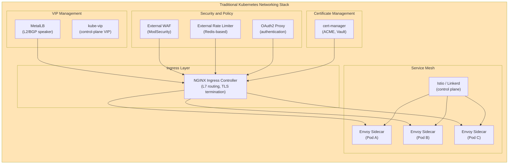
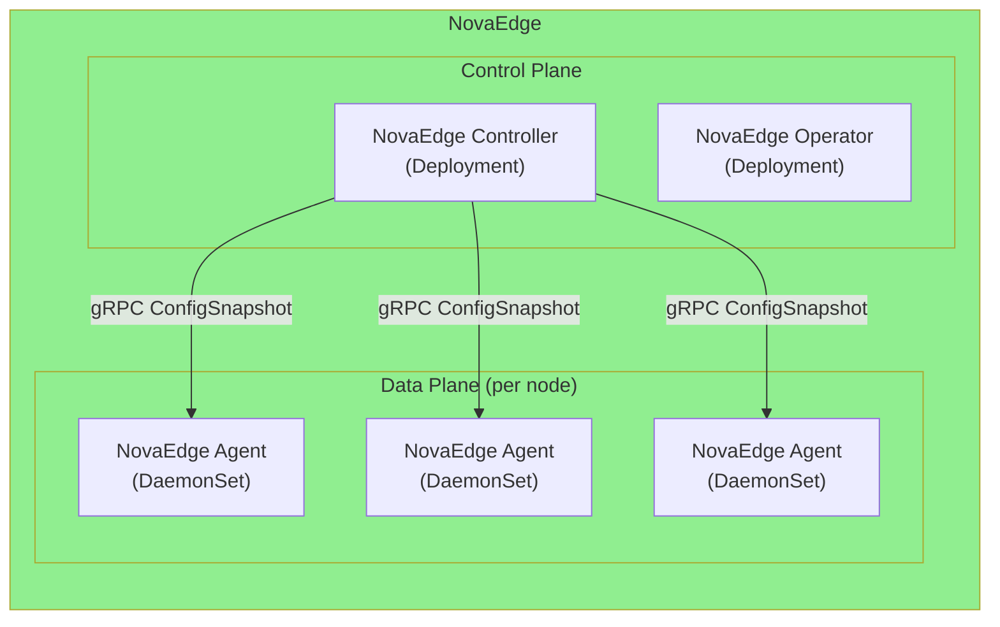
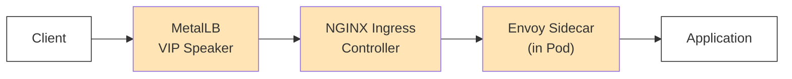
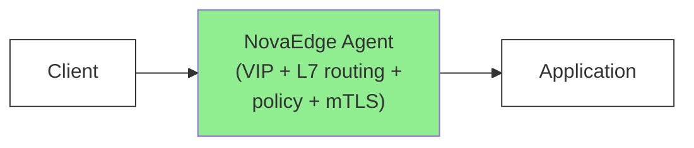

# What NovaEdge Replaces

NovaEdge consolidates multiple Kubernetes infrastructure tools into a single, unified solution. Instead of deploying and maintaining separate projects for ingress, load balancing, VIP management, service mesh, WAF, rate limiting, and certificate management, NovaEdge provides all of these capabilities in one binary with one configuration model.

This page explains what NovaEdge replaces, how its features map to existing tools, and why consolidation reduces operational complexity.

## Before and After

The following diagrams show a typical Kubernetes networking stack before and after adopting NovaEdge.

### Before: Traditional Multi-Tool Stack



**Result**: 6+ separate projects, dozens of CRDs, multiple configuration languages, independent upgrade cycles, and complex failure modes.

### After: NovaEdge



**Result**: 1 project, 12 CRDs, one configuration model, one upgrade path, and a single observability pipeline.

## Tool-by-Tool Replacement

The following table maps each traditional tool to the NovaEdge feature that replaces it.

| Traditional Tool | What It Does | NovaEdge Replacement |
|---|---|---|
| **NGINX Ingress Controller** | L7 HTTP routing, TLS termination, Kubernetes Ingress support | NovaEdge Ingress Controller with full Kubernetes Ingress and Gateway API support, L7 routing via `ProxyRoute` CRD, composable middleware pipelines |
| **Envoy / Istio Sidecar** | Per-pod sidecar proxy for service mesh, mTLS, traffic policies | NovaEdge TPROXY-based transparent proxy (no sidecars), transparent mTLS between services, traffic splitting and mirroring |
| **MetalLB** | Bare-metal VIP management via L2 ARP or BGP announcements | NovaEdge VIP management with L2 ARP, BGP (GoBGP), OSPF modes, plus BFD for sub-second failure detection, managed via `ProxyVIP` and `ProxyIPPool` CRDs |
| **Traefik** | L7 routing, middleware chains, built-in ACME certificate management | NovaEdge L7 routing with boolean routing expressions, middleware pipelines (auth, rate-limit, rewrite, compression, caching), built-in ACME via Let's Encrypt |
| **HAProxy** | High-performance L4/L7 proxying, health checks, connection management | NovaEdge L4 TCP/UDP proxying with TLS passthrough, 6 load balancing algorithms + sticky sessions, active/passive health checks, circuit breaking, connection pooling |
| **kube-vip** | Control-plane VIP for Kubernetes API server high availability | NovaEdge control-plane VIP manager with L2 ARP and BGP/BFD modes, leader election via Kubernetes leases |
| **cert-manager** | Automated TLS certificate lifecycle (ACME, Vault, self-signed) | NovaEdge built-in ACME client (HTTP-01, DNS-01 with Cloudflare/Route53/Google), cert-manager integration for existing deployments, HashiCorp Vault integration via `ProxyCertificate` CRD |
| **Kong / Ambassador** | API gateway with rate limiting, JWT validation, OAuth2, CORS policies | NovaEdge policy engine with token-bucket rate limiting (local + distributed Redis), JWT validation with JWKS, OAuth2/OIDC with Keycloak support, CORS, IP filtering, security headers via `ProxyPolicy` CRD |
| **ModSecurity** | Web Application Firewall (WAF) for OWASP threat protection | NovaEdge built-in WAF powered by Coraza engine with OWASP Core Rule Set support |
| **Linkerd** | Lightweight service mesh with automatic mTLS, traffic management | NovaEdge service mesh with TPROXY transparent proxy, automatic mTLS, traffic splitting, canary deployments, retry policies, without per-pod sidecar injection |
| **Cisco Viptela / WireGuard + manual scripts** | SD-WAN overlay with application-aware routing and WAN link failover | NovaEdge SD-WAN with `ProxyWANLink` and `ProxyWANPolicy` CRDs, WireGuard tunnels via wgctrl kernel API, SLA-based path selection (4 strategies), real-time link quality probing, DSCP marking, STUN NAT traversal |

## Feature Comparison Matrix

| Feature | NovaEdge | NGINX + MetalLB | Envoy + Istio | Traefik | HAProxy |
|---|:---:|:---:|:---:|:---:|:---:|
| **L7 HTTP/HTTPS Load Balancing** | Yes | Yes | Yes | Yes | Yes |
| **L4 TCP/UDP Proxying** | Yes | Limited | Yes | Yes | Yes |
| **HTTP/2 Support** | Yes | Yes | Yes | Yes | Yes |
| **HTTP/3 QUIC** | Yes | No | No | Experimental | No |
| **WebSocket / gRPC / SSE** | Yes | Yes | Yes | Yes | Partial |
| **VIP Management (L2 ARP)** | Yes | Yes (MetalLB) | No | No | No |
| **VIP Management (BGP)** | Yes | Yes (MetalLB) | No | No | No |
| **VIP Management (OSPF)** | Yes | No | No | No | No |
| **BFD (sub-second failover)** | Yes | No | No | No | No |
| **Rate Limiting** | Yes | External | Yes | Yes | Yes |
| **Distributed Rate Limiting (Redis)** | Yes | External | Yes | External | No |
| **Authentication (Basic/Forward)** | Yes | External | External | Yes | No |
| **OAuth2 / OIDC** | Yes | External | External | External | No |
| **JWT Validation** | Yes | External | Yes | External | No |
| **WAF (OWASP Rules)** | Yes | External | External | External | No |
| **TLS / ACME (Let's Encrypt)** | Yes | External (cert-manager) | External (cert-manager) | Yes | External |
| **cert-manager Integration** | Yes | Yes | Yes | No | No |
| **HashiCorp Vault Integration** | Yes | External | External | External | No |
| **mTLS (Frontend)** | Yes | Yes | Yes | Yes | Yes |
| **mTLS (Backend/Mesh)** | Yes | No | Yes (sidecars) | No | No |
| **Service Mesh (Sidecar-Free)** | Yes | No | No | No | No |
| **WASM Plugin System** | Yes | No | Yes | Experimental | No |
| **Gateway API Support** | Yes | Partial | Yes | Yes | No |
| **Kubernetes Ingress Support** | Yes | Yes | Yes | Yes | External |
| **Multi-Cluster Federation** | Yes | No | Partial | No | No |
| **Prometheus Metrics** | Yes | Yes | Yes | Yes | Yes |
| **OpenTelemetry Tracing** | Yes | External | Yes | Yes | No |
| **Response Caching** | Yes | Yes | No | No | Yes |
| **Compression (gzip/Brotli)** | Yes | Yes | Yes | Yes | Yes |
| **Traffic Mirroring** | Yes | No | Yes | Yes | No |
| **Traffic Splitting / Canary** | Yes | No | Yes | Yes | No |
| **Circuit Breaking** | Yes | No | Yes | Yes | No |
| **IP Filtering / Allowlists** | Yes | Yes | Yes | Yes | Yes |
| **SD-WAN (Application-Aware Path Selection)** | Yes | No | No | No | No |
| **CRDs to Manage** | 12 | 15+ (combined) | 50+ | 20+ | N/A |
| **Components to Deploy** | 2 | 3+ | 5+ | 1 | 1 |

## Operational Benefits

### Single Binary, Single Config Model

NovaEdge uses 12 purpose-built CRDs to express the full configuration surface. A traditional stack combining NGINX Ingress, MetalLB, cert-manager, and Istio requires understanding and maintaining 50+ CRDs across different API groups, each with its own versioning, documentation, and upgrade path.

```
Traditional stack CRDs:  NGINX (5) + MetalLB (6) + cert-manager (6) + Istio (30+) = 47+ CRDs
NovaEdge CRDs:           12 total
```

### Single Observability Pipeline

All NovaEdge metrics are exposed on a single Prometheus endpoint per agent. Request counts, latencies, upstream RTT, active connections, VIP failovers, certificate expiry, and WAF blocks are all available from one scrape target. OpenTelemetry traces follow the full request path from VIP ingress through routing and policy enforcement to the upstream response, without requiring trace context propagation across separate proxy boundaries.

### No Sidecar Overhead

Traditional service mesh solutions inject a sidecar proxy container into every application pod. This adds CPU and memory overhead per pod, increases scheduling complexity, and introduces latency on every hop. NovaEdge uses TPROXY-based transparent proxying at the node level, intercepting traffic without modifying pod definitions or injecting containers. This eliminates the per-pod resource tax while providing the same mTLS, traffic management, and observability capabilities.

### Unified RBAC and Security Model

With NovaEdge, one set of Kubernetes RBAC rules governs access to all networking configuration. In a traditional stack, separate RBAC policies are needed for Ingress resources, MetalLB address pools, cert-manager certificates, Istio policies, and external WAF rules. Consolidation into a single API group simplifies access control and audit logging.

### Fewer Failure Modes

Each additional component in the networking stack introduces its own failure modes, version compatibility requirements, and upgrade risks. A MetalLB speaker failure affects VIP availability but not routing. An NGINX Ingress Controller failure affects routing but not VIPs. Debugging requires correlating logs across multiple components with different log formats and verbosity settings. NovaEdge centralizes these functions, so a single structured log stream and one set of health checks covers the entire data path.

## Architecture Comparison: Request Flow

The following diagrams compare the request flow in a traditional multi-tool stack versus NovaEdge.

### Traditional Stack: Request Flow



**Hops**: Client -> MetalLB (L2/BGP) -> NGINX (L7 routing, TLS, WAF, auth) -> Envoy sidecar (mTLS, policy) -> Application

- 3 proxy hops before reaching the application
- Each hop adds latency, memory copies, and potential failure points
- TLS is terminated and re-established at multiple boundaries
- Debugging requires correlating logs from 3 separate components

### NovaEdge: Request Flow



**Hops**: Client -> NovaEdge Agent (VIP + L7 routing + TLS + WAF + auth + mTLS) -> Application

- 1 proxy hop before reaching the application
- VIP ownership, L7 routing, TLS termination, WAF, authentication, rate limiting, and upstream mTLS all happen in a single process
- Single structured log stream covers the entire request lifecycle
- OpenTelemetry trace spans the full path without cross-component correlation

### Latency Impact

| Metric | Traditional Stack | NovaEdge |
|---|---|---|
| Proxy hops | 3 | 1 |
| TLS handshakes (internal) | 2 (NGINX->Envoy, Envoy->App) | 1 (Agent->App) |
| Memory copies per request | 6+ | 2 |
| Components in failure domain | 3 | 1 |
| Log sources to correlate | 3+ | 1 |

## When to Choose NovaEdge

NovaEdge is a good fit when:

- You are running on bare metal or in environments without cloud load balancers and need VIP management
- You want to reduce the number of moving parts in your Kubernetes networking stack
- You need L4 and L7 proxying, WAF, rate limiting, and authentication without deploying separate tools for each
- You want service mesh capabilities (mTLS, traffic splitting) without the overhead of per-pod sidecars
- You need multi-cluster federation with a unified control plane
- You want a single set of CRDs and a single observability pipeline for all networking concerns

NovaEdge is not a drop-in replacement for every use case. If you only need basic Ingress routing and already have a stable NGINX Ingress Controller deployment, the migration cost may not be justified. NovaEdge provides the most value when you are currently running (or planning to run) multiple networking components that NovaEdge can consolidate.
