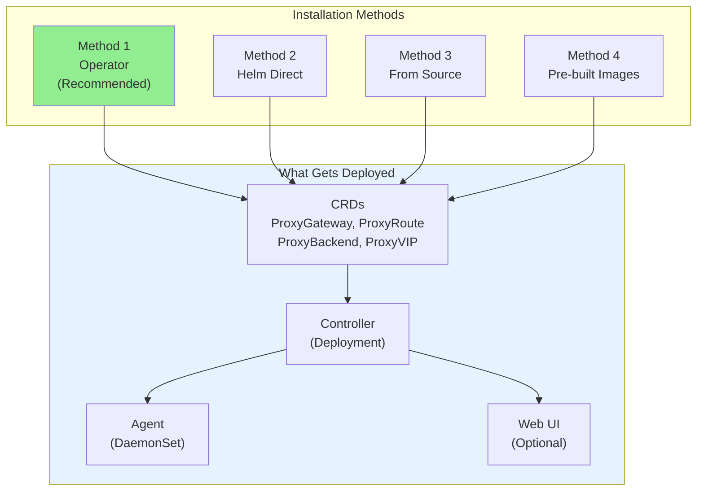
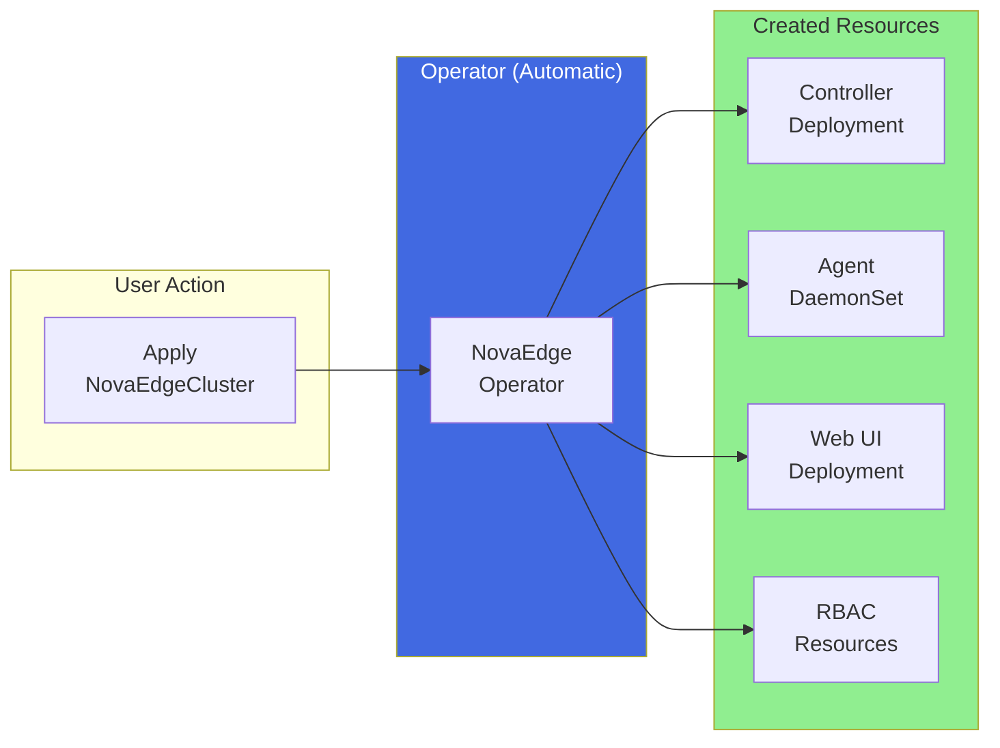
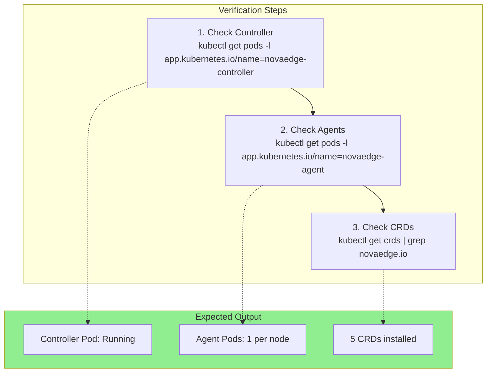

# Installation

This guide covers different installation methods for NovaEdge.

## Installation Overview



## Prerequisites

### Kubernetes Requirements

- Kubernetes 1.29 or higher
- kubectl configured with cluster access
- Cluster admin permissions (for CRD installation)
- Helm 3.0+ (recommended)

### Build Requirements (from source)

- Go 1.23 or higher
- make
- Docker (for container images)

## Installation Methods

### Method 1: Using the Operator (Recommended)

The NovaEdge Operator provides the easiest way to deploy and manage NovaEdge:

```bash
# Clone the repository
git clone https://github.com/piwi3910/novaedge.git
cd novaedge

# Install the operator
helm install novaedge-operator ./charts/novaedge-operator \
  --namespace novaedge-system \
  --create-namespace

# Create a NovaEdgeCluster
kubectl apply -f - <<EOF
apiVersion: novaedge.io/v1alpha1
kind: NovaEdgeCluster
metadata:
  name: novaedge
  namespace: novaedge-system
spec:
  version: "v0.1.0"
  controller:
    replicas: 1
    leaderElection: true
  agent:
    hostNetwork: true
    vip:
      enabled: true
      mode: L2
  webUI:
    enabled: true
    service:
      type: ClusterIP
EOF

# Verify
kubectl get novaedgecluster -n novaedge-system
kubectl get pods -n novaedge-system
```

The operator will automatically:
- Create the controller deployment
- Create the agent DaemonSet on all nodes
- Create the web UI deployment
- Configure RBAC for all components
- Handle rolling upgrades when you change the version



### Method 2: Using Helm (Direct)

Deploy NovaEdge components directly without the operator:

```bash
# Clone the repository
git clone https://github.com/piwi3910/novaedge.git
cd novaedge

# Install with Helm
helm install novaedge ./charts/novaedge \
  --namespace novaedge-system \
  --create-namespace

# Verify
kubectl get pods -n novaedge-system
```

### Method 3: From Source

```bash
# Clone the repository
git clone https://github.com/piwi3910/novaedge.git
cd novaedge

# Build all components
make build-all

# Build Docker images
make docker-build

# Install CRDs
make install-crds

# Deploy to cluster
kubectl apply -f config/controller/namespace.yaml
kubectl apply -f config/rbac/
kubectl apply -f config/controller/deployment.yaml
kubectl apply -f config/agent/
```

### Method 2: Using Pre-built Images

```bash
# Install CRDs
kubectl apply -f https://raw.githubusercontent.com/piwi3910/novaedge/main/config/crd/proxyvip.yaml
kubectl apply -f https://raw.githubusercontent.com/piwi3910/novaedge/main/config/crd/proxygateway.yaml
kubectl apply -f https://raw.githubusercontent.com/piwi3910/novaedge/main/config/crd/proxyroute.yaml
kubectl apply -f https://raw.githubusercontent.com/piwi3910/novaedge/main/config/crd/proxybackend.yaml
kubectl apply -f https://raw.githubusercontent.com/piwi3910/novaedge/main/config/crd/proxypolicy.yaml

# Deploy controller and agents
kubectl apply -f https://raw.githubusercontent.com/piwi3910/novaedge/main/config/controller/namespace.yaml
kubectl apply -f https://raw.githubusercontent.com/piwi3910/novaedge/main/config/rbac/
kubectl apply -f https://raw.githubusercontent.com/piwi3910/novaedge/main/config/controller/deployment.yaml
kubectl apply -f https://raw.githubusercontent.com/piwi3910/novaedge/main/config/agent/
```

## Verification

After installation, verify all components are running:



### Check Controller

```bash
# Verify controller pod is running
kubectl get pods -n novaedge-system -l app.kubernetes.io/name=novaedge-controller

# Check controller logs
kubectl logs -n novaedge-system -l app.kubernetes.io/name=novaedge-controller
```

### Check Agents

```bash
# Verify agent pods are running on all nodes
kubectl get pods -n novaedge-system -l app.kubernetes.io/name=novaedge-agent -o wide

# Check agent logs
kubectl logs -n novaedge-system -l app.kubernetes.io/name=novaedge-agent
```

### Check CRDs

```bash
# List installed CRDs
kubectl get crds | grep novaedge.io

# Expected output:
# proxybackends.novaedge.io
# proxygateways.novaedge.io
# proxypolicies.novaedge.io
# proxyroutes.novaedge.io
# proxyvips.novaedge.io
```

## Configuration

### Controller Configuration

The controller can be configured via command-line flags or environment variables:

| Flag | Environment Variable | Description | Default |
|------|---------------------|-------------|---------|
| `--metrics-port` | `METRICS_PORT` | Prometheus metrics port | 9090 |
| `--grpc-port` | `GRPC_PORT` | gRPC server port | 9091 |
| `--log-level` | `LOG_LEVEL` | Log level (debug, info, warn, error) | info |

### Agent Configuration

Agent configuration flags:

| Flag | Environment Variable | Description | Default |
|------|---------------------|-------------|---------|
| `--controller-addr` | `CONTROLLER_ADDR` | Controller gRPC address | controller:9091 |
| `--node-name` | `NODE_NAME` | Node name (from downward API) | hostname |
| `--metrics-port` | `METRICS_PORT` | Prometheus metrics port | 9090 |
| `--log-level` | `LOG_LEVEL` | Log level | info |

## Uninstallation

```bash
# Remove all NovaEdge resources
kubectl delete proxyvips,proxygateways,proxyroutes,proxybackends,proxypolicies --all -A

# Remove controller and agents
kubectl delete -f config/agent/
kubectl delete -f config/controller/
kubectl delete -f config/rbac/

# Remove CRDs
make uninstall-crds

# Remove namespace
kubectl delete namespace novaedge-system
```

## Troubleshooting

### Controller Not Starting

```bash
# Check pod status
kubectl describe pod -n novaedge-system -l app.kubernetes.io/name=novaedge-controller

# Check for RBAC issues
kubectl auth can-i list proxygateways --as=system:serviceaccount:novaedge-system:novaedge-controller
```

### Agent Not Connecting

```bash
# Check controller service
kubectl get svc -n novaedge-system novaedge-controller

# Test connectivity from agent
kubectl exec -n novaedge-system -it <agent-pod> -- nc -zv novaedge-controller 9091
```

### CRDs Not Found

```bash
# Reinstall CRDs
make install-crds

# Or manually
kubectl apply -f config/crd/
```

## Next Steps

- [Quick Start](quickstart.md) - Create your first gateway
- [Deployment Guide](../user-guide/deployment-guide.md) - Production deployment
