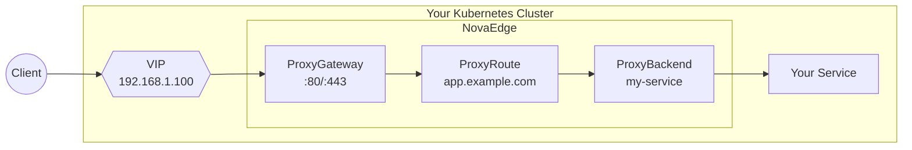
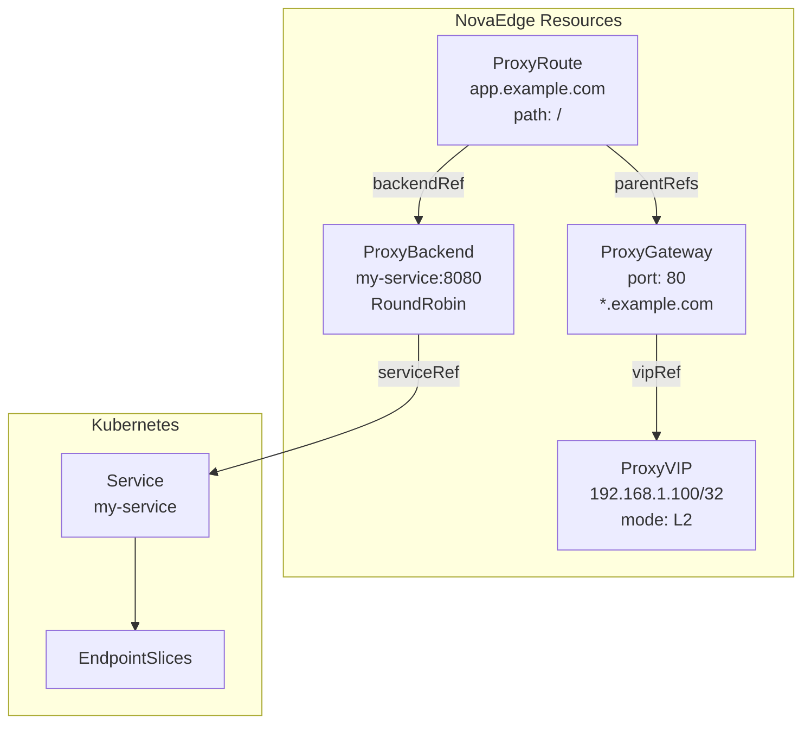

# Quick Start

Get NovaEdge up and running in your Kubernetes cluster in minutes.

## What You'll Build



## Prerequisites

- Kubernetes cluster (1.29+)
- kubectl configured
- Helm 3.0+ (recommended)

## Installation

Choose one of the following installation methods:

### Option 1: Using the Operator (Recommended)

The operator provides the simplest way to deploy and manage NovaEdge:

```bash
# Clone the repository
git clone https://github.com/piwi3910/novaedge.git
cd novaedge

# Install the operator
helm install novaedge-operator ./charts/novaedge-operator \
  --namespace novaedge-system \
  --create-namespace

# Deploy NovaEdge using the operator
kubectl apply -f - <<EOF
apiVersion: novaedge.io/v1alpha1
kind: NovaEdgeCluster
metadata:
  name: novaedge
  namespace: novaedge-system
spec:
  version: "v0.1.0"
  controller:
    replicas: 1
  agent:
    hostNetwork: true
    vip:
      enabled: true
      mode: L2
  webUI:
    enabled: true
EOF

# Verify deployment
kubectl get novaedgecluster -n novaedge-system
kubectl get pods -n novaedge-system
```

### Option 2: Using Helm (Direct)

Deploy NovaEdge components directly with Helm:

```bash
# Clone the repository
git clone https://github.com/piwi3910/novaedge.git
cd novaedge

# Install with Helm
helm install novaedge ./charts/novaedge \
  --namespace novaedge-system \
  --create-namespace

# Verify deployment
kubectl get pods -n novaedge-system
```

### Option 3: Using kubectl (Manual)

For more control over the deployment:

```bash
# Clone the repository
git clone https://github.com/piwi3910/novaedge.git
cd novaedge

# Install CRDs
make install-crds

# Verify CRDs are installed
kubectl get crds | grep novaedge.io

# Create namespace
kubectl apply -f config/controller/namespace.yaml

# Deploy RBAC and controller
kubectl apply -f config/rbac/
kubectl apply -f config/controller/deployment.yaml

# Deploy agent DaemonSet
kubectl apply -f config/agent/

# Verify all pods are running
kubectl get pods -n novaedge-system
```

## Your First Gateway

The following diagram shows how NovaEdge resources connect together:



### Step 1: Create a VIP

```yaml
apiVersion: novaedge.io/v1alpha1
kind: ProxyVIP
metadata:
  name: my-vip
spec:
  address: 192.168.1.100/32
  mode: L2
  interface: eth0
```

### Step 2: Create a Gateway

```yaml
apiVersion: novaedge.io/v1alpha1
kind: ProxyGateway
metadata:
  name: my-gateway
spec:
  vipRef: my-vip
  listeners:
  - name: http
    port: 80
    protocol: HTTP
    hostnames:
    - "*.example.com"
```

### Step 3: Create a Backend

```yaml
apiVersion: novaedge.io/v1alpha1
kind: ProxyBackend
metadata:
  name: my-backend
spec:
  serviceRef:
    name: my-service
    port: 8080
  lbPolicy: RoundRobin
  healthCheck:
    interval: 10s
    httpHealthCheck:
      path: /health
```

### Step 4: Create a Route

```yaml
apiVersion: novaedge.io/v1alpha1
kind: ProxyRoute
metadata:
  name: my-route
spec:
  parentRefs:
  - name: my-gateway
  hostnames:
  - app.example.com
  rules:
  - matches:
    - path:
        type: PathPrefix
        value: /
    backendRef:
      name: my-backend
```

### Step 5: Test

```bash
# Get the VIP address
kubectl get proxyvip my-vip -o jsonpath='{.spec.address}'

# Test the route
curl -H "Host: app.example.com" http://192.168.1.100/
```

## Using the CLI

NovaEdge includes `novactl`, a kubectl-style CLI:

```bash
# Build the CLI
make build-novactl

# List resources
./novactl get gateways
./novactl get routes
./novactl get backends

# Describe a resource
./novactl describe gateway my-gateway

# Check overall status
./novactl status
```

## Next Steps

- [Operator Guide](../user-guide/operator.md) - Manage NovaEdge with the operator
- [Deployment Guide](../user-guide/deployment-guide.md) - Production deployment
- [Web UI Guide](../user-guide/web-ui.md) - Use the web dashboard
- [Gateway API](../user-guide/gateway-api.md) - Use standard Gateway API resources
- [novactl Reference](../reference/novactl-reference.md) - Full CLI documentation
