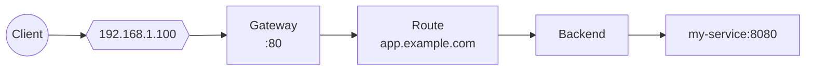

# Quick Start

Get NovaEdge running in your Kubernetes cluster in under 5 minutes.

## Prerequisites

- Kubernetes 1.29+
- kubectl configured
- Helm 3.0+

## Step 1: Install NovaEdge

```bash
# Clone the repository
git clone https://github.com/piwi3910/novaedge.git
cd novaedge

# Install the operator
helm install novaedge-operator ./charts/novaedge-operator \
  --namespace novaedge-system \
  --create-namespace

# Deploy NovaEdge cluster
kubectl apply -f - <<EOF
apiVersion: novaedge.io/v1alpha1
kind: NovaEdgeCluster
metadata:
  name: novaedge
  namespace: novaedge-system
spec:
  version: "v0.1.0"
  controller:
    replicas: 1
  agent:
    hostNetwork: true
    vip:
      enabled: true
      mode: L2
EOF
```

## Step 2: Verify Installation

```bash
# Check all pods are running
kubectl get pods -n novaedge-system

# Expected output:
# NAME                                    READY   STATUS    RESTARTS   AGE
# novaedge-operator-xxx                   1/1     Running   0          1m
# novaedge-controller-xxx                 1/1     Running   0          1m
# novaedge-agent-xxxxx                    1/1     Running   0          1m
```

## Step 3: Create Your First Gateway

This example creates a complete load balancing setup:



### 3.1 Create a VIP

```yaml
# Apply with: kubectl apply -f -
apiVersion: novaedge.io/v1alpha1
kind: ProxyVIP
metadata:
  name: my-vip
spec:
  address: 192.168.1.100/32
  mode: L2
  interface: eth0
```

### 3.2 Create a Gateway

```yaml
apiVersion: novaedge.io/v1alpha1
kind: ProxyGateway
metadata:
  name: my-gateway
spec:
  vipRef: my-vip
  listeners:
  - name: http
    port: 80
    protocol: HTTP
    hostnames:
    - "*.example.com"
```

### 3.3 Create a Backend

```yaml
apiVersion: novaedge.io/v1alpha1
kind: ProxyBackend
metadata:
  name: my-backend
spec:
  serviceRef:
    name: my-service
    port: 8080
  lbPolicy: RoundRobin
  healthCheck:
    interval: 10s
    httpHealthCheck:
      path: /health
```

### 3.4 Create a Route

```yaml
apiVersion: novaedge.io/v1alpha1
kind: ProxyRoute
metadata:
  name: my-route
spec:
  parentRefs:
  - name: my-gateway
  hostnames:
  - app.example.com
  rules:
  - matches:
    - path:
        type: PathPrefix
        value: /
    backendRef:
      name: my-backend
```

## Step 4: Test

```bash
# Test the endpoint
curl -H "Host: app.example.com" http://192.168.1.100/

# Or add to /etc/hosts and test directly
echo "192.168.1.100 app.example.com" | sudo tee -a /etc/hosts
curl http://app.example.com/
```

## All-in-One Example

Apply everything at once:

```yaml
# save as novaedge-example.yaml
---
apiVersion: novaedge.io/v1alpha1
kind: ProxyVIP
metadata:
  name: my-vip
spec:
  address: 192.168.1.100/32
  mode: L2
  interface: eth0
---
apiVersion: novaedge.io/v1alpha1
kind: ProxyGateway
metadata:
  name: my-gateway
spec:
  vipRef: my-vip
  listeners:
  - name: http
    port: 80
    protocol: HTTP
    hostnames:
    - "*.example.com"
---
apiVersion: novaedge.io/v1alpha1
kind: ProxyBackend
metadata:
  name: my-backend
spec:
  serviceRef:
    name: my-service
    port: 8080
  lbPolicy: RoundRobin
  healthCheck:
    interval: 10s
    httpHealthCheck:
      path: /health
---
apiVersion: novaedge.io/v1alpha1
kind: ProxyRoute
metadata:
  name: my-route
spec:
  parentRefs:
  - name: my-gateway
  hostnames:
  - app.example.com
  rules:
  - matches:
    - path:
        type: PathPrefix
        value: /
    backendRef:
      name: my-backend
```

```bash
kubectl apply -f novaedge-example.yaml
```

## Using the CLI

NovaEdge includes `novactl` for management:

```bash
# Build the CLI
make build-novactl

# List resources
./novactl get gateways
./novactl get routes
./novactl get backends

# Check status
./novactl status
```

## Next Steps

| Topic | Description |
|-------|-------------|
| [Installation](../installation/kubernetes.md) | Detailed installation options |
| [Routing](../user-guide/routing.md) | Advanced routing configuration |
| [VIP Management](../user-guide/vip-management.md) | L2, BGP, and OSPF modes |
| [Policies](../user-guide/policies.md) | Rate limiting, CORS, JWT auth |
| [Observability](../operations/observability.md) | Metrics and tracing |
