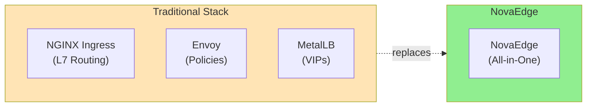
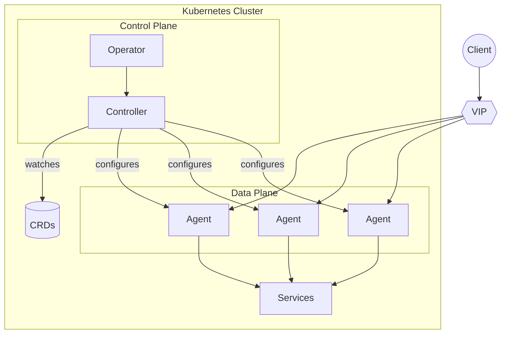

# NovaEdge

**A unified Kubernetes-native load balancer, reverse proxy, and VIP controller**

NovaEdge replaces Envoy + MetalLB + NGINX Ingress with a single, integrated solution designed for modern Kubernetes deployments.

## Why NovaEdge?



| Feature | Traditional | NovaEdge |
|---------|-------------|----------|
| L7 Load Balancing | NGINX/Envoy | Built-in |
| VIP Management | MetalLB | Built-in (L2/BGP/OSPF) |
| Rate Limiting | Envoy/Kong | Built-in |
| TLS Termination | Multiple configs | Unified |
| Components to manage | 3+ | 1 |

## Key Features

- **L7 Load Balancing** - HTTP/1.1, HTTP/2, HTTP/3 (QUIC), WebSockets, gRPC
- **VIP Management** - L2 ARP, BGP, and OSPF modes for bare-metal
- **Policy Enforcement** - Rate limiting, JWT auth, CORS, IP filtering
- **Gateway API** - Native support for Kubernetes Gateway API
- **Multi-Cluster** - Hub-spoke federation for distributed deployments
- **Observability** - OpenTelemetry tracing, Prometheus metrics, structured logging

## Quick Start

Get running in 2 minutes:

```bash
# Install the operator
helm install novaedge-operator ./charts/novaedge-operator \
  --namespace novaedge-system --create-namespace

# Deploy NovaEdge
kubectl apply -f - <<EOF
apiVersion: novaedge.io/v1alpha1
kind: NovaEdgeCluster
metadata:
  name: novaedge
  namespace: novaedge-system
spec:
  version: "v0.1.0"
  agent:
    vip:
      enabled: true
      mode: L2
EOF

# Verify
kubectl get pods -n novaedge-system
```

[Full Quick Start Guide](getting-started/quickstart.md){ .md-button .md-button--primary }

## Architecture at a Glance



**Components:**

- **Operator** - Manages NovaEdge lifecycle via `NovaEdgeCluster` CRD
- **Controller** - Watches CRDs, builds config, distributes to agents via gRPC
- **Agents** - Per-node DaemonSet handling traffic routing and VIP management

[Learn more about the architecture](architecture/overview.md)

## Documentation

### Getting Started
- [Quick Start](getting-started/quickstart.md) - Deploy in 5 minutes
- [Installation](installation/kubernetes.md) - Detailed installation options

### Architecture
- [Architecture Overview](architecture/overview.md) - System design and components
- [Component Details](architecture/components.md) - Deep dive into each component

### User Guide
- [Routing](user-guide/routing.md) - Configure routes and traffic matching
- [Load Balancing](user-guide/load-balancing.md) - Algorithms and session affinity
- [VIP Management](user-guide/vip-management.md) - L2, BGP, and OSPF modes
- [Policies](user-guide/policies.md) - Rate limiting, CORS, JWT, IP filtering
- [TLS](user-guide/tls.md) - TLS termination and mTLS
- [Health Checks](user-guide/health-checks.md) - Active and passive health checking

### Advanced Topics
- [Multi-Cluster](advanced/multi-cluster.md) - Hub-spoke federation
- [HTTP/3 & QUIC](advanced/http3-quic.md) - Next-gen protocol support
- [Gateway API](advanced/gateway-api.md) - Kubernetes Gateway API integration

### Operations
- [Observability](operations/observability.md) - Metrics, tracing, and logging
- [Web UI](operations/web-ui.md) - Dashboard for monitoring and management
- [Troubleshooting](operations/troubleshooting.md) - Common issues and solutions

### Reference
- [CRD Reference](reference/crd-reference.md) - Complete CRD specifications
- [CLI Reference](reference/cli-reference.md) - novactl command reference
- [Helm Values](reference/helm-values.md) - Chart configuration options

### Development
- [Contributing](development/contributing.md) - How to contribute
- [Development Guide](development/development-guide.md) - Building from source

## License

Apache License 2.0
