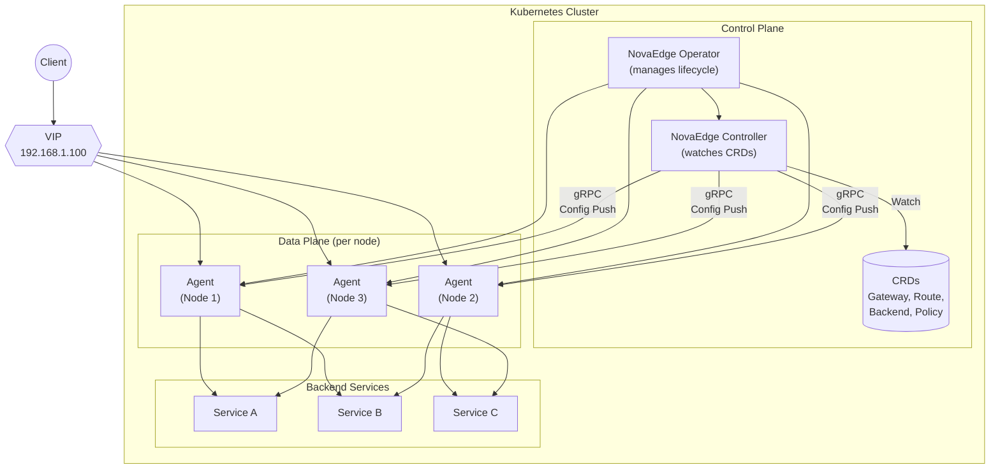
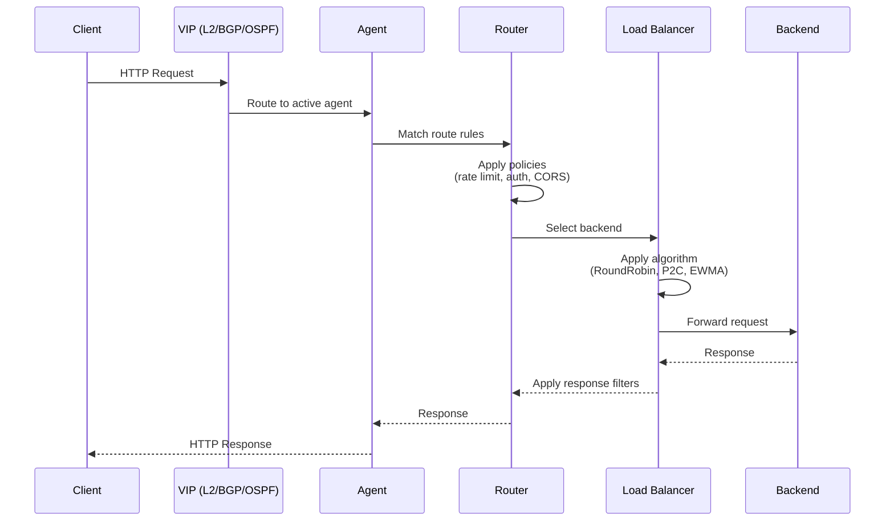
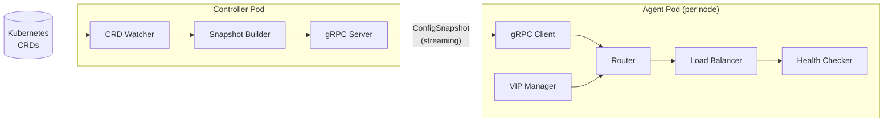
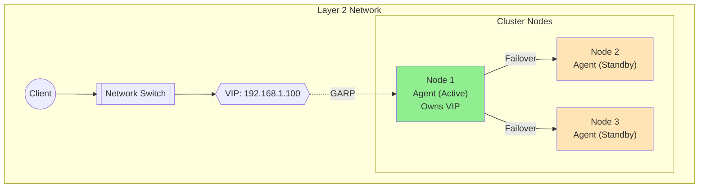
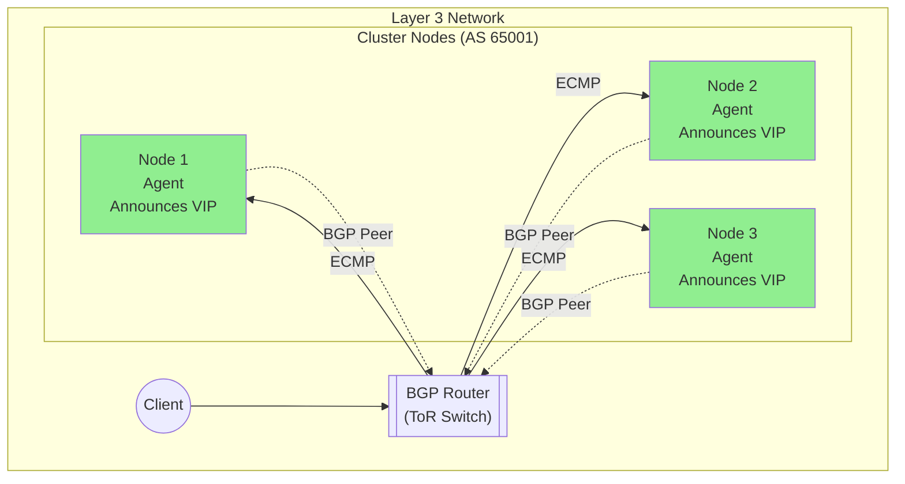

# NovaEdge

**Distributed Kubernetes-native load balancer, reverse proxy, and VIP controller**

NovaEdge is a unified replacement for Envoy + MetalLB + NGINX Ingress, providing enterprise-grade load balancing with native Kubernetes integration.

## Features

- **Distributed L7 Load Balancing** - HTTP/1.1, HTTP/2, HTTP/3 (QUIC), WebSockets, gRPC
- **Reverse Proxy with Filters** - Authentication, rate limiting, URL rewrites, CORS, response headers
- **Ingress Controller** - Compatible with Kubernetes Ingress and Gateway API
- **Distributed VIP Management** - L2 ARP, BGP, and OSPF modes
- **Policy Enforcement** - Rate limiting, JWT validation, IP filtering, security headers
- **Health Checking** - Active and passive health checks with circuit breaking
- **Full Observability** - OpenTelemetry tracing, Prometheus metrics, structured logging

## Quick Start

### Using the Operator (Recommended)

The NovaEdge Operator provides the easiest way to deploy and manage NovaEdge:

```bash
# Clone the repository
git clone https://github.com/piwi3910/novaedge.git
cd novaedge

# Install the operator
helm install novaedge-operator ./charts/novaedge-operator \
  --namespace novaedge-system \
  --create-namespace

# Create a NovaEdge cluster
kubectl apply -f - <<EOF
apiVersion: novaedge.io/v1alpha1
kind: NovaEdgeCluster
metadata:
  name: novaedge
  namespace: novaedge-system
spec:
  version: "v0.1.0"
  controller:
    replicas: 1
  agent:
    hostNetwork: true
    vip:
      enabled: true
      mode: L2
  webUI:
    enabled: true
EOF

# Verify deployment
kubectl get novaedgecluster -n novaedge-system
kubectl get pods -n novaedge-system
```

### Using Helm (Direct)

Deploy components directly without the operator:

```bash
helm install novaedge ./charts/novaedge \
  --namespace novaedge-system \
  --create-namespace
```

### Using kubectl (Manual)

```bash
# Install CRDs
make install-crds

# Deploy controller and agents
kubectl apply -f config/rbac/
kubectl apply -f config/controller/
kubectl apply -f config/agent/

# Apply sample configuration
kubectl apply -f config/samples/
```

## Architecture

NovaEdge consists of three major components:

1. **Operator (Optional)** - Kubernetes Operator that manages the lifecycle of NovaEdge components using `NovaEdgeCluster` CRD

2. **Controller (Control Plane)** - Kubernetes Deployment that watches CRDs, builds routing configuration, and distributes to agents via gRPC

3. **Agent (Data Plane)** - DaemonSet with hostNetwork that handles L7 load balancing, VIP management, and traffic routing

4. **CRDs** - Custom Resource Definitions: `NovaEdgeCluster`, `ProxyGateway`, `ProxyRoute`, `ProxyBackend`, `ProxyPolicy`, `ProxyVIP`

### High-Level Architecture



### Request Flow



### Component Interaction



## Deployment Modes

### Kubernetes Mode

Full integration with Kubernetes using CRDs, EndpointSlices for service discovery, and Secrets for TLS certificates.

[Learn more about Kubernetes deployment →](user-guide/deployment-guide.md)

### Standalone Mode

Run NovaEdge as a standalone load balancer without Kubernetes. Ideal for Docker-based deployments, bare-metal servers, and edge locations.

[Learn more about standalone mode →](user-guide/standalone-mode.md)

## Documentation

### Getting Started

- [Quick Start](getting-started/quickstart.md) - Get up and running in minutes
- [Installation](getting-started/installation.md) - Detailed installation guide

### User Guide

- [Operator Guide](user-guide/operator.md) - Deploy and manage NovaEdge with the operator
- [Deployment Guide](user-guide/deployment-guide.md) - Production deployment best practices
- [Web UI Guide](user-guide/web-ui.md) - Use the web dashboard
- [Standalone Mode](user-guide/standalone-mode.md) - Non-Kubernetes deployments
- [Gateway API](user-guide/gateway-api.md) - Using standard Gateway API resources
- [HTTP/3 and QUIC](user-guide/http3-guide.md) - Configure HTTP/3 support

### Reference

- [novactl CLI](reference/novactl-reference.md) - Command-line interface reference
- [CRD Reference](reference/crd-reference.md) - Custom Resource Definition reference
- [Helm Values](reference/helm-values.md) - Helm chart configuration reference

### Development

- [Development Guide](development/development-guide.md) - Contributing to NovaEdge
- [Contributing](development/contributing.md) - Contribution guidelines

## Load Balancing Algorithms

| Algorithm | Description | Use Case |
|-----------|-------------|----------|
| **RoundRobin** | Equal distribution across backends | General purpose |
| **P2C** | Power of Two Choices | Low latency |
| **EWMA** | Exponentially weighted moving average | Latency-aware |
| **RingHash** | Consistent hashing | Session affinity |
| **Maglev** | Google's Maglev hashing | High-performance consistent hashing |

## VIP Modes

| Mode | Description | Network |
|------|-------------|---------|
| **L2 ARP** | Single active node with gratuitous ARP | Layer 2 |
| **BGP** | Multi-node ECMP via BGP peering | Layer 3 |
| **OSPF** | Multi-node via OSPF routing | Layer 3 |

### L2 ARP Mode (Active/Standby)



### BGP Mode (Active/Active ECMP)



## License

Copyright 2024 NovaEdge Authors. Licensed under the Apache License, Version 2.0.
