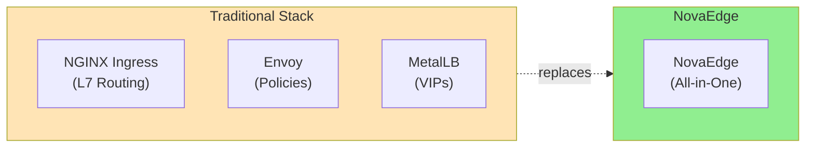
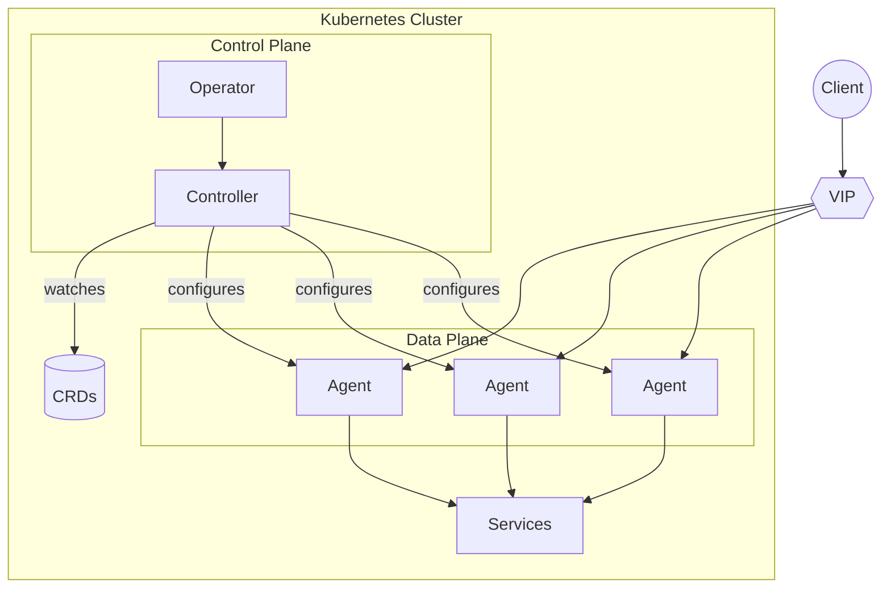

# NovaEdge

**A unified Kubernetes-native load balancer, reverse proxy, and VIP controller**

NovaEdge replaces Envoy + MetalLB + NGINX Ingress with a single, integrated solution designed for modern Kubernetes deployments.

## Why NovaEdge?



| Feature | Traditional | NovaEdge |
|---------|-------------|----------|
| L7 Load Balancing | NGINX/Envoy | Built-in (6 algorithms) |
| L4 TCP/UDP Proxying | HAProxy/Envoy | Built-in |
| VIP Management | MetalLB | Built-in (L2/BGP/OSPF + BFD) |
| Rate Limiting | Envoy/Kong | Built-in (local + Redis) |
| Authentication | OAuth2 Proxy/Kong | Built-in (Basic/Forward/OIDC) |
| WAF | ModSecurity/Kong | Built-in (Coraza) |
| TLS/ACME | cert-manager/Traefik | Built-in + cert-manager support |
| WASM Plugins | Envoy | Built-in (Wazero) |
| Components to manage | 3+ | 1 |

## Key Features

- **L7 Load Balancing** - HTTP/1.1, HTTP/2, HTTP/3 (QUIC), WebSockets, gRPC, SSE
- **L4 Proxying** - TCP/UDP proxying with TLS passthrough
- **VIP Management** - L2 ARP, BGP, OSPF modes with BFD and IPv6 dual-stack
- **Security** - mTLS, OCSP stapling, PROXY protocol, WAF, authentication stack
- **Certificate Management** - ACME, cert-manager, HashiCorp Vault integration
- **Policy Enforcement** - Rate limiting, JWT auth, CORS, IP filtering, security headers
- **Extensibility** - WASM plugins, composable middleware pipelines
- **Gateway API** - Native support for Kubernetes Gateway API (HTTP, gRPC, TCP, TLS routes)
- **Multi-Cluster** - Hub-spoke federation with split-brain detection
- **Observability** - OpenTelemetry tracing, Prometheus metrics, structured logging, Web UI

## Quick Start

Get running in 2 minutes:

```bash
# Install the operator
helm install novaedge-operator ./charts/novaedge-operator \
  --namespace novaedge-system --create-namespace

# Deploy NovaEdge
kubectl apply -f - <<EOF
apiVersion: novaedge.io/v1alpha1
kind: NovaEdgeCluster
metadata:
  name: novaedge
  namespace: novaedge-system
spec:
  version: "v0.1.0"
  agent:
    vip:
      enabled: true
      mode: L2
EOF

# Verify
kubectl get pods -n novaedge-system
```

[Full Quick Start Guide](getting-started/quickstart.md){ .md-button .md-button--primary }

## Architecture at a Glance



**Components:**

- **Operator** - Manages NovaEdge lifecycle via `NovaEdgeCluster` CRD
- **Controller** - Watches CRDs, builds config, distributes to agents via gRPC
- **Agents** - Per-node DaemonSet handling traffic routing and VIP management

[Learn more about the architecture](architecture/overview.md)

## Documentation

### Getting Started
- [Quick Start](getting-started/quickstart.md) - Deploy in 5 minutes
- [Installation](installation/kubernetes.md) - Detailed installation options
- [Helm Installation](installation/helm.md) - Deploy with Helm charts
- [Standalone Mode](installation/standalone.md) - Run without Kubernetes
- [Operator Installation](installation/operator.md) - Lifecycle management via operator

### Architecture
- [Architecture Overview](architecture/overview.md) - System design and components
- [Component Details](architecture/components.md) - Deep dive into each component
- [Federation Architecture](architecture/federation.md) - Multi-cluster federation design

### User Guide

#### Routing & Traffic
- [Routing](user-guide/routing.md) - Configure routes and traffic matching
- [Load Balancing](user-guide/load-balancing.md) - 6 algorithms and session affinity
- [L4 Proxying](user-guide/l4-proxying.md) - TCP/UDP proxying and TLS passthrough
- [Middleware Pipelines](user-guide/middleware-pipelines.md) - Composable middleware chains
- [Response Caching](user-guide/response-caching.md) - HTTP response caching
- [Traffic Mirroring](user-guide/traffic-mirroring.md) - Shadow traffic for testing
- [Retry](user-guide/retry.md) - Request retry configuration
- [Error Pages](user-guide/error-pages.md) - Custom error page handling
- [SSE](user-guide/sse.md) - Server-Sent Events support

#### VIP & Networking
- [VIP Management](user-guide/vip-management.md) - L2, BGP, OSPF modes with BFD and IPv6
- [IP Pools](user-guide/ip-pools.md) - ProxyIPPool management and IPAM
- [PROXY Protocol](user-guide/proxy-protocol.md) - PROXY protocol v1/v2 support

#### Security & Authentication
- [TLS](user-guide/tls.md) - TLS termination, mTLS, OCSP stapling, ACME challenges
- [Authentication](user-guide/authentication.md) - Basic auth, forward auth, OIDC, JWT
- [Keycloak Integration](user-guide/keycloak.md) - Keycloak OIDC provider setup
- [Policies](user-guide/policies.md) - Rate limiting, CORS, JWT, IP filtering, security headers
- [WAF](user-guide/waf.md) - Web Application Firewall (Coraza)

#### Certificate Management
- [cert-manager Integration](user-guide/cert-manager.md) - Kubernetes-native certificate lifecycle
- [HashiCorp Vault](user-guide/vault.md) - Vault PKI and KV integration

#### Health & Monitoring
- [Health Checks](user-guide/health-checks.md) - Active and passive health checking

### Advanced Topics
- [Multi-Cluster Federation](advanced/multi-cluster.md) - Hub-spoke federation
- [Federation Setup](advanced/federation-setup.md) - Step-by-step federation configuration
- [HTTP/3 & QUIC](advanced/http3-quic.md) - Next-gen protocol support
- [Gateway API](advanced/gateway-api.md) - Kubernetes Gateway API integration
- [WASM Plugins](advanced/wasm-plugins.md) - Extend NovaEdge with WebAssembly plugins

### Operations
- [Observability](operations/observability.md) - Metrics, tracing, and logging
- [Web UI](operations/web-ui.md) - Dashboard for monitoring and management
- [Access Logging](operations/access-logging.md) - Per-route access log configuration
- [Troubleshooting](operations/troubleshooting.md) - Common issues and solutions

### Reference
- [CRD Reference](reference/crd-reference.md) - Complete CRD specifications
- [CLI Reference](reference/cli-reference.md) - novactl command reference
- [Helm Values](reference/helm-values.md) - Chart configuration options

### Development
- [Contributing](development/contributing.md) - How to contribute
- [Development Guide](development/development-guide.md) - Building from source

## License

Apache License 2.0
