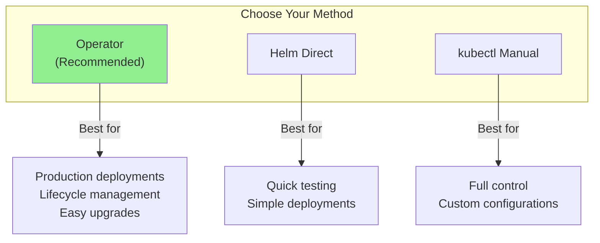

# Kubernetes Installation

This guide covers installing NovaEdge in a Kubernetes cluster.

## Prerequisites

- Kubernetes 1.29 or higher
- kubectl configured with cluster access
- Cluster admin permissions (for CRD installation)
- Helm 3.0+ (for Helm-based installation)

## Installation Methods



## Method 1: Using the Operator (Recommended)

The Operator provides automated lifecycle management.

### Install the Operator

```bash
# Clone the repository
git clone https://github.com/piwi3910/novaedge.git
cd novaedge

# Install operator with Helm
helm install novaedge-operator ./charts/novaedge-operator \
  --namespace novaedge-system \
  --create-namespace
```

### Deploy NovaEdge

Create a `NovaEdgeCluster` resource:

```yaml
# novaedge-cluster.yaml
apiVersion: novaedge.io/v1alpha1
kind: NovaEdgeCluster
metadata:
  name: novaedge
  namespace: novaedge-system
spec:
  version: "v0.1.0"

  controller:
    replicas: 1
    leaderElection: true

  agent:
    hostNetwork: true
    vip:
      enabled: true
      mode: L2

  webUI:
    enabled: true
```

```bash
kubectl apply -f novaedge-cluster.yaml
```

### Verify Installation

```bash
# Check cluster status
kubectl get novaedgecluster -n novaedge-system

# Check pods
kubectl get pods -n novaedge-system

# Expected output:
# novaedge-operator-xxx     1/1     Running
# novaedge-controller-xxx   1/1     Running
# novaedge-agent-xxxxx      1/1     Running (one per node)
```

## Method 2: Using Helm Direct

Deploy components directly without the Operator.

```bash
# Clone the repository
git clone https://github.com/piwi3910/novaedge.git
cd novaedge

# Install with Helm
helm install novaedge ./charts/novaedge \
  --namespace novaedge-system \
  --create-namespace \
  --set agent.vip.enabled=true \
  --set agent.vip.mode=L2
```

### Common Helm Values

```bash
# Production with BGP
helm install novaedge ./charts/novaedge \
  --namespace novaedge-system \
  --create-namespace \
  --set controller.replicas=3 \
  --set agent.vip.mode=BGP \
  --set agent.vip.bgp.asn=65000

# With metrics and tracing
helm install novaedge ./charts/novaedge \
  --namespace novaedge-system \
  --create-namespace \
  --set metrics.enabled=true \
  --set tracing.enabled=true \
  --set tracing.endpoint=jaeger:4317
```

## Method 3: Using kubectl

For full control over the deployment.

### Install CRDs

```bash
# Clone the repository
git clone https://github.com/piwi3910/novaedge.git
cd novaedge

# Install CRDs
make install-crds

# Or manually
kubectl apply -f config/crd/
```

### Create Namespace

```bash
kubectl create namespace novaedge-system
```

### Deploy RBAC

```bash
kubectl apply -f config/rbac/
```

### Deploy Controller

```bash
kubectl apply -f config/controller/deployment.yaml
```

### Deploy Agents

```bash
kubectl apply -f config/agent/daemonset.yaml
```

## Verification

After installation, verify all components:

### Check CRDs

```bash
kubectl get crds | grep novaedge.io

# Expected:
# novaedgeclusters.novaedge.io
# proxybackends.novaedge.io
# proxygateways.novaedge.io
# proxypolicies.novaedge.io
# proxyroutes.novaedge.io
# proxyvips.novaedge.io
```

### Check Controller

```bash
# Pod status
kubectl get pods -n novaedge-system -l app.kubernetes.io/name=novaedge-controller

# Logs
kubectl logs -n novaedge-system -l app.kubernetes.io/name=novaedge-controller
```

### Check Agents

```bash
# Pod status (one per node)
kubectl get pods -n novaedge-system -l app.kubernetes.io/name=novaedge-agent -o wide

# Logs
kubectl logs -n novaedge-system -l app.kubernetes.io/name=novaedge-agent
```

## Configuration

### Controller Options

| Flag | Environment | Default | Description |
|------|-------------|---------|-------------|
| `--grpc-port` | `GRPC_PORT` | 9090 | gRPC server port |
| `--metrics-port` | `METRICS_PORT` | 8080 | Prometheus metrics port |
| `--log-level` | `LOG_LEVEL` | info | Log level |
| `--leader-election` | `LEADER_ELECTION` | true | Enable leader election |

### Agent Options

| Flag | Environment | Default | Description |
|------|-------------|---------|-------------|
| `--controller-addr` | `CONTROLLER_ADDR` | controller:9090 | Controller address |
| `--node-name` | `NODE_NAME` | hostname | Node identifier |
| `--http-port` | `HTTP_PORT` | 80 | HTTP traffic port |
| `--https-port` | `HTTPS_PORT` | 443 | HTTPS traffic port |
| `--metrics-port` | `METRICS_PORT` | 9090 | Prometheus metrics port |

## Node Requirements

Agents require specific node capabilities:

| Requirement | Purpose |
|-------------|---------|
| `hostNetwork: true` | Bind to node ports 80/443 |
| `NET_ADMIN` capability | VIP management |
| `NET_RAW` capability | ARP operations (L2 mode) |

## Upgrading

### Using the Operator

```bash
# Update the version
kubectl patch novaedgecluster novaedge -n novaedge-system \
  --type=merge \
  -p '{"spec":{"version":"v0.2.0"}}'

# Monitor rollout
kubectl get novaedgecluster novaedge -n novaedge-system -w
```

### Using Helm

```bash
helm upgrade novaedge ./charts/novaedge \
  --namespace novaedge-system \
  --set controller.image.tag=v0.2.0 \
  --set agent.image.tag=v0.2.0
```

## Uninstallation

### Remove Resources First

```bash
# Delete all NovaEdge resources
kubectl delete proxyvips,proxygateways,proxyroutes,proxybackends,proxypolicies --all -A
```

### Using the Operator

```bash
# Delete the cluster
kubectl delete novaedgecluster novaedge -n novaedge-system

# Uninstall operator
helm uninstall novaedge-operator -n novaedge-system
```

### Using Helm Direct

```bash
helm uninstall novaedge -n novaedge-system
```

### Remove CRDs

```bash
make uninstall-crds
# Or: kubectl delete -f config/crd/

# Remove namespace
kubectl delete namespace novaedge-system
```

## Troubleshooting

### Controller Not Starting

```bash
# Check pod events
kubectl describe pod -n novaedge-system -l app.kubernetes.io/name=novaedge-controller

# Check RBAC
kubectl auth can-i list proxygateways \
  --as=system:serviceaccount:novaedge-system:novaedge-controller
```

### Agents Not Connecting

```bash
# Check controller service
kubectl get svc -n novaedge-system novaedge-controller

# Test connectivity from agent
kubectl exec -n novaedge-system <agent-pod> -- nc -zv novaedge-controller 9090
```

### VIP Not Working

```bash
# Check agent logs for VIP errors
kubectl logs -n novaedge-system -l app.kubernetes.io/name=novaedge-agent | grep -i vip

# Verify capabilities
kubectl get pod <agent-pod> -n novaedge-system -o yaml | grep -A5 securityContext
```

## Next Steps

- [Helm Installation](helm.md) - Detailed Helm configuration
- [Standalone Mode](standalone.md) - Non-Kubernetes deployment
- [Quick Start](../getting-started/quickstart.md) - Create your first gateway
