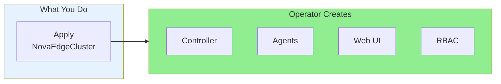

# Operator Installation (Recommended)

The NovaEdge Operator is the recommended way to deploy and manage NovaEdge in production.

## Overview

The Operator provides:

- **Automated lifecycle management** - Deploy, upgrade, and scale with a single CRD
- **Self-healing** - Automatic recovery from failures
- **Configuration management** - Centralized configuration via `NovaEdgeCluster`
- **Rolling upgrades** - Zero-downtime version updates



## Prerequisites

- Kubernetes 1.29+
- Helm 3.0+
- kubectl configured with cluster admin access

## Step 1: Install the Operator

```bash
# Clone the repository
git clone https://github.com/azrtydxb/novaedge.git
cd novaedge

# Install the operator
helm install novaedge-operator ./charts/novaedge-operator \
  --namespace nova-system \
  --create-namespace
```

Verify the operator is running:

```bash
kubectl get pods -n nova-system -l app.kubernetes.io/name=novaedge-operator
```

## Step 2: Deploy NovaEdge

Create a `NovaEdgeCluster` resource:

```yaml
# novaedge-cluster.yaml
apiVersion: novaedge.io/v1alpha1
kind: NovaEdgeCluster
metadata:
  name: novaedge
  namespace: nova-system
spec:
  version: "v0.1.0"

  controller:
    replicas: 1
    leaderElection: true

  agent:
    hostNetwork: true
    vip:
      enabled: true
      mode: L2

  webUI:
    enabled: true
    service:
      type: ClusterIP
```

```bash
kubectl apply -f novaedge-cluster.yaml
```

## Step 3: Verify Deployment

```bash
# Check cluster status
kubectl get novaedgecluster -n nova-system

# Check all pods are running
kubectl get pods -n nova-system

# Expected output:
# novaedge-operator-xxx      1/1     Running
# novaedge-controller-xxx    1/1     Running
# novaedge-agent-xxxxx       1/1     Running (one per node)
# novaedge-webui-xxx         1/1     Running
```

## Configuration Examples

### Production HA Setup

```yaml
apiVersion: novaedge.io/v1alpha1
kind: NovaEdgeCluster
metadata:
  name: novaedge-prod
  namespace: nova-system
spec:
  version: "v0.1.0"

  controller:
    replicas: 3
    leaderElection: true
    resources:
      requests:
        cpu: "200m"
        memory: "256Mi"
      limits:
        cpu: "1000m"
        memory: "1Gi"
    affinity:
      podAntiAffinity:
        preferredDuringSchedulingIgnoredDuringExecution:
          - weight: 100
            podAffinityTerm:
              labelSelector:
                matchLabels:
                  app.kubernetes.io/component: controller
              topologyKey: kubernetes.io/hostname

  agent:
    hostNetwork: true
    resources:
      requests:
        cpu: "200m"
        memory: "256Mi"
      limits:
        cpu: "2000m"
        memory: "2Gi"
    vip:
      enabled: true
      mode: L2
    updateStrategy:
      type: RollingUpdate
      maxUnavailable: 1

  webUI:
    enabled: true
    replicas: 2
    service:
      type: LoadBalancer

  observability:
    metrics:
      enabled: true
      serviceMonitor:
        enabled: true
    tracing:
      enabled: true
      endpoint: "jaeger-collector:4317"
    logging:
      level: info
      format: json
```

### BGP Mode

```yaml
apiVersion: novaedge.io/v1alpha1
kind: NovaEdgeCluster
metadata:
  name: novaedge-bgp
  namespace: nova-system
spec:
  version: "v0.1.0"

  controller:
    replicas: 2
    leaderElection: true

  agent:
    hostNetwork: true
    vip:
      enabled: true
      mode: BGP
      bgp:
        asn: 65000
        routerID: "10.0.0.1"
        peers:
          - address: "10.0.0.254"
            asn: 65001
            port: 179

  webUI:
    enabled: true
```

### Minimal Setup (Development)

```yaml
apiVersion: novaedge.io/v1alpha1
kind: NovaEdgeCluster
metadata:
  name: novaedge-dev
  namespace: nova-system
spec:
  version: "v0.1.0"
  controller:
    replicas: 1
  agent:
    hostNetwork: true
    vip:
      enabled: true
      mode: L2
```

## NovaEdgeCluster Reference

### Spec Fields

| Field | Type | Description |
|-------|------|-------------|
| `version` | string | NovaEdge version to deploy (required) |
| `imageRepository` | string | Image repository (default: `ghcr.io/azrtydxb/novaedge`) |
| `imagePullPolicy` | string | Pull policy (default: `IfNotPresent`) |
| `controller` | object | Controller configuration |
| `agent` | object | Agent configuration |
| `webUI` | object | Web UI configuration |
| `observability` | object | Metrics, tracing, logging |
| `tls` | object | Internal mTLS configuration |

### Controller Configuration

| Field | Type | Default | Description |
|-------|------|---------|-------------|
| `replicas` | int | 1 | Number of controller replicas |
| `leaderElection` | bool | true | Enable leader election |
| `grpcPort` | int | 9090 | gRPC config server port |
| `metricsPort` | int | 8080 | Prometheus metrics port |
| `resources` | object | - | Resource requirements |
| `nodeSelector` | map | - | Node selector |
| `tolerations` | array | - | Pod tolerations |
| `affinity` | object | - | Pod affinity |

### Agent Configuration

| Field | Type | Default | Description |
|-------|------|---------|-------------|
| `hostNetwork` | bool | true | Use host networking |
| `httpPort` | int | 80 | HTTP traffic port |
| `httpsPort` | int | 443 | HTTPS traffic port |
| `vip.enabled` | bool | true | Enable VIP management |
| `vip.mode` | string | L2 | VIP mode (L2, BGP, OSPF) |
| `vip.interface` | string | - | Network interface |
| `vip.bgp` | object | - | BGP configuration |
| `updateStrategy` | object | RollingUpdate | Update strategy |
| `resources` | object | - | Resource requirements |
| `nodeSelector` | map | - | Node selector |
| `tolerations` | array | - | Pod tolerations |

### Web UI Configuration

| Field | Type | Default | Description |
|-------|------|---------|-------------|
| `enabled` | bool | false | Enable Web UI |
| `replicas` | int | 1 | Number of replicas |
| `port` | int | 9080 | Web UI port |
| `readOnly` | bool | false | Read-only mode |
| `service.type` | string | ClusterIP | Service type |
| `ingress.enabled` | bool | false | Enable ingress |

### Observability Configuration

| Field | Type | Default | Description |
|-------|------|---------|-------------|
| `metrics.enabled` | bool | true | Enable Prometheus metrics |
| `metrics.serviceMonitor.enabled` | bool | false | Create ServiceMonitor |
| `tracing.enabled` | bool | false | Enable tracing |
| `tracing.endpoint` | string | - | OTLP endpoint |
| `tracing.samplingRate` | int | 10 | Sampling rate (0-100) |
| `logging.level` | string | info | Log level |
| `logging.format` | string | json | Log format |

## Upgrading

Update the version in your `NovaEdgeCluster`:

```bash
kubectl patch novaedgecluster novaedge -n nova-system \
  --type=merge \
  -p '{"spec":{"version":"v0.2.0"}}'
```

Monitor the upgrade:

```bash
kubectl get novaedgecluster novaedge -n nova-system -w
```

## Cluster Status

Check the status of your deployment:

```bash
kubectl describe novaedgecluster novaedge -n nova-system
```

Status fields:

| Field | Description |
|-------|-------------|
| `phase` | Pending, Initializing, Running, Upgrading, Degraded, Failed |
| `conditions` | Ready, ControllerReady, AgentReady, WebUIReady |
| `controller` | Controller deployment status |
| `agent` | Agent DaemonSet status |
| `webUI` | Web UI deployment status |

## Uninstalling

```bash
# Delete the cluster
kubectl delete novaedgecluster novaedge -n nova-system

# Uninstall the operator
helm uninstall novaedge-operator -n nova-system

# Optional: Remove CRDs
kubectl delete crd novaedgeclusters.novaedge.io
```

## Troubleshooting

### Operator Not Starting

```bash
kubectl describe pod -n nova-system -l app.kubernetes.io/name=novaedge-operator
kubectl logs -n nova-system -l app.kubernetes.io/name=novaedge-operator
```

### Cluster Stuck in Initializing

```bash
# Check operator logs
kubectl logs -n nova-system -l app.kubernetes.io/name=novaedge-operator

# Check events
kubectl get events -n nova-system --sort-by='.lastTimestamp'
```

### Components Not Ready

```bash
# Check component logs
kubectl logs -n nova-system -l app.kubernetes.io/component=controller
kubectl logs -n nova-system -l app.kubernetes.io/component=agent
```

## Next Steps

- [Quick Start](../getting-started/quickstart.md) - Create your first gateway
- [Routing](../user-guide/routing.md) - Configure routes
- [VIP Management](../user-guide/vip-management.md) - Configure VIP modes
- [Observability](../operations/observability.md) - Set up monitoring
