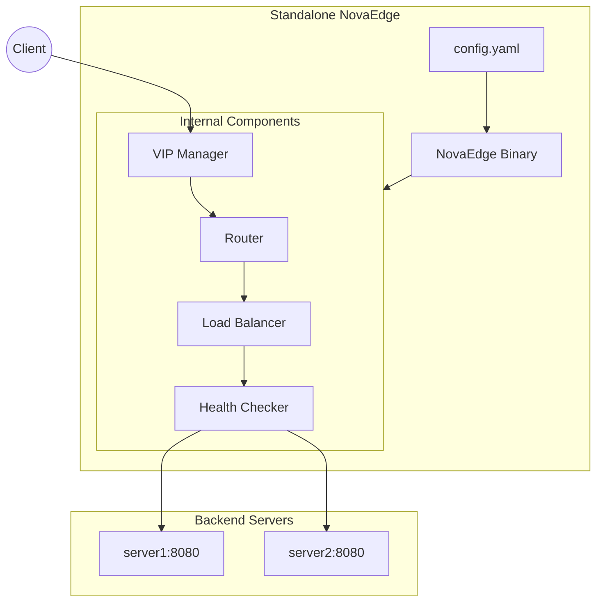

# Standalone Mode

Run NovaEdge without Kubernetes for Docker-based, bare-metal, or edge deployments.

## Overview



## Quick Start

### Using Docker Compose

```bash
# Clone repository
git clone https://github.com/azrtydxb/novaedge.git
cd novaedge

# Start NovaEdge
make standalone-up

# View logs
make standalone-logs

# Stop
make standalone-down
```

### Running Directly

```bash
# Build the binary
make build-standalone

# Run with config
./bin/novaedge-standalone --config=/path/to/config.yaml
```

## Configuration

Create a `config.yaml` file:

```yaml
version: "1.0"

listeners:
  - name: http
    port: 80
    protocol: HTTP

  - name: https
    port: 443
    protocol: HTTPS
    tls:
      certFile: /etc/novaedge/certs/server.crt
      keyFile: /etc/novaedge/certs/server.key

routes:
  - name: api-route
    match:
      hostnames:
        - "api.example.com"
      path:
        type: PathPrefix
        value: /api
    backends:
      - name: api-backend
    policies:
      - rate-limit

backends:
  - name: api-backend
    endpoints:
      - address: server1:8080
      - address: server2:8080
    lbPolicy: RoundRobin
    healthCheck:
      protocol: HTTP
      path: /health
      interval: 10s

policies:
  - name: rate-limit
    type: RateLimit
    rateLimit:
      requestsPerSecond: 100
      burstSize: 150
      key: client_ip
```

## Configuration Reference

### Listeners

```yaml
listeners:
  - name: http
    port: 80
    protocol: HTTP        # HTTP, HTTPS, TCP, TLS

  - name: https
    port: 443
    protocol: HTTPS
    tls:
      certFile: /path/to/cert.crt
      keyFile: /path/to/key.pem
      minVersion: "TLS1.2"  # TLS1.2 or TLS1.3
```

### Routes

```yaml
routes:
  - name: my-route
    match:
      hostnames:
        - "*.example.com"
      path:
        type: PathPrefix    # Exact, PathPrefix, RegularExpression
        value: /api
      methods:
        - GET
        - POST
      headers:
        - name: X-API-Version
          value: v2
    backends:
      - name: backend-name
    policies:
      - policy-name
    filters:
      - type: RequestHeaderModifier
        add:
          - name: X-Custom-Header
            value: custom-value
```

### Backends

```yaml
backends:
  - name: my-backend
    endpoints:
      - address: server1:8080
        weight: 100
      - address: server2:8080
        weight: 100
    lbPolicy: RoundRobin  # RoundRobin, P2C, EWMA, RingHash, Maglev
    healthCheck:
      protocol: HTTP      # HTTP, TCP, gRPC
      path: /health
      interval: 10s
      timeout: 5s
      healthyThreshold: 2
      unhealthyThreshold: 3
```

### Policies

```yaml
policies:
  # Rate Limiting
  - name: rate-limit
    type: RateLimit
    rateLimit:
      requestsPerSecond: 100
      burstSize: 150
      key: client_ip      # client_ip, header:X-API-Key

  # CORS
  - name: cors
    type: CORS
    cors:
      allowOrigins:
        - "https://example.com"
      allowMethods:
        - GET
        - POST
      allowHeaders:
        - Content-Type
      maxAge: 86400

  # Security Headers
  - name: security
    type: SecurityHeaders
    securityHeaders:
      hsts:
        enabled: true
        maxAgeSeconds: 31536000
      xFrameOptions: DENY
      xContentTypeOptions: true
```

### VIPs

```yaml
vips:
  - name: main-vip
    address: 192.168.1.100/32
    mode: L2           # L2, BGP, OSPF
    interface: eth0
```

## Docker Compose

### Basic Setup

```yaml
version: '3.8'

services:
  novaedge:
    image: novaedge:latest
    ports:
      - "80:80"
      - "443:443"
    volumes:
      - ./config.yaml:/etc/novaedge/config.yaml:ro
      - ./certs:/etc/novaedge/certs:ro
    restart: unless-stopped
```

### With Monitoring

```yaml
version: '3.8'

services:
  novaedge:
    image: novaedge:latest
    ports:
      - "80:80"
      - "443:443"
      - "9090:9090"  # Metrics
    volumes:
      - ./config.yaml:/etc/novaedge/config.yaml:ro
    restart: unless-stopped

  prometheus:
    image: prom/prometheus:latest
    ports:
      - "9091:9090"
    volumes:
      - ./prometheus.yml:/etc/prometheus/prometheus.yml:ro
    restart: unless-stopped

  grafana:
    image: grafana/grafana:latest
    ports:
      - "3000:3000"
    restart: unless-stopped
```

### Prometheus Config

```yaml
# prometheus.yml
global:
  scrape_interval: 15s

scrape_configs:
  - job_name: 'novaedge'
    static_configs:
      - targets: ['novaedge:9090']
```

## TLS Configuration

### Generate Self-Signed Certificate

```bash
openssl req -x509 -newkey rsa:4096 \
  -keyout certs/server.key \
  -out certs/server.crt \
  -days 365 -nodes \
  -subj "/CN=*.example.com"
```

### Configuration

```yaml
listeners:
  - name: https
    port: 443
    protocol: HTTPS
    tls:
      certFile: /etc/novaedge/certs/server.crt
      keyFile: /etc/novaedge/certs/server.key
      minVersion: "TLS1.3"
```

## Command Line Options

| Flag | Default | Description |
|------|---------|-------------|
| `--config` | /etc/novaedge/config.yaml | Config file path |
| `--node-name` | hostname | Node identifier |
| `--metrics-port` | 9090 | Prometheus metrics port |
| `--health-probe-port` | 8080 | Health probe port |
| `--log-level` | info | Log level (debug, info, warn, error) |

## Health Endpoints

| Endpoint | Description |
|----------|-------------|
| `http://localhost:8080/healthz` | Liveness probe |
| `http://localhost:8080/ready` | Readiness probe |

## Hot Reload

Configuration changes are automatically detected. Edit `config.yaml` and NovaEdge will reload within 30 seconds.

```bash
# Force reload
kill -HUP $(pgrep novaedge-standalone)
```

## Metrics

Prometheus metrics available at `http://localhost:9090/metrics`:

| Metric | Description |
|--------|-------------|
| `novaedge_requests_total` | Total request count |
| `novaedge_request_duration_seconds` | Request latency histogram |
| `novaedge_upstream_health` | Backend health status |
| `novaedge_active_connections` | Current active connections |

## Kubernetes vs Standalone

| Feature | Kubernetes | Standalone |
|---------|------------|------------|
| Configuration | CRDs | YAML file |
| Service Discovery | EndpointSlices | Static endpoints |
| TLS Certificates | Kubernetes Secrets | File paths |
| VIP Management | Full support | Full support |
| Scaling | HPA | Manual |

## Next Steps

- [Quick Start](../getting-started/quickstart.md) - Create your first gateway
- [Routing](../user-guide/routing.md) - Configure routes
- [Policies](../user-guide/policies.md) - Add rate limiting
