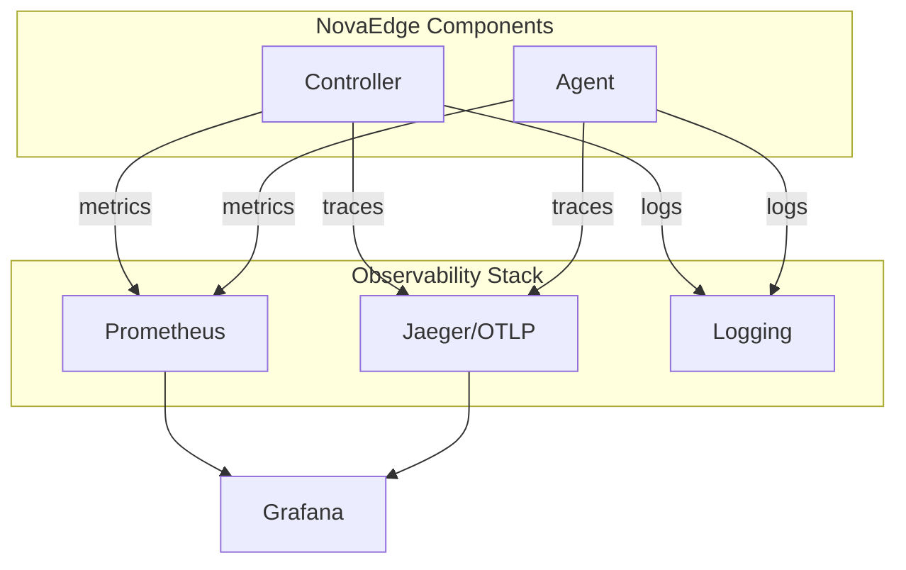
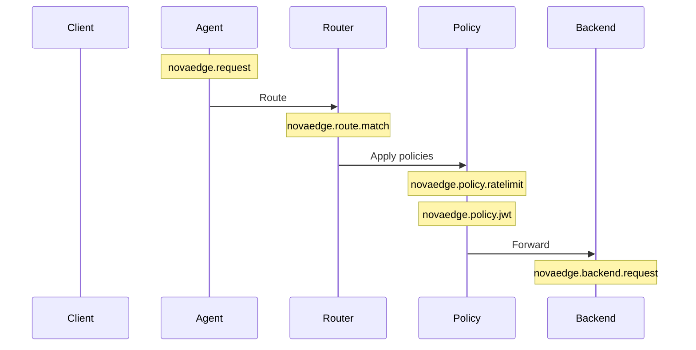

# Observability

Monitor NovaEdge with Prometheus metrics, OpenTelemetry tracing, and structured logging.

## Overview



## Prometheus Metrics

All NovaEdge components expose Prometheus metrics.

### Endpoints

| Component | Default Port | Endpoint |
|-----------|--------------|----------|
| Controller | 8080 | `/metrics` |
| Agent | 9090 | `/metrics` |
| Web UI | 9080 | `/metrics` |

### Enabling Metrics

```yaml
apiVersion: novaedge.io/v1alpha1
kind: NovaEdgeCluster
metadata:
  name: novaedge
spec:
  observability:
    metrics:
      enabled: true
      serviceMonitor:
        enabled: true
        interval: 30s
```

### Key Metrics

#### Request Metrics

```promql
# Request rate
rate(novaedge_requests_total[5m])

# Request latency (p99)
histogram_quantile(0.99, rate(novaedge_request_duration_seconds_bucket[5m]))

# Error rate
rate(novaedge_requests_total{status=~"5.."}[5m]) / rate(novaedge_requests_total[5m])
```

#### Backend Metrics

```promql
# Backend health
novaedge_backend_healthy{backend="api-backend"}

# Backend latency
histogram_quantile(0.95, rate(novaedge_backend_duration_seconds_bucket[5m]))

# Connection pool usage
novaedge_backend_connections_active / novaedge_backend_connections_max
```

#### VIP Metrics

```promql
# VIP status
novaedge_vip_bound{vip="main-vip"}

# Failovers
increase(novaedge_vip_failovers_total[1h])

# BGP session state
novaedge_bgp_session_state{peer="10.0.0.254"}
```

#### Policy Metrics

```promql
# Rate limit hits
rate(novaedge_ratelimit_limited_total[5m])

# JWT validation failures
rate(novaedge_jwt_validation_failed_total[5m])

# CORS preflight requests
rate(novaedge_cors_preflight_total[5m])
```

### ServiceMonitor

For Prometheus Operator:

```yaml
apiVersion: monitoring.coreos.com/v1
kind: ServiceMonitor
metadata:
  name: novaedge
  namespace: novaedge-system
spec:
  selector:
    matchLabels:
      app.kubernetes.io/name: novaedge
  endpoints:
    - port: metrics
      interval: 30s
      path: /metrics
```

### Grafana Dashboard

Import the NovaEdge dashboard or create panels:

```json
{
  "title": "NovaEdge Overview",
  "panels": [
    {
      "title": "Request Rate",
      "targets": [{
        "expr": "sum(rate(novaedge_requests_total[5m]))"
      }]
    },
    {
      "title": "P99 Latency",
      "targets": [{
        "expr": "histogram_quantile(0.99, sum(rate(novaedge_request_duration_seconds_bucket[5m])) by (le))"
      }]
    },
    {
      "title": "Error Rate",
      "targets": [{
        "expr": "sum(rate(novaedge_requests_total{status=~\"5..\"}[5m])) / sum(rate(novaedge_requests_total[5m]))"
      }]
    }
  ]
}
```

## OpenTelemetry Tracing

Distributed tracing for request flows.

### Enabling Tracing

```yaml
apiVersion: novaedge.io/v1alpha1
kind: NovaEdgeCluster
metadata:
  name: novaedge
spec:
  observability:
    tracing:
      enabled: true
      endpoint: "jaeger-collector.tracing.svc:4317"
      samplingRate: 10  # 10% of requests
      insecure: false
```

### Trace Context

NovaEdge propagates trace context via W3C Trace Context headers:

| Header | Description |
|--------|-------------|
| `traceparent` | Trace ID and span ID |
| `tracestate` | Vendor-specific trace data |

### Spans Created



### Jaeger Setup

```yaml
# Deploy Jaeger
kubectl create namespace tracing
kubectl apply -f https://raw.githubusercontent.com/jaegertracing/jaeger-operator/main/deploy/crds/jaegertracing.io_jaegers_crd.yaml
kubectl apply -f - <<EOF
apiVersion: jaegertracing.io/v1
kind: Jaeger
metadata:
  name: jaeger
  namespace: tracing
spec:
  strategy: allInOne
  allInOne:
    image: jaegertracing/all-in-one:latest
  ingress:
    enabled: true
EOF
```

## Logging

Structured JSON logging for all components.

### Log Levels

| Level | Description |
|-------|-------------|
| debug | Detailed debugging information |
| info | Normal operational messages |
| warn | Warning conditions |
| error | Error conditions |

### Configuration

```yaml
apiVersion: novaedge.io/v1alpha1
kind: NovaEdgeCluster
metadata:
  name: novaedge
spec:
  observability:
    logging:
      level: info
      format: json
```

### Log Format

```json
{
  "level": "info",
  "ts": "2024-01-15T10:30:00.123Z",
  "caller": "router/router.go:156",
  "msg": "request handled",
  "method": "GET",
  "path": "/api/users",
  "status": 200,
  "duration_ms": 15.3,
  "trace_id": "abc123",
  "span_id": "def456"
}
```

### Viewing Logs

```bash
# Controller logs
kubectl logs -n novaedge-system -l app.kubernetes.io/name=novaedge-controller

# Agent logs on specific node
kubectl logs -n novaedge-system -l app.kubernetes.io/name=novaedge-agent -c agent

# Follow logs
kubectl logs -f -n novaedge-system -l app.kubernetes.io/name=novaedge-agent
```

### Log Aggregation

#### Loki Stack

```yaml
# Promtail config
scrape_configs:
  - job_name: novaedge
    kubernetes_sd_configs:
      - role: pod
    relabel_configs:
      - source_labels: [__meta_kubernetes_pod_label_app_kubernetes_io_name]
        regex: novaedge.*
        action: keep
```

#### Elasticsearch

```yaml
# Filebeat config
filebeat.autodiscover:
  providers:
    - type: kubernetes
      templates:
        - condition:
            contains:
              kubernetes.labels.app_kubernetes_io/name: novaedge
          config:
            - type: container
              paths:
                - /var/log/containers/*novaedge*.log
              processors:
                - decode_json_fields:
                    fields: ["message"]
```

## Alerting

### Prometheus Alerting Rules

```yaml
apiVersion: monitoring.coreos.com/v1
kind: PrometheusRule
metadata:
  name: novaedge-alerts
  namespace: novaedge-system
spec:
  groups:
    - name: novaedge
      rules:
        # High error rate
        - alert: NovaEdgeHighErrorRate
          expr: |
            sum(rate(novaedge_requests_total{status=~"5.."}[5m]))
            / sum(rate(novaedge_requests_total[5m])) > 0.05
          for: 5m
          labels:
            severity: critical
          annotations:
            summary: "High error rate detected"

        # Backend unhealthy
        - alert: NovaEdgeBackendUnhealthy
          expr: novaedge_backend_healthy == 0
          for: 2m
          labels:
            severity: warning
          annotations:
            summary: "Backend {{ $labels.backend }} is unhealthy"

        # VIP failover
        - alert: NovaEdgeVIPFailover
          expr: increase(novaedge_vip_failovers_total[5m]) > 0
          labels:
            severity: warning
          annotations:
            summary: "VIP failover occurred"

        # Rate limiting active
        - alert: NovaEdgeRateLimiting
          expr: rate(novaedge_ratelimit_limited_total[5m]) > 10
          for: 5m
          labels:
            severity: info
          annotations:
            summary: "Rate limiting active"
```

## Health Endpoints

| Endpoint | Purpose |
|----------|---------|
| `/healthz` | Liveness probe |
| `/readyz` | Readiness probe |
| `/metrics` | Prometheus metrics |

### Kubernetes Probes

```yaml
livenessProbe:
  httpGet:
    path: /healthz
    port: 8080
  initialDelaySeconds: 10
  periodSeconds: 10

readinessProbe:
  httpGet:
    path: /readyz
    port: 8080
  initialDelaySeconds: 5
  periodSeconds: 5
```

## Complete Stack Example

### Docker Compose

```yaml
version: '3.8'

services:
  prometheus:
    image: prom/prometheus:latest
    volumes:
      - ./prometheus.yml:/etc/prometheus/prometheus.yml
    ports:
      - "9091:9090"

  grafana:
    image: grafana/grafana:latest
    ports:
      - "3000:3000"
    environment:
      - GF_SECURITY_ADMIN_PASSWORD=admin

  jaeger:
    image: jaegertracing/all-in-one:latest
    ports:
      - "16686:16686"
      - "4317:4317"

  loki:
    image: grafana/loki:latest
    ports:
      - "3100:3100"
```

### Prometheus Config

```yaml
global:
  scrape_interval: 15s

scrape_configs:
  - job_name: 'novaedge-controller'
    kubernetes_sd_configs:
      - role: pod
    relabel_configs:
      - source_labels: [__meta_kubernetes_pod_label_app_kubernetes_io_name]
        regex: novaedge-controller
        action: keep
      - source_labels: [__meta_kubernetes_pod_container_port_name]
        regex: metrics
        action: keep

  - job_name: 'novaedge-agent'
    kubernetes_sd_configs:
      - role: pod
    relabel_configs:
      - source_labels: [__meta_kubernetes_pod_label_app_kubernetes_io_name]
        regex: novaedge-agent
        action: keep
      - source_labels: [__meta_kubernetes_pod_container_port_name]
        regex: metrics
        action: keep
```

## Next Steps

- [Web UI](web-ui.md) - Dashboard for monitoring
- [Troubleshooting](troubleshooting.md) - Common issues
- [CRD Reference](../reference/crd-reference.md) - Resource specifications
