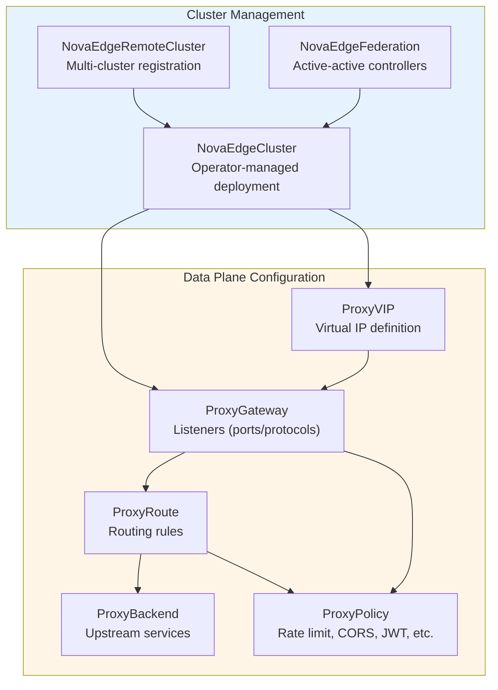
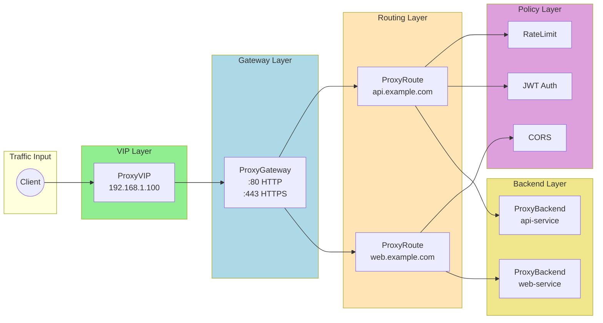
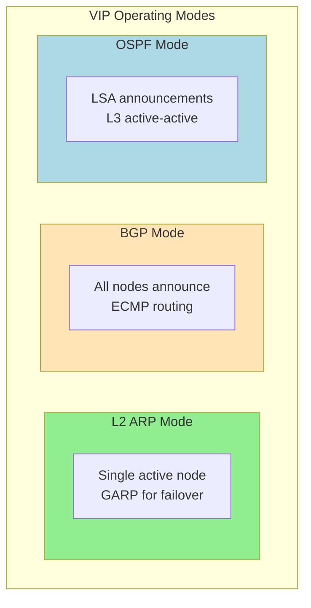
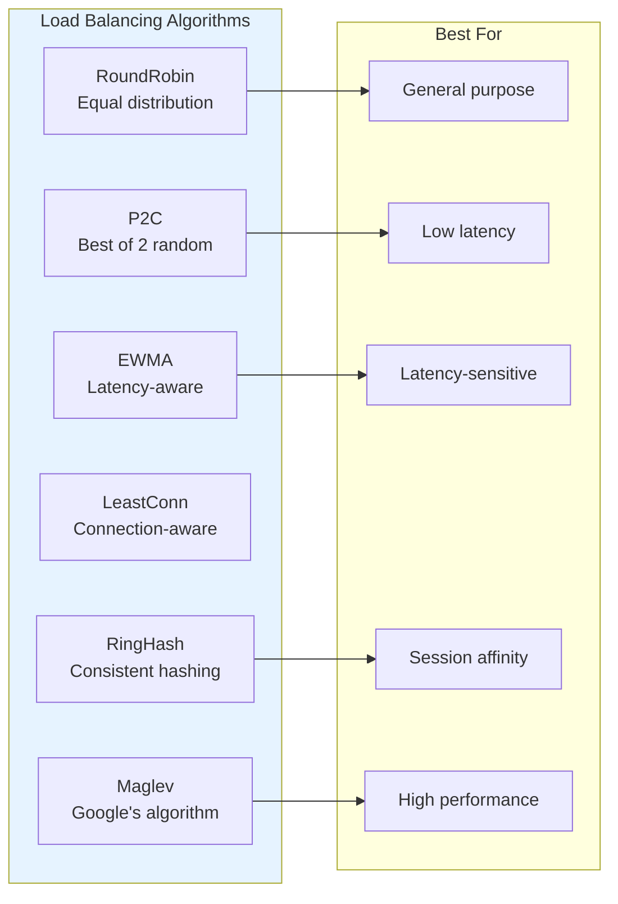
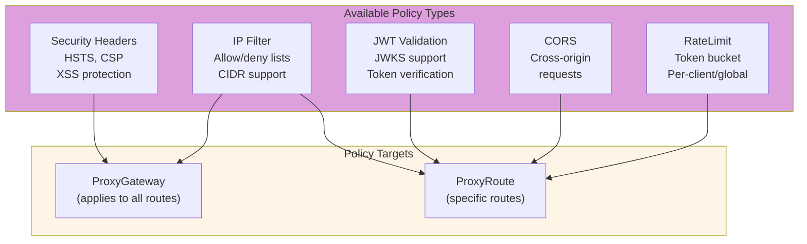

# CRD Reference

NovaEdge uses Custom Resource Definitions (CRDs) to configure load balancing, routing, and policies.

## CRD Overview



## CRD Relationships



## NovaEdgeCluster

Defines a complete NovaEdge deployment managed by the operator.

```yaml
apiVersion: novaedge.io/v1alpha1
kind: NovaEdgeCluster
metadata:
  name: novaedge
  namespace: novaedge-system
spec:
  # Version of NovaEdge to deploy
  version: "v0.1.0"

  # Image repository (optional)
  imageRepository: ghcr.io/piwi3910/novaedge
  imagePullPolicy: IfNotPresent

  # Controller configuration
  controller:
    replicas: 1
    leaderElection: true
    grpcPort: 9090
    metricsPort: 8080
    healthPort: 8081
    resources:
      requests:
        cpu: "100m"
        memory: "128Mi"
      limits:
        cpu: "500m"
        memory: "512Mi"

  # Agent DaemonSet configuration
  agent:
    hostNetwork: true
    httpPort: 80
    httpsPort: 443
    metricsPort: 9090
    healthPort: 8080
    vip:
      enabled: true
      mode: L2  # L2, BGP, or OSPF
    resources:
      requests:
        cpu: "100m"
        memory: "128Mi"

  # Web UI configuration (optional)
  webUI:
    enabled: true
    replicas: 1
    port: 9080
    readOnly: false
    service:
      type: ClusterIP
    prometheusEndpoint: "http://prometheus:9090"

  # Observability configuration
  observability:
    metrics:
      enabled: true
      serviceMonitor:
        enabled: true
        interval: "30s"
    tracing:
      enabled: true
      endpoint: "jaeger-collector:4317"
      samplingRate: 10
    logging:
      level: info
      format: json
```

### NovaEdgeCluster Fields

| Field | Type | Required | Description |
|-------|------|----------|-------------|
| `spec.version` | string | Yes | NovaEdge version to deploy |
| `spec.imageRepository` | string | No | Container image repository |
| `spec.imagePullPolicy` | string | No | Image pull policy |
| `spec.controller` | object | Yes | Controller deployment configuration |
| `spec.agent` | object | Yes | Agent DaemonSet configuration |
| `spec.webUI` | object | No | Web UI deployment configuration |
| `spec.tls` | object | No | Internal TLS configuration |
| `spec.observability` | object | No | Metrics, tracing, logging config |

### Controller Configuration

| Field | Type | Default | Description |
|-------|------|---------|-------------|
| `replicas` | int | 1 | Number of controller replicas |
| `leaderElection` | bool | true | Enable leader election for HA |
| `grpcPort` | int | 9090 | gRPC config server port |
| `metricsPort` | int | 8080 | Prometheus metrics port |
| `healthPort` | int | 8081 | Health probe port |
| `resources` | object | - | Resource requirements |
| `nodeSelector` | map | - | Node selector |
| `tolerations` | array | - | Pod tolerations |
| `affinity` | object | - | Pod affinity rules |

### Agent Configuration

| Field | Type | Default | Description |
|-------|------|---------|-------------|
| `hostNetwork` | bool | true | Enable host networking |
| `httpPort` | int | 80 | HTTP traffic port |
| `httpsPort` | int | 443 | HTTPS traffic port |
| `metricsPort` | int | 9090 | Prometheus metrics port |
| `healthPort` | int | 8080 | Health probe port |
| `vip.enabled` | bool | true | Enable VIP management |
| `vip.mode` | string | L2 | VIP mode: L2, BGP, OSPF |
| `vip.interface` | string | - | Network interface (L2 mode) |
| `vip.bgp` | object | - | BGP configuration |
| `updateStrategy` | object | - | DaemonSet update strategy |

### NovaEdgeCluster Status

```yaml
status:
  phase: Running
  observedGeneration: 1
  version: v0.1.0
  conditions:
    - type: Ready
      status: "True"
      reason: AllComponentsReady
    - type: ControllerReady
      status: "True"
    - type: AgentReady
      status: "True"
  controller:
    ready: true
    replicas: 1
    readyReplicas: 1
  agent:
    ready: true
    replicas: 3
    readyReplicas: 3
```

---

## NovaEdgeRemoteCluster

Represents a remote/edge cluster in a hub-spoke multi-cluster deployment. Created in the hub cluster to register and monitor remote clusters.

```yaml
apiVersion: novaedge.io/v1alpha1
kind: NovaEdgeRemoteCluster
metadata:
  name: edge-west-1
  namespace: novaedge-system
spec:
  # Unique cluster identifier
  clusterName: edge-west-1

  # Geographic location
  region: us-west
  zone: us-west-2a

  # Additional labels
  labels:
    environment: production
    tier: edge

  # Connection to hub controller
  connection:
    mode: Direct  # Direct or Tunnel
    controllerEndpoint: controller.novaedge-system.svc.cluster.local:9090
    reconnectInterval: 30s
    timeout: 10s
    tls:
      enabled: true
      caSecretRef:
        name: novaedge-ca
        namespace: novaedge-system
      serverName: novaedge-controller

  # Agent configuration for this cluster
  agent:
    version: "v0.1.0"  # Override version
    nodeSelector:
      node-role.kubernetes.io/edge: "true"
    vip:
      enabled: true
      mode: L2

  # Routing configuration
  routing:
    enabled: true
    priority: 100
    weight: 100
    localPreference: true
    allowCrossClusterTraffic: true

  # Health check configuration
  healthCheck:
    enabled: true
    interval: 30s
    timeout: 10s
    healthyThreshold: 2
    unhealthyThreshold: 3
    failoverEnabled: true
```

### NovaEdgeRemoteCluster Fields

| Field | Type | Required | Description |
|-------|------|----------|-------------|
| `spec.clusterName` | string | Yes | Unique identifier for the remote cluster |
| `spec.region` | string | No | Geographic region |
| `spec.zone` | string | No | Availability zone |
| `spec.labels` | map | No | Additional labels for the cluster |
| `spec.connection` | object | Yes | Connection configuration |
| `spec.agent` | object | No | Agent configuration override |
| `spec.routing` | object | No | Routing configuration |
| `spec.healthCheck` | object | No | Health check configuration |
| `spec.paused` | bool | No | Suspend reconciliation |

### Connection Configuration

| Field | Type | Default | Description |
|-------|------|---------|-------------|
| `mode` | string | Direct | Connection mode: `Direct` or `Tunnel` |
| `controllerEndpoint` | string | Required | Hub controller gRPC endpoint |
| `reconnectInterval` | duration | 30s | Reconnection interval |
| `timeout` | duration | 10s | Connection timeout |
| `tls.enabled` | bool | true | Enable mTLS |
| `tls.caSecretRef` | object | - | CA certificate secret reference |
| `tls.clientCertSecretRef` | object | - | Client certificate secret reference |
| `tls.serverName` | string | - | Expected server name for TLS |
| `tls.insecureSkipVerify` | bool | false | Skip TLS verification |
| `tunnel` | object | - | Tunnel configuration (when mode=Tunnel) |

### Routing Configuration

| Field | Type | Default | Description |
|-------|------|---------|-------------|
| `enabled` | bool | true | Enable routing to/from this cluster |
| `priority` | int | 100 | Routing priority (lower = higher priority) |
| `weight` | int | 100 | Traffic weight for weighted routing |
| `localPreference` | bool | true | Prefer local backends within cluster |
| `allowCrossClusterTraffic` | bool | true | Allow cross-cluster traffic routing |
| `endpoints` | object | - | Endpoint selection filters |

### Health Check Configuration

| Field | Type | Default | Description |
|-------|------|---------|-------------|
| `enabled` | bool | true | Enable health checking |
| `interval` | duration | 30s | Health check interval |
| `timeout` | duration | 10s | Health check timeout |
| `healthyThreshold` | int | 2 | Consecutive successes for healthy |
| `unhealthyThreshold` | int | 3 | Consecutive failures for unhealthy |
| `failoverEnabled` | bool | true | Enable automatic failover |

### NovaEdgeRemoteCluster Status

```yaml
status:
  phase: Connected
  observedGeneration: 1
  conditions:
    - type: Ready
      status: "True"
      reason: Connected
    - type: AgentsHealthy
      status: "True"
  connection:
    connected: true
    activeConnections: 3
    lastConnected: "2024-01-15T10:30:00Z"
    latency: "15ms"
  agents:
    total: 3
    ready: 3
    healthy: 3
    nodes:
      - name: edge-node-1
        ready: true
        ip: 10.1.0.10
        vips: ["192.168.1.100"]
      - name: edge-node-2
        ready: true
        ip: 10.1.0.11
  lastHeartbeat: "2024-01-15T12:00:00Z"
  lastConfigSync: "2024-01-15T11:55:00Z"
  version: v0.1.0
```

### Remote Cluster Phases

| Phase | Description |
|-------|-------------|
| `Pending` | Remote cluster is pending connection |
| `Connecting` | Connection is being established |
| `Connected` | Remote cluster is connected and healthy |
| `Degraded` | Some agents are unhealthy |
| `Disconnected` | No active connections from remote cluster |
| `Failed` | Remote cluster configuration failed |

---

## NovaEdgeFederation

Configures active-active federation between multiple NovaEdge controllers for multi-datacenter deployments with state synchronization and split-brain protection.

```yaml
apiVersion: novaedge.io/v1alpha1
kind: NovaEdgeFederation
metadata:
  name: production-federation
  namespace: novaedge-system
spec:
  # Unique federation identifier
  federationID: prod-fed-01

  # This controller's identity
  localMember:
    name: controller-dc1
    region: us-west
    zone: us-west-2a
    endpoint: controller-dc1.novaedge.example.com:9090

  # Peer controllers
  members:
    - name: controller-dc2
      endpoint: controller-dc2.novaedge.example.com:9090
      region: us-east
      zone: us-east-1a
      tls:
        enabled: true
        caSecretRef:
          name: novaedge-federation-ca
        clientCertSecretRef:
          name: novaedge-federation-client-cert
      priority: 100

  # Synchronization settings
  sync:
    interval: 5s
    timeout: 30s
    batchSize: 100
    compression: true

  # Conflict resolution
  conflictResolution:
    strategy: LastWriterWins  # LastWriterWins, Merge, Manual
    vectorClocks: true
    tombstoneTTL: 24h

  # Health checking
  healthCheck:
    interval: 10s
    timeout: 5s
    failureThreshold: 3
    successThreshold: 1

  # Split-brain detection and protection
  splitBrain:
    enabled: true
    partitionTimeout: 30s
    quorumMode: AgentAssisted  # Controllers or AgentAssisted
    quorumRequired: true
    fencingEnabled: true
    healingGracePeriod: 5s
    autoResolveOnHeal: true
    agentQuorum:
      controllerWeight: 10
      agentWeight: 1
      minAgentsForQuorum: 1
```

### NovaEdgeFederation Fields

| Field | Type | Required | Description |
|-------|------|----------|-------------|
| `spec.federationID` | string | Yes | Unique federation identifier |
| `spec.localMember` | object | Yes | This controller's identity |
| `spec.members` | array | No | Peer controller configurations |
| `spec.sync` | object | No | Synchronization settings |
| `spec.conflictResolution` | object | No | Conflict resolution settings |
| `spec.healthCheck` | object | No | Health check configuration |
| `spec.splitBrain` | object | No | Split-brain detection settings |
| `spec.paused` | bool | No | Suspend federation sync |

### Split-Brain Configuration

| Field | Type | Default | Description |
|-------|------|---------|-------------|
| `enabled` | bool | true | Enable split-brain detection |
| `partitionTimeout` | duration | 30s | Time before confirming partition |
| `quorumMode` | string | Controllers | `Controllers` or `AgentAssisted` |
| `quorumRequired` | bool | false | Require quorum for writes |
| `fencingEnabled` | bool | false | Block writes during partition |
| `healingGracePeriod` | duration | 5s | Grace period after partition heals |
| `autoResolveOnHeal` | bool | true | Auto-resolve conflicts on heal |

### Agent-Assisted Quorum Configuration

For 2-datacenter deployments, agent-assisted quorum enables split-brain prevention:

| Field | Type | Default | Description |
|-------|------|---------|-------------|
| `agentQuorum.controllerWeight` | int | 10 | Voting weight per controller |
| `agentQuorum.agentWeight` | int | 1 | Voting weight per agent |
| `agentQuorum.minAgentsForQuorum` | int | 1 | Minimum agents required |

### NovaEdgeFederation Status

```yaml
status:
  phase: Healthy
  observedGeneration: 1
  conditions:
    - type: Ready
      status: "True"
      reason: AllPeersHealthy
    - type: Synced
      status: "True"
  members:
    - name: controller-dc2
      healthy: true
      lastSeen: "2024-01-15T12:00:00Z"
      lastSyncTime: "2024-01-15T11:59:55Z"
      syncLag: 5s
      vectorClock:
        controller-dc1: 150
        controller-dc2: 148
      agentCount: 5
  lastSyncTime: "2024-01-15T11:59:55Z"
  syncLag: 5s
  localVectorClock:
    controller-dc1: 150
    controller-dc2: 148
  conflictsPending: 0
  splitBrain:
    partitionState: Healthy
    haveQuorum: true
    writesFenced: false
    reachablePeers:
      - controller-dc2
    agentQuorumStatus:
      totalAgents: 10
      reachableAgents: 10
      ourVotes: 20
      totalVotes: 30
      quorumThreshold: 16
```

### Federation Phases

| Phase | Description |
|-------|-------------|
| `Initializing` | Federation is starting up |
| `Syncing` | Initial sync in progress |
| `Healthy` | All members healthy and in sync |
| `Degraded` | Some members unhealthy or out of sync |
| `Partitioned` | Network partition detected |

### Partition States

| State | Description |
|-------|-------------|
| `Healthy` | All peers reachable |
| `Suspected` | Some peers not responding |
| `Confirmed` | Partition confirmed, fencing may be active |
| `Healing` | Partition healing, reconciliation in progress |

---

## ProxyVIP

Defines a Virtual IP address for the load balancer.



```yaml
apiVersion: novaedge.io/v1alpha1
kind: ProxyVIP
metadata:
  name: my-vip
spec:
  # VIP address with CIDR notation
  address: 192.168.1.100/32

  # VIP mode: L2, BGP, or OSPF
  mode: L2

  # Network interface for L2 mode
  interface: eth0

  # BGP configuration (for BGP mode)
  bgp:
    asn: 65000
    peers:
      - address: 192.168.1.1
        asn: 65001
        password: secret

  # OSPF configuration (for OSPF mode)
  ospf:
    area: 0.0.0.0
    helloInterval: 10s
    deadInterval: 40s
```

### Fields

| Field | Type | Required | Description |
|-------|------|----------|-------------|
| `spec.address` | string | Yes | VIP address with CIDR notation |
| `spec.mode` | string | Yes | VIP mode: `L2`, `BGP`, or `OSPF` |
| `spec.interface` | string | L2 only | Network interface for ARP |
| `spec.bgp` | object | BGP only | BGP configuration |
| `spec.ospf` | object | OSPF only | OSPF configuration |

---

## ProxyGateway

Defines listeners and binds them to a VIP.

```yaml
apiVersion: novaedge.io/v1alpha1
kind: ProxyGateway
metadata:
  name: my-gateway
spec:
  # Reference to ProxyVIP
  vipRef: my-vip

  listeners:
    - name: http
      port: 80
      protocol: HTTP
      hostnames:
        - "*.example.com"

    - name: https
      port: 443
      protocol: HTTPS
      hostnames:
        - "*.example.com"
      tls:
        secretRef:
          name: my-tls-secret
          namespace: default
        minVersion: "TLS1.2"
        cipherSuites:
          - TLS_AES_128_GCM_SHA256
          - TLS_AES_256_GCM_SHA384

    - name: http3
      port: 443
      protocol: HTTP3
      hostnames:
        - "*.example.com"
      tls:
        secretRef:
          name: my-tls-secret
        minVersion: "TLS1.3"
      quic:
        maxIdleTimeout: "30s"
        maxBiStreams: 100
        enable0RTT: true
```

### Fields

| Field | Type | Required | Description |
|-------|------|----------|-------------|
| `spec.vipRef` | string | Yes | Reference to ProxyVIP name |
| `spec.listeners` | array | Yes | List of listener configurations |
| `spec.listeners[].name` | string | Yes | Unique listener name |
| `spec.listeners[].port` | int32 | Yes | Port number |
| `spec.listeners[].protocol` | string | Yes | Protocol: `HTTP`, `HTTPS`, `HTTP3`, `TCP`, `TLS` |
| `spec.listeners[].hostnames` | array | No | Hostnames to match (wildcards supported) |
| `spec.listeners[].tls` | object | HTTPS/HTTP3 | TLS configuration |
| `spec.listeners[].quic` | object | HTTP3 only | QUIC configuration |

---

## ProxyRoute

Defines routing rules for traffic.

```yaml
apiVersion: novaedge.io/v1alpha1
kind: ProxyRoute
metadata:
  name: my-route
spec:
  # Reference to parent gateway(s)
  parentRefs:
    - name: my-gateway
      namespace: default

  # Hostnames to match
  hostnames:
    - "api.example.com"

  # Routing rules
  rules:
    - matches:
        - path:
            type: PathPrefix
            value: /api/v1
          headers:
            - name: X-API-Version
              value: v1
          method: GET

      # Backend reference
      backendRef:
        name: api-backend
        weight: 100

      # Request filters
      filters:
        - type: RequestHeaderModifier
          requestHeaderModifier:
            add:
              - name: X-Request-ID
                value: "${request_id}"
            set:
              - name: X-Forwarded-Proto
                value: https
            remove:
              - X-Legacy-Header

        - type: URLRewrite
          urlRewrite:
            path:
              type: ReplacePrefixMatch
              replacePrefixMatch: /v1

      # Response filters
      responseFilters:
        - type: ResponseHeaderModifier
          responseHeaderModifier:
            add:
              - name: X-Served-By
                value: novaedge
            remove:
              - Server

      # Policy references
      policyRefs:
        - name: rate-limit-policy
```

### Match Types

| Path Type | Description | Example |
|-----------|-------------|---------|
| `Exact` | Exact path match | `/api` matches only `/api` |
| `PathPrefix` | Prefix match | `/api` matches `/api`, `/api/v1`, etc. |
| `RegularExpression` | Regex match | `/api/v[0-9]+` |

### Filter Types

| Filter Type | Description |
|-------------|-------------|
| `RequestHeaderModifier` | Add, set, or remove request headers |
| `ResponseHeaderModifier` | Add, set, or remove response headers |
| `URLRewrite` | Rewrite URL path or hostname |
| `RequestRedirect` | Redirect to different URL |

---

## ProxyBackend

Defines backend services and load balancing.

```yaml
apiVersion: novaedge.io/v1alpha1
kind: ProxyBackend
metadata:
  name: my-backend
spec:
  # Reference to Kubernetes Service
  serviceRef:
    name: my-service
    port: 8080

  # Or static endpoints
  endpoints:
    - address: 10.0.0.1
      port: 8080
    - address: 10.0.0.2
      port: 8080

  # Load balancing policy
  lbPolicy: RoundRobin  # RoundRobin, P2C, EWMA, LeastConn, RingHash, Maglev

  # Health check configuration
  healthCheck:
    interval: 10s
    timeout: 5s
    healthyThreshold: 2
    unhealthyThreshold: 3
    httpHealthCheck:
      path: /health
      expectedStatuses:
        - 200
        - 204

  # Circuit breaker configuration
  circuitBreaker:
    maxConnections: 1000
    maxPendingRequests: 100
    maxRetries: 3
    consecutiveErrors: 5
    ejectionTime: 30s

  # Session affinity (sticky sessions)
  sessionAffinity:
    type: Cookie           # Cookie, Header, SourceIP
    cookieName: NOVAEDGE_AFFINITY
    cookieTTL: 30m
    cookiePath: /
    secure: true
    sameSite: Lax          # Strict, Lax, None

  # Connection pool configuration
  connectionPool:
    maxIdleConns: 100
    maxIdleConnsPerHost: 10
    idleConnTimeoutMs: 90000
```

### Load Balancing Policies



| Policy | Description |
|--------|-------------|
| `RoundRobin` | Equal distribution across endpoints |
| `P2C` | Power of Two Choices - pick best of 2 random |
| `EWMA` | Exponentially Weighted Moving Average latency |
| `RingHash` | Consistent hashing for session affinity |
| `Maglev` | Google's Maglev consistent hashing |

---

## ProxyPolicy

Defines policies for rate limiting, security, and more.



### Rate Limiting

```yaml
apiVersion: novaedge.io/v1alpha1
kind: ProxyPolicy
metadata:
  name: rate-limit
spec:
  targetRef:
    kind: ProxyRoute
    name: my-route

  rateLimit:
    requestsPerSecond: 100
    burstSize: 150
    key: client_ip  # client_ip, header:<name>, cookie:<name>
```

### CORS

```yaml
apiVersion: novaedge.io/v1alpha1
kind: ProxyPolicy
metadata:
  name: cors-policy
spec:
  targetRef:
    kind: ProxyRoute
    name: my-route

  cors:
    allowOrigins:
      - "https://example.com"
      - "https://*.example.com"
    allowMethods:
      - GET
      - POST
      - PUT
      - DELETE
    allowHeaders:
      - Authorization
      - Content-Type
    exposeHeaders:
      - X-Request-ID
    maxAge: 86400
    allowCredentials: true
```

### JWT Validation

```yaml
apiVersion: novaedge.io/v1alpha1
kind: ProxyPolicy
metadata:
  name: jwt-policy
spec:
  targetRef:
    kind: ProxyRoute
    name: my-route

  jwt:
    issuer: https://auth.example.com
    audience:
      - api.example.com
    jwksUri: https://auth.example.com/.well-known/jwks.json
    headerName: Authorization
    headerPrefix: "Bearer "
```

### IP Filtering

```yaml
apiVersion: novaedge.io/v1alpha1
kind: ProxyPolicy
metadata:
  name: ip-filter
spec:
  targetRef:
    kind: ProxyRoute
    name: my-route

  ipFilter:
    allowList:
      - 10.0.0.0/8
      - 192.168.0.0/16
    denyList:
      - 10.0.0.5/32
```

### Security Headers

```yaml
apiVersion: novaedge.io/v1alpha1
kind: ProxyPolicy
metadata:
  name: security-headers
spec:
  targetRef:
    kind: ProxyRoute
    name: my-route

  securityHeaders:
    hsts:
      enabled: true
      maxAgeSeconds: 31536000
      includeSubdomains: true
      preload: true
    xFrameOptions: DENY
    xContentTypeOptions: true
    referrerPolicy: strict-origin-when-cross-origin
    contentSecurityPolicy: "default-src 'self'"
```

---

## Status Conditions

All NovaEdge CRDs include status conditions:

```yaml
status:
  conditions:
    - type: Ready
      status: "True"
      reason: Valid
      message: Configuration is valid and applied
      lastTransitionTime: "2024-01-15T10:30:00Z"
  observedGeneration: 5
```

### Common Condition Types

| Type | Description |
|------|-------------|
| `Ready` | Resource is ready and configuration applied |
| `Accepted` | Resource was accepted by controller |
| `Programmed` | Configuration pushed to agents |
| `Degraded` | Resource is partially working |

---

## Labels and Annotations

### Common Labels

```yaml
metadata:
  labels:
    app.kubernetes.io/name: my-app
    app.kubernetes.io/component: frontend
    novaedge.io/gateway: my-gateway
```

### Annotations

```yaml
metadata:
  annotations:
    # Custom logging level for this resource
    novaedge.io/log-level: debug

    # Skip validation (use with caution)
    novaedge.io/skip-validation: "true"
```

## CompressionConfig

Response compression configuration, defined on `ProxyGateway.spec.compression`.

| Field | Type | Required | Default | Description |
|-------|------|----------|---------|-------------|
| `enabled` | bool | No | `false` | Enable response compression |
| `minSize` | string | No | `"1024"` | Minimum body size (bytes) before compression triggers |
| `level` | int32 | No | `6` | Compression level (gzip: 1-9, brotli: 0-11) |
| `algorithms` | []string | No | `["gzip", "br"]` | Supported compression algorithms in preference order |
| `excludeTypes` | []string | No | `["image/*", ...]` | Content type patterns to skip compression |

## RouteLimits

Per-route request size limits and timeouts, defined on `ProxyRoute.spec.rules[].limits`.

| Field | Type | Required | Default | Description |
|-------|------|----------|---------|-------------|
| `maxRequestBodySize` | string | No | Gateway default | Maximum request body size (e.g., "10Mi") |
| `requestTimeout` | string | No | No timeout | Total request timeout (e.g., "30s") |
| `idleTimeout` | string | No | No timeout | Connection idle timeout (e.g., "60s") |

## RouteBufferingConfig

Request/response buffering settings, defined on `ProxyRoute.spec.rules[].buffering`.

| Field | Type | Required | Default | Description |
|-------|------|----------|---------|-------------|
| `request` | bool | No | `false` | Buffer entire request body before forwarding |
| `response` | bool | No | `false` | Buffer entire response body before sending to client |
| `maxSize` | string | No | No limit | Maximum buffer size (e.g., "50Mi") |
