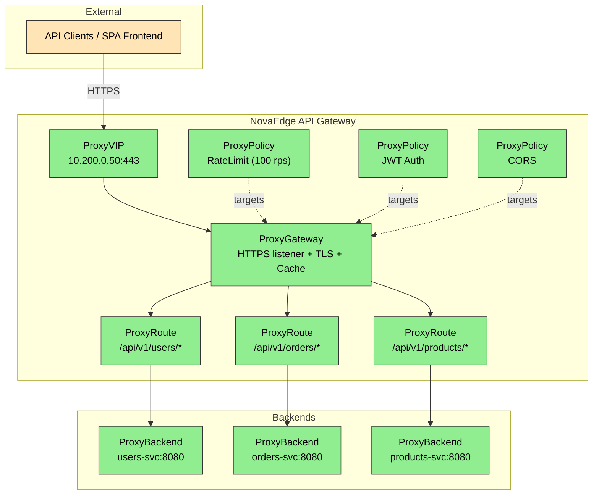

# Use Case: API Gateway

Replace Kong, Ambassador, or Tyk with NovaEdge as a unified, Kubernetes-native API gateway with built-in rate limiting, JWT authentication, CORS, response caching, and path-based routing.

## Problem Statement

> "I need a full-featured API gateway in front of my microservices, with rate limiting per API key, JWT validation, CORS for my SPA frontend, and response caching -- without deploying and maintaining a separate Kong or Ambassador stack."

Traditional API gateway stacks require:

- A dedicated gateway deployment (Kong, Ambassador, Tyk)
- A separate load balancer (MetalLB or cloud LB) to expose the gateway
- Separate certificate management (cert-manager)
- Multiple configuration languages and CRDs from different projects

NovaEdge collapses all of these into a single control plane with native CRDs.

## Architecture



## Full Configuration

The following YAML files define the complete API gateway stack. Apply them in order.

### Step 1: VIP -- External IP Address

```yaml
apiVersion: novaedge.io/v1alpha1
kind: ProxyVIP
metadata:
  name: api-gateway-vip
spec:
  address: "10.200.0.50/32"
  mode: L2ARP
  addressFamily: ipv4
  ports:
    - 443
    - 80
  healthPolicy:
    minHealthyNodes: 1
```

### Step 2: Gateway -- HTTPS Listener with TLS and Caching

```yaml
apiVersion: novaedge.io/v1alpha1
kind: ProxyGateway
metadata:
  name: api-gateway
  namespace: api-system
spec:
  vipRef: api-gateway-vip
  listeners:
    - name: https
      port: 443
      protocol: HTTPS
      hostnames:
        - "api.example.com"
      tls:
        secretRef:
          name: api-tls-cert
          namespace: api-system
        minVersion: "TLS1.3"
      sslRedirect: true
      maxRequestBodySize: 10485760  # 10 MiB
    - name: http-redirect
      port: 80
      protocol: HTTP
      hostnames:
        - "api.example.com"
  redirectScheme:
    enabled: true
    scheme: https
    port: 443
    statusCode: 301
  compression:
    enabled: true
    minSize: "1024"
    level: 6
    algorithms:
      - gzip
      - br
  cache:
    enabled: true
    maxSize: "256Mi"
    defaultTTL: "5m"
    maxTTL: "1h"
    maxEntrySize: "1Mi"
  tracing:
    enabled: true
    samplingRate: 100
  accessLog:
    enabled: true
    format: json
    excludePaths:
      - "/healthz"
      - "/readyz"
```

### Step 3: Backends -- Upstream Services

```yaml
apiVersion: novaedge.io/v1alpha1
kind: ProxyBackend
metadata:
  name: users-backend
  namespace: api-system
spec:
  serviceRef:
    name: users-svc
    port: 8080
  lbPolicy: P2C
  connectTimeout: "2s"
  healthCheck:
    interval: "10s"
    timeout: "5s"
    healthyThreshold: 2
    unhealthyThreshold: 3
    httpPath: "/healthz"
  circuitBreaker:
    maxConnections: 1000
    maxPendingRequests: 500
    consecutiveFailures: 5
    interval: "10s"
    baseEjectionTime: "30s"
  connectionPool:
    maxIdleConns: 100
    maxIdleConnsPerHost: 20
    idleConnTimeout: "90s"
---
apiVersion: novaedge.io/v1alpha1
kind: ProxyBackend
metadata:
  name: orders-backend
  namespace: api-system
spec:
  serviceRef:
    name: orders-svc
    port: 8080
  lbPolicy: LeastConn
  connectTimeout: "2s"
  healthCheck:
    interval: "10s"
    timeout: "5s"
    healthyThreshold: 2
    unhealthyThreshold: 3
    httpPath: "/healthz"
  circuitBreaker:
    consecutiveFailures: 5
    interval: "10s"
    baseEjectionTime: "30s"
---
apiVersion: novaedge.io/v1alpha1
kind: ProxyBackend
metadata:
  name: products-backend
  namespace: api-system
spec:
  serviceRef:
    name: products-svc
    port: 8080
  lbPolicy: RoundRobin
  connectTimeout: "2s"
  healthCheck:
    interval: "10s"
    timeout: "5s"
    healthyThreshold: 2
    unhealthyThreshold: 3
    httpPath: "/healthz"
```

### Step 4: Routes -- Path-Based Routing

```yaml
apiVersion: novaedge.io/v1alpha1
kind: ProxyRoute
metadata:
  name: users-route
  namespace: api-system
spec:
  hostnames:
    - "api.example.com"
  rules:
    - matches:
        - path:
            type: PathPrefix
            value: "/api/v1/users"
      backendRefs:
        - name: users-backend
      retry:
        maxRetries: 3
        retryOn:
          - "5xx"
          - "connection-failure"
      limits:
        requestTimeout: "30s"
        maxRequestBodySize: "1Mi"
---
apiVersion: novaedge.io/v1alpha1
kind: ProxyRoute
metadata:
  name: orders-route
  namespace: api-system
spec:
  hostnames:
    - "api.example.com"
  rules:
    - matches:
        - path:
            type: PathPrefix
            value: "/api/v1/orders"
      backendRefs:
        - name: orders-backend
      retry:
        maxRetries: 2
        retryOn:
          - "5xx"
      limits:
        requestTimeout: "60s"
        maxRequestBodySize: "5Mi"
---
apiVersion: novaedge.io/v1alpha1
kind: ProxyRoute
metadata:
  name: products-route
  namespace: api-system
spec:
  hostnames:
    - "api.example.com"
  rules:
    - matches:
        - path:
            type: PathPrefix
            value: "/api/v1/products"
          method: "GET"
      backendRefs:
        - name: products-backend
      limits:
        requestTimeout: "10s"
```

### Step 5: Policies -- Rate Limiting, JWT Auth, CORS

#### Rate Limiting (per API key header)

```yaml
apiVersion: novaedge.io/v1alpha1
kind: ProxyPolicy
metadata:
  name: api-rate-limit
  namespace: api-system
spec:
  type: RateLimit
  targetRef:
    kind: ProxyGateway
    name: api-gateway
  rateLimit:
    requestsPerSecond: 100
    burst: 200
    key: "header:X-API-Key"
```

#### JWT Authentication

```yaml
apiVersion: novaedge.io/v1alpha1
kind: ProxyPolicy
metadata:
  name: api-jwt-auth
  namespace: api-system
spec:
  type: JWT
  targetRef:
    kind: ProxyGateway
    name: api-gateway
  jwt:
    issuer: "https://auth.example.com"
    audience:
      - "api.example.com"
    jwksUri: "https://auth.example.com/.well-known/jwks.json"
    headerName: "Authorization"
    headerPrefix: "Bearer "
    allowedAlgorithms:
      - RS256
      - ES256
```

#### CORS Policy

```yaml
apiVersion: novaedge.io/v1alpha1
kind: ProxyPolicy
metadata:
  name: api-cors
  namespace: api-system
spec:
  type: CORS
  targetRef:
    kind: ProxyGateway
    name: api-gateway
  cors:
    allowOrigins:
      - "https://app.example.com"
      - "https://admin.example.com"
    allowMethods:
      - GET
      - POST
      - PUT
      - PATCH
      - DELETE
      - OPTIONS
    allowHeaders:
      - Authorization
      - Content-Type
      - X-API-Key
      - X-Request-ID
    exposeHeaders:
      - X-Request-ID
      - X-RateLimit-Remaining
    maxAge: "86400s"
    allowCredentials: true
```

#### Security Headers

```yaml
apiVersion: novaedge.io/v1alpha1
kind: ProxyPolicy
metadata:
  name: api-security-headers
  namespace: api-system
spec:
  type: SecurityHeaders
  targetRef:
    kind: ProxyGateway
    name: api-gateway
  securityHeaders:
    hsts:
      enabled: true
      maxAge: 31536000
      includeSubDomains: true
      preload: true
    xFrameOptions: "DENY"
    xContentTypeOptions: true
    referrerPolicy: "strict-origin-when-cross-origin"
```

## Verification

After applying all resources, verify the stack is operational:

```bash
# Check VIP status
kubectl get proxyvip api-gateway-vip
# Expected: Address=10.200.0.50/32, Mode=L2ARP, Active Node assigned

# Check gateway status
kubectl get proxygateway -n api-system api-gateway
# Expected: VIP Ref=api-gateway-vip

# Check all backends are healthy
kubectl get proxybackend -n api-system
# Expected: All backends show healthy endpoint counts

# Check routes are configured
kubectl get proxyroute -n api-system
# Expected: users-route, orders-route, products-route listed

# Check policies are applied
kubectl get proxypolicy -n api-system
# Expected: api-rate-limit, api-jwt-auth, api-cors, api-security-headers

# Detailed status with conditions
kubectl describe proxygateway -n api-system api-gateway
kubectl describe proxyvip api-gateway-vip

# Test the API gateway end-to-end (requires valid JWT)
curl -v https://api.example.com/api/v1/products \
  -H "Authorization: Bearer <YOUR_JWT_TOKEN>" \
  -H "X-API-Key: my-api-key"

# Test rate limit headers in response
curl -s -D - https://api.example.com/api/v1/products \
  -H "Authorization: Bearer <YOUR_JWT_TOKEN>" \
  -o /dev/null | grep -i ratelimit

# Test CORS preflight
curl -v -X OPTIONS https://api.example.com/api/v1/users \
  -H "Origin: https://app.example.com" \
  -H "Access-Control-Request-Method: POST" \
  -H "Access-Control-Request-Headers: Authorization, Content-Type"
```

## What You Replaced

| Traditional Stack          | NovaEdge Equivalent        |
|---------------------------|---------------------------|
| Kong / Ambassador         | ProxyGateway + ProxyRoute |
| Kong rate-limit plugin    | ProxyPolicy (RateLimit)   |
| Kong JWT plugin           | ProxyPolicy (JWT)         |
| Kong CORS plugin          | ProxyPolicy (CORS)        |
| Varnish / CDN cache       | ProxyGateway cache config |
| MetalLB                   | ProxyVIP                  |
| cert-manager Certificate  | ProxyGateway TLS config   |

## Related Documentation

- [ProxyGateway Reference](../reference/proxygateway.md)
- [ProxyRoute Reference](../reference/proxyroute.md)
- [ProxyPolicy Reference](../reference/proxypolicy.md)
- [ProxyBackend Reference](../reference/proxybackend.md)
- [ProxyVIP Reference](../reference/proxyvip.md)
- [TLS and Certificate Management](../user-guide/tls-certificates.md)
- [Rate Limiting Guide](../user-guide/rate-limiting.md)
- [Authentication Guide](../user-guide/authentication.md)
