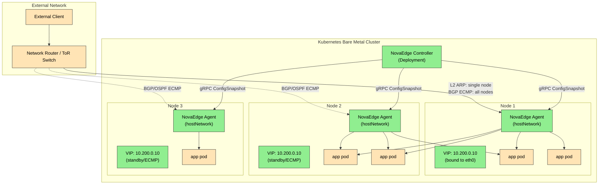
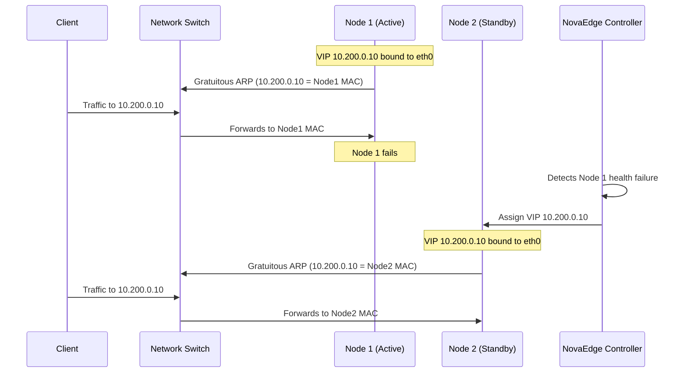
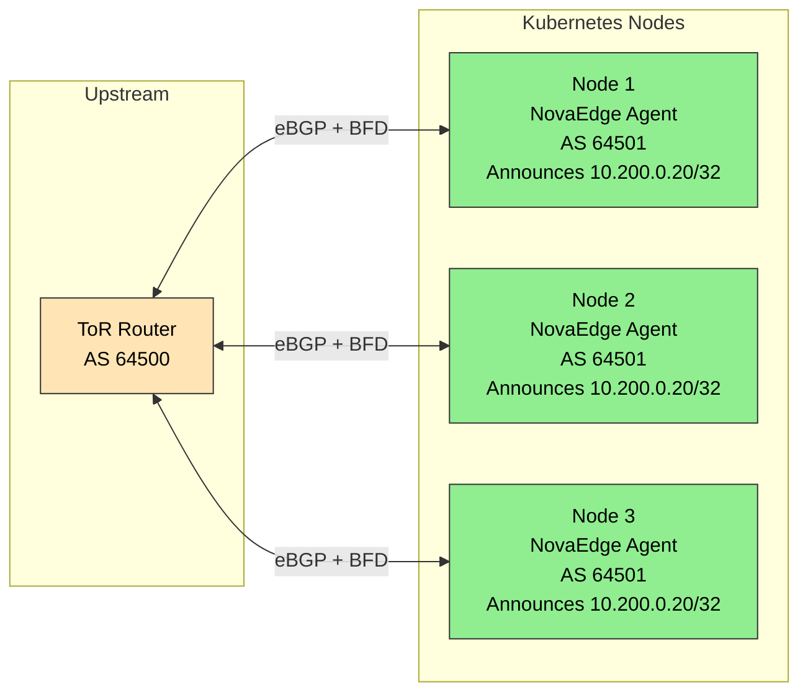

# Use Case: Bare Metal Load Balancer

Replace MetalLB with NovaEdge for bare-metal Kubernetes clusters. Get VIP management with L2 ARP, BGP with ECMP, or OSPF -- plus BFD for sub-second failover and IP address pool management.

## Problem Statement

> "I run Kubernetes on bare metal (no cloud LoadBalancer). I need stable external IPs for my services with fast failover. MetalLB only gives me L2 or BGP, and I still need a separate ingress controller and cert management on top of it."

MetalLB limitations that NovaEdge addresses:

- MetalLB only assigns IPs -- you still need NGINX Ingress, Envoy, or HAProxy on top
- No OSPF mode
- No BFD for sub-second failure detection
- No integrated health checking of application-layer services
- No built-in L4/L7 load balancing, TLS termination, or policy enforcement
- Separate IP pool management with limited IPAM

NovaEdge provides VIP management, L4/L7 load balancing, TLS termination, and policy enforcement in a single agent running on each node.

## Architecture: Traffic Flow



## IP Address Pool Management

Before creating VIPs, define an IP address pool. ProxyIPPool is a cluster-scoped resource that manages address allocation.

```yaml
apiVersion: novaedge.io/v1alpha1
kind: ProxyIPPool
metadata:
  name: external-pool
spec:
  cidrs:
    - "10.200.0.0/24"
  autoAssign: true
---
apiVersion: novaedge.io/v1alpha1
kind: ProxyIPPool
metadata:
  name: production-vips
spec:
  addresses:
    - "10.200.1.10/32"
    - "10.200.1.11/32"
    - "10.200.1.12/32"
    - "10.200.1.13/32"
    - "10.200.1.14/32"
    - "10.200.1.15/32"
  autoAssign: true
```

## Mode 1: L2 ARP (Simple, No Router Config Required)

Best for small clusters or environments where you cannot configure the network router. One node owns the VIP at a time, and failover happens via Gratuitous ARP.

**How it works:** The active NovaEdge agent binds the VIP to a local interface and broadcasts a GARP. All traffic for that IP goes to the active node. On failure, the controller reassigns the VIP to another healthy node, which sends a new GARP.



### L2 ARP VIP Configuration

```yaml
apiVersion: novaedge.io/v1alpha1
kind: ProxyVIP
metadata:
  name: web-vip-l2
spec:
  address: "10.200.0.10/32"
  mode: L2ARP
  addressFamily: ipv4
  ports:
    - 80
    - 443
  nodeSelector:
    matchLabels:
      node-role.kubernetes.io/edge: "true"
  healthPolicy:
    minHealthyNodes: 1
```

### L2 ARP VIP with Pool Allocation

```yaml
apiVersion: novaedge.io/v1alpha1
kind: ProxyVIP
metadata:
  name: web-vip-l2-auto
spec:
  # Address allocated automatically from the pool
  mode: L2ARP
  addressFamily: ipv4
  ports:
    - 80
    - 443
  poolRef:
    name: external-pool
  healthPolicy:
    minHealthyNodes: 1
```

## Mode 2: BGP with ECMP (Production, Active-Active)

Best for production environments with a BGP-capable top-of-rack (ToR) switch or router. All healthy nodes announce the VIP via BGP, and the router distributes traffic using Equal-Cost Multi-Path (ECMP) routing.

**How it works:** Each NovaEdge agent peers with the upstream router via BGP and announces the VIP as a /32 route. The router sees equal-cost paths to the VIP across all announcing nodes and load-balances across them.



### BGP VIP Configuration

```yaml
apiVersion: novaedge.io/v1alpha1
kind: ProxyVIP
metadata:
  name: web-vip-bgp
spec:
  address: "10.200.0.20/32"
  mode: BGP
  addressFamily: ipv4
  ports:
    - 80
    - 443
  bgpConfig:
    localAS: 64501
    routerID: "10.0.0.1"
    peers:
      - address: "10.0.0.254"
        as: 64500
        port: 179
    communities:
      - "64501:100"
  bfd:
    enabled: true
    detectMultiplier: 3
    desiredMinTxInterval: "300ms"
    requiredMinRxInterval: "300ms"
  nodeSelector:
    matchLabels:
      node-role.kubernetes.io/edge: "true"
  healthPolicy:
    minHealthyNodes: 2
```

### BGP with Dual-Stack (IPv4 + IPv6)

```yaml
apiVersion: novaedge.io/v1alpha1
kind: ProxyVIP
metadata:
  name: web-vip-bgp-dual
spec:
  address: "10.200.0.20/32"
  ipv6Address: "2001:db8::50/128"
  mode: BGP
  addressFamily: dual
  ports:
    - 80
    - 443
  bgpConfig:
    localAS: 64501
    routerID: "10.0.0.1"
    peers:
      - address: "10.0.0.254"
        as: 64500
        port: 179
  bfd:
    enabled: true
    detectMultiplier: 3
    desiredMinTxInterval: "300ms"
    requiredMinRxInterval: "300ms"
```

### BGP with Multiple Peers (Redundant Routers)

```yaml
apiVersion: novaedge.io/v1alpha1
kind: ProxyVIP
metadata:
  name: web-vip-bgp-redundant
spec:
  address: "10.200.0.20/32"
  mode: BGP
  addressFamily: ipv4
  ports:
    - 80
    - 443
  bgpConfig:
    localAS: 64501
    routerID: "10.0.0.1"
    peers:
      - address: "10.0.0.253"
        as: 64500
        port: 179
      - address: "10.0.0.254"
        as: 64500
        port: 179
    communities:
      - "64501:100"
    localPreference: 100
  bfd:
    enabled: true
    detectMultiplier: 3
    desiredMinTxInterval: "100ms"
    requiredMinRxInterval: "100ms"
    echoMode: true
```

## Mode 3: OSPF (Active-Active, L3 Routing)

Best for environments using OSPF for their datacenter fabric. Similar to BGP mode but uses OSPF LSA advertisements.

```yaml
apiVersion: novaedge.io/v1alpha1
kind: ProxyVIP
metadata:
  name: web-vip-ospf
spec:
  address: "10.200.0.30/32"
  mode: OSPF
  addressFamily: ipv4
  ports:
    - 80
    - 443
  ospfConfig:
    routerID: "10.0.0.1"
    areaID: 0
    cost: 10
    helloInterval: 10
    deadInterval: 40
    authType: md5
    authKey: "my-ospf-secret"
    gracefulRestart: true
  bfd:
    enabled: true
    detectMultiplier: 3
    desiredMinTxInterval: "300ms"
    requiredMinRxInterval: "300ms"
  healthPolicy:
    minHealthyNodes: 2
```

## Complete Stack: BGP VIP + Gateway + Backend

This example shows the full stack from VIP to pods for a production BGP deployment:

```yaml
# 1. IP Pool
apiVersion: novaedge.io/v1alpha1
kind: ProxyIPPool
metadata:
  name: production-pool
spec:
  cidrs:
    - "10.200.0.0/28"
  autoAssign: true
---
# 2. VIP with BGP + BFD
apiVersion: novaedge.io/v1alpha1
kind: ProxyVIP
metadata:
  name: prod-vip
spec:
  mode: BGP
  addressFamily: ipv4
  ports:
    - 443
    - 80
  poolRef:
    name: production-pool
  bgpConfig:
    localAS: 64501
    routerID: "10.0.0.1"
    peers:
      - address: "10.0.0.254"
        as: 64500
  bfd:
    enabled: true
    detectMultiplier: 3
    desiredMinTxInterval: "300ms"
    requiredMinRxInterval: "300ms"
  healthPolicy:
    minHealthyNodes: 2
---
# 3. Gateway
apiVersion: novaedge.io/v1alpha1
kind: ProxyGateway
metadata:
  name: prod-gateway
  namespace: production
spec:
  vipRef: prod-vip
  listeners:
    - name: https
      port: 443
      protocol: HTTPS
      tls:
        secretRef:
          name: prod-tls-cert
          namespace: production
        minVersion: "TLS1.3"
      sslRedirect: true
    - name: http
      port: 80
      protocol: HTTP
  redirectScheme:
    enabled: true
    scheme: https
    statusCode: 301
  compression:
    enabled: true
    algorithms:
      - gzip
      - br
---
# 4. Backend
apiVersion: novaedge.io/v1alpha1
kind: ProxyBackend
metadata:
  name: prod-backend
  namespace: production
spec:
  serviceRef:
    name: web-app
    port: 8080
  lbPolicy: EWMA
  healthCheck:
    interval: "10s"
    timeout: "5s"
    healthyThreshold: 2
    unhealthyThreshold: 3
    httpPath: "/healthz"
  circuitBreaker:
    consecutiveFailures: 5
    interval: "10s"
    baseEjectionTime: "30s"
---
# 5. Route
apiVersion: novaedge.io/v1alpha1
kind: ProxyRoute
metadata:
  name: prod-route
  namespace: production
spec:
  hostnames:
    - "www.example.com"
  rules:
    - matches:
        - path:
            type: PathPrefix
            value: "/"
      backendRefs:
        - name: prod-backend
      retry:
        maxRetries: 3
        retryOn:
          - "5xx"
          - "connection-failure"
```

## Mode Comparison

| Feature                     | L2 ARP           | BGP              | OSPF             |
|-----------------------------|------------------|------------------|------------------|
| Router configuration needed | No               | Yes (BGP peer)   | Yes (OSPF area)  |
| Active-active               | No (single node) | Yes (ECMP)       | Yes (ECMP)       |
| Failover speed              | 2-5 seconds      | Sub-second (BFD) | Sub-second (BFD) |
| Scalability                 | Single node      | All nodes        | All nodes         |
| Network complexity          | Low              | Medium           | Medium           |
| Dual-stack IPv6             | Yes              | Yes              | Yes              |
| Best for                    | Small/dev        | Production       | OSPF datacenters |

## Verification

```bash
# Check IP pool status
kubectl get proxyippool
# Expected: Shows allocated vs available IPs

# Check VIP status and active node
kubectl get proxyvip
# Expected: Address, Mode, Active Node (L2) or Announcing Nodes (BGP/OSPF)

# Detailed VIP status including BFD session state
kubectl describe proxyvip web-vip-bgp
# Look for: BFD Session State, Announcing Nodes, Conditions

# Check pool allocations
kubectl get proxyippool production-pool -o jsonpath='{.status.allocations}'

# Verify BGP peering from the node (if using BGP mode)
kubectl exec -n nova-system daemonset/novaedge-agent -- \
  novaedge-agent bgp status

# Test VIP reachability
ping -c 3 10.200.0.20

# Test failover (L2 mode) -- cordon a node and watch VIP move
kubectl cordon <active-node>
kubectl get proxyvip web-vip-l2 -w
# Expected: Active Node changes to another node
kubectl uncordon <active-node>

# Test failover (BGP mode) -- watch announcing nodes
kubectl get proxyvip web-vip-bgp -w
# Drain a node and verify it is removed from announcingNodes
```

## Related Documentation

- [ProxyVIP Reference](../reference/crd-reference.md)
- [ProxyIPPool Reference](../reference/crd-reference.md)
- [Network Architecture](../architecture/overview.md)
