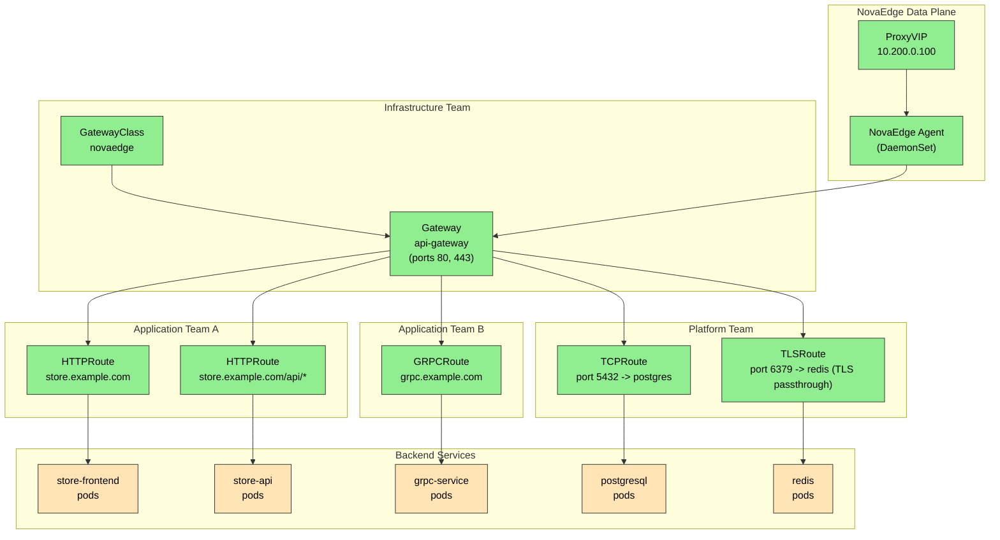

# Use Case: Kubernetes Gateway API

Use the modern Kubernetes Gateway API instead of legacy Ingress resources. NovaEdge implements the Gateway API specification, supporting GatewayClass, Gateway, HTTPRoute, GRPCRoute, TCPRoute, and TLSRoute.

## Problem Statement

> "I want to use the Kubernetes Gateway API for my service routing. It gives me better role separation (infra vs. app teams), native support for traffic splitting, header-based routing, and protocol-specific route types. I need a Gateway API implementation that also handles VIP management and L4/L7 policies."

The Gateway API is the successor to the Ingress API. It provides:

- **Role-oriented design**: Infrastructure providers manage GatewayClass and Gateway. Application developers manage Routes.
- **Expressive routing**: Header matching, query parameter matching, method matching, traffic splitting, request mirroring.
- **Protocol-specific routes**: HTTPRoute, GRPCRoute, TCPRoute, TLSRoute instead of a single Ingress spec for everything.
- **Portable**: Standardized API across implementations (NovaEdge, Envoy Gateway, Istio, Cilium).

NovaEdge implements Gateway API and extends it with VIP management, advanced policies, and L4/L7 load balancing that other implementations lack.

## Architecture



## Prerequisites

Install the Gateway API CRDs (these are separate from the NovaEdge CRDs):

```bash
# Install Gateway API standard CRDs (v1.2.x)
kubectl apply -f https://github.com/kubernetes-sigs/gateway-api/releases/download/v1.2.1/standard-install.yaml

# Install experimental CRDs (required for GRPCRoute, TCPRoute, TLSRoute)
kubectl apply -f https://github.com/kubernetes-sigs/gateway-api/releases/download/v1.2.1/experimental-install.yaml
```

## Configuration

### Step 1: GatewayClass (Infrastructure Team)

The GatewayClass tells Kubernetes which controller implements the Gateway API. This is a cluster-scoped resource.

```yaml
apiVersion: gateway.networking.k8s.io/v1
kind: GatewayClass
metadata:
  name: novaedge
spec:
  controllerName: novaedge.io/gateway-controller
  description: "NovaEdge Gateway API implementation with integrated VIP, LB, and policy support"
```

### Step 2: NovaEdge VIP (Infrastructure Team)

The Gateway API `Gateway` resource maps to the NovaEdge VIP for external IP allocation:

```yaml
apiVersion: novaedge.io/v1alpha1
kind: ProxyVIP
metadata:
  name: gateway-api-vip
spec:
  address: "10.200.0.100/32"
  mode: BGP
  addressFamily: ipv4
  ports:
    - 80
    - 443
    - 5432
    - 6379
  bgpConfig:
    localAS: 64501
    routerID: "10.0.0.1"
    peers:
      - address: "10.0.0.254"
        as: 64500
  bfd:
    enabled: true
    detectMultiplier: 3
    desiredMinTxInterval: "300ms"
    requiredMinRxInterval: "300ms"
```

### Step 3: Gateway (Infrastructure Team)

The Gateway defines listeners (ports, protocols, TLS) and references the NovaEdge VIP via an annotation or the `infrastructure` field.

```yaml
apiVersion: gateway.networking.k8s.io/v1
kind: Gateway
metadata:
  name: api-gateway
  namespace: gateway-system
  annotations:
    novaedge.io/vip-ref: "gateway-api-vip"
spec:
  gatewayClassName: novaedge
  listeners:
    - name: http
      protocol: HTTP
      port: 80
      allowedRoutes:
        namespaces:
          from: All
    - name: https
      protocol: HTTPS
      port: 443
      tls:
        mode: Terminate
        certificateRefs:
          - kind: Secret
            name: wildcard-tls
            namespace: gateway-system
      allowedRoutes:
        namespaces:
          from: All
    - name: tcp-postgres
      protocol: TCP
      port: 5432
      allowedRoutes:
        namespaces:
          from: Same
        kinds:
          - kind: TCPRoute
    - name: tls-redis
      protocol: TLS
      port: 6379
      tls:
        mode: Passthrough
      allowedRoutes:
        namespaces:
          from: Same
        kinds:
          - kind: TLSRoute
```

### Step 4: HTTPRoute (Application Team)

HTTPRoute provides expressive L7 routing with path matching, header matching, traffic splitting, and request/response manipulation.

#### Basic Path-Based Routing

```yaml
apiVersion: gateway.networking.k8s.io/v1
kind: HTTPRoute
metadata:
  name: store-frontend
  namespace: store
spec:
  parentRefs:
    - name: api-gateway
      namespace: gateway-system
      sectionName: https
  hostnames:
    - "store.example.com"
  rules:
    - matches:
        - path:
            type: PathPrefix
            value: /
      backendRefs:
        - name: store-frontend-svc
          port: 80
          weight: 1
```

#### Path + Header Matching with Traffic Splitting (Canary)

```yaml
apiVersion: gateway.networking.k8s.io/v1
kind: HTTPRoute
metadata:
  name: store-api
  namespace: store
spec:
  parentRefs:
    - name: api-gateway
      namespace: gateway-system
      sectionName: https
  hostnames:
    - "store.example.com"
  rules:
    # Canary: route 10% of /api traffic to v2
    - matches:
        - path:
            type: PathPrefix
            value: /api
      backendRefs:
        - name: store-api-v1
          port: 8080
          weight: 90
        - name: store-api-v2
          port: 8080
          weight: 10
    # Header-based routing: beta users go to v2
    - matches:
        - path:
            type: PathPrefix
            value: /api
          headers:
            - name: X-Beta-User
              value: "true"
      backendRefs:
        - name: store-api-v2
          port: 8080
```

#### URL Rewrite and Redirect

```yaml
apiVersion: gateway.networking.k8s.io/v1
kind: HTTPRoute
metadata:
  name: store-redirects
  namespace: store
spec:
  parentRefs:
    - name: api-gateway
      namespace: gateway-system
      sectionName: https
  hostnames:
    - "store.example.com"
  rules:
    # Rewrite /shop/* to /store/*
    - matches:
        - path:
            type: PathPrefix
            value: /shop
      filters:
        - type: URLRewrite
          urlRewrite:
            path:
              type: ReplacePrefixMatch
              replacePrefixMatch: /store
      backendRefs:
        - name: store-frontend-svc
          port: 80
    # Redirect old domain
    - matches:
        - path:
            type: PathPrefix
            value: /old-path
      filters:
        - type: RequestRedirect
          requestRedirect:
            hostname: store.example.com
            path:
              type: ReplacePrefixMatch
              replacePrefixMatch: /new-path
            statusCode: 301
```

#### Request/Response Header Modification

```yaml
apiVersion: gateway.networking.k8s.io/v1
kind: HTTPRoute
metadata:
  name: store-api-headers
  namespace: store
spec:
  parentRefs:
    - name: api-gateway
      namespace: gateway-system
      sectionName: https
  hostnames:
    - "store.example.com"
  rules:
    - matches:
        - path:
            type: PathPrefix
            value: /api
      filters:
        - type: RequestHeaderModifier
          requestHeaderModifier:
            add:
              - name: X-Forwarded-Proto
                value: https
              - name: X-Gateway
                value: novaedge
            remove:
              - X-Debug-Header
        - type: ResponseHeaderModifier
          responseHeaderModifier:
            add:
              - name: X-Served-By
                value: novaedge
      backendRefs:
        - name: store-api-v1
          port: 8080
```

### Step 5: GRPCRoute (Application Team)

GRPCRoute provides native gRPC routing by service and method name.

```yaml
apiVersion: gateway.networking.k8s.io/v1alpha2
kind: GRPCRoute
metadata:
  name: grpc-services
  namespace: store
spec:
  parentRefs:
    - name: api-gateway
      namespace: gateway-system
      sectionName: https
  hostnames:
    - "grpc.example.com"
  rules:
    # Route by gRPC service name
    - matches:
        - method:
            service: store.ProductService
      backendRefs:
        - name: product-grpc-svc
          port: 9090
    - matches:
        - method:
            service: store.OrderService
      backendRefs:
        - name: order-grpc-svc
          port: 9090
    # Route specific method to a different backend
    - matches:
        - method:
            service: store.OrderService
            method: StreamUpdates
      backendRefs:
        - name: order-streaming-svc
          port: 9090
```

### Step 6: TCPRoute (Platform Team)

TCPRoute provides L4 TCP proxying for non-HTTP protocols.

```yaml
apiVersion: gateway.networking.k8s.io/v1alpha2
kind: TCPRoute
metadata:
  name: postgres-route
  namespace: gateway-system
spec:
  parentRefs:
    - name: api-gateway
      sectionName: tcp-postgres
  rules:
    - backendRefs:
        - name: postgresql
          port: 5432
```

### Step 7: TLSRoute (Platform Team)

TLSRoute provides TLS passthrough routing based on SNI, without terminating TLS.

```yaml
apiVersion: gateway.networking.k8s.io/v1alpha2
kind: TLSRoute
metadata:
  name: redis-tls-route
  namespace: gateway-system
spec:
  parentRefs:
    - name: api-gateway
      sectionName: tls-redis
  hostnames:
    - "redis.internal.example.com"
  rules:
    - backendRefs:
        - name: redis-cluster
          port: 6379
```

## Applying NovaEdge Policies to Gateway API Routes

NovaEdge ProxyPolicy resources can target Gateway API resources. The controller translates between the two systems.

```yaml
# Rate limit on the Gateway (applies to all routes)
apiVersion: novaedge.io/v1alpha1
kind: ProxyPolicy
metadata:
  name: gateway-rate-limit
  namespace: gateway-system
spec:
  type: RateLimit
  targetRef:
    kind: ProxyGateway
    name: api-gateway
  rateLimit:
    requestsPerSecond: 1000
    burst: 2000
    key: "source-ip"
---
# JWT auth on a specific route
apiVersion: novaedge.io/v1alpha1
kind: ProxyPolicy
metadata:
  name: store-api-jwt
  namespace: store
spec:
  type: JWT
  targetRef:
    kind: ProxyRoute
    name: store-api
  jwt:
    issuer: "https://auth.example.com"
    audience:
      - "store.example.com"
    jwksUri: "https://auth.example.com/.well-known/jwks.json"
---
# WAF protection on the gateway
apiVersion: novaedge.io/v1alpha1
kind: ProxyPolicy
metadata:
  name: gateway-waf
  namespace: gateway-system
spec:
  type: WAF
  targetRef:
    kind: ProxyGateway
    name: api-gateway
  waf:
    enabled: true
    mode: prevention
    paranoiaLevel: 2
    anomalyThreshold: 5
```

## Ingress vs Gateway API Comparison

| Feature                           | Kubernetes Ingress               | Gateway API                        |
|-----------------------------------|----------------------------------|------------------------------------|
| **API stability**                 | Stable (v1)                      | Stable (v1) for core; alpha for TCP/gRPC |
| **Role separation**               | Single resource, one owner       | GatewayClass/Gateway (infra) + Routes (app) |
| **Path matching**                 | Prefix, Exact                    | Prefix, Exact, RegularExpression   |
| **Header matching**               | No                               | Yes                                |
| **Query parameter matching**      | No                               | Yes                                |
| **Method matching**               | No                               | Yes                                |
| **Traffic splitting (canary)**    | No                               | Yes (weighted backendRefs)         |
| **Request mirroring**             | No                               | Yes                                |
| **URL rewrite**                   | No (annotation hack)             | Yes (native filter)                |
| **Request/response header mod**   | No (annotation hack)             | Yes (native filter)                |
| **Redirect**                      | Annotation-based                 | Yes (native filter)                |
| **gRPC routing**                  | Annotation-based                 | GRPCRoute (native service/method)  |
| **TCP routing**                   | Not supported                    | TCPRoute                           |
| **TLS passthrough**               | Annotation-based                 | TLSRoute                           |
| **Cross-namespace routing**       | No                               | Yes (with ReferenceGrant)          |
| **Multiple implementations**      | One controller per class         | Multiple GatewayClasses            |
| **Extensibility**                 | Annotations (non-portable)       | Policy attachment (portable)       |
| **NovaEdge VIP integration**      | Via ProxyGateway ingressClassName| Via annotation on Gateway          |
| **NovaEdge policy attachment**    | Via ProxyPolicy targetRef        | Via ProxyPolicy targetRef          |

## When to Use Which

| Scenario                                       | Recommendation          |
|------------------------------------------------|-------------------------|
| Existing Ingress resources, need quick migration | Ingress with `ingressClassName: novaedge` |
| New project, want future-proof routing           | Gateway API             |
| Need gRPC-native routing by service/method       | Gateway API (GRPCRoute) |
| Need L4 TCP/TLS passthrough                      | Gateway API (TCPRoute/TLSRoute) |
| Need traffic splitting for canary deployments    | Gateway API (HTTPRoute weighted backends) |
| Need cross-namespace route sharing               | Gateway API             |
| Simple host+path routing, minimal config         | Either works            |

## Verification

```bash
# Check GatewayClass is accepted
kubectl get gatewayclass novaedge
# Expected: ACCEPTED=True

# Check Gateway status
kubectl get gateway -n gateway-system api-gateway
# Expected: PROGRAMMED=True, addresses assigned

# Check Gateway listeners
kubectl describe gateway -n gateway-system api-gateway
# Look for: Listener status, attached routes count

# Check HTTPRoutes
kubectl get httproute -A
# Expected: Routes listed with parent refs resolved

# Check GRPCRoute
kubectl get grpcroute -A

# Check TCPRoute and TLSRoute
kubectl get tcproute -A
kubectl get tlsroute -A

# Check NovaEdge VIP backs the Gateway
kubectl get proxyvip gateway-api-vip
# Expected: Address assigned, BGP announcing nodes listed

# Test HTTP routing
curl -v https://store.example.com/ \
  --resolve "store.example.com:443:10.200.0.100"

# Test canary traffic split (run multiple times, observe v1 vs v2 responses)
for i in $(seq 1 20); do
  curl -s https://store.example.com/api/version \
    --resolve "store.example.com:443:10.200.0.100"
done

# Test header-based routing
curl -v https://store.example.com/api/version \
  -H "X-Beta-User: true" \
  --resolve "store.example.com:443:10.200.0.100"

# Test gRPC routing
grpcurl -d '{}' -authority grpc.example.com \
  10.200.0.100:443 store.ProductService/ListProducts

# Test TCP route (PostgreSQL)
psql -h 10.200.0.100 -p 5432 -U myuser -d mydb
```

## Related Documentation

- [Kubernetes Gateway API Specification](https://gateway-api.sigs.k8s.io/)
- [Ingress Controller Use Case](./ingress-controller.md) -- for legacy Ingress support
- [ProxyVIP Reference](../reference/crd-reference.md)
- [ProxyPolicy Reference](../reference/crd-reference.md)
- [ProxyGateway Reference](../reference/crd-reference.md)
- [gRPC Routing Guide](../user-guide/routing.md)
- [L4 TCP/UDP Proxying Guide](../user-guide/l4-proxying.md)
