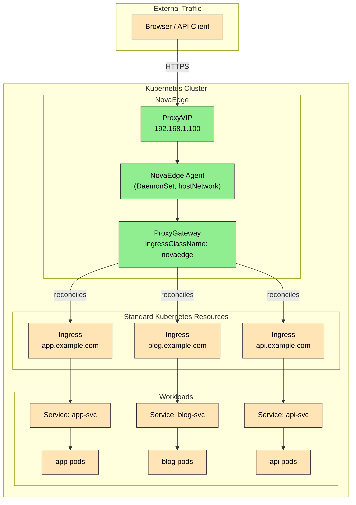

# Use Case: Kubernetes Ingress Controller

Replace NGINX Ingress Controller with NovaEdge. Existing Kubernetes `Ingress` resources work with zero changes -- just set `ingressClassName: novaedge`.

## Problem Statement

> "I need to replace my NGINX Ingress Controller with something that also handles VIP management and TLS natively, without maintaining a separate MetalLB stack. I want my existing Ingress resources to keep working."

NGINX Ingress Controller limitations that NovaEdge addresses:

- Requires a separate load balancer (MetalLB, cloud LB) to expose the controller
- TLS termination requires separate cert-manager setup
- No built-in rate limiting, JWT auth, WAF, or CORS (requires Lua plugins or annotations)
- Config reload via NGINX process signal causes brief connection drops
- No L4 TCP/UDP proxy without custom ConfigMap hacks

NovaEdge acts as a drop-in Ingress controller while also providing VIP management, L4 proxying, and policy enforcement natively.

## Architecture



## Installation

Install NovaEdge as an Ingress controller using Helm:

```bash
# Add the NovaEdge Helm repository
helm repo add novaedge https://charts.novaedge.io
helm repo update

# Install the operator
helm install novaedge-operator novaedge/novaedge-operator \
  --namespace nova-system \
  --create-namespace

# Install the controller with Ingress support enabled
helm install novaedge novaedge/novaedge \
  --namespace nova-system \
  --set controller.ingressClass.enabled=true \
  --set controller.ingressClass.name=novaedge \
  --set controller.ingressClass.default=false

# Install the agent DaemonSet
helm install novaedge-agent novaedge/novaedge-agent \
  --namespace nova-system
```

## Configuration

### Step 1: VIP and Gateway for Ingress

Create the NovaEdge infrastructure that backs the Ingress class:

```yaml
apiVersion: novaedge.io/v1alpha1
kind: ProxyVIP
metadata:
  name: ingress-vip
spec:
  address: "192.168.1.100/32"
  mode: L2ARP
  addressFamily: ipv4
  ports:
    - 443
    - 80
  healthPolicy:
    minHealthyNodes: 1
---
apiVersion: novaedge.io/v1alpha1
kind: ProxyGateway
metadata:
  name: ingress-gateway
  namespace: nova-system
spec:
  vipRef: ingress-vip
  ingressClassName: novaedge
  listeners:
    - name: https
      port: 443
      protocol: HTTPS
      tls:
        secretRef:
          name: default-tls-cert
          namespace: nova-system
        minVersion: "TLS1.2"
      sslRedirect: true
    - name: http
      port: 80
      protocol: HTTP
  redirectScheme:
    enabled: true
    scheme: https
    port: 443
    statusCode: 301
  compression:
    enabled: true
    algorithms:
      - gzip
      - br
  accessLog:
    enabled: true
    format: json
    excludePaths:
      - "/healthz"
```

### Step 2: Use Standard Kubernetes Ingress Resources (Zero Changes)

Your existing Ingress resources work as-is. Just ensure `ingressClassName` is set:

```yaml
apiVersion: networking.k8s.io/v1
kind: Ingress
metadata:
  name: app-ingress
  namespace: default
  annotations:
    cert-manager.io/cluster-issuer: "letsencrypt-prod"
spec:
  ingressClassName: novaedge
  tls:
    - hosts:
        - app.example.com
      secretName: app-tls
  rules:
    - host: app.example.com
      http:
        paths:
          - path: /
            pathType: Prefix
            backend:
              service:
                name: app-svc
                port:
                  number: 80
---
apiVersion: networking.k8s.io/v1
kind: Ingress
metadata:
  name: blog-ingress
  namespace: default
  annotations:
    cert-manager.io/cluster-issuer: "letsencrypt-prod"
spec:
  ingressClassName: novaedge
  tls:
    - hosts:
        - blog.example.com
      secretName: blog-tls
  rules:
    - host: blog.example.com
      http:
        paths:
          - path: /
            pathType: Prefix
            backend:
              service:
                name: blog-svc
                port:
                  number: 80
---
apiVersion: networking.k8s.io/v1
kind: Ingress
metadata:
  name: api-ingress
  namespace: default
spec:
  ingressClassName: novaedge
  tls:
    - hosts:
        - api.example.com
      secretName: api-tls
  rules:
    - host: api.example.com
      http:
        paths:
          - path: /v1
            pathType: Prefix
            backend:
              service:
                name: api-v1-svc
                port:
                  number: 8080
          - path: /v2
            pathType: Prefix
            backend:
              service:
                name: api-v2-svc
                port:
                  number: 8080
```

### Step 3 (Optional): NovaEdge-Native Equivalent

For teams ready to migrate to NovaEdge-native CRDs, here is the equivalent of the `app-ingress` above using NovaEdge resources. This unlocks features not available through standard Ingress (circuit breaking, advanced LB algorithms, per-route retries, middleware pipelines).

```yaml
apiVersion: novaedge.io/v1alpha1
kind: ProxyBackend
metadata:
  name: app-backend
  namespace: default
spec:
  serviceRef:
    name: app-svc
    port: 80
  lbPolicy: P2C
  healthCheck:
    interval: "10s"
    timeout: "5s"
    healthyThreshold: 2
    unhealthyThreshold: 3
    httpPath: "/healthz"
  circuitBreaker:
    consecutiveFailures: 5
    interval: "10s"
    baseEjectionTime: "30s"
  connectionPool:
    maxIdleConns: 100
    maxIdleConnsPerHost: 20
---
apiVersion: novaedge.io/v1alpha1
kind: ProxyRoute
metadata:
  name: app-route
  namespace: default
spec:
  hostnames:
    - "app.example.com"
  rules:
    - matches:
        - path:
            type: PathPrefix
            value: "/"
      backendRefs:
        - name: app-backend
      retry:
        maxRetries: 3
        retryOn:
          - "5xx"
          - "connection-failure"
      limits:
        requestTimeout: "30s"
---
apiVersion: novaedge.io/v1alpha1
kind: ProxyCertificate
metadata:
  name: app-cert
  namespace: default
spec:
  domains:
    - "app.example.com"
  issuer:
    type: acme
    acme:
      email: "admin@example.com"
      challengeType: http-01
  keyType: EC256
  renewBefore: "720h"
```

### Feature Comparison: Standard Ingress vs NovaEdge-Native

| Feature                       | Kubernetes Ingress     | NovaEdge Native CRDs      |
|-------------------------------|------------------------|---------------------------|
| Path-based routing            | Yes                    | Yes                       |
| Host-based routing            | Yes                    | Yes                       |
| TLS termination               | Yes (via Secret)       | Yes (Secret, ACME, Vault) |
| cert-manager integration      | Yes (annotation)       | Yes (annotation + native) |
| Load balancing algorithm      | Round Robin only       | 6 algorithms + sticky     |
| Circuit breaking              | No                     | Yes                       |
| Active health checks          | No                     | Yes                       |
| Per-route retries             | No                     | Yes                       |
| Per-route timeouts            | Limited (annotation)   | Yes                       |
| Rate limiting                 | No (plugin needed)     | Yes (ProxyPolicy)         |
| JWT authentication            | No (plugin needed)     | Yes (ProxyPolicy)         |
| CORS policy                   | No (plugin needed)     | Yes (ProxyPolicy)         |
| WAF                           | No (ModSecurity addon) | Yes (ProxyPolicy, Coraza) |
| Response caching              | No                     | Yes (ProxyGateway)        |
| Compression                   | No                     | Yes (gzip + Brotli)       |
| HTTP/3 QUIC                   | No                     | Yes                       |
| WebSocket                     | Annotation-based       | Native                    |
| gRPC routing                  | Annotation-based       | Native                    |
| Traffic mirroring             | No                     | Yes                       |
| Traffic splitting (canary)    | No                     | Yes (weighted backends)   |
| Middleware pipelines          | No                     | Yes (builtin + WASM)      |
| VIP management                | Separate (MetalLB)     | Built-in (ProxyVIP)      |

## Migration Path from NGINX Ingress

1. Install NovaEdge alongside NGINX Ingress (both can coexist with different `ingressClassName` values).
2. Create the NovaEdge ProxyVIP and ProxyGateway.
3. Change `ingressClassName` on individual Ingress resources from `nginx` to `novaedge`, one at a time.
4. Update DNS to point at the NovaEdge VIP.
5. Once all Ingress resources are migrated, uninstall NGINX Ingress and MetalLB.
6. Optionally migrate to NovaEdge-native CRDs for advanced features.

## Verification

```bash
# Check that the IngressClass exists
kubectl get ingressclass novaedge

# Check NovaEdge gateway is reconciling Ingress resources
kubectl get proxygateway -n nova-system ingress-gateway
kubectl describe proxygateway -n nova-system ingress-gateway

# Check VIP is active
kubectl get proxyvip ingress-vip
# Expected: Address=192.168.1.100/32, Active Node assigned

# List all Ingress resources using NovaEdge
kubectl get ingress -A --field-selector spec.ingressClassName=novaedge

# Test HTTPS access
curl -v https://app.example.com/ --resolve "app.example.com:443:192.168.1.100"

# Test HTTP-to-HTTPS redirect
curl -v http://app.example.com/ --resolve "app.example.com:80:192.168.1.100"
# Expected: 301 redirect to https://app.example.com/

# Check TLS certificate
echo | openssl s_client -connect 192.168.1.100:443 -servername app.example.com 2>/dev/null | openssl x509 -noout -subject -dates
```

## Related Documentation

- [ProxyGateway Reference](../reference/crd-reference.md)
- [ProxyVIP Reference](../reference/crd-reference.md)
- [TLS and Certificate Management](../user-guide/tls.md)
- [Gateway API Use Case](./gateway-api.md) -- for the modern alternative to Ingress
- [Installation Guide](../installation/helm.md)
