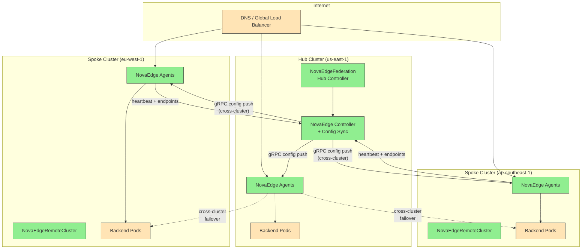

# Multi-Cluster Federation

## Problem Statement

"I need to route traffic across multiple Kubernetes clusters for geographic load balancing, disaster recovery, or edge deployments -- without manually synchronizing configuration or managing cross-cluster service discovery."

NovaEdge provides multi-cluster federation using a hub-spoke topology. A hub cluster runs the `NovaEdgeFederation` CRD and serves as the single source of truth. Spoke clusters register with `NovaEdgeRemoteCluster` CRDs. The hub controller automatically discovers endpoints across all clusters, synchronizes routing configuration, and handles failover when a spoke becomes unhealthy.

---

## Architecture



### How It Works

1. **Hub Controller** -- The hub cluster runs the NovaEdge controller with federation enabled. It maintains the global view of all endpoints and routing rules.

2. **Spoke Registration** -- Each spoke cluster is registered via a `NovaEdgeRemoteCluster` resource in the hub. Spoke agents connect back to the hub controller over gRPC (with mTLS).

3. **Endpoint Discovery** -- Spoke agents report their local endpoints to the hub controller via heartbeats. The hub merges these into the global endpoint list.

4. **Config Distribution** -- The hub controller pushes ConfigSnapshots to all agents (hub and spoke). Each agent receives a unified view including cross-cluster backends.

5. **Failover** -- When a spoke cluster becomes unhealthy (missed heartbeats), the hub automatically removes its endpoints from the routing table. Traffic fails over to healthy clusters.

---

## Step 1: Configure the Hub Cluster

### Create the Federation Resource

```yaml
apiVersion: novaedge.io/v1alpha1
kind: NovaEdgeFederation
metadata:
  name: global-federation
  namespace: novaedge-system
spec:
  federationID: prod-global
  localMember:
    name: us-east-1
    region: us-east
    zone: us-east-1a
    endpoint: "novaedge-controller.novaedge-system.svc.cluster.local:9090"
    labels:
      tier: hub
      environment: production
  sync:
    interval: "5s"
    timeout: "30s"
    batchSize: 100
    compression: true
    resourceTypes:
      - ProxyGateway
      - ProxyRoute
      - ProxyBackend
      - ProxyPolicy
      - ProxyVIP
      - ProxyCertificate
    excludeNamespaces:
      - kube-system
      - kube-public
  conflictResolution:
    strategy: LastWriterWins
    vectorClocks: true
    tombstoneTTL: "24h"
  healthCheck:
    interval: "10s"
    timeout: "5s"
    failureThreshold: 3
    successThreshold: 1
  splitBrain:
    enabled: true
    partitionTimeout: "30s"
    quorumMode: AgentAssisted
    quorumRequired: true
    fencingEnabled: true
    healingGracePeriod: "5s"
    autoResolveOnHeal: true
    agentQuorum:
      controllerWeight: 10
      agentWeight: 1
      minAgentsForQuorum: 1
```

---

## Step 2: Register Spoke Clusters

### Spoke: EU West

Create this resource in the hub cluster to register the EU spoke:

```yaml
apiVersion: novaedge.io/v1alpha1
kind: NovaEdgeRemoteCluster
metadata:
  name: eu-west-1
  namespace: novaedge-system
spec:
  clusterName: eu-west-1
  region: eu-west
  zone: eu-west-1a
  labels:
    tier: spoke
    environment: production
  connection:
    mode: Direct
    controllerEndpoint: "novaedge-controller.novaedge-system.svc.cluster.local:9090"
    tls:
      enabled: true
      caSecretRef:
        name: federation-ca
        namespace: novaedge-system
      clientCertSecretRef:
        name: eu-west-1-client-cert
        namespace: novaedge-system
      serverName: novaedge-controller.novaedge-system.svc.cluster.local
    reconnectInterval: "30s"
    timeout: "10s"
  agent:
    nodeSelector:
      kubernetes.io/os: linux
    resources:
      requests:
        cpu: "100m"
        memory: "128Mi"
      limits:
        cpu: "500m"
        memory: "512Mi"
  routing:
    enabled: true
    priority: 100
    weight: 50
    localPreference: true
    allowCrossClusterTraffic: true
  healthCheck:
    enabled: true
    interval: "30s"
    timeout: "10s"
    healthyThreshold: 2
    unhealthyThreshold: 3
    failoverEnabled: true
```

### Spoke: AP Southeast

```yaml
apiVersion: novaedge.io/v1alpha1
kind: NovaEdgeRemoteCluster
metadata:
  name: ap-southeast-1
  namespace: novaedge-system
spec:
  clusterName: ap-southeast-1
  region: ap-southeast
  zone: ap-southeast-1a
  labels:
    tier: spoke
    environment: production
  connection:
    mode: Direct
    controllerEndpoint: "novaedge-controller.novaedge-system.svc.cluster.local:9090"
    tls:
      enabled: true
      caSecretRef:
        name: federation-ca
        namespace: novaedge-system
      clientCertSecretRef:
        name: ap-southeast-1-client-cert
        namespace: novaedge-system
      serverName: novaedge-controller.novaedge-system.svc.cluster.local
    reconnectInterval: "30s"
    timeout: "10s"
  routing:
    enabled: true
    priority: 200
    weight: 30
    localPreference: true
    allowCrossClusterTraffic: true
  healthCheck:
    enabled: true
    interval: "30s"
    timeout: "10s"
    healthyThreshold: 2
    unhealthyThreshold: 3
    failoverEnabled: true
```

### Spoke via Tunnel (NAT/Firewall Traversal)

For spoke clusters behind NAT or firewalls where direct gRPC connectivity is not possible:

```yaml
apiVersion: novaedge.io/v1alpha1
kind: NovaEdgeRemoteCluster
metadata:
  name: edge-site-1
  namespace: novaedge-system
spec:
  clusterName: edge-site-1
  region: edge
  zone: datacenter-a
  labels:
    tier: edge
  connection:
    mode: Tunnel
    controllerEndpoint: "hub.example.com:51820"
    tunnel:
      type: WireGuard
      relayEndpoint: "hub.example.com:51820"
      wireGuard:
        privateKeySecretRef:
          name: edge-site-1-wg-key
          key: private-key
        publicKey: "aB1cD2eF3gH4iJ5kL6mN7oP8qR9sT0uV1wX2yZ3AB="
        endpoint: "hub.example.com:51820"
        allowedIPs:
          - "10.96.0.0/12"
          - "10.244.0.0/16"
        persistentKeepalive: 25
    tls:
      enabled: true
      caSecretRef:
        name: federation-ca
        namespace: novaedge-system
  routing:
    enabled: true
    priority: 300
    weight: 20
    localPreference: true
  healthCheck:
    enabled: true
    failoverEnabled: true
```

---

## Step 3: Create Cross-Cluster mTLS Secrets

Generate the CA and client certificates for federation mTLS:

```bash
# Generate federation CA (run once on the hub)
openssl req -x509 -newkey ec -pkeyopt ec_paramgen_curve:prime256v1 \
  -days 3650 -nodes -keyout federation-ca.key -out federation-ca.crt \
  -subj "/CN=NovaEdge Federation CA"

# Create CA secret in hub cluster
kubectl create secret generic federation-ca \
  --namespace novaedge-system \
  --from-file=ca.crt=federation-ca.crt

# Generate client cert for eu-west-1
openssl req -newkey ec -pkeyopt ec_paramgen_curve:prime256v1 \
  -nodes -keyout eu-west-1.key -out eu-west-1.csr \
  -subj "/CN=eu-west-1/O=NovaEdge Federation"

openssl x509 -req -in eu-west-1.csr -CA federation-ca.crt -CAkey federation-ca.key \
  -CAcreateserial -out eu-west-1.crt -days 365

kubectl create secret tls eu-west-1-client-cert \
  --namespace novaedge-system \
  --cert=eu-west-1.crt \
  --key=eu-west-1.key

# Repeat for ap-southeast-1
openssl req -newkey ec -pkeyopt ec_paramgen_curve:prime256v1 \
  -nodes -keyout ap-southeast-1.key -out ap-southeast-1.csr \
  -subj "/CN=ap-southeast-1/O=NovaEdge Federation"

openssl x509 -req -in ap-southeast-1.csr -CA federation-ca.crt -CAkey federation-ca.key \
  -CAcreateserial -out ap-southeast-1.crt -days 365

kubectl create secret tls ap-southeast-1-client-cert \
  --namespace novaedge-system \
  --cert=ap-southeast-1.crt \
  --key=ap-southeast-1.key
```

---

## Step 4: Deploy Services Across Clusters

Deploy the same service in multiple clusters. The hub controller aggregates endpoints automatically.

### Hub Cluster

```yaml
apiVersion: novaedge.io/v1alpha1
kind: ProxyBackend
metadata:
  name: api-backend
  namespace: production
spec:
  serviceRef:
    name: api-service
    port: 8080
  lbPolicy: P2C
  healthCheck:
    interval: "10s"
    timeout: "5s"
    httpPath: "/healthz"
    healthyThreshold: 2
    unhealthyThreshold: 3
  circuitBreaker:
    consecutiveFailures: 5
    interval: "10s"
    baseEjectionTime: "30s"
```

The same `ProxyBackend` definition works in each cluster. When spoke agents report endpoints for `api-service`, the hub controller includes those endpoints in the backend's routing table.

### Cross-Cluster Route

```yaml
apiVersion: novaedge.io/v1alpha1
kind: ProxyVIP
metadata:
  name: global-api-vip
spec:
  address: "10.0.100.100/32"
  mode: BGP
  ports:
    - 443
  bgpConfig:
    localAS: 65001
    routerID: "10.0.100.1"
    peers:
      - address: "10.0.100.254"
        as: 65000
        port: 179
  bfd:
    enabled: true
    detectMultiplier: 3
    desiredMinTxInterval: "300ms"
    requiredMinRxInterval: "300ms"
---
apiVersion: novaedge.io/v1alpha1
kind: ProxyGateway
metadata:
  name: global-api-gateway
  namespace: production
spec:
  vipRef: global-api-vip
  listeners:
    - name: https
      port: 443
      protocol: HTTPS
      hostnames:
        - api.example.com
      tls:
        secretRef:
          name: api-tls
          namespace: production
        minVersion: "TLS1.3"
---
apiVersion: novaedge.io/v1alpha1
kind: ProxyRoute
metadata:
  name: global-api-route
  namespace: production
spec:
  hostnames:
    - api.example.com
  rules:
    - matches:
        - path:
            type: PathPrefix
            value: /
      backendRefs:
        - name: api-backend
```

The agents on all clusters (hub and spokes) serve this route. Each agent prefers local endpoints (when `localPreference: true`) but falls back to cross-cluster endpoints when local ones are unhealthy.

---

## Step 5: Configure Failover Priorities

The `routing.priority` field on `NovaEdgeRemoteCluster` determines failover order. Lower values mean higher priority:

| Cluster | Priority | Weight | Role |
|---------|----------|--------|------|
| us-east-1 (hub) | -- | -- | Primary (always active) |
| eu-west-1 | 100 | 50 | Secondary, receives 50% of traffic |
| ap-southeast-1 | 200 | 30 | Tertiary, receives 30% of traffic |
| edge-site-1 | 300 | 20 | Edge, receives 20% of traffic |

When a cluster becomes unhealthy (misses `unhealthyThreshold` consecutive health checks), its endpoints are removed and traffic redistributes proportionally among remaining healthy clusters.

---

## Split-Brain Detection and Protection

The federation includes built-in split-brain detection to prevent conflicting writes when network partitions occur.

### Partition States

```mermaid
stateDiagram-v2
    [*] --> Healthy
    Healthy --> Suspected : missed heartbeats
    Suspected --> Healthy : heartbeats resume
    Suspected --> Confirmed : partition timeout exceeded
    Confirmed --> Healing : peer reconnects
    Healing --> Healthy : reconciliation complete

    state Healthy {
        direction LR
        note right of Healthy : All peers reachable\nNormal read/write
    }
    state Confirmed {
        direction LR
        note right of Confirmed : Write fencing active\n(if enabled)
    }
    state Healing {
        direction LR
        note right of Healing : Grace period\nConflict resolution
    }
```

### Agent-Assisted Quorum

With `quorumMode: AgentAssisted`, the system uses both controller and agent reachability to determine quorum. This allows split-brain prevention with only 2 controllers:

- Each controller has weight 10 (configurable)
- Each reachable agent has weight 1 (configurable)
- Quorum requires > 50% of total votes
- A controller with many reachable agents retains quorum even without peer controller connectivity

---

## Verification Steps

### Check Federation Status

```bash
kubectl get novaedgefederations -n novaedge-system

# Expected output:
# NAME                FEDERATION    LOCAL       MEMBERS   PHASE     AGE
# global-federation   prod-global   us-east-1   2         Healthy   1d
```

```bash
kubectl describe novaedgefederation global-federation -n novaedge-system
```

### Check Remote Cluster Status

```bash
kubectl get novaedgeremoteclusters -n novaedge-system

# Expected output:
# NAME              CLUSTER          REGION         PHASE       CONNECTED   AGENTS   AGE
# eu-west-1         eu-west-1        eu-west        Connected   true        3        1d
# ap-southeast-1    ap-southeast-1   ap-southeast   Connected   true        2        1d
# edge-site-1       edge-site-1      edge           Connected   true        1        12h
```

### Inspect Remote Cluster Connection Details

```bash
kubectl describe novaedgeremotecluster eu-west-1 -n novaedge-system
```

Look for:

```
Status:
  Phase:       Connected
  Connection:
    Connected:          true
    Active Connections: 3
    Latency:           45ms
  Agents:
    Total:    3
    Ready:    3
    Healthy:  3
```

### Verify Cross-Cluster Endpoint Discovery

```bash
# On the hub cluster, check that the backend includes endpoints from all clusters
kubectl get proxybackend api-backend -n production -o yaml | grep -A 5 endpointCount
```

### Check Split-Brain Status

```bash
kubectl get novaedgefederation global-federation -n novaedge-system \
  -o jsonpath='{.status.splitBrain}' | jq .
```

Expected output when healthy:

```json
{
  "partitionState": "Healthy",
  "haveQuorum": true,
  "writesFenced": false,
  "reachablePeers": ["eu-west-1", "ap-southeast-1"],
  "unreachablePeers": []
}
```

### Monitor Federation Metrics

```bash
kubectl exec -n novaedge-system deploy/novaedge-controller -- \
  curl -s localhost:9090/metrics | grep novaedge_federation
```

Key metrics:

| Metric | Description |
|--------|-------------|
| `novaedge_federation_sync_duration_seconds` | Time to sync with peers |
| `novaedge_federation_members_healthy` | Number of healthy federation members |
| `novaedge_federation_conflicts_pending` | Unresolved conflicts count |
| `novaedge_federation_partition_state` | Current partition state (0=healthy) |
| `novaedge_remote_cluster_latency_seconds` | Round-trip latency to spoke clusters |
| `novaedge_remote_cluster_agents_ready` | Ready agents per spoke cluster |

### Simulate Failover

Disconnect a spoke cluster and observe automatic failover:

```bash
# Scale down agents in the EU spoke (simulates cluster failure)
# Run this in the EU cluster:
kubectl scale daemonset novaedge-agent -n novaedge-system --replicas=0

# On the hub, watch the remote cluster status change
kubectl get novaedgeremoteclusters -n novaedge-system -w

# After unhealthyThreshold (3) missed health checks:
# eu-west-1 transitions to Disconnected
# Traffic automatically redistributes to remaining clusters
```

---

## Related Documentation

- [NovaEdgeFederation CRD Reference](../reference/crd-reference.md) -- Full specification for federation configuration
- [NovaEdgeRemoteCluster CRD Reference](../reference/crd-reference.md) -- Full specification for spoke cluster registration
- [Architecture Overview](../architecture/overview.md) -- How the controller and agent components interact
- [TLS & Certificate Management](tls-management.md) -- Setting up mTLS certificates for federation communication
- [Installation Guide](../installation/kubernetes.md) -- Deploying NovaEdge in multi-cluster environments
