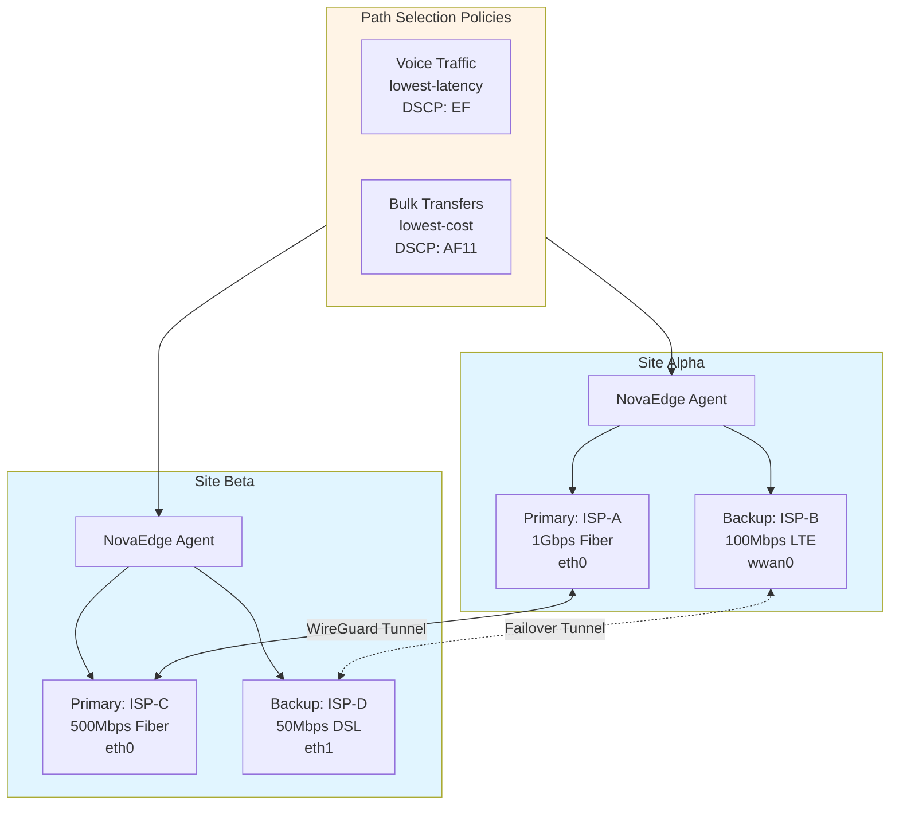
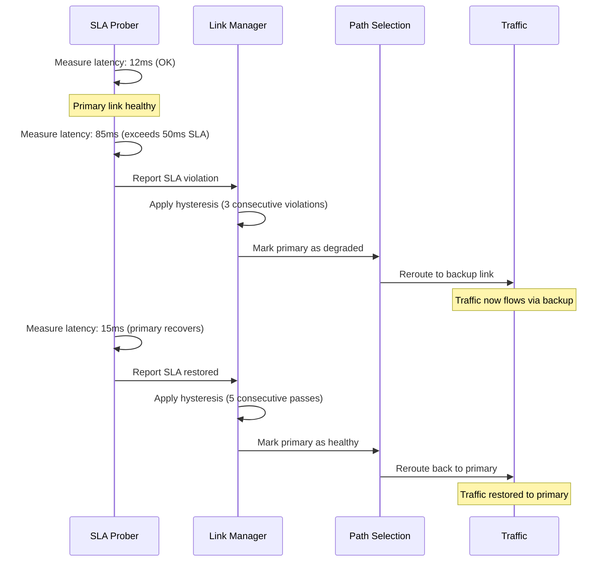

# Use Case: Multi-Site SD-WAN Deployment

This guide walks through a complete multi-site SD-WAN deployment using NovaEdge. Two sites are connected with dual WAN links each, application-aware path selection, and automatic failover.

## Architecture



## Prerequisites

- Two Kubernetes clusters (one per site) with NovaEdge deployed
- At least two WAN links per site (different ISPs recommended)
- Public IP addresses for WireGuard tunnel endpoints
- UDP port 51820 open between sites for WireGuard traffic

## Step 1: Define WAN Links for Site Alpha

Create `ProxyWANLink` resources for each WAN circuit at Site Alpha.

### Primary Fiber Link

```yaml
apiVersion: novaedge.io/v1alpha1
kind: ProxyWANLink
metadata:
  name: alpha-primary-fiber
  namespace: nova-system
spec:
  site: site-alpha
  interface: eth0
  provider: ISP-A
  bandwidth: "1Gbps"
  cost: 10
  role: primary
  sla:
    maxLatency: 50ms
    maxJitter: 10ms
    maxPacketLoss: 0.01
  tunnelEndpoint:
    publicIP: "203.0.113.1"
    port: 51820
```

### Backup LTE Link

```yaml
apiVersion: novaedge.io/v1alpha1
kind: ProxyWANLink
metadata:
  name: alpha-backup-lte
  namespace: nova-system
spec:
  site: site-alpha
  interface: wwan0
  provider: ISP-B
  bandwidth: "100Mbps"
  cost: 200
  role: backup
  sla:
    maxLatency: 100ms
    maxJitter: 30ms
    maxPacketLoss: 0.05
  tunnelEndpoint:
    publicIP: "198.51.100.1"
    port: 51821
```

## Step 2: Define WAN Links for Site Beta

### Primary Fiber Link

```yaml
apiVersion: novaedge.io/v1alpha1
kind: ProxyWANLink
metadata:
  name: beta-primary-fiber
  namespace: nova-system
spec:
  site: site-beta
  interface: eth0
  provider: ISP-C
  bandwidth: "500Mbps"
  cost: 15
  role: primary
  sla:
    maxLatency: 50ms
    maxJitter: 10ms
    maxPacketLoss: 0.01
  tunnelEndpoint:
    publicIP: "203.0.113.50"
    port: 51820
```

### Backup DSL Link

```yaml
apiVersion: novaedge.io/v1alpha1
kind: ProxyWANLink
metadata:
  name: beta-backup-dsl
  namespace: nova-system
spec:
  site: site-beta
  interface: eth1
  provider: ISP-D
  bandwidth: "50Mbps"
  cost: 300
  role: backup
  sla:
    maxLatency: 150ms
    maxJitter: 50ms
    maxPacketLoss: 0.10
  tunnelEndpoint:
    publicIP: "198.51.100.50"
    port: 51821
```

## Step 3: Define Path Selection Policies

### Voice Traffic -- Lowest Latency

Voice and real-time communication traffic is routed through the link with the lowest measured latency. DSCP marking `EF` (Expedited Forwarding) ensures QoS priority.

```yaml
apiVersion: novaedge.io/v1alpha1
kind: ProxyWANPolicy
metadata:
  name: voice-policy
  namespace: nova-system
spec:
  match:
    hosts:
      - "voice.example.com"
      - "sip.example.com"
    paths:
      - "/api/voice"
      - "/api/rtc"
    headers:
      X-Traffic-Class: voice
  pathSelection:
    strategy: lowest-latency
    failover: true
    dscpClass: EF
```

### Bulk Transfers -- Lowest Cost

Large file transfers and backup traffic use the cheapest available link. DSCP marking `AF11` gives this traffic lower priority.

```yaml
apiVersion: novaedge.io/v1alpha1
kind: ProxyWANPolicy
metadata:
  name: bulk-transfer-policy
  namespace: nova-system
spec:
  match:
    hosts:
      - "backup.example.com"
      - "storage.example.com"
    paths:
      - "/api/upload"
      - "/api/sync"
    headers:
      X-Traffic-Class: bulk
  pathSelection:
    strategy: lowest-cost
    failover: true
    dscpClass: AF11
```

## Step 4: Apply Configuration

```bash
# Apply WAN links
kubectl apply -f alpha-primary-fiber.yaml
kubectl apply -f alpha-backup-lte.yaml
kubectl apply -f beta-primary-fiber.yaml
kubectl apply -f beta-backup-dsl.yaml

# Apply policies
kubectl apply -f voice-policy.yaml
kubectl apply -f bulk-transfer-policy.yaml

# Verify link status
kubectl get proxywanlinks -n nova-system
```

Expected output:

```
NAME                   SITE         ROLE      PROVIDER   HEALTHY   AGE
alpha-primary-fiber    site-alpha   primary   ISP-A      true      1m
alpha-backup-lte       site-alpha   backup    ISP-B      true      1m
beta-primary-fiber     site-beta    primary   ISP-C      true      1m
beta-backup-dsl        site-beta    backup    ISP-D      true      1m
```

## Step 5: Verify with novactl

```bash
# Check SD-WAN status
novactl sdwan status

# View link quality metrics
novactl sdwan links -A

# View overlay topology
novactl sdwan topology
```

## How Failover Works

When a primary link degrades below its SLA thresholds, the SD-WAN engine automatically fails over:



The hysteresis mechanism prevents link flip-flop by requiring multiple consecutive measurements before changing link state. This avoids routing instability from transient network glitches.

## Monitoring

SD-WAN exposes Prometheus metrics for monitoring:

- `novaedge_sdwan_link_latency_ms` -- Current link latency per site/provider
- `novaedge_sdwan_link_jitter_ms` -- Current link jitter per site/provider
- `novaedge_sdwan_link_packet_loss_ratio` -- Current packet loss per site/provider
- `novaedge_sdwan_link_healthy` -- Link health status (1 = healthy, 0 = degraded)
- `novaedge_sdwan_path_selections_total` -- Path selection decisions per policy/strategy
- `novaedge_sdwan_failovers_total` -- Failover events per site/link

## See Also

- [SD-WAN User Guide](../user-guide/sdwan.md) -- Detailed SD-WAN configuration reference
- [ProxyWANLink Reference](../reference/proxywanlink.md) -- Full CRD specification
- [ProxyWANPolicy Reference](../reference/proxywanpolicy.md) -- Full CRD specification
- [CRD Reference](../reference/crd-reference.md) -- All NovaEdge CRDs
