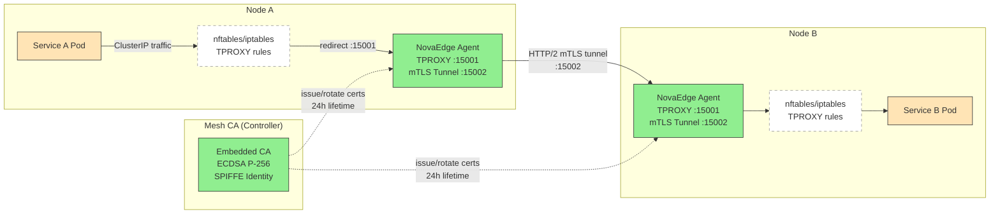

# Service Mesh

## Problem Statement

"I need to secure service-to-service communication with mTLS and enforce authorization policies, but I do not want the resource overhead and operational complexity of Istio or Linkerd sidecars."

Traditional service mesh solutions inject a sidecar proxy container into every pod. This doubles memory and CPU consumption per pod, complicates debugging, and introduces latency from the extra network hop. NovaEdge replaces sidecars with a transparent proxy (TPROXY) running on the node agent DaemonSet, so there is zero per-pod overhead.

---

## Architecture



### How It Works

1. **Traffic Interception** -- The NovaEdge agent on each node creates nftables NAT REDIRECT rules (table `novaedge_mesh`) or an iptables NAT chain (`NOVAEDGE_MESH`) to intercept outbound ClusterIP traffic from mesh-enabled pods and redirect it to the agent's transparent proxy listener on port 15001. The agent auto-selects nftables when available for atomic rule updates.

2. **mTLS Tunnel** -- The agent on the source node establishes an HTTP/2 mTLS tunnel (port 15002) to the agent on the destination node. Both endpoints authenticate using SPIFFE-format X.509 certificates.

3. **SPIFFE Identity** -- Every agent receives a SPIFFE identity in the format `spiffe://cluster.local/agent/<node-name>`. The embedded mesh CA in the controller issues ECDSA P-256 certificates with a 24-hour lifetime. Certificates are automatically renewed at 80% of their lifetime (roughly every 19 hours).

4. **Authorization Engine** -- The `MeshAuthorization` policy type lets you define which source identities (by namespace, service account, or SPIFFE ID) are allowed to reach which destinations (by HTTP method and path).

---

## Step 1: Enable Mesh on a Service

Add the `novaedge.io/mesh: "enabled"` annotation to your Service or Deployment. The NovaEdge agent will automatically set up TPROXY interception for pods backing this service.

```yaml
apiVersion: v1
kind: Service
metadata:
  name: backend-api
  namespace: production
  annotations:
    novaedge.io/mesh: "enabled"
spec:
  selector:
    app: backend-api
  ports:
    - name: http
      port: 8080
      targetPort: 8080
```

```yaml
apiVersion: apps/v1
kind: Deployment
metadata:
  name: backend-api
  namespace: production
  annotations:
    novaedge.io/mesh: "enabled"
spec:
  replicas: 3
  selector:
    matchLabels:
      app: backend-api
  template:
    metadata:
      labels:
        app: backend-api
      annotations:
        novaedge.io/mesh: "enabled"
    spec:
      containers:
        - name: backend-api
          image: myregistry/backend-api:v2.1.0
          ports:
            - containerPort: 8080
```

No sidecar injection occurs. The NovaEdge agent DaemonSet (already running on every node) detects the annotation and configures TPROXY rules for matching pods.

---

## Step 2: Verify TPROXY Interception

Once the annotation is applied, the agent creates TPROXY rules. You can verify this on any node where a mesh-enabled pod is scheduled:

```bash
# nftables backend (preferred): list the novaedge_mesh table
kubectl debug node/<node-name> -it --image=busybox -- \
  nsenter -t 1 -m -u -i -n -p -- nft list table ip novaedge_mesh

# iptables fallback: check the NOVAEDGE_MESH chain
kubectl debug node/<node-name> -it --image=busybox -- \
  nsenter -t 1 -m -u -i -n -p -- iptables -t nat -L NOVAEDGE_MESH -v -n
```

---

## Step 3: Verify Certificate Issuance

The controller's embedded mesh CA automatically issues SPIFFE certificates to every agent. Verify that certificates are active:

```bash
# Check agent logs for certificate issuance
kubectl logs -n novaedge-system daemonset/novaedge-agent | grep -i "mesh cert"
```

Expected log entries:

```
{"level":"info","msg":"mesh certificate issued","spiffe_id":"spiffe://cluster.local/agent/node-1","not_after":"2026-02-16T14:30:00Z","key_type":"ECDSA P-256"}
{"level":"info","msg":"mesh certificate renewal scheduled","renew_at":"2026-02-16T09:42:00Z"}
```

```bash
# Verify the SPIFFE identity on a specific agent
kubectl exec -n novaedge-system daemonset/novaedge-agent -- \
  novaedge-agent mesh status
```

---

## Step 4: Define Mesh Authorization Policies

Use the `MeshAuthorization` policy type to control which services can communicate.

### Allow Specific Namespaces

Allow only pods in the `frontend` namespace to reach the `backend-api` service:

```yaml
apiVersion: novaedge.io/v1alpha1
kind: ProxyPolicy
metadata:
  name: backend-api-allow-frontend
  namespace: production
spec:
  type: MeshAuthorization
  targetRef:
    kind: Service
    name: backend-api
  meshAuthorization:
    action: ALLOW
    rules:
      - from:
          - namespaces:
              - frontend
```

### Allow by Service Account

Allow only pods running under the `order-processor` service account to call the `payment-service`:

```yaml
apiVersion: novaedge.io/v1alpha1
kind: ProxyPolicy
metadata:
  name: payment-allow-orders
  namespace: production
spec:
  type: MeshAuthorization
  targetRef:
    kind: Service
    name: payment-service
  meshAuthorization:
    action: ALLOW
    rules:
      - from:
          - serviceAccounts:
              - order-processor
        to:
          - methods:
              - POST
            paths:
              - /api/v1/charges
              - /api/v1/refunds
```

### Deny by SPIFFE ID Pattern

Block a specific agent node from reaching a sensitive service:

```yaml
apiVersion: novaedge.io/v1alpha1
kind: ProxyPolicy
metadata:
  name: deny-untrusted-node
  namespace: production
spec:
  type: MeshAuthorization
  targetRef:
    kind: Service
    name: secrets-vault
  meshAuthorization:
    action: DENY
    rules:
      - from:
          - spiffeIds:
              - "spiffe://cluster.local/agent/untrusted-*"
```

### Combined Authorization: Namespace + Path Restriction

Allow the `monitoring` namespace to access only the `/healthz` and `/metrics` endpoints:

```yaml
apiVersion: novaedge.io/v1alpha1
kind: ProxyPolicy
metadata:
  name: backend-api-monitoring-readonly
  namespace: production
spec:
  type: MeshAuthorization
  targetRef:
    kind: Service
    name: backend-api
  meshAuthorization:
    action: ALLOW
    rules:
      - from:
          - namespaces:
              - monitoring
        to:
          - methods:
              - GET
            paths:
              - /healthz
              - /metrics
```

---

## Step 5: Verify Mesh Communication

### Check mTLS Tunnel Status

```bash
# List active mesh tunnels on an agent
kubectl exec -n novaedge-system daemonset/novaedge-agent -- \
  novaedge-agent mesh tunnels
```

### Verify End-to-End Connectivity

Deploy a test pod and confirm that traffic flows through the mesh:

```bash
# From a mesh-enabled pod, curl a mesh-enabled service
kubectl exec -n frontend deploy/web-frontend -- \
  curl -s -o /dev/null -w "%{http_code}" http://backend-api.production.svc.cluster.local:8080/healthz
```

Expected output: `200`

### Check Authorization Policy Enforcement

Attempt an unauthorized call and verify it is denied:

```bash
# From a non-allowed namespace, try to reach the backend
kubectl exec -n unauthorized-ns deploy/rogue-client -- \
  curl -s -o /dev/null -w "%{http_code}" http://backend-api.production.svc.cluster.local:8080/api
```

Expected output: `403`

### Inspect Mesh Metrics

```bash
# Check mesh-specific Prometheus metrics
kubectl exec -n novaedge-system daemonset/novaedge-agent -- \
  curl -s localhost:9090/metrics | grep novaedge_mesh
```

Key metrics:

| Metric | Description |
|--------|-------------|
| `novaedge_mesh_connections_active` | Active mTLS tunnel connections |
| `novaedge_mesh_requests_total` | Total mesh-intercepted requests |
| `novaedge_mesh_auth_denied_total` | Requests denied by MeshAuthorization |
| `novaedge_mesh_cert_expiry_seconds` | Seconds until mesh certificate expiry |
| `novaedge_mesh_cert_renewals_total` | Certificate renewal count |

---

## How NovaEdge Mesh Compares to Sidecars

| Aspect | Sidecar Mesh (Istio/Linkerd) | NovaEdge TPROXY Mesh |
|--------|------------------------------|----------------------|
| Per-pod overhead | ~50-100 MB RAM per sidecar | Zero (runs on DaemonSet) |
| Injection mechanism | Mutating webhook adds container | nftables/iptables NAT REDIRECT on node |
| Certificate management | Per-pod identity certs | Per-node SPIFFE certs |
| Network hops | Pod -> Sidecar -> Network -> Sidecar -> Pod | Pod -> Agent (TPROXY) -> Agent -> Pod |
| Deployment complexity | CRDs + webhook + control plane | Already part of NovaEdge agent |
| mTLS protocol | HTTP/2 (Envoy) | HTTP/2 mTLS tunnel (:15002) |

---

## Related Documentation

- [ProxyPolicy CRD Reference](../reference/crd-reference.md) -- Full specification for all policy types including MeshAuthorization
- [Architecture Overview](../architecture/overview.md) -- How the controller and agent components interact
- [Installation Guide](../installation/kubernetes.md) -- Deploying the NovaEdge agent DaemonSet
- [WAF & Security Stack](waf-security.md) -- Complementary security policies for north-south traffic
