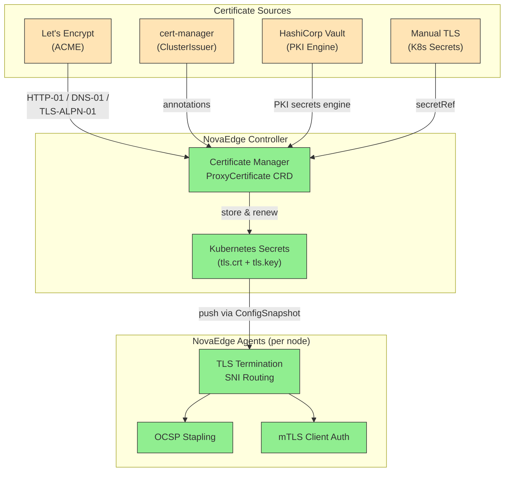

# TLS & Certificate Management

## Problem Statement

"I need to manage TLS certificates for my Kubernetes services without installing cert-manager, or I want to consolidate multiple certificate sources (ACME, Vault, manual) under a single, unified API."

NovaEdge provides built-in certificate lifecycle management through the `ProxyCertificate` CRD. It supports four certificate sources -- ACME (Let's Encrypt), cert-manager integration, HashiCorp Vault PKI, and manual TLS secrets -- all with automatic renewal, OCSP stapling, and mTLS client verification.

---

## Architecture



---

## Source 1: Built-in ACME (Let's Encrypt)

NovaEdge includes a native ACME client that supports HTTP-01, DNS-01, and TLS-ALPN-01 challenge types. No external controller is needed.

### HTTP-01 Challenge

The simplest approach. NovaEdge automatically responds to HTTP-01 challenges on port 80.

```yaml
apiVersion: novaedge.io/v1alpha1
kind: ProxyCertificate
metadata:
  name: app-example-com
  namespace: production
spec:
  domains:
    - app.example.com
    - www.example.com
  issuer:
    type: acme
    acme:
      email: admin@example.com
      challengeType: http-01
      server: "https://acme-v02.api.letsencrypt.org/directory"
      acceptTOS: true
  keyType: EC256
  renewBefore: "720h"
  secretName: app-example-com-tls
```

### DNS-01 Challenge (Cloudflare)

Required for wildcard certificates. NovaEdge supports Cloudflare, Route53, and Google DNS providers.

```yaml
apiVersion: novaedge.io/v1alpha1
kind: ProxyCertificate
metadata:
  name: wildcard-example-com
  namespace: production
spec:
  domains:
    - "*.example.com"
    - example.com
  issuer:
    type: acme
    acme:
      email: admin@example.com
      challengeType: dns-01
      dns01:
        provider: cloudflare
        credentialsRef:
          name: cloudflare-api-token
        propagationTimeout: "120s"
        pollingInterval: "5s"
  keyType: EC256
  renewBefore: "720h"
  secretName: wildcard-example-com-tls
---
# Create the Cloudflare API token secret first
apiVersion: v1
kind: Secret
metadata:
  name: cloudflare-api-token
  namespace: production
type: Opaque
stringData:
  CF_API_TOKEN: "<your-cloudflare-api-token>"
```

### DNS-01 Challenge (Route53)

```yaml
apiVersion: novaedge.io/v1alpha1
kind: ProxyCertificate
metadata:
  name: wildcard-example-com-aws
  namespace: production
spec:
  domains:
    - "*.example.com"
  issuer:
    type: acme
    acme:
      email: admin@example.com
      challengeType: dns-01
      dns01:
        provider: route53
        credentialsRef:
          name: aws-route53-credentials
        propagationTimeout: "180s"
  keyType: EC256
  secretName: wildcard-example-com-tls
---
apiVersion: v1
kind: Secret
metadata:
  name: aws-route53-credentials
  namespace: production
type: Opaque
stringData:
  AWS_ACCESS_KEY_ID: "<your-access-key>"
  AWS_SECRET_ACCESS_KEY: "<your-secret-key>"
  AWS_REGION: "us-east-1"
  AWS_HOSTED_ZONE_ID: "Z1234567890ABC"
```

### DNS-01 Challenge (Google Cloud DNS)

```yaml
apiVersion: novaedge.io/v1alpha1
kind: ProxyCertificate
metadata:
  name: wildcard-example-com-gcp
  namespace: production
spec:
  domains:
    - "*.example.com"
  issuer:
    type: acme
    acme:
      email: admin@example.com
      challengeType: dns-01
      dns01:
        provider: googledns
        credentialsRef:
          name: gcp-dns-credentials
  keyType: EC256
  secretName: wildcard-example-com-tls
---
apiVersion: v1
kind: Secret
metadata:
  name: gcp-dns-credentials
  namespace: production
type: Opaque
stringData:
  GCE_PROJECT: "my-gcp-project"
  GCE_SERVICE_ACCOUNT_FILE: |
    {
      "type": "service_account",
      "project_id": "my-gcp-project",
      ...
    }
```

### TLS-ALPN-01 Challenge

Useful when port 80 is not available. The challenge runs over TLS on port 443.

```yaml
apiVersion: novaedge.io/v1alpha1
kind: ProxyCertificate
metadata:
  name: app-example-com-alpn
  namespace: production
spec:
  domains:
    - app.example.com
  issuer:
    type: acme
    acme:
      email: admin@example.com
      challengeType: tls-alpn-01
      tlsAlpn01:
        port: 443
  keyType: EC256
  secretName: app-example-com-tls
```

### Let's Encrypt Staging (Testing)

Always test with the staging server before using production to avoid rate limits:

```yaml
apiVersion: novaedge.io/v1alpha1
kind: ProxyCertificate
metadata:
  name: app-example-com-staging
  namespace: production
spec:
  domains:
    - app.example.com
  issuer:
    type: acme
    acme:
      email: admin@example.com
      challengeType: http-01
      server: "https://acme-staging-v02.api.letsencrypt.org/directory"
  keyType: EC256
  secretName: app-example-com-tls-staging
```

---

## Source 2: cert-manager Integration

If you already run cert-manager, NovaEdge can consume its issuers through annotations on the `ProxyGateway` or through a dedicated `ProxyCertificate` referencing a cert-manager Issuer.

### Via ProxyCertificate CRD

```yaml
apiVersion: novaedge.io/v1alpha1
kind: ProxyCertificate
metadata:
  name: app-certmanager
  namespace: production
spec:
  domains:
    - app.example.com
    - api.example.com
  issuer:
    type: cert-manager
    certManager:
      issuerRef:
        name: letsencrypt-prod
        kind: ClusterIssuer
  keyType: EC256
  secretName: app-certmanager-tls
```

### Via ProxyGateway Annotations

Add cert-manager annotations directly to your `ProxyGateway`. The controller detects these and creates cert-manager Certificate resources automatically:

```yaml
apiVersion: novaedge.io/v1alpha1
kind: ProxyGateway
metadata:
  name: main-gateway
  namespace: production
  annotations:
    cert-manager.io/cluster-issuer: "letsencrypt-prod"
spec:
  vipRef: main-vip
  listeners:
    - name: https
      port: 443
      protocol: HTTPS
      hostnames:
        - app.example.com
      tls:
        secretRef:
          name: app-certmanager-tls
          namespace: production
        minVersion: "TLS1.2"
```

---

## Source 3: HashiCorp Vault PKI

NovaEdge integrates with Vault's PKI secrets engine for enterprise certificate management.

### Using ProxyCertificate with Vault PKI

```yaml
apiVersion: novaedge.io/v1alpha1
kind: ProxyCertificate
metadata:
  name: app-vault-cert
  namespace: production
spec:
  domains:
    - app.example.com
    - api.example.com
  issuer:
    type: vault-pki
    vaultPKI:
      path: pki-int
      role: novaedge-issuer
      ttl: "720h"
  keyType: EC256
  secretName: app-vault-tls
```

### Using Inline Vault Reference on ProxyGateway

For tighter integration, reference Vault directly in the gateway listener:

```yaml
apiVersion: novaedge.io/v1alpha1
kind: ProxyGateway
metadata:
  name: vault-gateway
  namespace: production
spec:
  vipRef: main-vip
  listeners:
    - name: https
      port: 443
      protocol: HTTPS
      hostnames:
        - app.example.com
      tls:
        vaultCertRef:
          path: pki-int
          role: novaedge-issuer
          ttl: "720h"
          cacheSecretName: app-vault-cached-tls
        minVersion: "TLS1.3"
```

The controller requests a certificate from Vault, caches it in the Kubernetes Secret specified by `cacheSecretName`, and renews it before expiry.

### Vault Configuration Prerequisites

Ensure your Vault PKI secrets engine is configured:

```bash
# Enable PKI secrets engine
vault secrets enable -path=pki-int pki

# Configure the role
vault write pki-int/roles/novaedge-issuer \
  allowed_domains="example.com" \
  allow_subdomains=true \
  max_ttl="8760h" \
  key_type="ec" \
  key_bits=256

# Grant the NovaEdge controller service account access
vault policy write novaedge-pki - <<EOF
path "pki-int/issue/novaedge-issuer" {
  capabilities = ["create", "update"]
}
path "pki-int/sign/novaedge-issuer" {
  capabilities = ["create", "update"]
}
EOF
```

---

## Source 4: Manual TLS Secrets

For certificates managed externally (purchased from a CA, generated by your own PKI, etc.), point to an existing Kubernetes TLS Secret.

```yaml
apiVersion: novaedge.io/v1alpha1
kind: ProxyCertificate
metadata:
  name: app-manual-cert
  namespace: production
spec:
  domains:
    - app.example.com
  issuer:
    type: manual
    manual:
      secretRef:
        name: app-manual-tls
        namespace: production
  secretName: app-manual-tls
---
# Create the TLS secret from your certificate files
apiVersion: v1
kind: Secret
metadata:
  name: app-manual-tls
  namespace: production
type: kubernetes.io/tls
data:
  tls.crt: <base64-encoded-certificate-chain>
  tls.key: <base64-encoded-private-key>
```

Or create it with kubectl:

```bash
kubectl create secret tls app-manual-tls \
  --namespace production \
  --cert=./fullchain.pem \
  --key=./privkey.pem
```

---

## Configuring HTTPS Listeners with Certificates

Regardless of the certificate source, the `ProxyGateway` references the resulting TLS Secret:

```yaml
apiVersion: novaedge.io/v1alpha1
kind: ProxyVIP
metadata:
  name: web-vip
spec:
  address: "10.0.100.50/32"
  mode: L2ARP
  ports:
    - 80
    - 443
---
apiVersion: novaedge.io/v1alpha1
kind: ProxyGateway
metadata:
  name: web-gateway
  namespace: production
spec:
  vipRef: web-vip
  listeners:
    - name: http
      port: 80
      protocol: HTTP
      sslRedirect: true
    - name: https
      port: 443
      protocol: HTTPS
      hostnames:
        - app.example.com
        - api.example.com
      tls:
        certificateRef:
          name: app-example-com
          kind: ProxyCertificate
        minVersion: "TLS1.2"
      ocspStapling: true
  redirectScheme:
    enabled: true
    scheme: https
    statusCode: 301
```

### SNI Support with Multiple Certificates

Serve different certificates per hostname on the same listener:

```yaml
apiVersion: novaedge.io/v1alpha1
kind: ProxyGateway
metadata:
  name: multi-domain-gateway
  namespace: production
spec:
  vipRef: web-vip
  listeners:
    - name: https
      port: 443
      protocol: HTTPS
      tlsCertificates:
        "app.example.com":
          secretRef:
            name: app-example-com-tls
            namespace: production
          minVersion: "TLS1.3"
        "api.partner.io":
          secretRef:
            name: api-partner-io-tls
            namespace: production
          minVersion: "TLS1.2"
        "*.internal.corp":
          secretRef:
            name: wildcard-internal-tls
            namespace: production
      ocspStapling: true
```

---

## mTLS: Client Certificate Verification

Require clients to present a valid certificate signed by a trusted CA. This is useful for API-to-API communication, IoT device authentication, or zero-trust architectures.

```yaml
apiVersion: novaedge.io/v1alpha1
kind: ProxyGateway
metadata:
  name: mtls-gateway
  namespace: production
spec:
  vipRef: web-vip
  listeners:
    - name: https-mtls
      port: 443
      protocol: HTTPS
      hostnames:
        - api.example.com
      tls:
        secretRef:
          name: api-server-tls
          namespace: production
        minVersion: "TLS1.3"
      clientAuth:
        mode: require
        caCertRef:
          name: client-ca-bundle
          namespace: production
        requiredCNPatterns:
          - "^service-.*\\.example\\.com$"
        requiredSANs:
          - "*.api-clients.example.com"
      ocspStapling: true
---
# CA bundle for verifying client certificates
apiVersion: v1
kind: Secret
metadata:
  name: client-ca-bundle
  namespace: production
type: Opaque
data:
  ca.crt: <base64-encoded-ca-certificate>
```

### Optional mTLS (Passthrough if No Client Cert)

For endpoints that should work with or without client certificates:

```yaml
apiVersion: novaedge.io/v1alpha1
kind: ProxyGateway
metadata:
  name: optional-mtls-gateway
  namespace: production
spec:
  vipRef: web-vip
  listeners:
    - name: https
      port: 443
      protocol: HTTPS
      hostnames:
        - portal.example.com
      tls:
        secretRef:
          name: portal-tls
          namespace: production
        minVersion: "TLS1.2"
      clientAuth:
        mode: optional
        caCertRef:
          name: client-ca-bundle
          namespace: production
```

---

## OCSP Stapling

OCSP stapling improves TLS handshake performance by embedding the certificate revocation status directly in the TLS handshake, avoiding the client needing to contact the CA's OCSP responder.

Enable it per-listener:

```yaml
listeners:
  - name: https
    port: 443
    protocol: HTTPS
    tls:
      secretRef:
        name: app-tls
        namespace: production
    ocspStapling: true
```

For maximum security, request the OCSP Must-Staple extension in the certificate itself:

```yaml
apiVersion: novaedge.io/v1alpha1
kind: ProxyCertificate
metadata:
  name: app-must-staple
  namespace: production
spec:
  domains:
    - app.example.com
  issuer:
    type: acme
    acme:
      email: admin@example.com
      challengeType: http-01
  keyType: EC256
  mustStaple: true
  secretName: app-must-staple-tls
```

---

## Verification Steps

### Check Certificate Status

```bash
# List all ProxyCertificate resources
kubectl get proxycertificates -n production

# Expected output:
# NAME                    DOMAINS            ISSUER       STATE   EXPIRES                AGE
# app-example-com         app.example.com    acme         Ready   2026-05-16T00:00:00Z   1d
# wildcard-example-com    *.example.com      acme         Ready   2026-05-16T00:00:00Z   1d
# app-vault-cert          app.example.com    vault-pki    Ready   2026-03-17T00:00:00Z   1d
```

```bash
# Inspect a specific certificate's full status
kubectl describe proxycertificate app-example-com -n production
```

### Verify the TLS Secret Was Created

```bash
kubectl get secret app-example-com-tls -n production -o jsonpath='{.type}'
# Expected: kubernetes.io/tls
```

### Test TLS Termination

```bash
# Verify the certificate served by the gateway
openssl s_client -connect 10.0.100.50:443 -servername app.example.com < /dev/null 2>/dev/null | \
  openssl x509 -noout -subject -issuer -dates
```

### Verify OCSP Stapling

```bash
openssl s_client -connect 10.0.100.50:443 -servername app.example.com -status < /dev/null 2>&1 | \
  grep -A 5 "OCSP Response"
```

Expected output includes `OCSP Response Status: successful`.

### Monitor Certificate Metrics

```bash
kubectl exec -n novaedge-system daemonset/novaedge-agent -- \
  curl -s localhost:9090/metrics | grep novaedge_certificate
```

Key metrics:

| Metric | Description |
|--------|-------------|
| `novaedge_certificate_expiry_seconds` | Seconds until certificate expires |
| `novaedge_certificate_renewals_total` | Number of successful renewals |
| `novaedge_acme_challenges_total` | ACME challenge attempts by type |
| `novaedge_certificate_errors_total` | Certificate-related errors |

---

## Related Documentation

- [ProxyCertificate CRD Reference](../reference/crd-reference.md) -- Full specification for certificate management
- [ProxyGateway CRD Reference](../reference/crd-reference.md) -- Listener and TLS configuration details
- [WAF & Security Stack](waf-security.md) -- Applying security policies to your TLS endpoints
- [Installation Guide](../installation/kubernetes.md) -- Setting up Vault connectivity and DNS provider access
