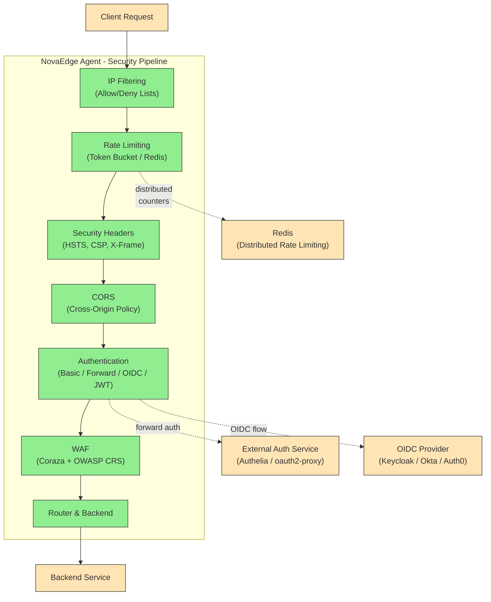

# WAF & Security Stack

## Problem Statement

"I need to protect my web applications with a WAF, enforce authentication, apply rate limiting, and set security headers -- but I do not want to deploy and maintain separate ModSecurity, oauth2-proxy, and rate limiter services."

NovaEdge provides a complete, built-in security stack. Every component runs inside the NovaEdge agent, configured entirely through `ProxyPolicy` CRDs. There is no additional infrastructure to deploy.

---

## Architecture



The security pipeline processes policies in a fixed, defense-in-depth order:

1. **IP Filtering** -- Drop blocked sources immediately
2. **Rate Limiting** -- Prevent abuse before expensive processing
3. **Security Headers** -- Set response headers early
4. **CORS** -- Handle preflight before authentication
5. **Authentication** -- Verify the caller's identity
6. **WAF** -- Inspect request payload for attacks
7. **Routing** -- Forward clean traffic to the backend

---

## Setting Up the Route

All policies reference a `ProxyRoute` (or `ProxyGateway`) by name. Here is the baseline route used throughout this guide:

```yaml
apiVersion: novaedge.io/v1alpha1
kind: ProxyVIP
metadata:
  name: web-vip
spec:
  address: "10.0.100.50/32"
  mode: L2ARP
  ports:
    - 80
    - 443
---
apiVersion: novaedge.io/v1alpha1
kind: ProxyGateway
metadata:
  name: web-gateway
  namespace: production
spec:
  vipRef: web-vip
  listeners:
    - name: https
      port: 443
      protocol: HTTPS
      hostnames:
        - app.example.com
      tls:
        secretRef:
          name: app-tls
          namespace: production
        minVersion: "TLS1.2"
      ocspStapling: true
    - name: http
      port: 80
      protocol: HTTP
      sslRedirect: true
  redirectScheme:
    enabled: true
    scheme: https
    statusCode: 301
---
apiVersion: novaedge.io/v1alpha1
kind: ProxyRoute
metadata:
  name: app-route
  namespace: production
spec:
  hostnames:
    - app.example.com
  rules:
    - matches:
        - path:
            type: PathPrefix
            value: /
      backendRefs:
        - name: app-backend
---
apiVersion: novaedge.io/v1alpha1
kind: ProxyBackend
metadata:
  name: app-backend
  namespace: production
spec:
  serviceRef:
    name: app-service
    port: 8080
  lbPolicy: P2C
  healthCheck:
    interval: "10s"
    timeout: "5s"
    httpPath: "/healthz"
    healthyThreshold: 2
    unhealthyThreshold: 3
```

---

## WAF (Web Application Firewall)

NovaEdge embeds the Coraza WAF engine with the OWASP Core Rule Set (CRS). No separate WAF deployment is needed.

### Prevention Mode (Block Attacks)

```yaml
apiVersion: novaedge.io/v1alpha1
kind: ProxyPolicy
metadata:
  name: waf-protection
  namespace: production
spec:
  type: WAF
  targetRef:
    kind: ProxyRoute
    name: app-route
  waf:
    enabled: true
    mode: prevention
    paranoiaLevel: 2
    anomalyThreshold: 5
```

### Detection Mode (Log Only)

Use detection mode during initial rollout to observe what would be blocked without affecting traffic:

```yaml
apiVersion: novaedge.io/v1alpha1
kind: ProxyPolicy
metadata:
  name: waf-detection
  namespace: production
spec:
  type: WAF
  targetRef:
    kind: ProxyRoute
    name: app-route
  waf:
    enabled: true
    mode: detection
    paranoiaLevel: 2
    anomalyThreshold: 5
```

### Custom Rules and Exclusions

Exclude specific rule IDs that cause false positives for your application, and load custom rules from a ConfigMap:

```yaml
apiVersion: novaedge.io/v1alpha1
kind: ProxyPolicy
metadata:
  name: waf-custom
  namespace: production
spec:
  type: WAF
  targetRef:
    kind: ProxyRoute
    name: app-route
  waf:
    enabled: true
    mode: prevention
    paranoiaLevel: 2
    anomalyThreshold: 5
    ruleExclusions:
      - "920350"
      - "942100"
    rulesConfigMap:
      name: custom-waf-rules
---
apiVersion: v1
kind: ConfigMap
metadata:
  name: custom-waf-rules
  namespace: production
data:
  custom-rules.conf: |
    # Block requests with specific user agents
    SecRule REQUEST_HEADERS:User-Agent "@contains BadBot" \
      "id:100001,phase:1,deny,status:403,msg:'Blocked bot'"
```

### Paranoia Level Reference

| Level | Description | Recommended For |
|-------|-------------|-----------------|
| 1 | Base rules, minimal false positives | General-purpose applications |
| 2 | Additional rules for common attacks | Web applications with forms |
| 3 | More rules, stricter matching | Financial and healthcare apps |
| 4 | Maximum protection, highest false positive rate | High-security environments |

---

## Authentication

### Basic Auth

Protect routes with username/password authentication using htpasswd-formatted credentials.

```yaml
apiVersion: novaedge.io/v1alpha1
kind: ProxyPolicy
metadata:
  name: basic-auth
  namespace: production
spec:
  type: BasicAuth
  targetRef:
    kind: ProxyRoute
    name: app-route
  basicAuth:
    realm: "Production Admin"
    secretRef:
      name: htpasswd-credentials
    stripAuth: true
---
apiVersion: v1
kind: Secret
metadata:
  name: htpasswd-credentials
  namespace: production
type: Opaque
stringData:
  htpasswd: |
    admin:$2y$10$abcdefghijklmnopqrstuuFHKJlmnOPQRSTUVWXYZabcde1234
    readonly:$2y$10$zyxwvutsrqponmlkjihgfedcbaZYXWVUTSRQPONMLKJIHGF
```

Generate htpasswd entries:

```bash
htpasswd -nbBC 10 admin 'your-secure-password'
```

### Forward Auth (Authelia / oauth2-proxy)

Delegate authentication decisions to an external service. The agent sends a subrequest to the auth service; if it returns 2xx, the original request proceeds.

```yaml
apiVersion: novaedge.io/v1alpha1
kind: ProxyPolicy
metadata:
  name: forward-auth-authelia
  namespace: production
spec:
  type: ForwardAuth
  targetRef:
    kind: ProxyRoute
    name: app-route
  forwardAuth:
    address: "http://authelia.auth-system.svc.cluster.local:9091/api/verify?rd=https://auth.example.com"
    authHeaders:
      - Authorization
      - Cookie
      - X-Forwarded-For
      - X-Forwarded-Proto
      - X-Forwarded-Host
    responseHeaders:
      - Remote-User
      - Remote-Groups
      - Remote-Email
    timeout: "5s"
    cacheTTL: "5m"
```

### OIDC / OAuth2 (Generic Provider)

NovaEdge handles the full OAuth2/OIDC flow (redirect to IdP, token exchange, session management) without an external oauth2-proxy.

```yaml
apiVersion: novaedge.io/v1alpha1
kind: ProxyPolicy
metadata:
  name: oidc-auth
  namespace: production
spec:
  type: OIDC
  targetRef:
    kind: ProxyRoute
    name: app-route
  oidc:
    provider: generic
    issuerURL: "https://accounts.google.com"
    clientID: "your-client-id.apps.googleusercontent.com"
    clientSecretRef:
      name: google-oidc-secret
    redirectURL: "https://app.example.com/oauth2/callback"
    scopes:
      - openid
      - profile
      - email
    sessionSecretRef:
      name: oidc-session-secret
    forwardHeaders:
      - X-Auth-User
      - X-Auth-Email
---
apiVersion: v1
kind: Secret
metadata:
  name: google-oidc-secret
  namespace: production
type: Opaque
stringData:
  client-secret: "<your-google-client-secret>"
---
apiVersion: v1
kind: Secret
metadata:
  name: oidc-session-secret
  namespace: production
type: Opaque
stringData:
  session-secret: "a-32-byte-random-secret-key-here"
```

### OIDC with Keycloak (Role-Based Access)

```yaml
apiVersion: novaedge.io/v1alpha1
kind: ProxyPolicy
metadata:
  name: keycloak-auth
  namespace: production
spec:
  type: OIDC
  targetRef:
    kind: ProxyRoute
    name: app-route
  oidc:
    provider: keycloak
    clientID: "novaedge-app"
    clientSecretRef:
      name: keycloak-client-secret
    redirectURL: "https://app.example.com/oauth2/callback"
    scopes:
      - openid
      - profile
      - email
      - roles
    sessionSecretRef:
      name: oidc-session-secret
    keycloak:
      serverURL: "https://keycloak.example.com"
      realm: "production"
      roleClaim: "realm_access.roles"
      groupClaim: "groups"
    authorization:
      requiredRoles:
        - app-user
        - admin
      mode: any
---
apiVersion: v1
kind: Secret
metadata:
  name: keycloak-client-secret
  namespace: production
type: Opaque
stringData:
  client-secret: "<your-keycloak-client-secret>"
```

### JWT Validation (API Authentication)

Validate JWTs from an external identity provider using JWKS for key rotation:

```yaml
apiVersion: novaedge.io/v1alpha1
kind: ProxyPolicy
metadata:
  name: jwt-auth
  namespace: production
spec:
  type: JWT
  targetRef:
    kind: ProxyRoute
    name: app-route
  jwt:
    issuer: "https://accounts.google.com"
    audience:
      - "your-client-id.apps.googleusercontent.com"
    jwksUri: "https://www.googleapis.com/oauth2/v3/certs"
    headerName: Authorization
    headerPrefix: "Bearer "
    allowedAlgorithms:
      - RS256
      - ES256
```

---

## Rate Limiting

### Local Rate Limiting (Single Node)

Token bucket rate limiting per source IP, processed locally on each agent:

```yaml
apiVersion: novaedge.io/v1alpha1
kind: ProxyPolicy
metadata:
  name: rate-limit-local
  namespace: production
spec:
  type: RateLimit
  targetRef:
    kind: ProxyRoute
    name: app-route
  rateLimit:
    requestsPerSecond: 100
    burst: 200
    key: source-ip
```

### Distributed Rate Limiting (Redis)

Enforce a global rate limit across all agent nodes using Redis for shared state:

```yaml
apiVersion: novaedge.io/v1alpha1
kind: ProxyPolicy
metadata:
  name: rate-limit-distributed
  namespace: production
spec:
  type: DistributedRateLimit
  targetRef:
    kind: ProxyRoute
    name: app-route
  distributedRateLimit:
    requestsPerSecond: 1000
    burst: 2000
    algorithm: sliding-window
    key: source-ip
    redisRef:
      address: "redis.redis-system.svc.cluster.local:6379"
      password:
        name: redis-credentials
        key: password
      tls: false
      database: 0
---
apiVersion: v1
kind: Secret
metadata:
  name: redis-credentials
  namespace: production
type: Opaque
stringData:
  password: "<your-redis-password>"
```

---

## IP Filtering

### Allow List (Restrict to Known IPs)

```yaml
apiVersion: novaedge.io/v1alpha1
kind: ProxyPolicy
metadata:
  name: ip-allow-list
  namespace: production
spec:
  type: IPAllowList
  targetRef:
    kind: ProxyRoute
    name: app-route
  ipList:
    cidrs:
      - "10.0.0.0/8"
      - "172.16.0.0/12"
      - "203.0.113.0/24"
    sourceHeader: "X-Forwarded-For"
```

### Deny List (Block Known Bad Actors)

```yaml
apiVersion: novaedge.io/v1alpha1
kind: ProxyPolicy
metadata:
  name: ip-deny-list
  namespace: production
spec:
  type: IPDenyList
  targetRef:
    kind: ProxyRoute
    name: app-route
  ipList:
    cidrs:
      - "198.51.100.0/24"
      - "192.0.2.50/32"
```

---

## Security Headers

```yaml
apiVersion: novaedge.io/v1alpha1
kind: ProxyPolicy
metadata:
  name: security-headers
  namespace: production
spec:
  type: SecurityHeaders
  targetRef:
    kind: ProxyRoute
    name: app-route
  securityHeaders:
    hsts:
      enabled: true
      maxAge: 31536000
      includeSubDomains: true
      preload: true
    contentSecurityPolicy: "default-src 'self'; script-src 'self' 'unsafe-inline'; style-src 'self' 'unsafe-inline'; img-src 'self' data: https:; font-src 'self' https://fonts.gstatic.com"
    xFrameOptions: DENY
    xContentTypeOptions: true
    xXssProtection: "1; mode=block"
    referrerPolicy: strict-origin-when-cross-origin
    permissionsPolicy: "camera=(), microphone=(), geolocation=(self), payment=()"
    crossOriginEmbedderPolicy: require-corp
    crossOriginOpenerPolicy: same-origin
    crossOriginResourcePolicy: same-origin
```

---

## CORS

```yaml
apiVersion: novaedge.io/v1alpha1
kind: ProxyPolicy
metadata:
  name: cors-policy
  namespace: production
spec:
  type: CORS
  targetRef:
    kind: ProxyRoute
    name: app-route
  cors:
    allowOrigins:
      - "https://app.example.com"
      - "https://admin.example.com"
    allowMethods:
      - GET
      - POST
      - PUT
      - DELETE
      - OPTIONS
    allowHeaders:
      - Authorization
      - Content-Type
      - X-Request-ID
    exposeHeaders:
      - X-Request-ID
      - X-RateLimit-Remaining
    maxAge: "86400s"
    allowCredentials: true
```

---

## Full Defense-in-Depth Configuration

The following combines all security policies on a single route. Each `ProxyPolicy` targets the same `ProxyRoute`. The agent evaluates them in the pipeline order shown in the architecture diagram.

```yaml
# 1. IP Deny List - Block known bad actors first
apiVersion: novaedge.io/v1alpha1
kind: ProxyPolicy
metadata:
  name: app-ip-deny
  namespace: production
spec:
  type: IPDenyList
  targetRef:
    kind: ProxyRoute
    name: app-route
  ipList:
    cidrs:
      - "198.51.100.0/24"
---
# 2. Distributed Rate Limiting - Prevent abuse
apiVersion: novaedge.io/v1alpha1
kind: ProxyPolicy
metadata:
  name: app-rate-limit
  namespace: production
spec:
  type: DistributedRateLimit
  targetRef:
    kind: ProxyRoute
    name: app-route
  distributedRateLimit:
    requestsPerSecond: 500
    burst: 1000
    algorithm: sliding-window
    key: source-ip
    redisRef:
      address: "redis.redis-system.svc.cluster.local:6379"
      password:
        name: redis-credentials
        key: password
---
# 3. Security Headers - Harden responses
apiVersion: novaedge.io/v1alpha1
kind: ProxyPolicy
metadata:
  name: app-sec-headers
  namespace: production
spec:
  type: SecurityHeaders
  targetRef:
    kind: ProxyRoute
    name: app-route
  securityHeaders:
    hsts:
      enabled: true
      maxAge: 31536000
      includeSubDomains: true
      preload: true
    xFrameOptions: DENY
    xContentTypeOptions: true
    referrerPolicy: strict-origin-when-cross-origin
    contentSecurityPolicy: "default-src 'self'"
---
# 4. CORS - Handle cross-origin preflight
apiVersion: novaedge.io/v1alpha1
kind: ProxyPolicy
metadata:
  name: app-cors
  namespace: production
spec:
  type: CORS
  targetRef:
    kind: ProxyRoute
    name: app-route
  cors:
    allowOrigins:
      - "https://app.example.com"
    allowMethods:
      - GET
      - POST
      - PUT
      - DELETE
      - OPTIONS
    allowHeaders:
      - Authorization
      - Content-Type
    allowCredentials: true
---
# 5. OIDC Authentication - Verify identity
apiVersion: novaedge.io/v1alpha1
kind: ProxyPolicy
metadata:
  name: app-oidc
  namespace: production
spec:
  type: OIDC
  targetRef:
    kind: ProxyRoute
    name: app-route
  oidc:
    provider: keycloak
    clientID: "novaedge-app"
    clientSecretRef:
      name: keycloak-client-secret
    redirectURL: "https://app.example.com/oauth2/callback"
    scopes:
      - openid
      - profile
      - email
    sessionSecretRef:
      name: oidc-session-secret
    keycloak:
      serverURL: "https://keycloak.example.com"
      realm: "production"
    authorization:
      requiredRoles:
        - app-user
      mode: any
---
# 6. WAF - Inspect request payload for attacks
apiVersion: novaedge.io/v1alpha1
kind: ProxyPolicy
metadata:
  name: app-waf
  namespace: production
spec:
  type: WAF
  targetRef:
    kind: ProxyRoute
    name: app-route
  waf:
    enabled: true
    mode: prevention
    paranoiaLevel: 2
    anomalyThreshold: 5
```

---

## Verification Steps

### List All Policies for a Route

```bash
kubectl get proxypolicies -n production

# Expected output:
# NAME               TYPE                   TARGET KIND   TARGET NAME   AGE
# app-ip-deny        IPDenyList             ProxyRoute    app-route     1m
# app-rate-limit     DistributedRateLimit   ProxyRoute    app-route     1m
# app-sec-headers    SecurityHeaders        ProxyRoute    app-route     1m
# app-cors           CORS                   ProxyRoute    app-route     1m
# app-oidc           OIDC                   ProxyRoute    app-route     1m
# app-waf            WAF                    ProxyRoute    app-route     1m
```

### Test WAF Blocking

```bash
# Send a SQL injection attempt
curl -k -s -o /dev/null -w "%{http_code}" \
  "https://app.example.com/search?q=1%27%20OR%201%3D1%20--%20"

# Expected: 403
```

```bash
# Send an XSS attempt
curl -k -s -o /dev/null -w "%{http_code}" \
  -H "Content-Type: application/x-www-form-urlencoded" \
  -d "name=<script>alert(1)</script>" \
  "https://app.example.com/submit"

# Expected: 403
```

### Test Rate Limiting

```bash
# Send a burst of requests and check for 429 responses
for i in $(seq 1 600); do
  STATUS=$(curl -k -s -o /dev/null -w "%{http_code}" https://app.example.com/healthz)
  if [ "$STATUS" = "429" ]; then
    echo "Rate limited at request $i"
    break
  fi
done
```

### Verify Security Headers

```bash
curl -k -s -D - -o /dev/null https://app.example.com/ | grep -iE "strict-transport|x-frame|x-content-type|content-security"

# Expected:
# Strict-Transport-Security: max-age=31536000; includeSubDomains; preload
# X-Frame-Options: DENY
# X-Content-Type-Options: nosniff
# Content-Security-Policy: default-src 'self'
```

### Verify CORS Headers

```bash
curl -k -s -D - -o /dev/null \
  -H "Origin: https://app.example.com" \
  -X OPTIONS \
  https://app.example.com/api | grep -i "access-control"

# Expected:
# Access-Control-Allow-Origin: https://app.example.com
# Access-Control-Allow-Methods: GET, POST, PUT, DELETE, OPTIONS
# Access-Control-Allow-Credentials: true
```

### Check IP Deny List

```bash
# From a blocked IP range, expect a 403
curl -k -s -o /dev/null -w "%{http_code}" \
  -H "X-Forwarded-For: 198.51.100.10" \
  https://app.example.com/

# Expected: 403
```

### Monitor Security Metrics

```bash
kubectl exec -n nova-system daemonset/novaedge-agent -- \
  curl -s localhost:9090/metrics | grep -E "novaedge_(waf|ratelimit|auth|policy)"
```

Key metrics:

| Metric | Description |
|--------|-------------|
| `novaedge_waf_blocked_total` | Requests blocked by WAF |
| `novaedge_waf_detected_total` | Requests flagged in detection mode |
| `novaedge_ratelimit_exceeded_total` | Requests rejected by rate limiting |
| `novaedge_auth_success_total` | Successful authentication events |
| `novaedge_auth_failure_total` | Failed authentication attempts |
| `novaedge_policy_evaluation_duration_seconds` | Policy evaluation latency |

---

## Related Documentation

- [ProxyPolicy CRD Reference](../reference/crd-reference.md) -- Full specification for all 13 policy types
- [TLS & Certificate Management](tls-management.md) -- Setting up HTTPS and mTLS for your gateway
- [Service Mesh](service-mesh.md) -- East-west security with mesh authorization policies
- [ProxyRoute CRD Reference](../reference/crd-reference.md) -- Routing rules and middleware pipelines
