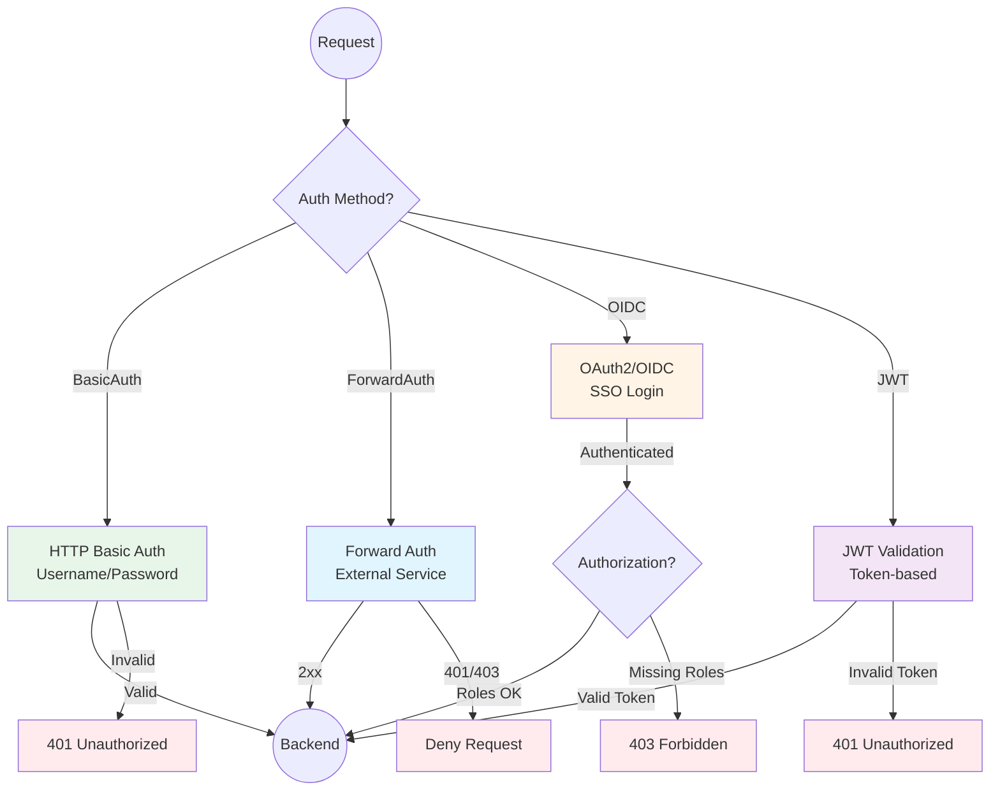
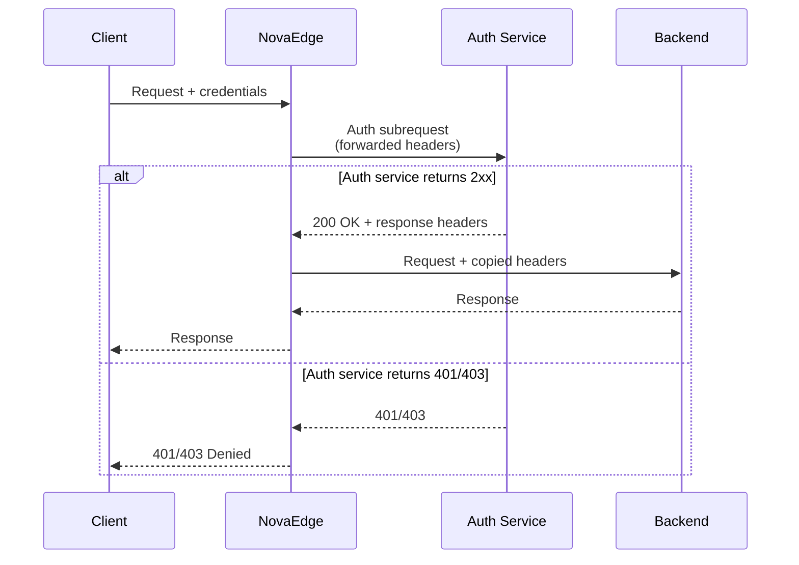
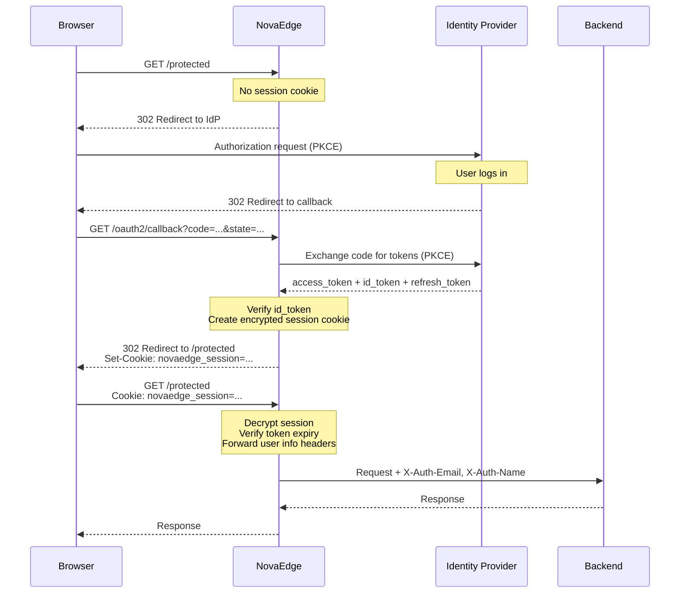

# Authentication

NovaEdge provides multiple authentication methods to protect your routes and services.

## Overview



## Authentication Methods

| Method | Use Case | Protocol | Session |
|--------|----------|----------|---------|
| **Basic Auth** | Simple API/internal access | HTTP Basic | Stateless |
| **Forward Auth** | External auth services (Authelia, oauth2-proxy) | HTTP subrequest | Delegated |
| **OIDC** | SSO with identity providers (Google, Okta, Keycloak) | OAuth2 + OIDC | Cookie-based |
| **JWT** | Token-based API authentication | Bearer token | Stateless |

## HTTP Basic Authentication

HTTP Basic Auth validates credentials against a htpasswd-style secret stored in Kubernetes.

### Configuration

```yaml
apiVersion: novaedge.io/v1alpha1
kind: ProxyPolicy
metadata:
  name: basic-auth
spec:
  type: BasicAuth
  targetRef:
    kind: ProxyRoute
    name: protected-route
  basicAuth:
    realm: "Admin Area"
    secretRef:
      name: htpasswd-secret
    stripAuth: true
```

### Creating the htpasswd Secret

```bash
# Using htpasswd (bcrypt)
htpasswd -nbBC 10 admin 'P@ssw0rd!' > htpasswd
htpasswd -nbBC 10 readonly 'r3ad0nly' >> htpasswd

# Create Kubernetes secret
kubectl create secret generic htpasswd-secret \
  --from-file=htpasswd=htpasswd
```

### Supported Hash Formats

| Format | Prefix | Security | Example |
|--------|--------|----------|---------|
| **bcrypt** | `$2y$`, `$2a$`, `$2b$` | Recommended | `admin:$2y$10$...` |
| **SHA-256** | `{SHA256}` | Good | `admin:{SHA256}base64hash` |
| **APR1 MD5** | `$apr1$` | Legacy | `admin:$apr1$salt$hash` |

### Behavior

- Returns `401 Unauthorized` with `WWW-Authenticate: Basic realm="..."` on failure
- Sets `X-Auth-User` header on successful authentication
- Optionally strips `Authorization` header before forwarding to backend (`stripAuth: true`)

## Forward Auth

Forward Auth delegates authentication to an external service by sending a subrequest.

### How It Works



### Configuration

```yaml
apiVersion: novaedge.io/v1alpha1
kind: ProxyPolicy
metadata:
  name: forward-auth
spec:
  type: ForwardAuth
  targetRef:
    kind: ProxyRoute
    name: protected-route
  forwardAuth:
    address: "http://authelia.auth.svc.cluster.local:9091/api/verify"
    authHeaders:
      - Authorization
      - Cookie
    responseHeaders:
      - X-Auth-User
      - X-Auth-Groups
    timeout: "5s"
    cacheTTL: "5m"
```

### Configuration Fields

| Field | Description | Default |
|-------|-------------|---------|
| `address` | URL of the external auth service | Required |
| `authHeaders` | Headers to forward to auth service | All headers |
| `responseHeaders` | Headers to copy from auth response | None |
| `timeout` | Timeout for auth subrequest | `5s` |
| `cacheTTL` | Cache auth decisions duration | No caching |

### Compatible Auth Services

- [Authelia](https://www.authelia.com/)
- [oauth2-proxy](https://oauth2-proxy.github.io/oauth2-proxy/)
- [Vouch Proxy](https://github.com/vouch/vouch-proxy)
- Any service that returns 2xx for allowed or 401/403 for denied

## OAuth2/OIDC Authentication

OIDC provides full OAuth2 Authorization Code Flow with PKCE for browser-based SSO.

### How It Works



### Generic OIDC Configuration

```yaml
apiVersion: novaedge.io/v1alpha1
kind: ProxyPolicy
metadata:
  name: oidc-google
spec:
  type: OIDC
  targetRef:
    kind: ProxyRoute
    name: webapp-route
  oidc:
    provider: generic
    issuerURL: "https://accounts.google.com"
    clientID: "your-client-id"
    clientSecretRef:
      name: oidc-client-secret
    redirectURL: "https://myapp.example.com/oauth2/callback"
    scopes:
      - openid
      - profile
      - email
    sessionSecretRef:
      name: oidc-session-secret
    forwardHeaders:
      - X-Auth-Email
      - X-Auth-Name
```

### Required Secrets

```bash
# Client secret
kubectl create secret generic oidc-client-secret \
  --from-literal=client-secret="your-oauth2-client-secret"

# Session encryption key (32 bytes)
kubectl create secret generic oidc-session-secret \
  --from-literal=session-secret="$(openssl rand 32)"
```

### OIDC Endpoints

NovaEdge automatically registers these endpoints on your routes:

| Endpoint | Purpose |
|----------|---------|
| `/oauth2/callback` | OAuth2 callback (receives auth code) |
| `/oauth2/logout` | Clears session and optionally redirects to IdP logout |

### Token Refresh

When a session token expires, NovaEdge automatically attempts to refresh it using the stored refresh token. If refresh fails, the user is redirected to the IdP for re-authentication.

### Headers Forwarded to Backend

| Header | Source |
|--------|--------|
| `X-Auth-Subject` | JWT `sub` claim |
| `X-Auth-Email` | JWT `email` claim |
| `X-Auth-Name` | JWT `name` claim |
| Custom headers | Via `forwardHeaders` configuration |

## Authorization (Role-Based Access Control)

OIDC policies support authorization based on roles and groups from JWT claims.

### Configuration

```yaml
oidc:
  # ... OIDC config ...
  authorization:
    requiredRoles:
      - admin
      - editor
    requiredGroups:
      - /engineering
    mode: any  # "any" (OR) or "all" (AND)
```

### Authorization Modes

| Mode | Behavior |
|------|----------|
| `any` | User needs ANY of the required roles OR ANY of the required groups |
| `all` | User needs ALL required roles AND ALL required groups |

### Response on Authorization Failure

When an authenticated user lacks required roles/groups, NovaEdge returns:

```
HTTP/1.1 403 Forbidden
Forbidden: insufficient roles or groups
```

## Security Best Practices

1. **Always use HTTPS** for authentication endpoints
2. **Rotate session secrets** regularly
3. **Use bcrypt** for htpasswd credentials (avoid MD5 for new deployments)
4. **Set short cache TTLs** for forward auth to balance performance and security
5. **Use PKCE** (enabled by default) for OIDC flows to prevent authorization code interception
6. **Restrict scopes** to only what your application needs
7. **Enable `stripAuth`** to prevent credential leakage to backends
