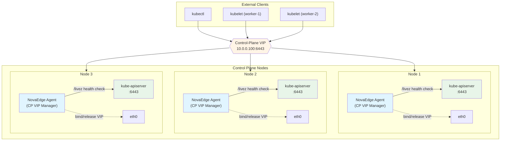
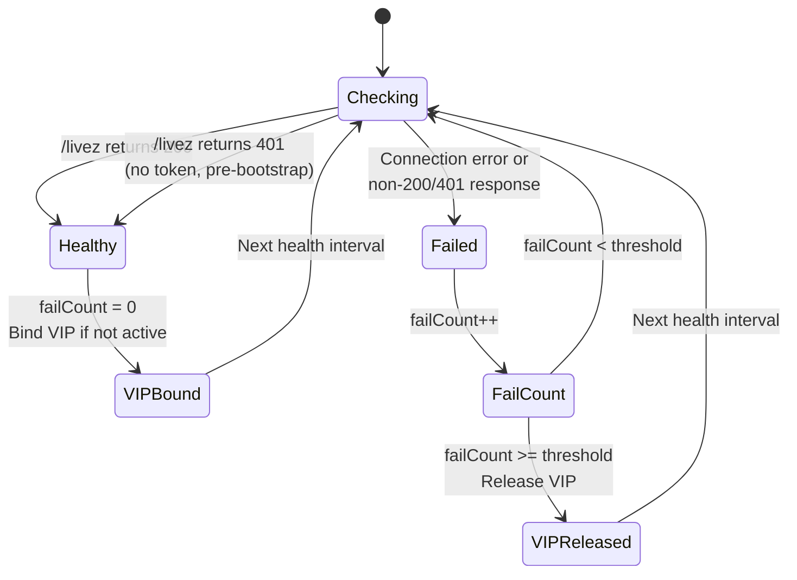
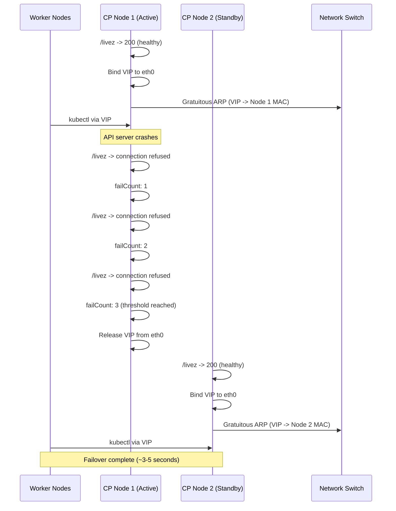

# Control-Plane VIP

NovaEdge can manage a dedicated Virtual IP (VIP) for the Kubernetes API server, providing control-plane high availability without external tools like kube-vip. The CP VIP manager runs independently of the NovaEdge controller, making it suitable for pre-bootstrap scenarios where the API server itself needs a stable address before any Kubernetes workloads can run.

## Overview

In a multi-node Kubernetes control plane, each API server instance runs on a different node with a different IP address. Clients (kubelets, kubectl, controllers) need a single stable address to reach the API server regardless of which node is healthy. The CP VIP manager solves this by:

1. Health-checking the local API server via the `/livez` endpoint
2. Binding a VIP to the node's network interface when the API server is healthy
3. Releasing the VIP when the health check fails, allowing another node to take over

This operates at the node agent level with no dependency on the Kubernetes API being available, which is critical for bootstrapping new clusters.

## Architecture



### Key properties

- **Independent of the controller** -- the CP VIP manager runs in the node agent process, not the controller. It does not require the Kubernetes API to be available.
- **Separate from data-plane VIPs** -- the CP VIP manager (`internal/agent/cpvip/`) is distinct from the data-plane VIP system (`internal/agent/vip/`). It uses the same underlying L2/BGP handlers but manages a single dedicated VIP for the API server.
- **Pre-bootstrap safe** -- can run as a systemd service or static pod before the cluster is fully operational.

## Configuration

The CP VIP manager is configured through environment variables or command-line flags on the `novaedge-agent` binary.

### Configuration reference

| Parameter | Env Variable | Default | Description |
|-----------|-------------|---------|-------------|
| VIP Address | `NOVAEDGE_CP_VIP_ADDRESS` | (required) | VIP in CIDR notation, e.g., `10.0.0.100/32` |
| Interface | `NOVAEDGE_CP_VIP_INTERFACE` | auto-detect | Network interface for VIP binding (L2 mode) |
| API Port | `NOVAEDGE_CP_VIP_API_PORT` | `6443` | kube-apiserver port |
| Health Interval | `NOVAEDGE_CP_VIP_HEALTH_INTERVAL` | `1s` | Interval between health checks |
| Health Timeout | `NOVAEDGE_CP_VIP_HEALTH_TIMEOUT` | `3s` | Timeout per health check request |
| Fail Threshold | `NOVAEDGE_CP_VIP_FAIL_THRESHOLD` | `3` | Consecutive failures before VIP release |
| SA Token Path | `NOVAEDGE_CP_VIP_SA_TOKEN_PATH` | `/var/run/secrets/kubernetes.io/serviceaccount/token` | Path to SA token for authenticated health checks |
| Mode | `NOVAEDGE_CP_VIP_MODE` | `l2` | VIP mode: `l2` or `bgp` |

### BGP mode parameters

| Parameter | Env Variable | Default | Description |
|-----------|-------------|---------|-------------|
| BGP Local AS | `NOVAEDGE_BGP_LOCAL_AS` | (required for bgp) | Local BGP autonomous system number |
| BGP Router ID | `NOVAEDGE_BGP_ROUTER_ID` | (required for bgp) | BGP router identifier |
| BGP Peer Address | `NOVAEDGE_BGP_PEER_ADDRESS` | (required for bgp) | BGP peer IP address |
| BGP Peer AS | `NOVAEDGE_BGP_PEER_AS` | (required for bgp) | BGP peer AS number |

### BFD parameters

| Parameter | Env Variable | Default | Description |
|-----------|-------------|---------|-------------|
| BFD Enabled | `NOVAEDGE_BFD_ENABLED` | `false` | Enable BFD for sub-second failure detection |
| BFD Detect Multiplier | `NOVAEDGE_BFD_DETECT_MULT` | `3` | Missed packets before session down |
| BFD TX Interval | `NOVAEDGE_BFD_TX_INTERVAL` | `300ms` | Minimum transmit interval |
| BFD RX Interval | `NOVAEDGE_BFD_RX_INTERVAL` | `300ms` | Minimum receive interval |

### Example: L2 mode (systemd)

```bash
cat > /etc/novaedge/cpvip.env <<'EOF'
NOVAEDGE_CP_VIP_ADDRESS=10.0.0.100/32
NOVAEDGE_CP_VIP_MODE=l2
NOVAEDGE_CP_VIP_HEALTH_INTERVAL=1s
NOVAEDGE_CP_VIP_FAIL_THRESHOLD=3
EOF
```

### Example: BGP mode with BFD

```bash
cat > /etc/novaedge/cpvip.env <<'EOF'
NOVAEDGE_CP_VIP_ADDRESS=10.0.0.100/32
NOVAEDGE_CP_VIP_MODE=bgp
NOVAEDGE_BGP_LOCAL_AS=65000
NOVAEDGE_BGP_ROUTER_ID=10.0.0.11
NOVAEDGE_BGP_PEER_ADDRESS=10.0.0.254
NOVAEDGE_BGP_PEER_AS=65001
NOVAEDGE_BFD_ENABLED=true
NOVAEDGE_BFD_DETECT_MULT=3
NOVAEDGE_BFD_TX_INTERVAL=300ms
NOVAEDGE_BFD_RX_INTERVAL=300ms
EOF
```

## Health Check Mechanism

The CP VIP manager continuously checks the local API server's health to decide whether to hold or release the VIP.



### How health checks work

1. The manager sends an HTTPS GET request to `https://localhost:<apiPort>/livez` every `healthInterval` (default: 1 second).

2. **With SA token** (normal operation): The request includes an `Authorization: Bearer <token>` header. Only HTTP 200 is considered healthy.

3. **Without SA token** (pre-bootstrap): When the SA token file is not available (e.g., before Kubernetes mounts secrets), both HTTP 200 and HTTP 401 are treated as healthy. A 401 response proves the API server is accepting connections, even though the agent cannot authenticate yet.

4. The SA token is read from disk and cached for 5 minutes. Kubernetes rotates projected SA tokens periodically (~1 hour), so the refresh interval is well within that window.

5. If `failThreshold` consecutive checks fail (default: 3), the VIP is released. A single successful check resets the failure counter and re-binds the VIP.

### Health check endpoint

The manager uses `/livez` instead of the deprecated `/healthz`. The `/livez` endpoint provides more accurate liveness information -- it returns 200 only when the API server is ready to serve requests, not just when the process is running.

### TLS verification

Health check requests use `InsecureSkipVerify: true` because the API server's TLS certificate may not include `localhost` in its SANs, especially during bootstrap. This is safe because the health check runs locally (loopback) and does not transmit sensitive data.

## VIP Modes

### L2 ARP mode (default)

In L2 mode, the CP VIP manager binds the VIP address to the specified network interface and sends Gratuitous ARP packets to update the network's MAC address tables. Only one node holds the VIP at a time (active/standby).



**Requirements:**
- All control-plane nodes on the same Layer 2 network
- `NET_ADMIN` and `NET_RAW` capabilities on the agent

**Failover time:** ~3-5 seconds (health interval x fail threshold + ARP propagation).

### BGP mode

In BGP mode, all healthy nodes announce the VIP via BGP. The upstream router distributes traffic across all announcing nodes using ECMP (Equal-Cost Multi-Path). When a node's API server fails, it withdraws the BGP route, and the router removes it from the ECMP set.

**Requirements:**
- BGP-capable router peered with each control-plane node
- ECMP enabled on the router

**Failover time:** Depends on BGP hold timer (default ~90 seconds). With BFD enabled, detection drops to ~900ms (3 x 300ms).

### BFD (Bidirectional Forwarding Detection)

BFD can be enabled alongside BGP mode for sub-second failure detection. BFD runs a lightweight probe between the agent and the router, detecting link failures much faster than BGP's native hold timer.

| BFD Parameter | Default | Formula |
|---------------|---------|---------|
| Detect multiplier | 3 | -- |
| TX interval | 300ms | -- |
| RX interval | 300ms | -- |
| Detection time | -- | detectMult x max(txInterval, rxInterval) = 900ms |

## Comparison with kube-vip

| Feature | NovaEdge CP VIP | kube-vip |
|---------|----------------|----------|
| VIP modes | L2 ARP, BGP, BFD | L2 ARP, BGP |
| BFD support | Yes (sub-second failover) | No |
| Health check endpoint | `/livez` (modern, authenticated) | `/healthz` (deprecated) |
| SA token authentication | Yes (auto-refreshed) | No |
| Pre-bootstrap support | Yes (systemd or static pod) | Yes (static pod or DaemonSet) |
| Data-plane integration | Shares agent with LB/proxy/mesh | Separate tool |
| Service LoadBalancer | Yes (via NovaEdge controller) | Yes (built-in) |
| Service mesh | Yes (via NovaEdge mesh) | No |
| BGP implementation | GoBGP (full BGP stack) | GoBGP |
| OSPF support | Yes (via data-plane VIP) | No |
| IPv6 dual-stack VIPs | Yes | Limited |
| Configuration | Env vars / flags | ConfigMap / annotations |
| License | Apache 2.0 | Apache 2.0 |

### Migration from kube-vip

1. Note your current VIP address from the kube-vip configuration.
2. Deploy NovaEdge CP VIP on all control-plane nodes with the same VIP address.
3. Stop kube-vip (remove the static pod manifest or delete the DaemonSet).
4. Verify NovaEdge holds the VIP: `ip addr show | grep <vip-address>`.

See the [K3s Control Plane HA](k3s-control-plane-ha.md) guide for a complete migration walkthrough.

## Shutdown Behavior

When the agent receives a shutdown signal (context cancellation), the CP VIP manager:

1. Releases the VIP if currently active (removes from interface, withdraws BGP route).
2. Logs the release.
3. Returns cleanly.

This ensures the VIP is not left bound to a node that is shutting down, preventing a window where clients send traffic to a node that is no longer serving the API.

## Troubleshooting

### VIP not being bound

```bash
# Check agent logs for CP VIP manager events
journalctl -u novaedge-cpvip -f
# or, if running as a pod:
kubectl logs -n kube-system <novaedge-cpvip-pod> | grep cpvip

# Expected when healthy:
# "Starting control-plane VIP manager" vip=10.0.0.100/32 mode=l2
# "API server is healthy, binding VIP"
# "Control-plane VIP bound" address=10.0.0.100/32 mode=l2
```

### VIP flapping (bind/release cycle)

If the VIP is repeatedly bound and released:

```bash
# Check if the API server is intermittently unhealthy
curl -k https://localhost:6443/livez
# Should return 200 consistently

# Increase the fail threshold to tolerate brief hiccups
NOVAEDGE_CP_VIP_FAIL_THRESHOLD=5

# Check for network issues between the agent and API server
ss -tlnp | grep 6443
```

### Health check returning non-200

```bash
# Test the health check manually with SA token
TOKEN=$(cat /var/run/secrets/kubernetes.io/serviceaccount/token)
curl -k -H "Authorization: Bearer $TOKEN" https://localhost:6443/livez -v

# If you get 403, the SA may lack permissions
# If you get connection refused, the API server is not running
# If you get 500/503, the API server is unhealthy
```

### BGP session not establishing

```bash
# Check agent logs for BGP errors
journalctl -u novaedge-cpvip | grep -i bgp

# Verify BGP peer reachability
nc -zv <peer-address> 179

# Check router-side BGP neighbor status
# (on FRRouting) show ip bgp summary
```

### Checking which node holds the VIP

```bash
# On each control-plane node:
ip addr show | grep 10.0.0.100

# The node with output like:
#   inet 10.0.0.100/32 scope global eth0
# is the current VIP holder
```

### Verifying ARP table (L2 mode)

```bash
# From any machine on the same L2 network:
arp -a | grep 10.0.0.100
# Should show the MAC address of the active node
```

## Related Pages

- [K3s Control Plane HA](k3s-control-plane-ha.md) -- Step-by-step guide for deploying CP VIP on K3s
- [VIP Management](vip-management.md) -- Data-plane VIP management for services
- [IP Address Pools](ip-pools.md) -- Dynamic IP address allocation for service VIPs
