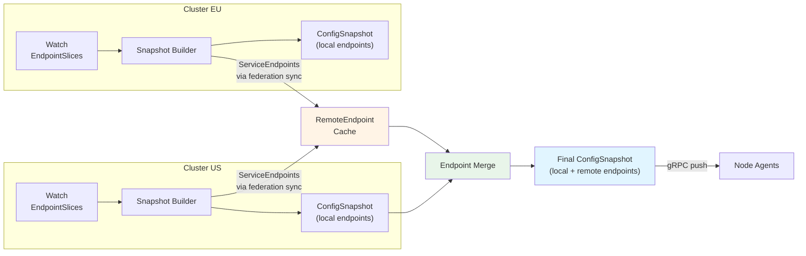
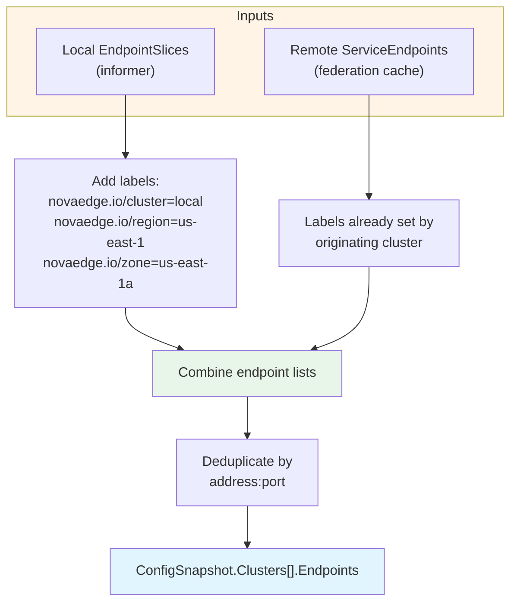
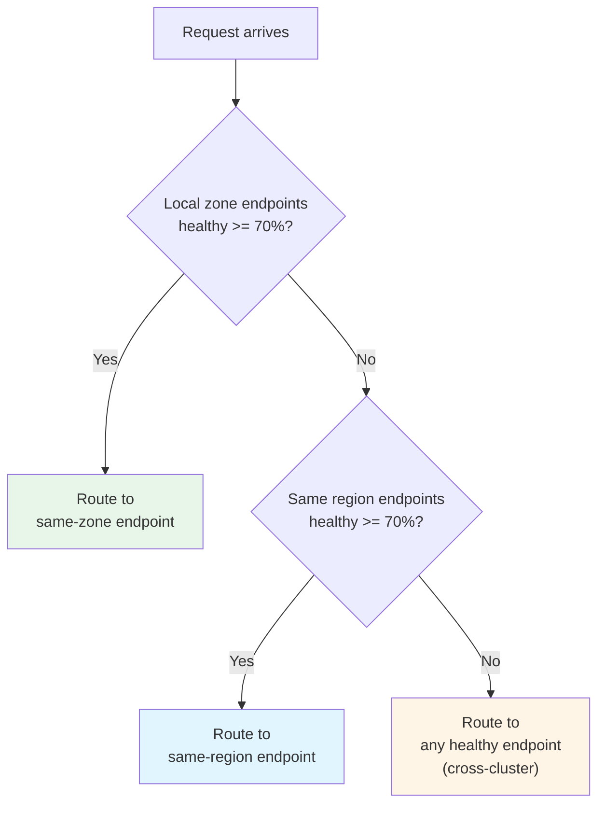
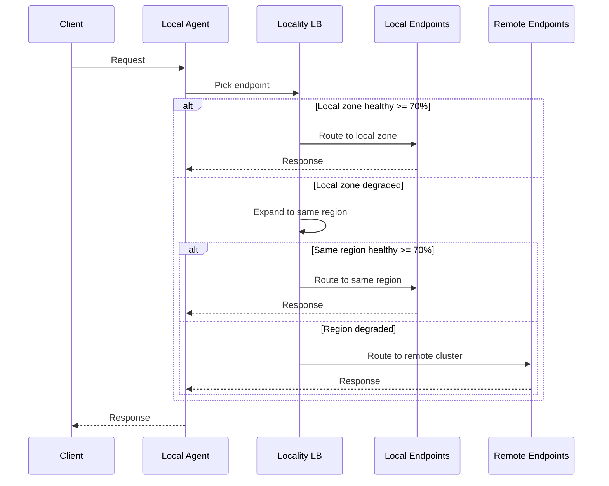

# Cross-Cluster Routing

When NovaEdge federation is running in mesh or unified mode, the controller merges service endpoints from all federated clusters into a single endpoint list. Agents then use locality-aware load balancing to route traffic to the nearest healthy backend, overflowing to remote clusters only when local capacity drops below a configurable threshold.

## How Endpoint Merging Works

Each federated controller maintains a `RemoteEndpointCache` that stores `ServiceEndpoints` received from peer clusters. During every config snapshot build cycle, the snapshot builder queries this cache and merges remote endpoints into the local endpoint list for each service.



### Merge Pipeline

1. **Local endpoints** are collected from Kubernetes EndpointSlices by the controller's informers
2. **Remote endpoints** arrive via the federation sync protocol and are stored in the `RemoteEndpointCache`, keyed by cluster name and `namespace/service`
3. **The snapshot builder** calls `GetForService(namespace, serviceName)` to retrieve all remote endpoints for a given service
4. **Endpoints are combined** into a single list, with each endpoint annotated with locality labels (`novaedge.io/cluster`, `novaedge.io/region`, `novaedge.io/zone`)
5. **The merged snapshot** is pushed to local agents via gRPC



## Locality-Aware Routing

Agents use a three-tier locality hierarchy to prefer nearby endpoints:

```
Same Zone > Same Region > Cross-Region (any cluster)
```

The locality balancer checks endpoint labels to determine affinity:

| Label | Source | Example |
|-------|--------|---------|
| `novaedge.io/zone` | Set by originating cluster | `us-east-1a` |
| `novaedge.io/region` | Set by originating cluster | `us-east-1` |
| `novaedge.io/cluster` | Set by originating cluster | `cluster-us` |
| `topology.kubernetes.io/zone` | Standard Kubernetes node label | `us-east-1a` |
| `topology.kubernetes.io/region` | Standard Kubernetes node label | `us-east-1` |

### Overflow Behavior

The agent's `LocalityConfig` controls when traffic overflows from local to remote endpoints:

1. **Collect local-zone endpoints** -- endpoints in the same zone as the agent
2. **Check healthy ratio** -- if `healthy_local / total_local >= MinHealthyPercent` (default: 70%), traffic stays in the local zone
3. **Expand to same-region** -- if the local zone is below threshold, include all endpoints in the same region
4. **Expand to all** -- if the entire region is below threshold, use all endpoints across all clusters



The `MinHealthyPercent` threshold is configurable per load balancer:

```yaml
apiVersion: novaedge.io/v1alpha1
kind: ProxyBackend
metadata:
  name: my-service
spec:
  loadBalancer:
    algorithm: LeastConn
    localityAware:
      enabled: true
      minHealthyPercent: 70
```

## Configuring RemoteClusterRouting

The `NovaEdgeRemoteCluster` resource includes a `routing` section that controls how traffic flows to and from the remote cluster:

```yaml
spec:
  routing:
    # Enable or disable routing to this cluster
    enabled: true

    # Failover priority (lower = higher priority)
    # Local cluster typically has priority 50, remote clusters 100+
    priority: 100

    # Traffic weight for weighted load balancing (0-100)
    # Distribute 70% local / 30% remote:
    #   local weight: 70, remote weight: 30
    weight: 50

    # Prefer backends within the requesting cluster before cross-cluster
    localPreference: true

    # Allow cross-cluster traffic when local backends are unavailable
    allowCrossClusterTraffic: true

    # Filter which endpoints from this cluster to include
    endpoints:
      # Only include endpoints from these namespaces
      namespaces:
        - default
        - production
      # Exclude endpoints from these namespaces
      excludeNamespaces:
        - kube-system
        - monitoring
      # Only include endpoints matching these labels
      matchLabels:
        tier: frontend
```

### Field Reference

| Field | Default | Description |
|-------|---------|-------------|
| `enabled` | true | Whether to route traffic to/from this cluster |
| `priority` | 100 | Failover ordering; lower values are preferred (range: 1-1000) |
| `weight` | 100 | Traffic weight for weighted distribution (range: 0-100) |
| `localPreference` | true | Prefer local backends before cross-cluster |
| `allowCrossClusterTraffic` | true | Allow failover to this cluster when local backends are down |
| `endpoints.namespaces` | (all) | Restrict to endpoints in these namespaces |
| `endpoints.excludeNamespaces` | (none) | Exclude endpoints from these namespaces |
| `endpoints.matchLabels` | (none) | Only include endpoints with matching labels |

## Failover Behavior

When local endpoints become unhealthy, the system follows a predictable failover sequence:



### Failover triggers

1. **Endpoint health checks fail** -- passive failure detection (error responses) or active probing marks endpoints as unhealthy
2. **Healthy ratio drops below threshold** -- when fewer than `MinHealthyPercent` of local endpoints are healthy, the locality balancer expands to the next tier
3. **Remote cluster disconnects** -- if federation health checks mark a remote cluster as unhealthy, its endpoints are excluded from the merged list

### Failback

When local endpoints recover:

1. Health checks mark endpoints as healthy again
2. The healthy ratio rises above `MinHealthyPercent`
3. The locality balancer resumes preferring local endpoints
4. Traffic gradually shifts back (no sudden switchover)

## Monitoring Cross-Cluster Traffic

### Endpoint Labels

Every endpoint in the merged list carries cluster, region, and zone labels. You can query Prometheus metrics with these labels to understand traffic distribution:

```promql
# Requests routed to remote clusters
sum by (cluster) (
  rate(novaedge_upstream_requests_total{cluster!="local"}[5m])
)

# Cross-cluster latency
histogram_quantile(0.99,
  rate(novaedge_upstream_duration_seconds_bucket{cluster!="local"}[5m])
)
```

### Key Metrics

| Metric | Description |
|--------|-------------|
| `novaedge_upstream_requests_total` | Total upstream requests, labeled by cluster/region/zone |
| `novaedge_upstream_duration_seconds` | Upstream request duration histogram |
| `novaedge_federation_peers_healthy` | Number of healthy federation peers |
| `novaedge_federation_sync_duration_seconds` | Time taken for federation sync per peer |

### Checking Endpoint Distribution

Inspect the merged endpoint list for a service:

```bash
# View the cluster endpoints in the current config snapshot
kubectl -n novaedge-system exec deploy/novaedge-agent -- \
  novaedge-agent --dump-config | \
  jq '.clusters[] | select(.name=="my-service") | .endpoints[] | {address, labels}'
```

## Related Guides

- [Federation](federation.md) -- federation setup and modes
- [Federation Tunnels](federation-tunnels.md) -- network tunnels for environments with NAT or firewalls
- [Load Balancing](load-balancing.md) -- load balancing algorithms including locality-aware
- [Health Checks](health-checks.md) -- endpoint health check configuration
