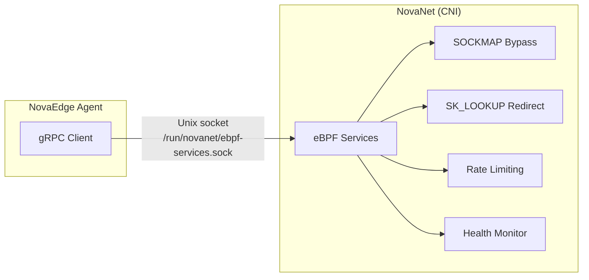

# eBPF Acceleration via NovaNet

NovaEdge leverages eBPF/XDP acceleration for the data plane through
[NovaNet](https://github.com/azrtydxb/novanet), the Nova CNI component. NovaEdge
itself no longer loads or manages eBPF programs directly. Instead, it communicates
with NovaNet via a gRPC client over a Unix domain socket to request eBPF services.

!!! note "L4 Load Balancing"
    Kubernetes Service L4 load balancing is handled by [NovaNet](https://github.com/azrtydxb/novanet). NovaEdge focuses on L7 ingress load balancing.

## Overview

The following eBPF acceleration features are provided by **NovaNet** and consumed
by NovaEdge via gRPC. All features are auto-detected at runtime by NovaNet. If
NovaNet is not available, NovaEdge continues to operate without eBPF acceleration
(graceful degradation).

| Feature | Provided By | Fallback (NovaNet unavailable) |
|---------|------------|-------------------------------|
| **SOCKMAP Same-Node Bypass** | NovaNet | Kernel network stack |
| **eBPF Mesh Redirect** | NovaNet | nftables/iptables TPROXY |
| **Rate Limiting** | NovaNet | Userspace rate limiting |
| **Health Monitoring** | NovaNet | Dataplane health checks |

## Architecture

### Previous Architecture (Removed)

Previously, NovaEdge loaded and managed eBPF programs directly within the Go
agent, requiring `privileged: true`, `CAP_BPF`, `CAP_SYS_ADMIN`, and BPF
filesystem mounts.

### Current Architecture



NovaEdge connects to NovaNet via a Unix domain socket at
`/run/novanet/ebpf-services.sock` (configurable via Helm). NovaNet handles all
eBPF program loading, lifecycle management, and kernel interactions.

## Security Improvement

By removing direct eBPF management from NovaEdge, the agent container no longer
requires elevated privileges for BPF operations:

| Requirement | Before (Direct eBPF) | After (NovaNet) |
|-------------|---------------------|-----------------|
| `privileged: true` | Required | **Not required** |
| `CAP_BPF` | Required | **Not required** |
| `CAP_SYS_ADMIN` | Required | **Not required** |
| `CAP_NET_RAW` | Required | **Not required** |
| `/sys/fs/bpf` mount | Required | **Not required** |
| `/run/novanet/` mount | Not applicable | Required (for socket access) |

The NovaEdge agent now runs with a significantly reduced privilege set. Only
`CAP_NET_ADMIN` and `CAP_NET_BIND_SERVICE` are needed for VIP management and
binding privileged ports.

## Helm Configuration

### Enabling NovaNet Integration

```yaml
# charts/novaedge-agent/values.yaml
novanet:
  # Enable NovaNet eBPF services integration
  enabled: true

  # Path to the NovaNet eBPF services Unix socket
  ebpfServicesSocket: /run/novanet/ebpf-services.sock

# Reduced security context — no BPF capabilities needed
securityContext:
  capabilities:
    add:
      - NET_ADMIN
      - NET_BIND_SERVICE
    drop:
      - ALL
```

### Volume Mount

The agent DaemonSet needs access to the NovaNet socket directory:

```yaml
volumes:
  - name: novanet-socket
    hostPath:
      path: /run/novanet
      type: DirectoryOrCreate

volumeMounts:
  - name: novanet-socket
    mountPath: /run/novanet
    readOnly: true
```

## Graceful Degradation

If NovaNet is not available (not installed, socket not present, or service
unavailable), NovaEdge continues to operate normally:

- **SOCKMAP bypass**: Falls back to kernel network stack for same-node traffic
- **Mesh redirect**: Falls back to nftables/iptables TPROXY rules
- **Rate limiting**: Falls back to userspace rate limiting in the Rust dataplane
- **Health monitoring**: Falls back to dataplane-side health checks

The agent logs a warning at startup when NovaNet is not available and periodically
retries the connection.

```
{"level":"warn","msg":"NovaNet eBPF services not available, operating in degraded mode","socket":"/run/novanet/ebpf-services.sock"}
```

## Monitoring

### Prometheus Metrics

NovaNet integration exposes the following metrics:

| Metric | Type | Description |
|--------|------|-------------|
| `novaedge_novanet_connected` | Gauge | Whether the agent is connected to NovaNet (0 or 1) |
| `novaedge_novanet_requests_total` | Counter | Total gRPC requests to NovaNet |
| `novaedge_novanet_errors_total` | Counter | Total gRPC errors from NovaNet |

For eBPF program-level metrics (loaded programs, map operations, etc.), see the
NovaNet documentation.

## Troubleshooting

### Agent cannot connect to NovaNet

**Symptom:** Agent logs `NovaNet eBPF services not available`

**Common causes:**

1. **NovaNet not installed** -- install NovaNet as the cluster CNI
2. **Socket path incorrect** -- verify `novanet.ebpfServicesSocket` matches the
   actual NovaNet socket location
3. **Missing volume mount** -- ensure `/run/novanet/` is mounted in the agent pod
4. **Permissions** -- the socket file must be readable by the agent process

### Verifying NovaNet is providing eBPF services

```bash
# Check if the NovaNet socket exists on the node
ls -la /run/novanet/ebpf-services.sock

# Check agent logs for successful connection
kubectl logs -n nova-system -l app.kubernetes.io/name=novaedge-agent | grep novanet

# Expected on success:
# {"level":"info","msg":"Connected to NovaNet eBPF services","socket":"/run/novanet/ebpf-services.sock"}
```
