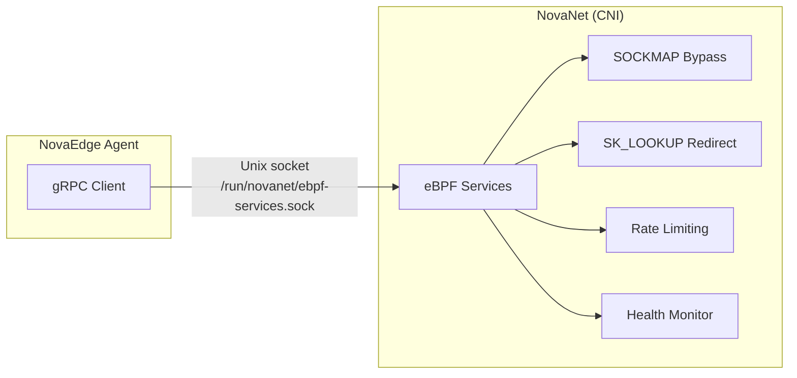

# eBPF Acceleration via NovaNet

NovaEdge leverages eBPF/XDP acceleration for the data plane through
[NovaNet](https://github.com/azrtydxb/novanet), the Nova CNI component. NovaEdge
itself no longer loads or manages eBPF programs directly. Instead, it communicates
with NovaNet via a gRPC client over a Unix domain socket to request eBPF services.

!!! note "L4 Load Balancing"
    Kubernetes Service L4 load balancing is handled by [NovaNet](https://github.com/azrtydxb/novanet). NovaEdge focuses on L7 ingress load balancing.

## Overview

The following eBPF acceleration features are provided by **NovaNet** and consumed
by NovaEdge via gRPC. All features are auto-detected at runtime by NovaNet. If
NovaNet is not available, NovaEdge continues to operate without eBPF acceleration
(graceful degradation).

| Feature | Provided By | Fallback (NovaNet unavailable) |
|---------|------------|-------------------------------|
| **SOCKMAP Same-Node Bypass** | NovaNet | Kernel network stack |
| **eBPF Mesh Redirect** | NovaNet | nftables/iptables TPROXY |
| **Rate Limiting** | NovaNet | Userspace rate limiting |
| **Health Monitoring** | NovaNet | Dataplane health checks |

## Architecture

### Previous Architecture (Removed)

Previously, NovaEdge loaded and managed eBPF programs directly within the Go
agent, requiring `privileged: true`, `CAP_BPF`, `CAP_SYS_ADMIN`, and BPF
filesystem mounts.

### Current Architecture



NovaEdge connects to NovaNet via a Unix domain socket at
`/run/novanet/ebpf-services.sock` (configurable via Helm). NovaNet handles all
eBPF program loading, lifecycle management, and kernel interactions.

## Security Improvement

By removing direct eBPF management from NovaEdge, the agent container no longer
requires elevated privileges for BPF operations:

| Requirement | Before (Direct eBPF) | After (NovaNet) |
|-------------|---------------------|-----------------|
| `privileged: true` | Required | **Not required** |
| `CAP_BPF` | Required | **Not required** |
| `CAP_SYS_ADMIN` | Required | **Not required** |
| `CAP_NET_RAW` | Required | **Not required** |
| `/sys/fs/bpf` mount | Required | **Not required** |
| `/run/novanet/` mount | Not applicable | Required (for socket access) |

The NovaEdge agent now runs with a significantly reduced privilege set. Only
`CAP_NET_ADMIN` and `CAP_NET_BIND_SERVICE` are needed for VIP management and
binding privileged ports.

## Helm Configuration

### Enabling NovaNet Integration

```yaml
# charts/novaedge-agent/values.yaml
novanet:
  # Enable NovaNet eBPF services integration
  enabled: true

  # Path to the NovaNet eBPF services Unix socket
  ebpfServicesSocket: /run/novanet/ebpf-services.sock

# Reduced security context — no BPF capabilities needed
securityContext:
  capabilities:
    add:
      - NET_ADMIN
      - NET_BIND_SERVICE
    drop:
      - ALL
```

### Volume Mount

The agent DaemonSet needs access to the NovaNet socket directory:

```yaml
volumes:
  - name: novanet-socket
    hostPath:
      path: /run/novanet
      type: DirectoryOrCreate

volumeMounts:
  - name: novanet-socket
    mountPath: /run/novanet
    readOnly: true
```

## Mesh Integration

When the [service mesh](service-mesh.md) is enabled, the NovaEdge agent reconciles
eBPF acceleration state on every config snapshot via the NovaNet gRPC client.
This section describes the four acceleration features and how they integrate
with the mesh manager.

### SK_LOOKUP Mesh Redirect

Traditional mesh traffic interception uses nftables or iptables NAT REDIRECT
rules to divert ClusterIP traffic to the transparent listener on port 15001.
When NovaNet is available, the agent instead requests NovaNet to install
`sk_lookup` eBPF program entries that redirect matching traffic at the socket
lookup layer, bypassing the entire netfilter rule chain.

**How it works:**

1. The controller pushes mesh-enabled `InternalService` entries to the agent
   via the ConfigSnapshot.
2. The mesh manager calls `AddMeshRedirect(clusterIP, port, 15001)` for each
   new service and `RemoveMeshRedirect(clusterIP, port)` for services that
   are no longer enrolled.
3. NovaNet installs an `sk_lookup` map entry that redirects TCP connections
   matching `(clusterIP, port)` to the agent's transparent listener socket.
4. The agent tracks only successfully installed/removed entries so that
   failures are retried on the next reconciliation cycle.

**Benefits over nftables/iptables:**

- No PREROUTING chain traversal -- redirect happens at socket lookup time
- No conntrack entries created for the redirect itself
- Atomic per-entry updates (no batch flush/replace)
- Lower latency for the first packet of each connection

The nftables/iptables rules remain active as a fallback when NovaNet is
unavailable or when `sk_lookup` is not supported by the kernel.

### SOCKMAP Same-Node Acceleration

For mesh traffic between pods on the same node, NovaNet can install SOCKMAP
entries that splice connected socket pairs directly in the kernel, bypassing
the full TCP/IP stack for data transfer.

**How it works:**

1. The mesh manager identifies endpoints running on the local node by
   comparing the `topology.kubernetes.io/node` label against the agent's
   node name, or by comparing the endpoint address against the node IP.
2. For each local endpoint pod, the agent calls
   `EnableSockmap(namespace, name)` via the NovaNet client.
3. NovaNet attaches `sk_msg` and `sk_skb` programs to the pod's sockets,
   enabling kernel-level splice for matching connections.
4. When pods leave the mesh or move to a different node, the agent calls
   `DisableSockmap(namespace, name)` to clean up.
5. On agent shutdown, all tracked SOCKMAP entries are cleaned up using the
   shutdown context to honor cancellation and timeout.

**Requirements:**

- The `NODE_IP` environment variable must be set in the agent pod spec
  (typically via the Downward API).
- The `--node-name` flag must match the Kubernetes node name for topology
  label matching.
- Endpoint objects must carry `kubernetes.io/namespace` and
  `kubernetes.io/name` labels identifying the pod. These labels must be
  populated by the snapshot builder when constructing `InternalService`
  endpoints.

!!! note "Endpoint Label Requirement"
    SOCKMAP acceleration requires that `InternalService` endpoints carry
    `kubernetes.io/namespace`, `kubernetes.io/name`, and
    `topology.kubernetes.io/node` labels. If your snapshot builder does not
    populate these labels, SOCKMAP will not activate. See issue tracking for
    the snapshot builder enhancement.

### Kernel-Level Rate Limiting

NovaNet can enforce per-CIDR rate limits directly in the eBPF datapath,
dropping packets before they reach the userspace proxy. The mesh manager
exposes an `ApplyRateLimits()` method that reconciles desired rate limit
entries against the currently installed set.

**Current status:** The `ApplyRateLimits()` method is implemented but not
yet wired into the agent's config application path. Per-CIDR rate limit
policies need to be extracted from the ConfigSnapshot's `ProxyPolicy`
objects and passed to this method. Until then, rate limiting falls back to
the Rust dataplane's userspace token-bucket implementation.

**Planned integration:**

1. The agent's `applyAgentConfig()` callback will extract per-CIDR rate
   limit entries from policy objects in the ConfigSnapshot.
2. These entries will be passed to `meshManager.ApplyRateLimits(ctx, entries)`.
3. NovaNet will install TC or XDP rate-limit maps for each CIDR.
4. Stale entries are automatically removed on reconciliation.

### Passive Backend Health Monitoring

NovaNet's eBPF layer passively monitors TCP connection outcomes (SYN-ACK
latency, RST rates, connection failures) for backend endpoints without
injecting active health-check probes. The agent streams these health events
via a long-lived gRPC server-streaming RPC.

**How it works:**

1. At startup, the agent calls `StartHealthStream()` which opens a
   `StreamBackendHealth` RPC to NovaNet.
2. The stream is started unconditionally -- if NovaNet is not yet connected,
   the stream loop waits with a 5-second backoff before retrying.
3. If the stream is interrupted (NovaNet restart, network error), the agent
   waits for a backoff period before reconnecting, preventing CPU spin on
   rapid failures.
4. Each received event contains per-backend metrics: total connections,
   failed connections, and failure rate.

**Current status:** Health events are logged at DEBUG level. A future
enhancement will forward these events to the Rust dataplane's outlier
detection subsystem to influence routing decisions (e.g., ejecting
backends with high failure rates).

## NovaNet Integration Requirements

To use eBPF acceleration features, the following must be in place:

| Requirement | Purpose |
|-------------|---------|
| NovaNet installed as cluster CNI | Provides eBPF services on each node |
| `/run/novanet/ebpf-services.sock` mounted | gRPC communication channel |
| `NODE_IP` environment variable set | SOCKMAP same-node detection |
| `--node-name` flag matches K8s node name | Topology label matching |
| `--mesh-enabled` flag set | Enables mesh manager reconciliation |
| `--novanet-socket` flag (optional) | Override default socket path |
| Kernel 5.9+ (recommended) | Full sk_lookup and SOCKMAP support |

## Graceful Degradation

If NovaNet is not available (not installed, socket not present, or service
unavailable), NovaEdge continues to operate normally:

- **SOCKMAP bypass**: Falls back to kernel network stack for same-node traffic
- **Mesh redirect**: Falls back to nftables/iptables TPROXY rules
- **Rate limiting**: Falls back to userspace rate limiting in the Rust dataplane
- **Health monitoring**: Falls back to dataplane-side health checks

The agent logs a warning at startup when NovaNet is not available and periodically
retries the connection.

```
{"level":"warn","msg":"NovaNet eBPF services not available, operating in degraded mode","socket":"/run/novanet/ebpf-services.sock"}
```

## Monitoring

### Prometheus Metrics

NovaNet integration exposes the following metrics:

| Metric | Type | Description |
|--------|------|-------------|
| `novaedge_novanet_connected` | Gauge | Whether the agent is connected to NovaNet (0 or 1) |
| `novaedge_novanet_requests_total` | Counter | Total gRPC requests to NovaNet |
| `novaedge_novanet_errors_total` | Counter | Total gRPC errors from NovaNet |

For eBPF program-level metrics (loaded programs, map operations, etc.), see the
NovaNet documentation.

## Troubleshooting

### Agent cannot connect to NovaNet

**Symptom:** Agent logs `NovaNet eBPF services not available`

**Common causes:**

1. **NovaNet not installed** -- install NovaNet as the cluster CNI
2. **Socket path incorrect** -- verify `novanet.ebpfServicesSocket` matches the
   actual NovaNet socket location
3. **Missing volume mount** -- ensure `/run/novanet/` is mounted in the agent pod
4. **Permissions** -- the socket file must be readable by the agent process

### Verifying NovaNet is providing eBPF services

```bash
# Check if the NovaNet socket exists on the node
ls -la /run/novanet/ebpf-services.sock

# Check agent logs for successful connection
kubectl logs -n nova-system -l app.kubernetes.io/name=novaedge-agent | grep novanet

# Expected on success:
# {"level":"info","msg":"Connected to NovaNet eBPF services","socket":"/run/novanet/ebpf-services.sock"}
```
