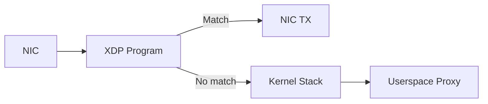
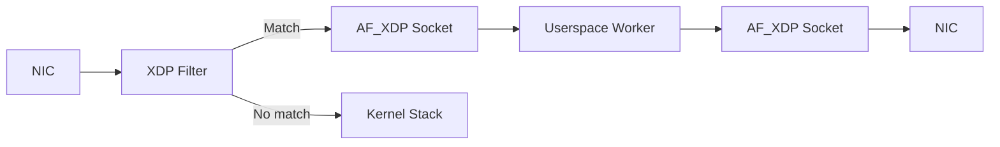

# eBPF/XDP Data Plane Acceleration

NovaEdge supports optional eBPF/XDP acceleration for the data plane, providing
kernel-bypass packet processing that can dramatically reduce latency and increase
throughput for L4 load balancing and service mesh traffic interception.

## Overview

Three eBPF acceleration features are available, each opt-in via agent flags or
Helm values:

| Feature | Program Type | Replaces | Flag |
|---------|-------------|----------|------|
| **eBPF Mesh Redirect** | `BPF_PROG_TYPE_SK_LOOKUP` | nftables/iptables TPROXY | Automatic (detected at runtime) |
| **XDP L4 Load Balancing** | `BPF_PROG_TYPE_XDP` | Userspace TCP/UDP proxy | `--enable-xdp-lb` |
| **AF_XDP Zero-Copy** | XDP + `AF_XDP` socket | Kernel network stack | `--enable-afxdp` |

All features gracefully fall back to the existing userspace implementation when
eBPF is not available (wrong kernel version, missing capabilities, non-Linux OS).

## Prerequisites

### Kernel Requirements

| Feature | Minimum Kernel | Required Support |
|---------|---------------|-----------------|
| eBPF Mesh Redirect | 5.9+ | `BPF_PROG_TYPE_SK_LOOKUP` |
| XDP L4 LB | 5.8+ | XDP driver mode on NIC |
| AF_XDP | 5.10+ | XDP + AF_XDP socket support |

Check your kernel version:

```bash
uname -r
```

### BTF Support

BTF (BPF Type Format) is recommended for CO-RE (Compile Once, Run Everywhere)
portability. Verify BTF is available:

```bash
ls /sys/kernel/btf/vmlinux
```

### Capabilities

The agent pod requires these Linux capabilities when eBPF features are enabled:

- `CAP_BPF` — load and manage BPF programs and maps
- `CAP_NET_ADMIN` — attach XDP programs to network interfaces
- `CAP_SYS_ADMIN` — required on kernels < 5.8 that lack `CAP_BPF`

## Enabling via Helm

```yaml
# charts/novaedge-agent/values.yaml
ebpf:
  # Mount /sys/fs/bpf for BPF map pinning
  bpffsMount: true

  # XDP-based L4 load balancing
  xdpLb:
    enabled: true
    interface: eth0  # NIC to attach XDP program to

  # AF_XDP zero-copy packet processing
  afxdp:
    enabled: true

# Required security context for eBPF
securityContext:
  capabilities:
    add:
      - NET_ADMIN
      - NET_RAW
      - NET_BIND_SERVICE
      - BPF
      - SYS_ADMIN
    drop:
      - ALL
```

## Enabling via Agent Flags

```bash
novaedge-agent \
  --enable-xdp-lb \
  --xdp-interface eth0 \
  --enable-afxdp \
  --mesh-enabled
```

The eBPF mesh redirect is automatically detected and used when
`--mesh-enabled` is set and the kernel supports `SK_LOOKUP`.

## Architecture

### Packet Flow Without eBPF


Every packet crosses the kernel-userspace boundary twice, incurring context
switches, memory copies, and syscall overhead.

### Packet Flow With XDP LB



Matched VIP traffic is rewritten and forwarded at the NIC driver level
without ever entering the kernel network stack. Non-matching traffic
passes through normally.

### Packet Flow With AF_XDP



AF_XDP provides zero-copy packet I/O between the NIC and userspace via
shared memory ring buffers, eliminating kernel stack traversal while
maintaining full userspace programmability.

## How It Works

### eBPF Mesh Redirect

The `SK_LOOKUP` program intercepts socket lookups for TCP connections matching
service mesh targets. Instead of using nftables TPROXY rules, the BPF program
directly assigns the connection to the TPROXY listener socket using
`bpf_sk_assign()`. This eliminates the overhead of traversing the entire
netfilter/nftables rule chain.

### XDP L4 Load Balancing

The XDP program runs at the earliest point in the receive path — before
`sk_buff` allocation. For each incoming packet:

1. Parse Ethernet, IPv4, and TCP/UDP headers
2. Look up destination VIP in a BPF hash map
3. Select a backend using a flow-based hash
4. Rewrite destination IP, port, and MAC address
5. Return `XDP_TX` to transmit the modified packet back out the NIC

Only plain TCP/UDP L4 listeners are offloaded. TLS passthrough listeners
remain in userspace because they require SNI inspection.

### AF_XDP Zero-Copy

AF_XDP extends XDP with userspace zero-copy packet processing:

1. An XDP filter program matches flows against a VIP set
2. Matched packets are redirected to an AF_XDP socket via `bpf_redirect_map()`
3. The userspace worker reads packets from the UMEM ring buffer
4. Processed responses are written back through the TX ring
5. Non-matching packets pass to the normal kernel stack

## Monitoring

### Prometheus Metrics

All eBPF subsystems expose Prometheus metrics:

| Metric | Type | Labels | Description |
|--------|------|--------|-------------|
| `novaedge_ebpf_programs_loaded` | Gauge | `subsystem` | Number of loaded BPF programs |
| `novaedge_ebpf_map_operations_total` | Counter | `map`, `op`, `result` | BPF map operations |
| `novaedge_ebpf_errors_total` | Counter | `subsystem`, `type` | BPF-related errors |
| `novaedge_ebpf_attach_duration_seconds` | Histogram | `subsystem` | Time to load and attach programs |

### Verifying with bpftool

```bash
# List loaded BPF programs
bpftool prog list

# Show XDP programs attached to interfaces
bpftool net show

# Dump BPF map contents
bpftool map dump name vip_backends

# Show per-CPU statistics
bpftool map dump name lb_stats
```

### Agent Logs

Look for these log messages to confirm eBPF acceleration is active:

```
# eBPF mesh redirect
{"msg": "Using ebpf-sk-lookup backend for mesh interception"}

# XDP L4 LB
{"msg": "XDP L4 load balancing enabled", "interface": "eth0"}
{"msg": "XDP LB program attached", "interface": "eth0"}

# AF_XDP
{"msg": "AF_XDP zero-copy fast path enabled", "interface": "eth0"}
```

## Troubleshooting

### BPF program fails to load

**Symptom:** Agent logs `Failed to start XDP LB manager, falling back to userspace proxy`

**Common causes:**

1. **Kernel too old** — check `uname -r` against the requirements table above
2. **Missing capabilities** — ensure `CAP_BPF` and `CAP_NET_ADMIN` are granted
3. **BTF not available** — check `/sys/kernel/btf/vmlinux` exists
4. **NIC driver doesn't support XDP** — not all NICs support XDP driver mode;
   virtual NICs (veth, bridge) use generic XDP which is slower

### XDP program attached but no traffic accelerated

**Check the BPF maps:**

```bash
# Verify VIP entries exist
bpftool map dump name vip_backends
# Should show entries for your configured VIPs

# Check statistics
bpftool map dump name lb_stats
# xdp_tx counter should increase with traffic
```

**Common causes:**

1. VIP address not yet assigned to this node
2. No L4 listeners configured for the VIP port
3. Backends not ready (health checks failing)

### Permission denied errors

Ensure the agent container runs with sufficient privileges:

```yaml
securityContext:
  capabilities:
    add: [BPF, NET_ADMIN, SYS_ADMIN, NET_RAW, NET_BIND_SERVICE]
```

On some distributions, you may also need `privileged: true` in the pod
security context.
