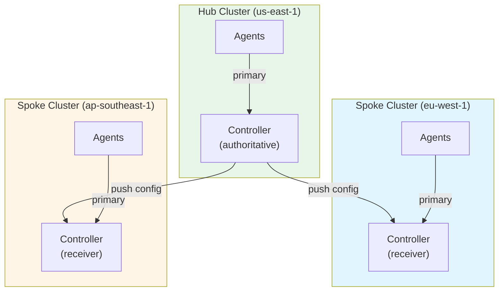
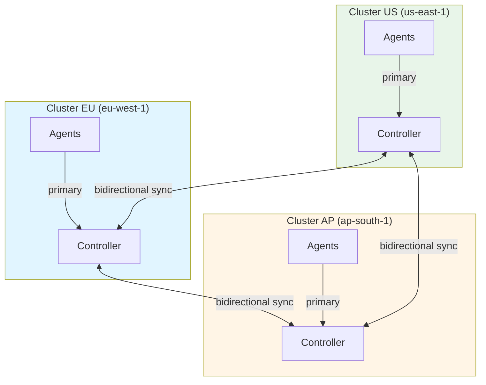
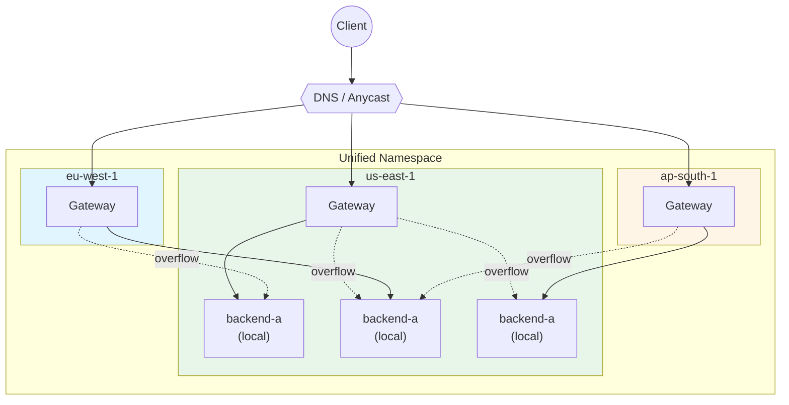
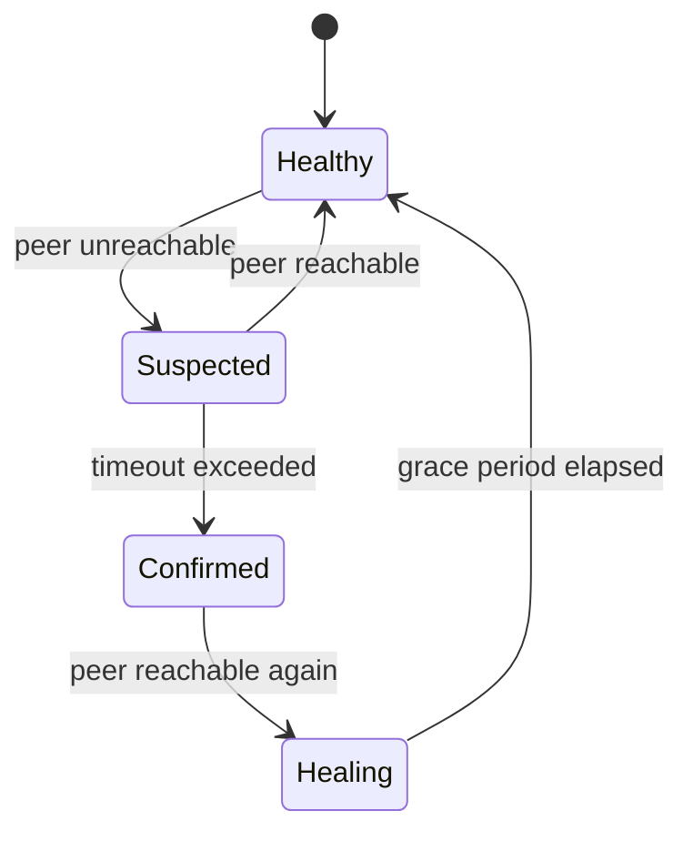

# Federation

NovaEdge federation connects multiple Kubernetes clusters into a unified control plane, enabling cross-cluster service discovery, configuration synchronization, and traffic failover. Federation supports three operating modes -- hub-spoke, mesh, and unified -- to match different organizational and network topologies.

## Overview

In a single-cluster deployment, NovaEdge manages load balancing, routing, and VIPs for services within one Kubernetes cluster. Federation extends this to multiple clusters:

- **Configuration synchronization** -- routing rules, policies, and backend definitions propagate across clusters automatically
- **Cross-cluster endpoint merging** -- the snapshot builder combines local and remote service endpoints so agents can route traffic to backends in any cluster
- **Locality-aware routing** -- traffic prefers local backends, overflowing to remote clusters only when local capacity is insufficient
- **Split-brain protection** -- vector clocks, quorum checks, and write fencing prevent conflicting updates during network partitions

Federation is managed through two CRDs:

| CRD | Purpose |
|-----|---------|
| `NovaEdgeFederation` | Defines the federation topology, sync settings, conflict resolution, and split-brain policy |
| `NovaEdgeRemoteCluster` | Registers a remote or edge cluster with connection details, routing weights, and health checks |

## Federation Modes

NovaEdge supports three federation modes, each suited to different use cases:

| Mode | Sync Direction | Endpoint Merging | Best For |
|------|---------------|------------------|----------|
| `hub-spoke` | Hub pushes to spokes | No | Centralized management with edge clusters |
| `mesh` | Bidirectional | Yes | Active-active multi-region deployments |
| `unified` | Bidirectional | Yes (all endpoints) | Global anycast-style load balancing |

### Hub-Spoke

A central hub cluster owns all configuration and pushes it one-directionally to spoke clusters. Spokes execute the configuration but do not originate changes.

**When to use:**

- A single team manages all routing and policy
- Edge or satellite clusters need to mirror the hub's configuration
- You want a simple, predictable sync topology



### Mesh

All clusters synchronize bidirectionally. Each controller is both a producer and consumer of configuration. Endpoint merging allows services in one cluster to route traffic to backends in another.

**When to use:**

- Active-active multi-region deployments
- Cross-cluster service discovery and failover
- Multiple teams manage configuration in their own clusters



### Unified

All clusters share a single service namespace and behave as one logical load balancer. Endpoints from every cluster are merged, and location-aware routing directs traffic to the nearest healthy backend. This mode is the most aggressive form of federation.

**When to use:**

- Global anycast-style load balancing
- Region-aware failover with automatic cross-region fallback
- A single control-plane view across all regions



## Setup Walkthrough

### Prerequisites

Before configuring federation:

1. **Kubernetes 1.29+** on all participating clusters
2. **NovaEdge installed** on each cluster
3. **Network connectivity** between controllers on gRPC port 9443 (or via a [tunnel](federation-tunnels.md) for NAT/firewall environments)
4. **TLS certificates** for secure controller-to-controller mTLS communication

### Step 1: Create TLS Secrets

Federation controllers communicate over gRPC with mutual TLS. Create the CA certificate and client certificate secrets in every participating cluster:

```bash
# Generate a CA (or use your organization's CA)
openssl req -x509 -newkey ec -pkeyopt ec_paramgen_curve:P-256 \
  -days 3650 -nodes -keyout ca.key -out ca.crt \
  -subj "/CN=NovaEdge Federation CA"

# Generate client certificate for this cluster
openssl req -newkey ec -pkeyopt ec_paramgen_curve:P-256 \
  -nodes -keyout client.key -out client.csr \
  -subj "/CN=cluster-us"

openssl x509 -req -in client.csr -CA ca.crt -CAkey ca.key \
  -CAcreateserial -days 365 -out client.crt

# Create Kubernetes secrets
kubectl -n novaedge-system create secret tls federation-ca \
  --cert=ca.crt --key=ca.key

kubectl -n novaedge-system create secret tls federation-client-cert \
  --cert=client.crt --key=client.key
```

!!! warning "Use the same CA across all clusters"
    Every cluster in the federation must trust the same CA certificate so that mTLS handshakes succeed between any pair of controllers.

### Step 2: Create the NovaEdgeFederation Resource

Deploy a `NovaEdgeFederation` resource on each cluster. The `localMember` section identifies the current cluster, while `members` lists the peers.

**Hub-spoke example** (deploy on the hub):

```yaml
apiVersion: novaedge.io/v1alpha1
kind: NovaEdgeFederation
metadata:
  name: global-federation
  namespace: novaedge-system
spec:
  mode: hub-spoke
  federationID: global-prod
  localMember:
    name: hub-us-east
    region: us-east-1
    zone: us-east-1a
    endpoint: "federation-hub.example.com:9443"
  members:
    - name: spoke-eu-west
      region: eu-west-1
      zone: eu-west-1a
      endpoint: "spoke-eu.example.com:9443"
      priority: 10
      tls:
        enabled: true
        caSecretRef:
          name: federation-ca
          namespace: novaedge-system
        clientCertSecretRef:
          name: federation-client-cert
          namespace: novaedge-system
        serverName: spoke-eu.example.com
  sync:
    interval: 5s
    timeout: 30s
    batchSize: 100
    compression: true
  healthCheck:
    interval: 10s
    timeout: 5s
    failureThreshold: 3
    successThreshold: 1
```

**Mesh example** (deploy on each cluster, adjusting `localMember`):

```yaml
apiVersion: novaedge.io/v1alpha1
kind: NovaEdgeFederation
metadata:
  name: mesh-federation
  namespace: novaedge-system
spec:
  mode: mesh
  federationID: prod-mesh
  localMember:
    name: cluster-us
    region: us-east-1
    zone: us-east-1b
    endpoint: "novaedge-us.example.com:9443"
  members:
    - name: cluster-eu
      region: eu-west-1
      zone: eu-west-1a
      endpoint: "novaedge-eu.example.com:9443"
      priority: 100
      tls:
        enabled: true
        caSecretRef:
          name: federation-ca
          namespace: novaedge-system
        clientCertSecretRef:
          name: federation-client-cert
          namespace: novaedge-system
        serverName: novaedge-eu.example.com
  conflictResolution:
    strategy: Merge
    vectorClocks: true
    tombstoneTTL: 24h
  splitBrain:
    enabled: true
    partitionTimeout: 30s
    quorumMode: AgentAssisted
    quorumRequired: true
    fencingEnabled: true
    healingGracePeriod: 5s
    autoResolveOnHeal: true
```

### Step 3: Register Remote Clusters (Optional)

For hub-spoke deployments with edge or satellite clusters, create `NovaEdgeRemoteCluster` resources on the hub to register each remote cluster:

```yaml
apiVersion: novaedge.io/v1alpha1
kind: NovaEdgeRemoteCluster
metadata:
  name: edge-eu-west
  namespace: novaedge-system
spec:
  clusterName: edge-eu-west
  region: eu-west-1
  zone: eu-west-1a
  connection:
    mode: Direct
    controllerEndpoint: "novaedge-hub.example.com:9090"
    tls:
      enabled: true
      caSecretRef:
        name: remote-cluster-ca
        namespace: novaedge-system
      clientCertSecretRef:
        name: remote-agent-cert
        namespace: novaedge-system
      serverName: novaedge-hub.example.com
  routing:
    enabled: true
    priority: 100
    weight: 50
    localPreference: true
    allowCrossClusterTraffic: true
  healthCheck:
    enabled: true
    interval: 30s
    timeout: 10s
    unhealthyThreshold: 3
    failoverEnabled: true
```

### Step 4: Verify Federation Health

Check the federation status:

```bash
# View federation status
kubectl -n novaedge-system get novaedgefederations

# Detailed status with member health
kubectl -n novaedge-system describe novaedgefederation global-federation

# Check remote clusters
kubectl -n novaedge-system get novaedgeremoteclusters
```

A healthy federation shows `Phase: Healthy` with all members listed as healthy:

```
NAME                FEDERATION    LOCAL          PHASE     AGE
global-federation   global-prod   hub-us-east    Healthy   5m
```

## TLS Configuration

All federation communication uses mutual TLS (mTLS) by default. Each peer entry in the `NovaEdgeFederation` resource specifies its TLS configuration:

```yaml
tls:
  # Enable mTLS (default: true)
  enabled: true

  # CA certificate used to verify the peer's server certificate
  caSecretRef:
    name: federation-ca
    namespace: novaedge-system

  # Client certificate and key for authenticating to the peer
  clientCertSecretRef:
    name: federation-client-cert
    namespace: novaedge-system

  # Expected server name in the peer's certificate (for SNI verification)
  serverName: novaedge-eu.example.com

  # Skip certificate verification (NOT recommended for production)
  insecureSkipVerify: false
```

!!! tip "Certificate rotation"
    Update the Kubernetes secrets with new certificates before expiry. NovaEdge reloads TLS certificates automatically when the underlying secrets change.

## Conflict Resolution

In mesh and unified modes, concurrent writes to the same resource from different clusters create conflicts. NovaEdge provides three strategies:

| Strategy | Behavior | When to Use |
|----------|----------|-------------|
| `LastWriterWins` | Most recent change wins (vector clock ordering) | Default; simple and predictable |
| `Merge` | Non-overlapping field changes are merged; overlapping fields fall back to `LastWriterWins` | Teams editing different parts of the same resource |
| `Manual` | Conflicts are flagged in status for operator resolution | Strict change control requirements |

**Vector clocks** provide causal ordering of changes across clusters. They are enabled by default and should remain enabled for all multi-writer modes.

**Tombstones** prevent deleted resources from reappearing during sync. The `tombstoneTTL` (default: 24h) controls how long deletion markers are retained.

## Split-Brain Protection

When network partitions prevent controllers from reaching each other, split-brain protection prevents divergent writes:



Configuration options:

| Field | Default | Description |
|-------|---------|-------------|
| `partitionTimeout` | 30s | Time without peer contact before confirming partition |
| `quorumMode` | Controllers | `Controllers` (3+ controllers) or `AgentAssisted` (2 controllers using agent witnesses) |
| `quorumRequired` | false | Reject writes when quorum is lost |
| `fencingEnabled` | false | Block all writes during confirmed partition |
| `healingGracePeriod` | 5s | Wait time after healing before resuming normal writes |
| `autoResolveOnHeal` | true | Automatically resolve conflicts when partition heals |

!!! info "Agent-assisted quorum"
    With only two controllers, traditional majority quorum is impossible. `AgentAssisted` mode uses agent reachability as additional voting participants. Controllers have a configurable weight (default: 10) versus agents (default: 1), preventing a controller with no agents from claiming quorum.

## Monitoring

### Prometheus Metrics

NovaEdge exposes federation-specific Prometheus metrics:

| Metric | Type | Description |
|--------|------|-------------|
| `novaedge_federation_peers_total` | Gauge | Total number of federation peers |
| `novaedge_federation_peers_healthy` | Gauge | Number of healthy peers |
| `novaedge_federation_peers_connected` | Gauge | Number of connected peers |
| `novaedge_federation_phase` | Gauge (labeled) | Current federation phase (1 = active) |
| `novaedge_federation_sync_total` | Counter | Total sync operations by type and direction |
| `novaedge_federation_sync_duration_seconds` | Histogram | Sync operation duration per peer |
| `novaedge_federation_changes_received_total` | Counter | Changes received from each peer |

### Status Conditions

The `NovaEdgeFederation` status includes standard Kubernetes conditions and per-member health:

```bash
kubectl -n novaedge-system get fed global-federation -o jsonpath='{.status.phase}'
# Healthy

kubectl -n novaedge-system get fed global-federation -o jsonpath='{.status.members}' | jq .
```

Key status fields:

- `phase` -- overall federation health (`Initializing`, `Syncing`, `Healthy`, `Degraded`, `Partitioned`)
- `members[].healthy` -- per-peer health
- `members[].syncLag` -- how far behind this peer is
- `splitBrain.partitionState` -- current partition state (`Healthy`, `Suspected`, `Confirmed`, `Healing`)
- `splitBrain.haveQuorum` -- whether we currently hold quorum
- `conflictsPending` -- number of unresolved conflicts

## Troubleshooting

### Federation stays in Initializing phase

**Cause:** Controllers cannot reach each other on the gRPC port.

**Resolution:**

1. Verify network connectivity: `nc -zv <peer-endpoint> 9443`
2. Check firewall rules allow traffic on port 9443 between clusters
3. Verify TLS secrets exist and contain valid certificates
4. Check controller logs: `kubectl -n novaedge-system logs deploy/novaedge-controller | grep federation`

### Peers show as unhealthy

**Cause:** Health checks are failing.

**Resolution:**

1. Check the `error` field in the member status: `kubectl -n novaedge-system get fed -o yaml`
2. Verify the peer's endpoint is correct and resolvable
3. Ensure TLS `serverName` matches the peer's certificate CN/SAN
4. Increase `healthCheck.timeout` if the network has high latency

### Conflicts pending in mesh mode

**Cause:** Concurrent writes to the same resource from different clusters.

**Resolution:**

1. Check pending conflicts: `kubectl -n novaedge-system get fed -o jsonpath='{.status.conflictsPending}'`
2. If using `Manual` strategy, resolve conflicts by updating the resource in one cluster
3. Consider switching to `Merge` or `LastWriterWins` for automatic resolution
4. Review which teams are editing shared resources and establish ownership conventions

### Split-brain detected

**Cause:** Network partition between controllers.

**Resolution:**

1. Check partition state: `kubectl -n novaedge-system get fed -o jsonpath='{.status.splitBrain}'`
2. Verify network connectivity between clusters
3. If using tunnels, check tunnel health (see [Federation Tunnels](federation-tunnels.md))
4. If writes are fenced, they will resume automatically once the partition heals and the grace period elapses

### Sync lag increasing

**Cause:** Sync operations are falling behind, possibly due to high change rate or network latency.

**Resolution:**

1. Increase `sync.batchSize` to sync more resources per batch
2. Decrease `sync.interval` for more frequent sync cycles
3. Enable `sync.compression` to reduce bandwidth
4. Check controller CPU and memory -- sync operations are CPU-intensive with large resource sets

## Related Guides

- [Cross-Cluster Routing](cross-cluster-routing.md) -- how endpoint merging and locality-aware routing work
- [Federation Tunnels](federation-tunnels.md) -- WireGuard, SSH, and WebSocket tunnels for NAT/firewall environments
- [Architecture: Federation](../architecture/federation.md) -- internal architecture details
