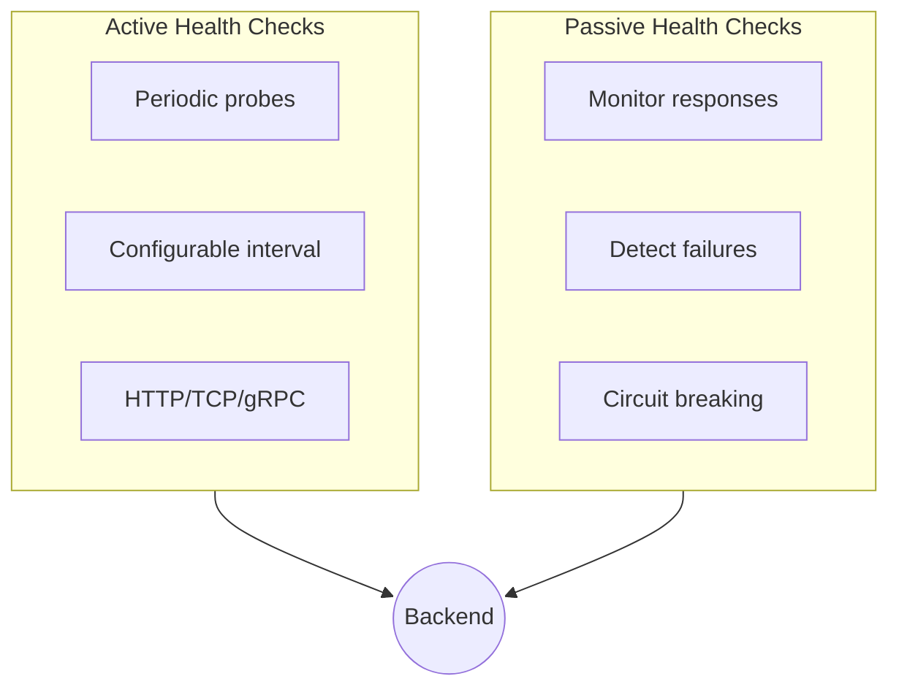
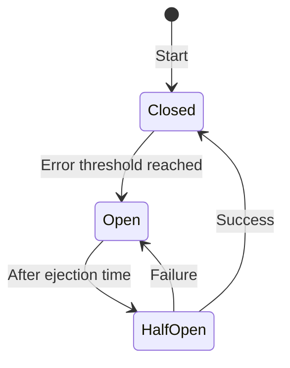
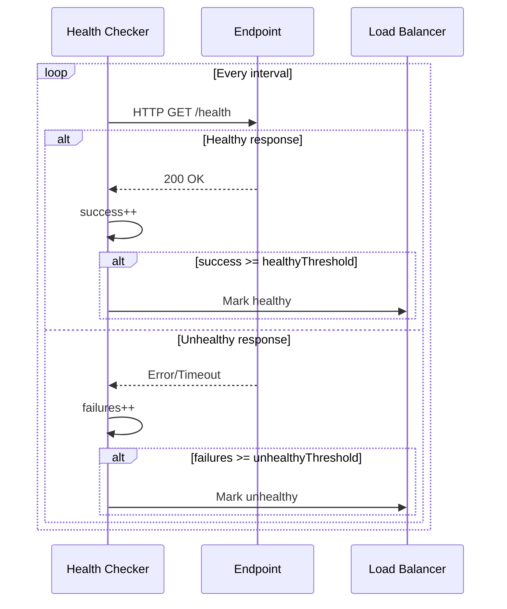

# Health Checks

Configure active and passive health checking for backend services.

## Overview

NovaEdge supports two types of health checking:



## Active Health Checks

Periodically probe backends to determine health.

### HTTP Health Check

```yaml
apiVersion: novaedge.io/v1alpha1
kind: ProxyBackend
metadata:
  name: api-backend
spec:
  serviceRef:
    name: api-service
    port: 8080
  lbPolicy: RoundRobin
  healthCheck:
    protocol: HTTP
    interval: 10s
    timeout: 5s
    healthyThreshold: 2
    unhealthyThreshold: 3
    httpHealthCheck:
      path: /health
      expectedStatuses:
        - 200
        - 204
      headers:
        - name: X-Health-Check
          value: novaedge
```

### TCP Health Check

```yaml
apiVersion: novaedge.io/v1alpha1
kind: ProxyBackend
metadata:
  name: redis-backend
spec:
  serviceRef:
    name: redis
    port: 6379
  healthCheck:
    protocol: TCP
    interval: 5s
    timeout: 2s
    healthyThreshold: 1
    unhealthyThreshold: 3
```

### gRPC Health Check

```yaml
apiVersion: novaedge.io/v1alpha1
kind: ProxyBackend
metadata:
  name: grpc-backend
spec:
  serviceRef:
    name: grpc-service
    port: 9090
  healthCheck:
    protocol: GRPC
    interval: 10s
    timeout: 5s
    healthyThreshold: 2
    unhealthyThreshold: 3
    grpcHealthCheck:
      serviceName: "my.service.Health"
```

### Health Check Options

| Field | Default | Description |
|-------|---------|-------------|
| `protocol` | HTTP | Check protocol (HTTP, TCP, GRPC) |
| `interval` | 10s | Time between checks |
| `timeout` | 5s | Check timeout |
| `healthyThreshold` | 2 | Consecutive successes to mark healthy |
| `unhealthyThreshold` | 3 | Consecutive failures to mark unhealthy |
| `initialDelay` | 0s | Delay before first check |

### HTTP Check Options

| Field | Default | Description |
|-------|---------|-------------|
| `path` | /health | Health check path |
| `host` | - | Override Host header |
| `expectedStatuses` | [200] | Expected status codes |
| `headers` | [] | Additional headers |

## Passive Health Checks

Monitor actual traffic for failures.

```yaml
apiVersion: novaedge.io/v1alpha1
kind: ProxyBackend
metadata:
  name: api-backend
spec:
  serviceRef:
    name: api-service
    port: 8080
  passiveHealthCheck:
    enabled: true
    consecutiveErrors: 5
    interval: 30s
    baseEjectionTime: 30s
    maxEjectionPercent: 50
    consecutiveGatewayErrors: 3
```

### Passive Check Options

| Field | Default | Description |
|-------|---------|-------------|
| `enabled` | true | Enable passive checks |
| `consecutiveErrors` | 5 | Errors before ejection |
| `interval` | 30s | Analysis interval |
| `baseEjectionTime` | 30s | Initial ejection duration |
| `maxEjectionPercent` | 50 | Max % of endpoints to eject |
| `consecutiveGatewayErrors` | 0 | 5xx errors before ejection |

## Circuit Breaker

Prevent cascading failures by temporarily removing failing backends.

```yaml
apiVersion: novaedge.io/v1alpha1
kind: ProxyBackend
metadata:
  name: api-backend
spec:
  serviceRef:
    name: api-service
    port: 8080
  circuitBreaker:
    consecutiveErrors: 5
    interval: 30s
    baseEjectionTime: 30s
    maxEjectionPercent: 50
    splitExternalLocalOriginErrors: true
```

### Circuit Breaker States



| State | Description |
|-------|-------------|
| Closed | Normal operation, traffic flows |
| Open | Backend ejected, no traffic |
| Half-Open | Testing if backend recovered |

## Connection Limits

Protect backends from overload:

```yaml
apiVersion: novaedge.io/v1alpha1
kind: ProxyBackend
metadata:
  name: api-backend
spec:
  serviceRef:
    name: api-service
    port: 8080
  connectionLimits:
    maxConnections: 100
    maxPendingRequests: 50
    maxRequestsPerConnection: 1000
    maxRetries: 3
```

### Connection Limit Options

| Field | Default | Description |
|-------|---------|-------------|
| `maxConnections` | 1000 | Maximum connections |
| `maxPendingRequests` | 100 | Maximum pending requests |
| `maxRequestsPerConnection` | 0 | Max requests per connection (0=unlimited) |
| `maxRetries` | 3 | Maximum retries |

## Retry Policy

Configure request retries:

```yaml
apiVersion: novaedge.io/v1alpha1
kind: ProxyBackend
metadata:
  name: api-backend
spec:
  serviceRef:
    name: api-service
    port: 8080
  retryPolicy:
    retryOn:
      - 5xx
      - reset
      - connect-failure
      - retriable-4xx
    numRetries: 3
    perTryTimeout: 5s
    retryBackOff:
      baseInterval: 25ms
      maxInterval: 250ms
```

### Retry Conditions

| Condition | Description |
|-----------|-------------|
| `5xx` | Retry on 5xx responses |
| `reset` | Retry on connection reset |
| `connect-failure` | Retry on connection failure |
| `retriable-4xx` | Retry on 409 |
| `refused-stream` | Retry on REFUSED_STREAM |

## Health Status

Check backend health status:

```bash
# View backend health
kubectl get proxybackend api-backend -o yaml

# Using novactl
novactl get backends
novactl describe backend api-backend
```

Example status:

```yaml
status:
  endpoints:
    - address: 10.0.0.5:8080
      healthy: true
      lastCheck: "2024-01-15T10:30:00Z"
    - address: 10.0.0.6:8080
      healthy: false
      lastCheck: "2024-01-15T10:30:00Z"
      lastError: "connection refused"
  healthyCount: 1
  unhealthyCount: 1
  conditions:
    - type: Healthy
      status: "True"
      message: "At least one endpoint is healthy"
```

## Health Check Flow



## Metrics

| Metric | Description |
|--------|-------------|
| `novaedge_health_check_total` | Total health checks |
| `novaedge_health_check_success_total` | Successful health checks |
| `novaedge_health_check_failure_total` | Failed health checks |
| `novaedge_endpoint_healthy` | Endpoint health status (1=healthy) |
| `novaedge_circuit_breaker_state` | Circuit breaker state |
| `novaedge_ejections_total` | Total ejections |

## Troubleshooting

### All Endpoints Unhealthy

```bash
# Check endpoint status
kubectl get proxybackend api-backend -o yaml

# Check health check path manually
kubectl exec -it <agent-pod> -- curl -v http://<endpoint>:8080/health

# Check agent logs
kubectl logs -n nova-system -l app.kubernetes.io/name=novaedge-agent | grep health
```

### High Ejection Rate

```bash
# Check circuit breaker metrics
curl http://localhost:9090/metrics | grep circuit_breaker

# Review passive health settings
kubectl get proxybackend api-backend -o yaml | grep -A10 passiveHealthCheck
```

## Best Practices

1. **Set appropriate thresholds** - Balance between quick detection and false positives
2. **Use dedicated health endpoints** - Don't use heavy endpoints for health checks
3. **Match health check to traffic** - Use HTTP checks for HTTP services
4. **Configure reasonable timeouts** - Health check timeout < interval
5. **Monitor health metrics** - Alert on elevated failure rates

## Next Steps

- [Load Balancing](load-balancing.md) - Configure LB algorithms
- [Observability](../operations/observability.md) - Monitor health checks
- [Troubleshooting](../operations/troubleshooting.md) - Common issues
