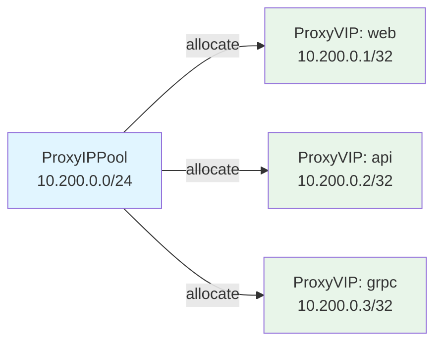
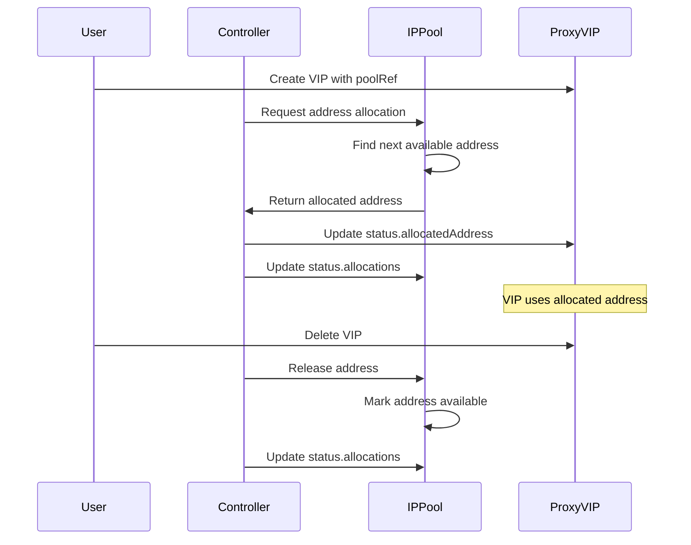

# IP Address Pools

Manage IP address pools for automatic VIP address allocation.

## Overview

`ProxyIPPool` resources define pools of IP addresses from which VIPs can be automatically allocated. This is useful when you want to manage a range of addresses centrally rather than assigning individual IPs to each VIP.



## Creating an IP Pool

### CIDR-Based Pool

Define a pool using CIDR ranges. Addresses within the range are automatically expanded (excluding network and broadcast addresses for IPv4):

```yaml
apiVersion: novaedge.io/v1alpha1
kind: ProxyIPPool
metadata:
  name: main-vip-pool
spec:
  cidrs:
    - "10.200.0.0/24"
  autoAssign: true
```

This creates a pool with 254 usable IPv4 addresses (10.200.0.1 through 10.200.0.254).

### Explicit Address Pool

Define a pool with specific addresses:

```yaml
apiVersion: novaedge.io/v1alpha1
kind: ProxyIPPool
metadata:
  name: external-vip-pool
spec:
  addresses:
    - "203.0.113.10/32"
    - "203.0.113.11/32"
    - "203.0.113.12/32"
  autoAssign: false
```

### Combined Pool

Mix CIDRs and explicit addresses:

```yaml
apiVersion: novaedge.io/v1alpha1
kind: ProxyIPPool
metadata:
  name: mixed-pool
spec:
  cidrs:
    - "10.200.0.0/28"
  addresses:
    - "10.200.1.100/32"
    - "10.200.1.200/32"
  autoAssign: true
```

### IPv6 Pool

```yaml
apiVersion: novaedge.io/v1alpha1
kind: ProxyIPPool
metadata:
  name: ipv6-pool
spec:
  cidrs:
    - "2001:db8::/120"
  autoAssign: true
```

## Pool Specification

| Field | Required | Default | Description |
|-------|----------|---------|-------------|
| `spec.cidrs` | No | [] | CIDR ranges to include in the pool |
| `spec.addresses` | No | [] | Explicit addresses (in CIDR notation) |
| `spec.autoAssign` | No | `false` | Allow automatic address allocation |

At least one of `cidrs` or `addresses` must be specified.

## Using Pools with VIPs

### Automatic Allocation

Reference a pool in a VIP's `poolRef` field. The controller allocates an address automatically:

```yaml
apiVersion: novaedge.io/v1alpha1
kind: ProxyVIP
metadata:
  name: auto-vip
spec:
  mode: BGP
  addressFamily: ipv4
  ports:
    - 80
  poolRef:
    name: main-vip-pool
  bgpConfig:
    localAS: 65000
    routerID: "10.0.0.1"
    peers:
      - address: "10.0.0.254"
        as: 65001
```

When using `poolRef`, the `address` field is optional. The allocated address appears in the VIP status:

```yaml
status:
  allocatedAddress: "10.200.0.1/32"
  conditions:
    - type: Bound
      status: "True"
      reason: AddressAllocated
      message: Address 10.200.0.1/32 allocated from pool main-vip-pool
```

### Static Address with Pool Tracking

You can specify an `address` even when using `poolRef` to request a specific address from the pool:

```yaml
apiVersion: novaedge.io/v1alpha1
kind: ProxyVIP
metadata:
  name: specific-vip
spec:
  address: 10.200.0.50/32
  mode: L2ARP
  addressFamily: ipv4
  ports:
    - 80
  poolRef:
    name: main-vip-pool
```

## Pool Status

Check pool status to see allocation information:

```bash
# List all pools
kubectl get proxyippool

# Using novactl
novactl get ippools
```

Example output:

```
NAME              ALLOCATED   AVAILABLE   AUTO-ASSIGN   AGE
main-vip-pool     3           251         true          5h
external-pool     1           2           false         3h
```

Detailed status:

```yaml
status:
  allocated: 3
  available: 251
  allocations:
    - address: "10.200.0.1/32"
      vipRef: "web-vip"
      allocatedAt: "2024-01-15T10:30:00Z"
    - address: "10.200.0.2/32"
      vipRef: "api-vip"
      allocatedAt: "2024-01-15T10:31:00Z"
    - address: "10.200.0.3/32"
      vipRef: "grpc-vip"
      allocatedAt: "2024-01-15T10:32:00Z"
  conditions:
    - type: Ready
      status: "True"
      reason: PoolReady
      message: Pool has 251 available addresses
```

## Allocation Lifecycle



## Conflict Detection

The IPAM allocator checks for address conflicts across all pools:

- An address cannot be allocated to two different VIPs
- An address from one pool cannot conflict with an address in another pool
- If a VIP specifies both `address` and `poolRef`, the address is validated against the pool

## Safety Limits

To prevent memory issues, CIDR expansion is limited to 65,536 addresses per CIDR range. For larger ranges, split into multiple CIDRs or use explicit addresses.

| CIDR | Usable Addresses |
|------|-----------------|
| /32 | 1 |
| /28 | 14 |
| /24 | 254 |
| /20 | 4,094 |
| /16 | 65,534 (capped at 65,536) |

## Troubleshooting

### Pool Exhausted

If allocation fails with "pool exhausted":

```bash
# Check pool status
kubectl get proxyippool main-vip-pool -o yaml

# Check current allocations
kubectl get proxyvip -o jsonpath='{range .items[*]}{.metadata.name}{"\t"}{.status.allocatedAddress}{"\n"}{end}'
```

### Address Conflicts

If you see address conflict errors:

```bash
# Check all pool allocations
kubectl get proxyippool -o yaml

# Verify no manual address overlaps with pool ranges
kubectl get proxyvip -o jsonpath='{range .items[*]}{.metadata.name}{"\t"}{.spec.address}{"\n"}{end}'
```

## Next Steps

- [VIP Management](vip-management.md) - VIP modes and configuration
- [Routing](routing.md) - Configure routes
- [CRD Reference](../reference/crd-reference.md) - Full API reference
