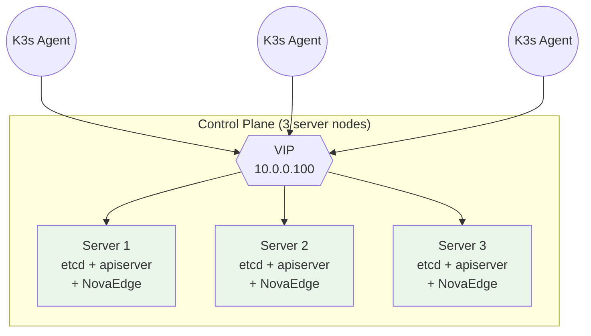
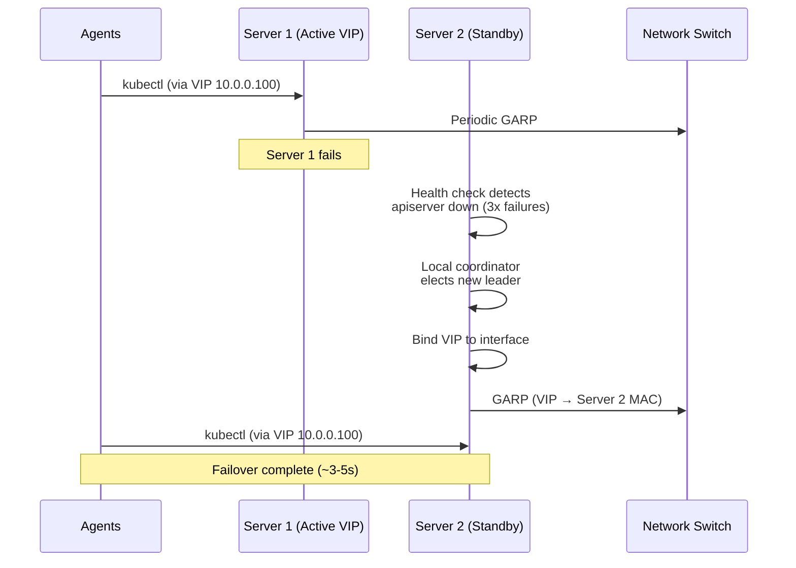
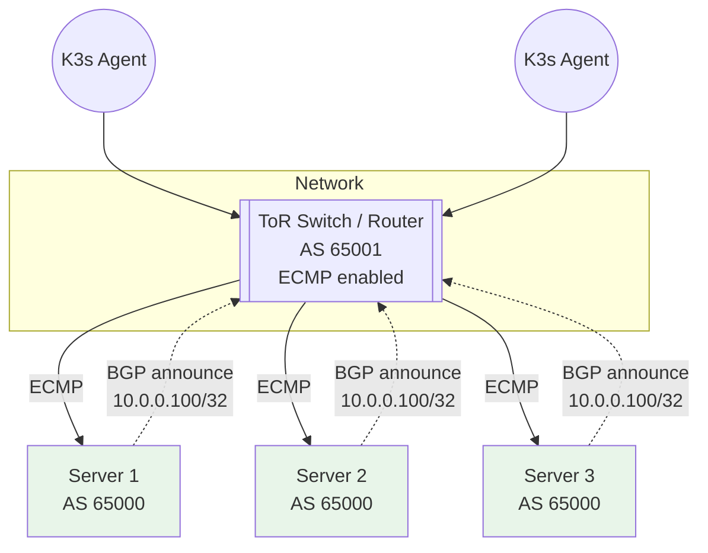
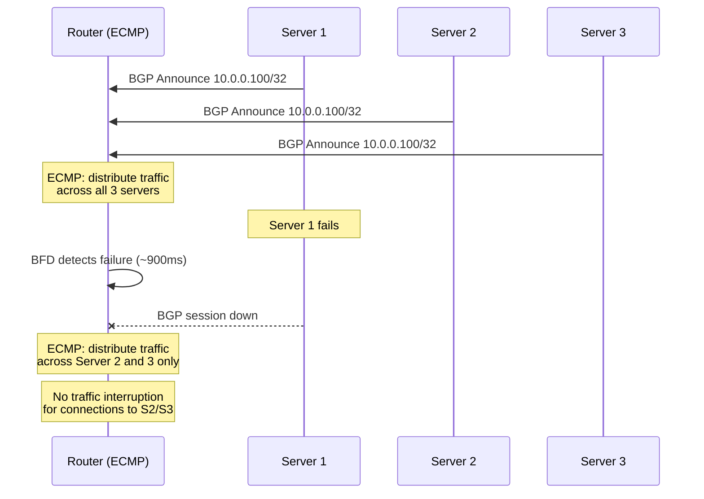
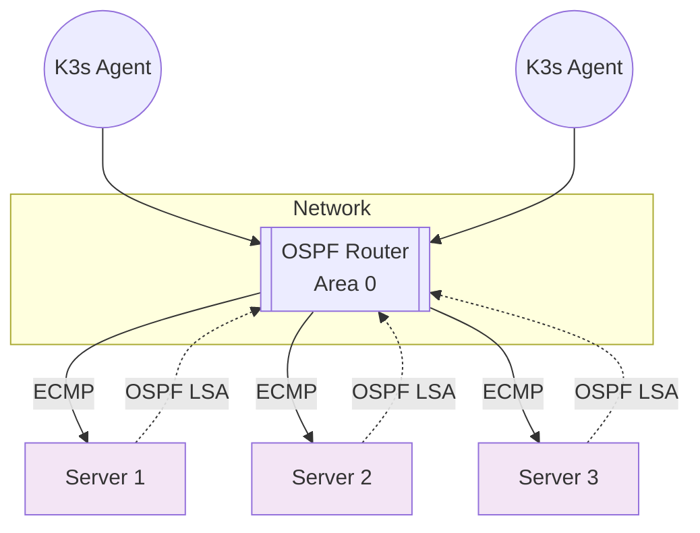
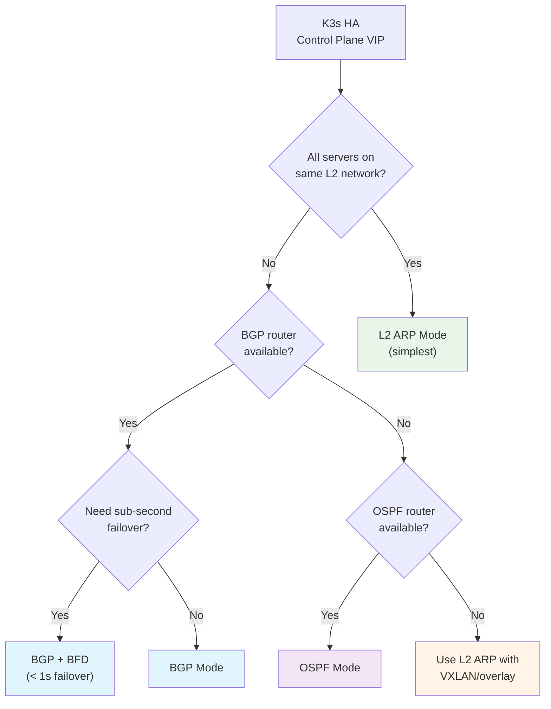

# K3s Control Plane HA with NovaEdge

Deploy NovaEdge as a kube-vip replacement to provide control plane HA and service load balancing for K3s clusters.

## Overview

K3s supports high availability with embedded etcd, but requires a fixed registration address (VIP) so agents can reach the API server even when individual server nodes fail. NovaEdge provides this VIP through three modes:

| Mode | Network | Failover | Best For |
|------|---------|----------|----------|
| [L2 ARP](#l2-arp-mode) | Layer 2 | Active/Standby (~1-3s) | Simple flat networks |
| [BGP](#bgp-mode) | Layer 3 | Active/Active (ECMP) | Data centers with ToR switches |
| [OSPF](#ospf-mode) | Layer 3 | Active/Active (ECMP) | OSPF-only environments |



## Prerequisites

- 3+ server nodes for K3s HA (embedded etcd requires an odd number)
- A VIP address on the same network as the server nodes (L2 mode) or routable via BGP/OSPF
- `novaedge-agent` binary or container image available on all server nodes
- Ports 2379-2380 open between server nodes (etcd)
- Port 6443 open for kube-apiserver

## L2 ARP Mode

The simplest mode. One node owns the VIP at a time. On failure, another node takes over and sends a Gratuitous ARP to update the network switch's MAC table.

**Requirements:** All server nodes must be on the same Layer 2 network segment.

### Step 1: Generate the static pod manifest

On each server node, generate a static pod manifest. Replace `10.0.0.100/32` with your chosen VIP address:

```bash
# On server-1
novactl generate static-pod \
  --vip-address 10.0.0.100/32 \
  --image ghcr.io/azrtydxb/novaedge-agent:latest \
  --node-name server-1 \
  > /var/lib/rancher/k3s/agent/pod-manifests/novaedge-cpvip.yaml
```

```bash
# On server-2
novactl generate static-pod \
  --vip-address 10.0.0.100/32 \
  --image ghcr.io/azrtydxb/novaedge-agent:latest \
  --node-name server-2 \
  > /var/lib/rancher/k3s/agent/pod-manifests/novaedge-cpvip.yaml
```

```bash
# On server-3
novactl generate static-pod \
  --vip-address 10.0.0.100/32 \
  --image ghcr.io/azrtydxb/novaedge-agent:latest \
  --node-name server-3 \
  > /var/lib/rancher/k3s/agent/pod-manifests/novaedge-cpvip.yaml
```

> **Note:** K3s uses `/var/lib/rancher/k3s/agent/pod-manifests/` for static pods instead of the standard `/etc/kubernetes/manifests/`.

### Alternative: Systemd service

If you prefer running NovaEdge outside of Kubernetes (e.g., before the cluster is bootstrapped):

```bash
# Install the binary
curl -Lo /usr/local/bin/novaedge-agent \
  https://github.com/azrtydxb/novaedge/releases/latest/download/novaedge-agent-linux-amd64
chmod +x /usr/local/bin/novaedge-agent

# Generate the systemd unit
novactl generate systemd-unit \
  --vip-address 10.0.0.100/32 \
  --node-name $(hostname) \
  > /etc/systemd/system/novaedge-cpvip.service

# Enable and start
systemctl daemon-reload
systemctl enable --now novaedge-cpvip.service
```

### Step 2: Initialize the first K3s server

On the first server node, initialize K3s with the VIP as a TLS SAN:

```bash
curl -sfL https://get.k3s.io | K3S_TOKEN=my-cluster-token sh -s - server \
  --cluster-init \
  --tls-san=10.0.0.100 \
  --disable=servicelb
```

**Flags explained:**
- `--cluster-init`: Initializes embedded etcd on this node
- `--tls-san=10.0.0.100`: Adds the VIP to the API server's TLS certificate SANs so agents can connect through the VIP without certificate errors
- `--disable=servicelb`: Disables K3s's built-in ServiceLB (Klipper) since NovaEdge will handle it

### Step 3: Join additional server nodes

On server-2 and server-3, join the cluster using the VIP address:

```bash
curl -sfL https://get.k3s.io | K3S_TOKEN=my-cluster-token sh -s - server \
  --server https://10.0.0.100:6443 \
  --tls-san=10.0.0.100 \
  --disable=servicelb
```

### Step 4: Join agent nodes

Agent nodes connect through the VIP:

```bash
curl -sfL https://get.k3s.io | K3S_TOKEN=my-cluster-token sh -s - agent \
  --server https://10.0.0.100:6443
```

### Step 5: Verify

```bash
# Check the VIP is bound
kubectl get pods -n kube-system | grep novaedge

# Test API server access through the VIP
kubectl --server=https://10.0.0.100:6443 get nodes

# Check which node holds the VIP
ip addr show | grep 10.0.0.100
```

### Failover behavior

When the active node fails:



---

## BGP Mode

All server nodes announce the VIP via BGP. Your ToR switch or router performs ECMP (Equal-Cost Multi-Path) load balancing across all healthy nodes. This provides active/active load distribution with instant failover when a BGP session drops.

**Requirements:** A BGP-capable router (physical switch, FRRouting, BIRD, etc.) peered with each server node.

### Network topology



### Step 1: Configure your router

Example for FRRouting (FRR):

```
router bgp 65001
 neighbor 10.0.0.11 remote-as 65000
 neighbor 10.0.0.12 remote-as 65000
 neighbor 10.0.0.13 remote-as 65000

 address-family ipv4 unicast
  maximum-paths 16
 exit-address-family
```

Where `10.0.0.11-13` are the server node IPs.

### Step 2: Deploy NovaEdge with BGP config

For BGP mode, use the systemd approach since NovaEdge needs to run before the cluster is fully up. Create a config file on each server node:

**On server-1 (`10.0.0.11`):**

```bash
cat > /etc/novaedge/cpvip.env <<'EOF'
NOVAEDGE_CP_VIP_ADDRESS=10.0.0.100/32
NOVAEDGE_CP_VIP_MODE=bgp
NOVAEDGE_BGP_LOCAL_AS=65000
NOVAEDGE_BGP_ROUTER_ID=10.0.0.11
NOVAEDGE_BGP_PEER_ADDRESS=10.0.0.254
NOVAEDGE_BGP_PEER_AS=65001
EOF
```

> **Note:** BGP mode for the control plane VIP currently requires using NovaEdge after the cluster is bootstrapped. For pre-bootstrap scenarios, start with L2 ARP mode and switch to BGP once the cluster is running.

After the cluster is bootstrapped, deploy NovaEdge as a DaemonSet on server nodes and create the VIP resource:

```yaml
# control-plane-vip.yaml
apiVersion: novaedge.io/v1alpha1
kind: ProxyVIP
metadata:
  name: k3s-cp-vip
spec:
  address: 10.0.0.100/32
  mode: BGP
  addressFamily: ipv4
  ports:
    - 6443
  bgpConfig:
    localAS: 65000
    routerID: "10.0.0.11"
    peers:
      - address: "10.0.0.254"
        as: 65001
        port: 179
  nodeSelector:
    matchLabels:
      node-role.kubernetes.io/control-plane: "true"
```

```bash
kubectl apply -f control-plane-vip.yaml
```

### Step 3: Add BFD for sub-second failover (optional)

BFD (Bidirectional Forwarding Detection) detects link failures in under a second, much faster than BGP's default hold timer (90s):

```yaml
apiVersion: novaedge.io/v1alpha1
kind: ProxyVIP
metadata:
  name: k3s-cp-vip
spec:
  address: 10.0.0.100/32
  mode: BGP
  addressFamily: ipv4
  ports:
    - 6443
  bgpConfig:
    localAS: 65000
    routerID: "10.0.0.11"
    peers:
      - address: "10.0.0.254"
        as: 65001
  bfd:
    enabled: true
    detectMultiplier: 3
    desiredMinTxInterval: "300ms"
    requiredMinRxInterval: "300ms"
  nodeSelector:
    matchLabels:
      node-role.kubernetes.io/control-plane: "true"
```

Configure BFD on your router as well:

```
! FRRouting BFD config
bfd
 peer 10.0.0.11
  detect-multiplier 3
  receive-interval 300
  transmit-interval 300
 !
 peer 10.0.0.12
  detect-multiplier 3
  receive-interval 300
  transmit-interval 300
 !
 peer 10.0.0.13
  detect-multiplier 3
  receive-interval 300
  transmit-interval 300
 !
!
router bgp 65001
 neighbor 10.0.0.11 bfd
 neighbor 10.0.0.12 bfd
 neighbor 10.0.0.13 bfd
```

With BFD enabled, failover time drops from seconds to ~900ms (3 x 300ms).

### Failover behavior



---

## OSPF Mode

OSPF mode announces the VIP as an AS-External LSA. All healthy nodes announce equal-cost routes, and the router performs ECMP. This is the right choice if your network runs OSPF and doesn't support BGP.

**Requirements:** An OSPF-capable router in the same OSPF area as the server nodes.

### Network topology



### Configuration

Like BGP, OSPF mode works best as a CRD resource after the cluster is bootstrapped. Use L2 ARP for initial bootstrap, then switch to OSPF:

```yaml
# control-plane-vip-ospf.yaml
apiVersion: novaedge.io/v1alpha1
kind: ProxyVIP
metadata:
  name: k3s-cp-vip
spec:
  address: 10.0.0.100/32
  mode: OSPF
  addressFamily: ipv4
  ports:
    - 6443
  ospfConfig:
    routerID: "10.0.0.11"
    areaID: 0
    cost: 10
    helloInterval: 10
    deadInterval: 40
  nodeSelector:
    matchLabels:
      node-role.kubernetes.io/control-plane: "true"
```

### Router configuration (FRRouting)

```
router ospf
 ospf router-id 10.0.0.254
 redistribute connected
 network 10.0.0.0/24 area 0
 maximum-paths 16

interface eth0
 ip ospf area 0
 ip ospf cost 10
 ip ospf hello-interval 10
 ip ospf dead-interval 40
```

### With MD5 authentication

```yaml
apiVersion: novaedge.io/v1alpha1
kind: ProxyVIP
metadata:
  name: k3s-cp-vip
spec:
  address: 10.0.0.100/32
  mode: OSPF
  addressFamily: ipv4
  ports:
    - 6443
  ospfConfig:
    routerID: "10.0.0.11"
    areaID: 0
    cost: 10
    authType: md5
    authKey: "mySecretKey123"
    gracefulRestart: true
  nodeSelector:
    matchLabels:
      node-role.kubernetes.io/control-plane: "true"
```

---

## Service LoadBalancer Integration

After the cluster is running, enable NovaEdge as the Service LoadBalancer to replace K3s's built-in Klipper (ServiceLB).

### Step 1: Deploy NovaEdge controller

Deploy the NovaEdge controller with the `--enable-service-lb` flag:

```bash
helm install novaedge novaedge/novaedge \
  --namespace nova-system \
  --create-namespace \
  --set controller.extraArgs[0]="--enable-service-lb"
```

Or if deploying manually, add the flag to the controller deployment:

```yaml
args:
  - "--enable-service-lb"
```

### Step 2: Create an IP pool

```yaml
apiVersion: novaedge.io/v1alpha1
kind: ProxyIPPool
metadata:
  name: default
spec:
  cidrs:
    - "10.0.0.200/28"
  autoAssign: true
```

This creates a pool of 14 addresses (10.0.0.201-10.0.0.214) for service VIPs.

### Step 3: Create a LoadBalancer Service

Annotate your Service with the VIP mode to trigger automatic VIP creation:

```yaml
apiVersion: v1
kind: Service
metadata:
  name: my-app
  annotations:
    novaedge.io/vip-mode: "L2ARP"
    novaedge.io/address-pool: "default"
spec:
  type: LoadBalancer
  ports:
    - port: 80
      targetPort: 8080
  selector:
    app: my-app
```

NovaEdge automatically:
1. Allocates an IP from the pool
2. Creates a `ProxyVIP` resource
3. Updates `Service.status.loadBalancer.ingress` with the allocated IP

```bash
# Verify the Service got an external IP
kubectl get svc my-app
# NAME     TYPE           CLUSTER-IP    EXTERNAL-IP    PORT(S)        AGE
# my-app   LoadBalancer   10.43.0.100   10.0.0.201     80:31234/TCP   30s
```

### Service annotations reference

| Annotation | Required | Default | Description |
|------------|----------|---------|-------------|
| `novaedge.io/vip-mode` | Yes | - | `L2ARP`, `BGP`, or `OSPF` |
| `novaedge.io/address-pool` | No | `default` | IP pool name |
| `novaedge.io/address-family` | No | `ipv4` | `ipv4`, `ipv6`, or `dual` |
| `novaedge.io/bgp-config` | No | - | JSON BGP config |
| `novaedge.io/ospf-config` | No | - | JSON OSPF config |
| `novaedge.io/bfd-enabled` | No | `false` | Enable BFD |
| `novaedge.io/node-selector` | No | - | JSON label selector |

### BGP service example

```yaml
apiVersion: v1
kind: Service
metadata:
  name: my-app-bgp
  annotations:
    novaedge.io/vip-mode: "BGP"
    novaedge.io/address-pool: "default"
    novaedge.io/bgp-config: |
      {
        "localAS": 65000,
        "routerID": "10.0.0.11",
        "peers": [
          {"address": "10.0.0.254", "as": 65001}
        ]
      }
    novaedge.io/bfd-enabled: "true"
spec:
  type: LoadBalancer
  ports:
    - port: 443
      targetPort: 8443
  selector:
    app: my-app
```

---

## Choosing a Mode



| Scenario | Mode | Failover Time | Complexity |
|----------|------|---------------|------------|
| Home lab / small office | L2 ARP | ~3-5s | Low |
| Data center with ToR BGP | BGP | ~seconds | Medium |
| Data center with BFD | BGP + BFD | < 1s | Medium |
| OSPF-only network | OSPF | ~seconds | Medium |
| Multi-subnet / routed | BGP or OSPF | ~seconds | Medium-High |

### L2 ARP advantages

- Simplest to set up (no router config needed)
- Works on any flat Layer 2 network
- Pre-bootstrap support via static pod or systemd
- No dependency on external routing infrastructure

### BGP advantages

- Active/active: all nodes serve traffic simultaneously via ECMP
- No single point of failure at the VIP level
- Scales to many nodes
- Sub-second failover with BFD
- Standard in data center environments

### OSPF advantages

- Active/active with ECMP
- Works in OSPF-only environments
- Supports authentication (plaintext, MD5)
- Graceful restart reduces disruption during planned maintenance

---

## Complete Example: 3-Node K3s HA with L2 ARP

This is the most common setup for small to medium deployments.

### Network layout

```
Server 1: 10.0.0.11 (server-1)
Server 2: 10.0.0.12 (server-2)
Server 3: 10.0.0.13 (server-3)
CP VIP:   10.0.0.100
Svc pool: 10.0.0.200/28 (14 addresses)
```

### On all three server nodes

```bash
# Install novaedge-agent
curl -Lo /usr/local/bin/novaedge-agent \
  https://github.com/azrtydxb/novaedge/releases/latest/download/novaedge-agent-linux-amd64
chmod +x /usr/local/bin/novaedge-agent

# Install novactl
curl -Lo /usr/local/bin/novactl \
  https://github.com/azrtydxb/novaedge/releases/latest/download/novactl-linux-amd64
chmod +x /usr/local/bin/novactl

# Generate and install systemd unit for CP VIP
novactl generate systemd-unit \
  --vip-address 10.0.0.100/32 \
  --node-name $(hostname) \
  > /etc/systemd/system/novaedge-cpvip.service

systemctl daemon-reload
systemctl enable --now novaedge-cpvip.service
```

### On server-1 (first node)

```bash
curl -sfL https://get.k3s.io | K3S_TOKEN=my-secret-token sh -s - server \
  --cluster-init \
  --tls-san=10.0.0.100 \
  --disable=servicelb
```

### On server-2 and server-3

```bash
curl -sfL https://get.k3s.io | K3S_TOKEN=my-secret-token sh -s - server \
  --server https://10.0.0.100:6443 \
  --tls-san=10.0.0.100 \
  --disable=servicelb
```

### Deploy NovaEdge controller for Service LB

```bash
# Install NovaEdge with Helm
helm repo add novaedge https://azrtydxb.github.io/novaedge
helm install novaedge novaedge/novaedge \
  --namespace nova-system \
  --create-namespace \
  --set controller.extraArgs[0]="--enable-service-lb"

# Create IP pool for services
cat <<EOF | kubectl apply -f -
apiVersion: novaedge.io/v1alpha1
kind: ProxyIPPool
metadata:
  name: default
spec:
  cidrs:
    - "10.0.0.200/28"
  autoAssign: true
EOF
```

### Join agent nodes

```bash
curl -sfL https://get.k3s.io | K3S_TOKEN=my-secret-token sh -s - agent \
  --server https://10.0.0.100:6443
```

### Verify everything

```bash
# Check cluster nodes
kubectl get nodes
# NAME       STATUS   ROLES                       AGE
# server-1   Ready    control-plane,etcd,master    10m
# server-2   Ready    control-plane,etcd,master    8m
# server-3   Ready    control-plane,etcd,master    6m

# Check CP VIP
systemctl status novaedge-cpvip

# Check IP pool
kubectl get proxyippool
# NAME      ALLOCATED   AVAILABLE   AGE
# default   0           14          2m

# Test with a LoadBalancer service
kubectl create deployment nginx --image=nginx --replicas=3
kubectl expose deployment nginx --type=LoadBalancer --port=80 \
  --overrides='{"metadata":{"annotations":{"novaedge.io/vip-mode":"L2ARP"}}}'

kubectl get svc nginx
# NAME    TYPE           CLUSTER-IP    EXTERNAL-IP    PORT(S)        AGE
# nginx   LoadBalancer   10.43.0.50    10.0.0.201     80:32100/TCP   10s

curl http://10.0.0.201
# <!DOCTYPE html>...
```

---

## Migrating from kube-vip

If you're currently using kube-vip, here's how to migrate:

1. **Note your current VIP address** from the kube-vip configuration
2. **Install NovaEdge CP VIP** on all server nodes (systemd or static pod) with the same VIP address
3. **Stop kube-vip** on all nodes:
   ```bash
   # If using static pod
   rm /var/lib/rancher/k3s/agent/pod-manifests/kube-vip.yaml
   # If using DaemonSet
   kubectl delete daemonset kube-vip -n kube-system
   ```
4. **Verify NovaEdge** holds the VIP:
   ```bash
   ip addr show | grep <your-vip>
   systemctl status novaedge-cpvip
   ```
5. **For Service LB**: Deploy the NovaEdge controller with `--enable-service-lb` and create IP pools matching your kube-vip address ranges

> **Important:** Do not run both kube-vip and NovaEdge CP VIP simultaneously on the same nodes, as they will conflict over the VIP address.

---

## Troubleshooting

### VIP not being assigned

```bash
# Check NovaEdge agent logs
journalctl -u novaedge-cpvip -f

# Check if the VIP is bound to an interface
ip addr show | grep 10.0.0.100

# Check apiserver health (what NovaEdge checks)
curl -k https://localhost:6443/healthz
```

### Agents can't reach the API server

```bash
# Verify the VIP is reachable from an agent node
ping 10.0.0.100

# Check TLS SAN includes the VIP
openssl s_client -connect 10.0.0.100:6443 </dev/null 2>/dev/null | \
  openssl x509 -noout -text | grep -A1 "Subject Alternative Name"

# If the VIP is missing from the SAN, add it:
# Edit /etc/rancher/k3s/config.yaml on all servers:
#   tls-san:
#     - "10.0.0.100"
# Then restart k3s: systemctl restart k3s
```

### Service not getting an external IP

```bash
# Check the Service has the required annotation
kubectl get svc <name> -o jsonpath='{.metadata.annotations}'

# Check the NovaEdge controller logs
kubectl logs -n nova-system deploy/novaedge-controller | grep service

# Check the IP pool has available addresses
kubectl get proxyippool default -o yaml

# Check events on the Service
kubectl describe svc <name> | grep Events
```

### BGP sessions not establishing

```bash
# Check BGP session from the router side
show ip bgp summary

# Check NovaEdge agent logs for BGP errors
kubectl logs -n nova-system -l app.kubernetes.io/name=novaedge-agent | grep bgp

# Verify connectivity to BGP peer
nc -zv 10.0.0.254 179
```

---

## Next Steps

- [VIP Management](vip-management.md) - Full VIP mode reference
- [IP Address Pools](ip-pools.md) - Pool configuration and IPAM
- [Load Balancing](load-balancing.md) - LB algorithm configuration
- [TLS](tls.md) - TLS certificate management
- [Policies](policies.md) - Rate limiting, auth, WAF
