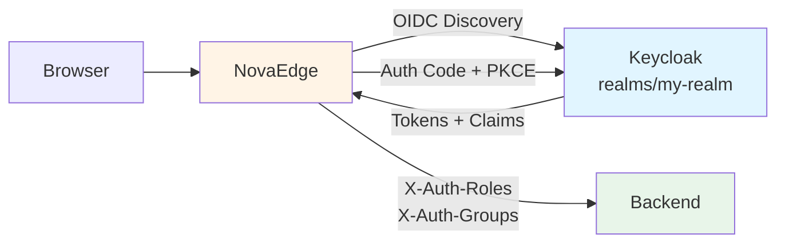

# Keycloak Integration

NovaEdge provides first-class integration with Keycloak for enterprise SSO with role-based access control.

## Overview



## Prerequisites

1. A running Keycloak instance
2. A Keycloak realm configured
3. A confidential client created in Keycloak with:
   - Valid redirect URIs (e.g., `https://myapp.example.com/oauth2/callback`)
   - Client authentication enabled
   - Standard flow enabled

## Keycloak Client Setup

### Step 1: Create a Client

In your Keycloak admin console:

1. Navigate to your realm
2. Go to Clients and click "Create client"
3. Set the Client ID (e.g., `my-application`)
4. Enable Client authentication
5. Set Valid redirect URIs: `https://myapp.example.com/oauth2/callback`
6. Set Valid post logout redirect URIs: `https://myapp.example.com/`

### Step 2: Configure Client Scopes

Ensure these scopes are assigned to your client:
- `openid` (default)
- `profile`
- `email`
- `roles` (add as optional/default scope for role claims)

### Step 3: Configure Group Mapper (Optional)

To include groups in the JWT:

1. Go to Client Scopes > your client scope
2. Add a mapper: "Group Membership"
3. Set token claim name: `groups`
4. Enable "Add to ID token"

## NovaEdge Configuration

### Basic Keycloak Auth

```yaml
apiVersion: novaedge.io/v1alpha1
kind: ProxyPolicy
metadata:
  name: keycloak-auth
spec:
  type: OIDC
  targetRef:
    kind: ProxyRoute
    name: webapp-route
  oidc:
    provider: keycloak
    clientID: "my-application"
    clientSecretRef:
      name: keycloak-client-secret
    redirectURL: "https://myapp.example.com/oauth2/callback"
    scopes:
      - openid
      - profile
      - email
      - roles
    sessionSecretRef:
      name: keycloak-session-secret
    keycloak:
      serverURL: "https://keycloak.example.com"
      realm: "my-realm"
```

Note: When `provider: keycloak` is set, the `issuerURL` is automatically constructed from the Keycloak `serverURL` and `realm`.

### Keycloak with Role-Based Access

```yaml
apiVersion: novaedge.io/v1alpha1
kind: ProxyPolicy
metadata:
  name: keycloak-admin-only
spec:
  type: OIDC
  targetRef:
    kind: ProxyRoute
    name: admin-route
  oidc:
    provider: keycloak
    clientID: "my-application"
    clientSecretRef:
      name: keycloak-client-secret
    redirectURL: "https://myapp.example.com/oauth2/callback"
    scopes:
      - openid
      - profile
      - email
      - roles
    sessionSecretRef:
      name: keycloak-session-secret
    keycloak:
      serverURL: "https://keycloak.example.com"
      realm: "my-realm"
      roleClaim: "realm_access.roles"
      groupClaim: "groups"
    authorization:
      requiredRoles:
        - admin
      mode: any
```

### Create Required Secrets

```bash
# Client secret (from Keycloak client credentials tab)
kubectl create secret generic keycloak-client-secret \
  --from-literal=client-secret="$(cat keycloak-client-secret.txt)"

# Session encryption key
kubectl create secret generic keycloak-session-secret \
  --from-literal=session-secret="$(openssl rand 32)"
```

## Keycloak JWT Claims

### Realm Roles

Keycloak stores realm roles in the `realm_access.roles` claim:

```json
{
  "realm_access": {
    "roles": ["admin", "user", "offline_access"]
  }
}
```

### Client Roles

Client-specific roles are in `resource_access.<clientID>.roles`:

```json
{
  "resource_access": {
    "my-application": {
      "roles": ["app-admin", "app-editor"]
    }
  }
}
```

NovaEdge automatically extracts both realm and client roles when using the Keycloak provider.

### Groups

Groups are in the `groups` claim (requires Group Membership mapper):

```json
{
  "groups": ["/engineering", "/platform-team"]
}
```

## Headers Forwarded to Backend

When using Keycloak, NovaEdge sets these headers on upstream requests:

| Header | Description | Example |
|--------|-------------|---------|
| `X-Auth-Subject` | User ID (sub claim) | `f1234-abcd-5678` |
| `X-Auth-Email` | User email | `user@example.com` |
| `X-Auth-Name` | Full name | `John Doe` |
| `X-Auth-Username` | Keycloak username | `jdoe` |
| `X-Auth-Roles` | Comma-separated roles | `admin,user,app-editor` |
| `X-Auth-Groups` | Comma-separated groups | `/engineering,/platform` |
| `X-Auth-Realm` | Keycloak realm name | `my-realm` |

## Authorization Modes

### Any Mode (OR)

User needs **any one** of the required roles or groups:

```yaml
authorization:
  requiredRoles: [admin, super-admin]
  requiredGroups: [/platform-team]
  mode: any
```

A user with the `admin` role OR membership in `/platform-team` passes.

### All Mode (AND)

User needs **all** required roles and groups:

```yaml
authorization:
  requiredRoles: [admin]
  requiredGroups: [/engineering]
  mode: all
```

A user must have the `admin` role AND be in the `/engineering` group.

## Logout

NovaEdge provides a logout endpoint at `/oauth2/logout` that:

1. Clears the NovaEdge session cookie
2. Redirects to Keycloak's logout endpoint
3. Keycloak clears its session and redirects back to your application

## Troubleshooting

### Common Issues

| Issue | Solution |
|-------|----------|
| "Failed to create OIDC provider" | Verify Keycloak server URL and realm name |
| 403 after login | Check that the user has the required roles/groups in Keycloak |
| Session cookie not set | Verify `redirectURL` matches the configured redirect URI in Keycloak |
| Token refresh fails | Ensure the client has "offline_access" scope |

### Debugging Claims

To see what claims are in your Keycloak token, decode the JWT at [jwt.io](https://jwt.io) or use:

```bash
# Get a token using the Keycloak token endpoint
curl -s -X POST "https://keycloak.example.com/realms/my-realm/protocol/openid-connect/token" \
  -d "grant_type=password" \
  -d "client_id=my-application" \
  -d "client_secret=YOUR_SECRET" \
  -d "username=testuser" \
  -d "password=testpass" | jq -r '.access_token' | cut -d. -f2 | base64 -d | jq .
```
