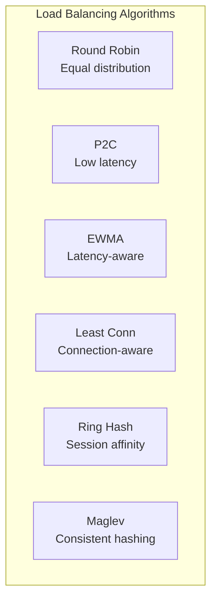
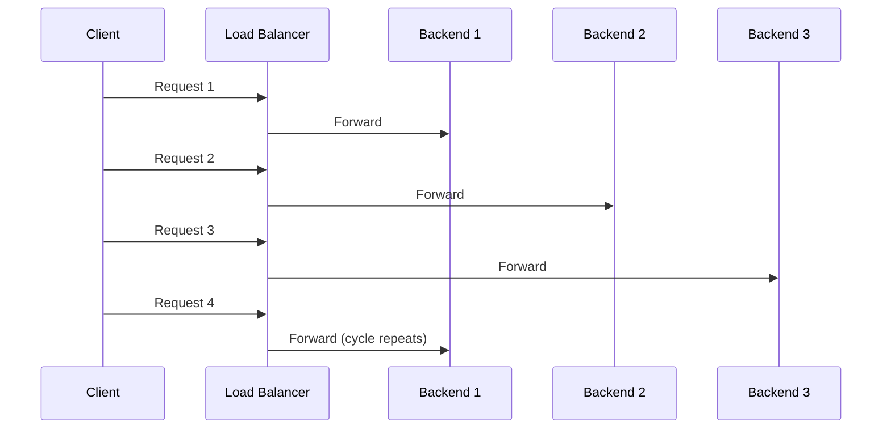
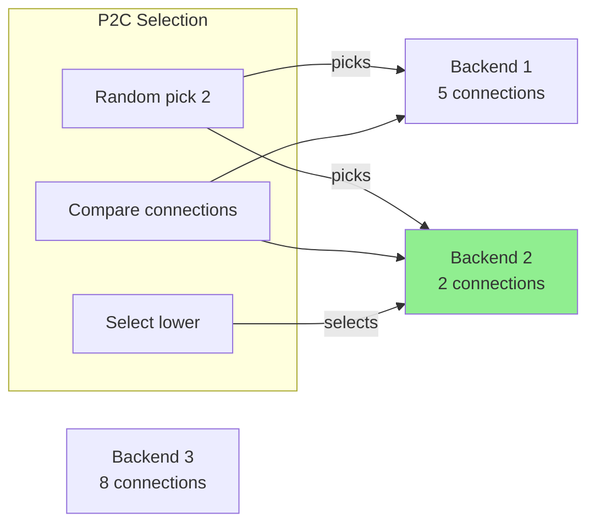
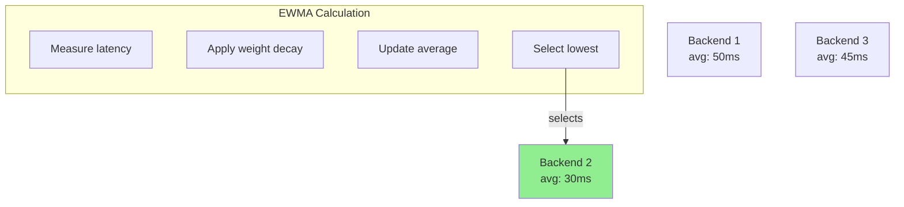
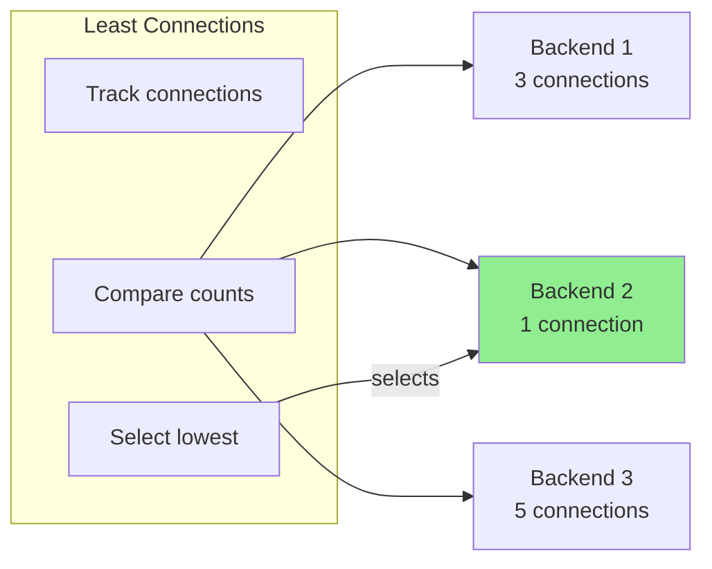
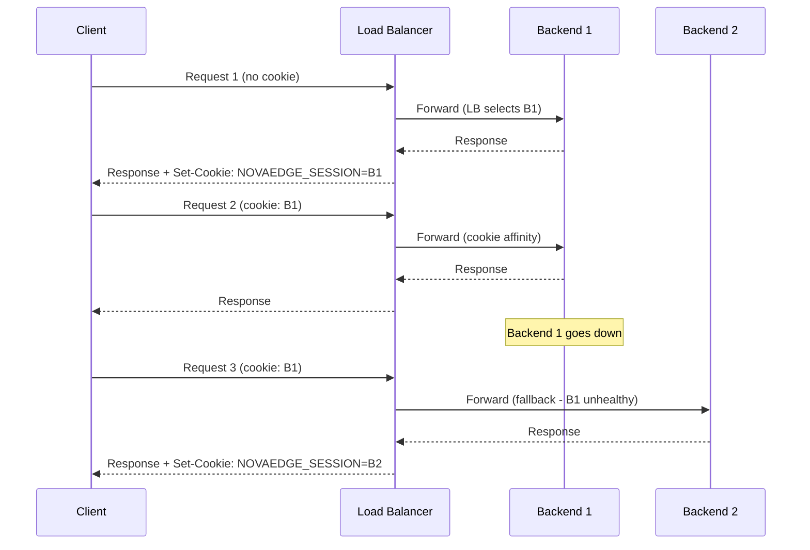
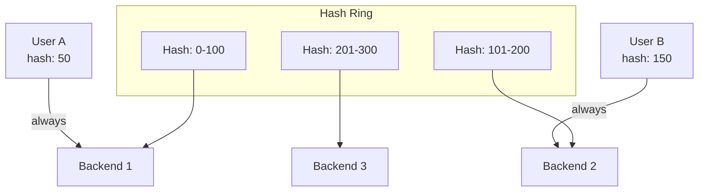
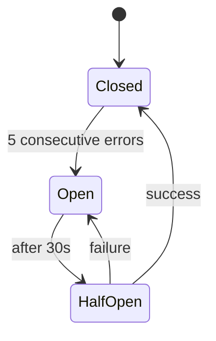
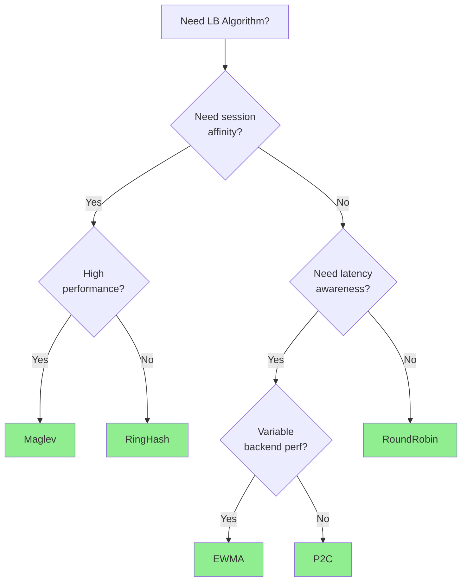

# Load Balancing

Configure how NovaEdge distributes traffic across backend endpoints.

## Algorithms

NovaEdge supports six load balancing algorithms:



| Algorithm | Best For | Session Affinity |
|-----------|----------|------------------|
| RoundRobin | General purpose | No |
| P2C | Low latency | No |
| EWMA | Variable backend performance | No |
| LeastConn | Connection-aware distribution | No |
| RingHash | Stateful applications | Yes |
| Maglev | High-performance consistent hashing | Yes |

## Round Robin

Distributes requests equally across all healthy backends.

```yaml
apiVersion: novaedge.io/v1alpha1
kind: ProxyBackend
metadata:
  name: api-backend
spec:
  serviceRef:
    name: api-service
    port: 8080
  lbPolicy: RoundRobin
```



**Use when:**
- All backends have similar capacity
- Requests have similar processing time
- No session affinity needed

## Power of Two Choices (P2C)

Picks two random backends and selects the one with fewer active connections.

```yaml
apiVersion: novaedge.io/v1alpha1
kind: ProxyBackend
metadata:
  name: api-backend
spec:
  serviceRef:
    name: api-service
    port: 8080
  lbPolicy: P2C
```



**Use when:**
- Requests have variable processing times
- Want low latency without full tracking
- Simple and effective

## EWMA (Exponentially Weighted Moving Average)

Tracks latency history and routes to the backend with lowest weighted latency.

```yaml
apiVersion: novaedge.io/v1alpha1
kind: ProxyBackend
metadata:
  name: api-backend
spec:
  serviceRef:
    name: api-service
    port: 8080
  lbPolicy: EWMA
```



**Use when:**
- Backend performance varies
- Need latency-aware routing
- Backends have different capacities

## Least Connections (LeastConn)

Routes traffic to the backend with the fewest active connections. This is ideal for
workloads where requests have variable processing times.

```yaml
apiVersion: novaedge.io/v1alpha1
kind: ProxyBackend
metadata:
  name: api-backend
spec:
  serviceRef:
    name: api-service
    port: 8080
  lbPolicy: LeastConn
```



**Use when:**
- Requests have variable processing times
- Backends may have different capacities
- Long-running connections (WebSockets, gRPC streams)
- Need connection-aware load distribution

## Cookie-Based Session Affinity (Sticky Sessions)

Any LB algorithm can be wrapped with cookie-based session affinity. On the first
request, the LB picks an endpoint normally and sets an affinity cookie. On
subsequent requests from the same client, the cookie routes traffic to the same
backend. If the backend is unavailable, the LB falls back to normal selection.

```yaml
apiVersion: novaedge.io/v1alpha1
kind: ProxyBackend
metadata:
  name: stateful-backend
spec:
  serviceRef:
    name: stateful-app
    port: 8080
  lbPolicy: LeastConn
  sessionAffinity:
    type: Cookie
    cookieName: NOVAEDGE_SESSION
    cookieTTL: 30m
    cookiePath: /
    secure: true
    sameSite: Lax
```



### Session Affinity Options

| Field | Default | Description |
|-------|---------|-------------|
|  |  | Affinity type (, , ) |
|  |  | Name of the affinity cookie |
|  |  | Cookie TTL ( = session cookie) |
|  |  | Cookie path attribute |
|  |  | Set the Secure flag |
|  |  | SameSite attribute (, , ) |

**Use when:**
- Stateful applications that store session data in-memory
- Shopping carts, user preferences, WebSocket connections
- Applications that benefit from cache locality

## Ring Hash

Consistent hashing for session affinity. Same key always routes to same backend.

```yaml
apiVersion: novaedge.io/v1alpha1
kind: ProxyBackend
metadata:
  name: api-backend
spec:
  serviceRef:
    name: api-service
    port: 8080
  lbPolicy: RingHash
  hashPolicy:
    type: Header
    headerName: X-User-ID
```



### Hash Key Options

```yaml
# Hash by header
hashPolicy:
  type: Header
  headerName: X-User-ID

# Hash by client IP
hashPolicy:
  type: ClientIP

# Hash by cookie
hashPolicy:
  type: Cookie
  cookieName: session_id
```

**Use when:**
- Need session affinity
- Stateful backends (caches, sessions)
- Consistent routing required

## Maglev

Google's high-performance consistent hashing algorithm with minimal disruption on backend changes.

```yaml
apiVersion: novaedge.io/v1alpha1
kind: ProxyBackend
metadata:
  name: api-backend
spec:
  serviceRef:
    name: api-service
    port: 8080
  lbPolicy: Maglev
  hashPolicy:
    type: Header
    headerName: X-Request-ID
```

**Advantages over Ring Hash:**
- More even distribution
- Smaller lookup table
- Faster lookups
- Minimal remapping on changes

**Use when:**
- High-performance consistent hashing needed
- Frequent backend changes
- Large backend pools

## Weighted Backends

Assign weights to distribute traffic unevenly:

```yaml
apiVersion: novaedge.io/v1alpha1
kind: ProxyBackend
metadata:
  name: weighted-backend
spec:
  endpoints:
    - address: server1:8080
      weight: 100    # Gets 50% of traffic
    - address: server2:8080
      weight: 50     # Gets 25% of traffic
    - address: server3:8080
      weight: 50     # Gets 25% of traffic
  lbPolicy: RoundRobin
```

## Connection Limits

Limit connections per backend:

```yaml
apiVersion: novaedge.io/v1alpha1
kind: ProxyBackend
metadata:
  name: limited-backend
spec:
  serviceRef:
    name: api-service
    port: 8080
  lbPolicy: P2C
  connectionLimits:
    maxConnections: 100
    maxPendingRequests: 50
    maxRetries: 3
```

## Circuit Breaking

Automatically remove unhealthy backends:

```yaml
apiVersion: novaedge.io/v1alpha1
kind: ProxyBackend
metadata:
  name: circuit-breaker-backend
spec:
  serviceRef:
    name: api-service
    port: 8080
  lbPolicy: RoundRobin
  circuitBreaker:
    consecutiveErrors: 5
    interval: 30s
    baseEjectionTime: 30s
    maxEjectionPercent: 50
```



## Retry Policy

Configure request retries:

```yaml
apiVersion: novaedge.io/v1alpha1
kind: ProxyBackend
metadata:
  name: retry-backend
spec:
  serviceRef:
    name: api-service
    port: 8080
  lbPolicy: RoundRobin
  retryPolicy:
    retryOn:
      - 5xx
      - reset
      - connect-failure
    numRetries: 3
    perTryTimeout: 5s
    retryHostPredicate: PreviousHosts
```

## Timeouts

Configure request timeouts:

```yaml
apiVersion: novaedge.io/v1alpha1
kind: ProxyBackend
metadata:
  name: timeout-backend
spec:
  serviceRef:
    name: api-service
    port: 8080
  lbPolicy: RoundRobin
  timeout:
    connect: 5s
    request: 30s
    idle: 60s
```

## Algorithm Selection Guide



## Monitoring

Key metrics for load balancing:

| Metric | Description |
|--------|-------------|
| `novaedge_backend_requests_total` | Requests per backend |
| `novaedge_backend_latency_seconds` | Backend latency histogram |
| `novaedge_backend_connections` | Active connections |
| `novaedge_backend_health` | Backend health status |
| `novaedge_circuit_breaker_state` | Circuit breaker state |

## Next Steps

- [Health Checks](health-checks.md) - Configure health checking
- [VIP Management](vip-management.md) - Configure VIP modes
- [Policies](policies.md) - Add rate limiting
