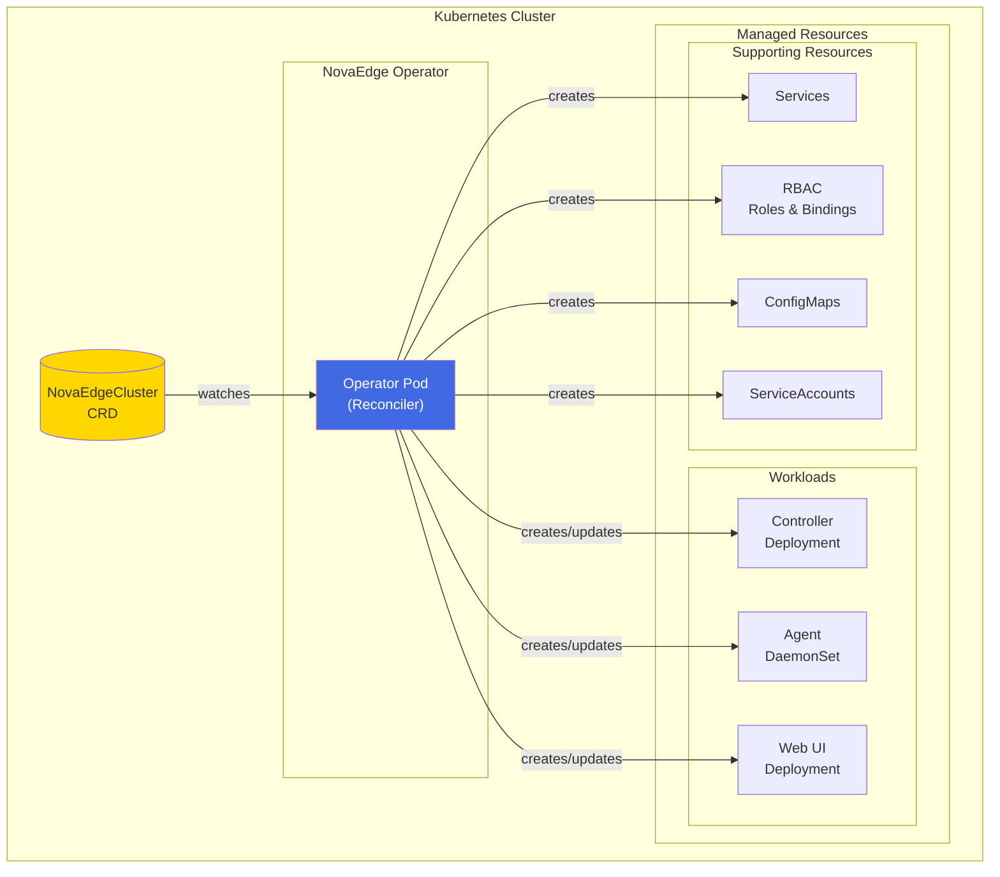
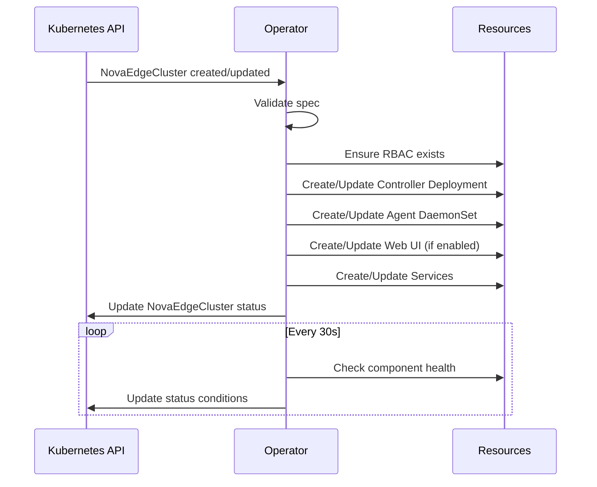

# NovaEdge Operator Guide

The NovaEdge Operator provides a declarative way to deploy and manage NovaEdge clusters on Kubernetes. Instead of manually deploying the controller, agents, and web UI, you can define a single `NovaEdgeCluster` resource and let the operator handle the rest.

## Overview

The operator manages the complete lifecycle of NovaEdge deployments:

- **Installation**: Deploy all NovaEdge components with a single resource
- **Configuration**: Manage configuration through the CRD spec
- **Upgrades**: Rolling upgrades with version changes
- **Health Monitoring**: Automatic status tracking and condition reporting
- **Cleanup**: Proper resource cleanup on deletion

## Architecture



### Operator Reconciliation Loop



## Installation

### Prerequisites

- Kubernetes 1.25 or later
- Helm 3.0 or later
- kubectl configured to access your cluster

### Installing the Operator

```bash
# Create namespace
kubectl create namespace novaedge-system

# Install using Helm
helm install novaedge-operator charts/novaedge-operator \
  --namespace novaedge-system
```

### Verify Installation

```bash
# Check operator is running
kubectl get pods -n novaedge-system -l app.kubernetes.io/name=novaedge-operator

# Check CRD is installed
kubectl get crd novaedgeclusters.novaedge.io
```

## Creating a NovaEdge Cluster

### Basic Cluster

Create a file named `novaedge-cluster.yaml`:

```yaml
apiVersion: novaedge.io/v1alpha1
kind: NovaEdgeCluster
metadata:
  name: novaedge
  namespace: novaedge-system
spec:
  version: "v0.1.0"

  controller:
    replicas: 1
    leaderElection: true

  agent:
    hostNetwork: true
    vip:
      enabled: true
      mode: L2

  webUI:
    enabled: true
    service:
      type: ClusterIP
```

Apply the resource:

```bash
kubectl apply -f novaedge-cluster.yaml
```

### Production Cluster with HA

```yaml
apiVersion: novaedge.io/v1alpha1
kind: NovaEdgeCluster
metadata:
  name: novaedge-prod
  namespace: novaedge-system
spec:
  version: "v0.1.0"
  imageRepository: "ghcr.io/piwi3910/novaedge"
  imagePullPolicy: IfNotPresent

  controller:
    replicas: 3
    leaderElection: true
    resources:
      requests:
        cpu: "200m"
        memory: "256Mi"
      limits:
        cpu: "1000m"
        memory: "1Gi"
    affinity:
      podAntiAffinity:
        preferredDuringSchedulingIgnoredDuringExecution:
          - weight: 100
            podAffinityTerm:
              labelSelector:
                matchLabels:
                  app.kubernetes.io/component: controller
              topologyKey: kubernetes.io/hostname

  agent:
    hostNetwork: true
    resources:
      requests:
        cpu: "200m"
        memory: "256Mi"
      limits:
        cpu: "2000m"
        memory: "2Gi"
    tolerations:
      - key: node-role.kubernetes.io/control-plane
        operator: Exists
        effect: NoSchedule
    vip:
      enabled: true
      mode: L2
    updateStrategy:
      type: RollingUpdate
      maxUnavailable: 1

  webUI:
    enabled: true
    replicas: 2
    readOnly: false
    service:
      type: LoadBalancer
    prometheusEndpoint: "http://prometheus.monitoring.svc:9090"

  observability:
    metrics:
      enabled: true
      serviceMonitor:
        enabled: true
        interval: "30s"
    tracing:
      enabled: true
      endpoint: "jaeger-collector.tracing.svc:4317"
      samplingRate: 10
    logging:
      level: info
      format: json
```

### BGP Mode Cluster

```yaml
apiVersion: novaedge.io/v1alpha1
kind: NovaEdgeCluster
metadata:
  name: novaedge-bgp
  namespace: novaedge-system
spec:
  version: "v0.1.0"

  controller:
    replicas: 2
    leaderElection: true

  agent:
    hostNetwork: true
    vip:
      enabled: true
      mode: BGP
      bgp:
        asn: 65000
        routerID: "10.0.0.1"
        peers:
          - address: "10.0.0.254"
            asn: 65001
            port: 179
          - address: "10.0.0.253"
            asn: 65001
            port: 179

  webUI:
    enabled: true
```

## Configuration Reference

### Spec Fields

| Field | Type | Description |
|-------|------|-------------|
| `version` | string | NovaEdge version to deploy (required) |
| `imageRepository` | string | Container image repository (default: `ghcr.io/piwi3910/novaedge`) |
| `imagePullPolicy` | string | Image pull policy (default: `IfNotPresent`) |
| `imagePullSecrets` | array | List of image pull secrets |
| `controller` | object | Controller configuration |
| `agent` | object | Agent configuration |
| `webUI` | object | Web UI configuration (optional) |
| `tls` | object | Internal TLS configuration |
| `observability` | object | Observability configuration |

### Controller Configuration

| Field | Type | Default | Description |
|-------|------|---------|-------------|
| `replicas` | int | 1 | Number of controller replicas |
| `leaderElection` | bool | true | Enable leader election |
| `grpcPort` | int | 9090 | gRPC config server port |
| `metricsPort` | int | 8080 | Prometheus metrics port |
| `healthPort` | int | 8081 | Health probe port |
| `resources` | object | - | Resource requirements |
| `nodeSelector` | map | - | Node selector |
| `tolerations` | array | - | Pod tolerations |
| `affinity` | object | - | Pod affinity rules |
| `extraArgs` | array | - | Additional command-line arguments |
| `extraEnv` | array | - | Additional environment variables |

### Agent Configuration

| Field | Type | Default | Description |
|-------|------|---------|-------------|
| `hostNetwork` | bool | true | Enable host networking |
| `dnsPolicy` | string | ClusterFirstWithHostNet | DNS policy |
| `httpPort` | int | 80 | HTTP traffic port |
| `httpsPort` | int | 443 | HTTPS traffic port |
| `metricsPort` | int | 9090 | Prometheus metrics port |
| `healthPort` | int | 8080 | Health probe port |
| `vip.enabled` | bool | true | Enable VIP management |
| `vip.mode` | string | L2 | VIP mode (L2, BGP, OSPF) |
| `vip.interface` | string | - | Network interface for VIP binding |
| `vip.bgp` | object | - | BGP configuration |
| `updateStrategy.type` | string | RollingUpdate | Update strategy type |
| `updateStrategy.maxUnavailable` | int | 1 | Max unavailable during update |
| `resources` | object | - | Resource requirements |
| `nodeSelector` | map | - | Node selector |
| `tolerations` | array | - | Pod tolerations |
| `extraArgs` | array | - | Additional command-line arguments |
| `extraEnv` | array | - | Additional environment variables |
| `extraVolumes` | array | - | Additional volumes |
| `extraVolumeMounts` | array | - | Additional volume mounts |

### Web UI Configuration

| Field | Type | Default | Description |
|-------|------|---------|-------------|
| `enabled` | bool | true | Enable web UI |
| `replicas` | int | 1 | Number of replicas |
| `port` | int | 9080 | Web UI port |
| `readOnly` | bool | false | Read-only mode |
| `prometheusEndpoint` | string | - | Prometheus URL for metrics |
| `service.type` | string | ClusterIP | Service type |
| `service.nodePort` | int | - | Node port (if type is NodePort) |
| `service.annotations` | map | - | Service annotations |
| `ingress.enabled` | bool | false | Enable ingress |
| `ingress.className` | string | - | Ingress class name |
| `ingress.host` | string | - | Ingress hostname |
| `ingress.annotations` | map | - | Ingress annotations |
| `ingress.tls.enabled` | bool | false | Enable TLS for ingress |
| `ingress.tls.secretName` | string | - | TLS secret name |
| `tls.enabled` | bool | false | Enable TLS for web UI server |
| `tls.auto` | bool | false | Auto-generate self-signed certificate |

### Observability Configuration

| Field | Type | Default | Description |
|-------|------|---------|-------------|
| `metrics.enabled` | bool | true | Enable Prometheus metrics |
| `metrics.serviceMonitor.enabled` | bool | false | Create ServiceMonitor |
| `metrics.serviceMonitor.interval` | string | 30s | Scrape interval |
| `tracing.enabled` | bool | false | Enable distributed tracing |
| `tracing.endpoint` | string | - | OTLP endpoint |
| `tracing.samplingRate` | int | 10 | Sampling rate (0-100) |
| `logging.level` | string | info | Log level |
| `logging.format` | string | json | Log format |

## Monitoring Cluster Status

### Check Cluster Status

```bash
# List all clusters
kubectl get novaedgeclusters -A

# Get detailed status
kubectl describe novaedgecluster novaedge -n novaedge-system
```

### Status Fields

The operator updates the cluster status with:

| Field | Description |
|-------|-------------|
| `phase` | Current phase (Pending, Initializing, Running, Upgrading, Degraded, Failed) |
| `observedGeneration` | Last observed generation |
| `conditions` | Detailed conditions (Ready, ControllerReady, AgentReady, WebUIReady) |
| `controller` | Controller deployment status |
| `agent` | Agent DaemonSet status |
| `webUI` | Web UI deployment status |
| `version` | Currently deployed version |
| `lastUpgradeTime` | Timestamp of last upgrade |

### Example Status

```yaml
status:
  phase: Running
  observedGeneration: 1
  version: v0.1.0
  conditions:
    - type: Ready
      status: "True"
      reason: AllComponentsReady
      message: All components are ready
    - type: ControllerReady
      status: "True"
      reason: ControllerReady
      message: Controller is ready
    - type: AgentReady
      status: "True"
      reason: AgentReady
      message: Agent DaemonSet is ready
  controller:
    ready: true
    replicas: 1
    readyReplicas: 1
    version: v0.1.0
  agent:
    ready: true
    replicas: 3
    readyReplicas: 3
    version: v0.1.0
```

## Upgrading

### Upgrade NovaEdge Version

Update the `version` field in your NovaEdgeCluster:

```bash
kubectl patch novaedgecluster novaedge -n novaedge-system \
  --type=merge \
  -p '{"spec":{"version":"v0.2.0"}}'
```

The operator will perform a rolling upgrade of all components.

### Monitor Upgrade Progress

```bash
# Watch cluster status
kubectl get novaedgecluster novaedge -n novaedge-system -w

# Check rollout status
kubectl rollout status deployment/novaedge-controller -n novaedge-system
kubectl rollout status daemonset/novaedge-agent -n novaedge-system
```

## Troubleshooting

### Check Operator Logs

```bash
kubectl logs -n novaedge-system -l app.kubernetes.io/name=novaedge-operator
```

### Check Component Logs

```bash
# Controller logs
kubectl logs -n novaedge-system -l app.kubernetes.io/component=controller

# Agent logs (on specific node)
kubectl logs -n novaedge-system -l app.kubernetes.io/component=agent

# Web UI logs
kubectl logs -n novaedge-system -l app.kubernetes.io/component=webui
```

### Common Issues

| Issue | Possible Cause | Solution |
|-------|---------------|----------|
| Cluster stuck in Initializing | Resources not available | Check node resources and events |
| Controller not ready | RBAC or config issues | Check controller logs |
| Agents not ready | Network or privilege issues | Verify hostNetwork and security context |
| VIP not working | Missing capabilities | Ensure NET_ADMIN capability is granted |

## Cleanup

### Delete a Cluster

```bash
kubectl delete novaedgecluster novaedge -n novaedge-system
```

The operator will clean up all managed resources.

### Uninstall the Operator

```bash
# Delete all clusters first
kubectl delete novaedgeclusters --all -A

# Uninstall operator
helm uninstall novaedge-operator -n novaedge-system

# Optionally remove CRDs
kubectl delete crd novaedgeclusters.novaedge.io
```

## See Also

- [Deployment Guide](deployment-guide.md)
- [Helm Chart](../getting-started/helm.md)
- [Web UI Guide](web-ui.md)
