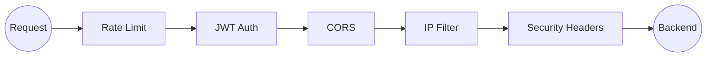
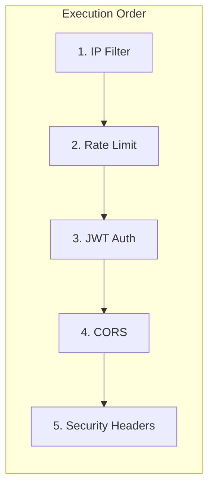

# Policies

Configure rate limiting, authentication, CORS, and security headers.

## Overview

Policies are applied to routes to enforce traffic controls:



## Creating Policies

Policies are defined as `ProxyPolicy` resources and attached to routes:

```yaml
apiVersion: novaedge.io/v1alpha1
kind: ProxyPolicy
metadata:
  name: my-policy
spec:
  targetRef:
    kind: ProxyRoute
    name: my-route
  rateLimit:
    requestsPerSecond: 100
    burstSize: 150
```

## Rate Limiting

Control request rates using token bucket algorithm.

### Basic Rate Limit

```yaml
apiVersion: novaedge.io/v1alpha1
kind: ProxyPolicy
metadata:
  name: rate-limit-policy
spec:
  targetRef:
    kind: ProxyRoute
    name: api-route
  rateLimit:
    requestsPerSecond: 100
    burstSize: 150
    key: client_ip
```

### Rate Limit by Header

```yaml
apiVersion: novaedge.io/v1alpha1
kind: ProxyPolicy
metadata:
  name: api-key-rate-limit
spec:
  targetRef:
    kind: ProxyRoute
    name: api-route
  rateLimit:
    requestsPerSecond: 1000
    burstSize: 1500
    key: "header:X-API-Key"
```

### Rate Limit Options

| Field | Default | Description |
|-------|---------|-------------|
| `requestsPerSecond` | - | Base rate limit |
| `burstSize` | - | Maximum burst size |
| `key` | client_ip | Rate limit key (client_ip, header:name) |
| `responseCode` | 429 | Response code when limited |

### Rate Limit Headers

NovaEdge adds these headers to responses:

| Header | Description |
|--------|-------------|
| `X-RateLimit-Limit` | Configured rate limit |
| `X-RateLimit-Remaining` | Remaining requests |
| `Retry-After` | Seconds until next request allowed |

## JWT Authentication

Validate JWT tokens against JWKS endpoints.

### Basic JWT Validation

```yaml
apiVersion: novaedge.io/v1alpha1
kind: ProxyPolicy
metadata:
  name: jwt-auth-policy
spec:
  targetRef:
    kind: ProxyRoute
    name: api-route
  jwt:
    issuer: "https://auth.example.com"
    audience:
      - "api.example.com"
    jwksUri: "https://auth.example.com/.well-known/jwks.json"
```

### JWT with Claims Validation

```yaml
apiVersion: novaedge.io/v1alpha1
kind: ProxyPolicy
metadata:
  name: jwt-claims-policy
spec:
  targetRef:
    kind: ProxyRoute
    name: admin-route
  jwt:
    issuer: "https://auth.example.com"
    jwksUri: "https://auth.example.com/.well-known/jwks.json"
    claimsToHeaders:
      - claim: sub
        header: X-User-ID
      - claim: email
        header: X-User-Email
    requiredClaims:
      - name: role
        values:
          - admin
          - superuser
```

### JWT Options

| Field | Description |
|-------|-------------|
| `issuer` | Expected token issuer |
| `audience` | Expected audience(s) |
| `jwksUri` | JWKS endpoint URL |
| `claimsToHeaders` | Forward claims as headers |
| `requiredClaims` | Claims that must be present |
| `forwardToken` | Forward token to backend (default: true) |

## CORS

Configure Cross-Origin Resource Sharing.

### Basic CORS

```yaml
apiVersion: novaedge.io/v1alpha1
kind: ProxyPolicy
metadata:
  name: cors-policy
spec:
  targetRef:
    kind: ProxyRoute
    name: api-route
  cors:
    allowOrigins:
      - "https://app.example.com"
      - "https://admin.example.com"
    allowMethods:
      - GET
      - POST
      - PUT
      - DELETE
    allowHeaders:
      - Content-Type
      - Authorization
    exposeHeaders:
      - X-Request-ID
    maxAge: 86400
    allowCredentials: true
```

### Wildcard Origins

```yaml
apiVersion: novaedge.io/v1alpha1
kind: ProxyPolicy
metadata:
  name: cors-wildcard-policy
spec:
  targetRef:
    kind: ProxyRoute
    name: public-api-route
  cors:
    allowOrigins:
      - "*"
    allowMethods:
      - GET
    maxAge: 3600
```

### CORS Options

| Field | Default | Description |
|-------|---------|-------------|
| `allowOrigins` | [] | Allowed origins (* for any) |
| `allowMethods` | [] | Allowed HTTP methods |
| `allowHeaders` | [] | Allowed request headers |
| `exposeHeaders` | [] | Headers exposed to client |
| `maxAge` | 0 | Preflight cache duration (seconds) |
| `allowCredentials` | false | Allow credentials |

## IP Filtering

Allow or deny requests based on client IP.

### Allow List

```yaml
apiVersion: novaedge.io/v1alpha1
kind: ProxyPolicy
metadata:
  name: ip-allow-policy
spec:
  targetRef:
    kind: ProxyRoute
    name: internal-route
  ipFilter:
    action: Allow
    cidrs:
      - "10.0.0.0/8"
      - "172.16.0.0/12"
      - "192.168.0.0/16"
```

### Deny List

```yaml
apiVersion: novaedge.io/v1alpha1
kind: ProxyPolicy
metadata:
  name: ip-deny-policy
spec:
  targetRef:
    kind: ProxyRoute
    name: api-route
  ipFilter:
    action: Deny
    cidrs:
      - "203.0.113.0/24"  # Known bad actors
```

### IP Filter with X-Forwarded-For

```yaml
apiVersion: novaedge.io/v1alpha1
kind: ProxyPolicy
metadata:
  name: ip-filter-xff
spec:
  targetRef:
    kind: ProxyRoute
    name: api-route
  ipFilter:
    action: Allow
    cidrs:
      - "10.0.0.0/8"
    useXForwardedFor: true
    trustedProxies:
      - "10.0.0.1/32"
```

## Security Headers

Add security headers to responses.

```yaml
apiVersion: novaedge.io/v1alpha1
kind: ProxyPolicy
metadata:
  name: security-headers-policy
spec:
  targetRef:
    kind: ProxyRoute
    name: web-route
  securityHeaders:
    hsts:
      enabled: true
      maxAgeSeconds: 31536000
      includeSubdomains: true
      preload: true
    xFrameOptions: DENY
    xContentTypeOptions: true
    xXSSProtection: "1; mode=block"
    referrerPolicy: strict-origin-when-cross-origin
    contentSecurityPolicy: "default-src 'self'"
```

### Security Headers Options

| Field | Default | Description |
|-------|---------|-------------|
| `hsts.enabled` | false | Enable HSTS |
| `hsts.maxAgeSeconds` | 31536000 | HSTS max age |
| `hsts.includeSubdomains` | false | Include subdomains |
| `hsts.preload` | false | Enable preload |
| `xFrameOptions` | - | X-Frame-Options (DENY, SAMEORIGIN) |
| `xContentTypeOptions` | false | X-Content-Type-Options: nosniff |
| `xXSSProtection` | - | X-XSS-Protection value |
| `referrerPolicy` | - | Referrer-Policy value |
| `contentSecurityPolicy` | - | Content-Security-Policy |

## Combining Policies

Apply multiple policies to a single route:

```yaml
---
apiVersion: novaedge.io/v1alpha1
kind: ProxyPolicy
metadata:
  name: rate-limit
spec:
  targetRef:
    kind: ProxyRoute
    name: api-route
  rateLimit:
    requestsPerSecond: 100
    burstSize: 150
---
apiVersion: novaedge.io/v1alpha1
kind: ProxyPolicy
metadata:
  name: jwt-auth
spec:
  targetRef:
    kind: ProxyRoute
    name: api-route
  jwt:
    issuer: "https://auth.example.com"
    jwksUri: "https://auth.example.com/.well-known/jwks.json"
---
apiVersion: novaedge.io/v1alpha1
kind: ProxyPolicy
metadata:
  name: cors
spec:
  targetRef:
    kind: ProxyRoute
    name: api-route
  cors:
    allowOrigins:
      - "https://app.example.com"
    allowMethods:
      - GET
      - POST
```

## Policy Execution Order



## Attaching Policies via Routes

Alternatively, reference policies from routes:

```yaml
apiVersion: novaedge.io/v1alpha1
kind: ProxyRoute
metadata:
  name: api-route
spec:
  parentRefs:
    - name: main-gateway
  policyRefs:
    - name: rate-limit
    - name: jwt-auth
    - name: cors
  rules:
    - matches:
        - path:
            type: PathPrefix
            value: /api
      backendRef:
        name: api-backend
```

## Metrics

| Metric | Description |
|--------|-------------|
| `novaedge_ratelimit_requests_total` | Rate limited requests |
| `novaedge_ratelimit_limited_total` | Requests that were limited |
| `novaedge_jwt_validation_total` | JWT validations |
| `novaedge_jwt_validation_failed_total` | Failed JWT validations |
| `novaedge_cors_preflight_total` | CORS preflight requests |
| `novaedge_ip_filter_blocked_total` | IP-blocked requests |

## Next Steps

- [TLS](tls.md) - TLS termination and mTLS
- [Health Checks](health-checks.md) - Backend health checking
- [Observability](../operations/observability.md) - Monitoring policies
