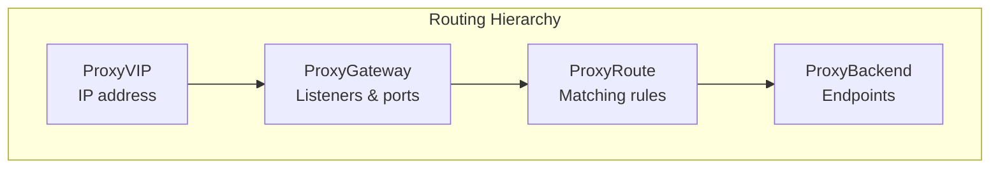
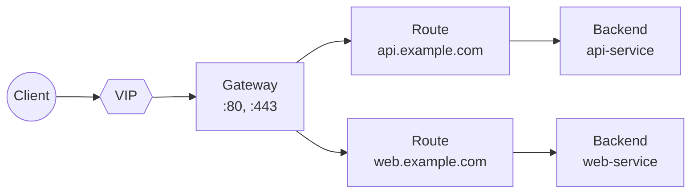
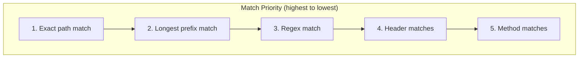
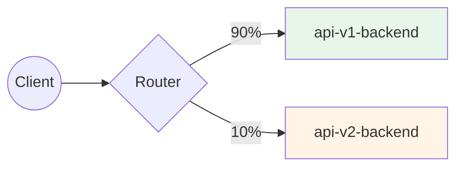
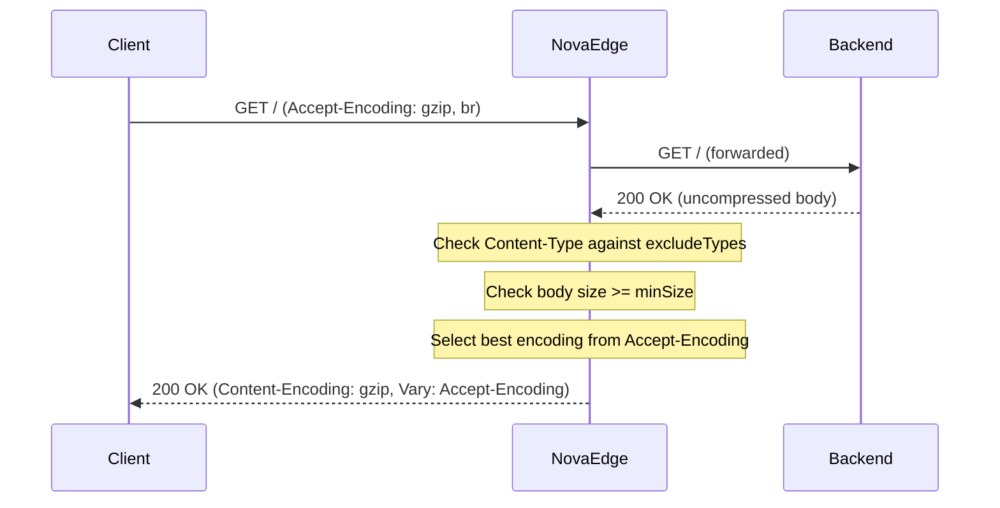
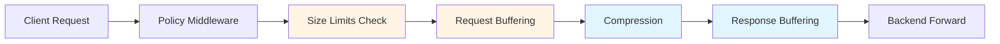

# Routing

Configure how NovaEdge routes traffic to your backend services.

## Overview

NovaEdge uses a hierarchical routing model:



## Resource Relationships



## Creating a Gateway

A Gateway defines listeners that accept traffic:

```yaml
apiVersion: novaedge.io/v1alpha1
kind: ProxyGateway
metadata:
  name: main-gateway
spec:
  vipRef: my-vip
  listeners:
    - name: http
      port: 80
      protocol: HTTP
      hostnames:
        - "*.example.com"

    - name: https
      port: 443
      protocol: HTTPS
      hostnames:
        - "*.example.com"
      tls:
        mode: Terminate
        certificateRefs:
          - name: example-tls-secret
```

### Listener Protocols

| Protocol | Port | TLS | Description |
|----------|------|-----|-------------|
| HTTP | 80 | No | Plain HTTP traffic |
| HTTPS | 443 | Yes | TLS-terminated HTTPS |
| TCP | Any | No | Raw TCP passthrough |
| TLS | Any | Yes | TLS passthrough (SNI routing) |

## Creating Routes

Routes match incoming requests and direct them to backends:

### Path-Based Routing

```yaml
apiVersion: novaedge.io/v1alpha1
kind: ProxyRoute
metadata:
  name: api-route
spec:
  parentRefs:
    - name: main-gateway
  hostnames:
    - api.example.com
  rules:
    - matches:
        - path:
            type: PathPrefix
            value: /v1
      backendRef:
        name: api-v1-backend

    - matches:
        - path:
            type: PathPrefix
            value: /v2
      backendRef:
        name: api-v2-backend
```

### Path Match Types

| Type | Example | Matches |
|------|---------|---------|
| Exact | `/api` | Only `/api` |
| PathPrefix | `/api` | `/api`, `/api/users`, `/api/v1` |
| RegularExpression | `/user/[0-9]+` | `/user/123`, `/user/456` |

### Header-Based Routing

Route based on HTTP headers:

```yaml
apiVersion: novaedge.io/v1alpha1
kind: ProxyRoute
metadata:
  name: header-route
spec:
  parentRefs:
    - name: main-gateway
  rules:
    - matches:
        - headers:
            - name: X-API-Version
              value: v2
      backendRef:
        name: api-v2-backend

    - matches:
        - headers:
            - name: X-API-Version
              value: v1
      backendRef:
        name: api-v1-backend
```

### Method-Based Routing

Route based on HTTP method:

```yaml
apiVersion: novaedge.io/v1alpha1
kind: ProxyRoute
metadata:
  name: method-route
spec:
  parentRefs:
    - name: main-gateway
  rules:
    - matches:
        - path:
            type: PathPrefix
            value: /api
          method: GET
      backendRef:
        name: read-service

    - matches:
        - path:
            type: PathPrefix
            value: /api
          method: POST
      backendRef:
        name: write-service
```

### Combined Matching

Combine multiple match conditions:

```yaml
apiVersion: novaedge.io/v1alpha1
kind: ProxyRoute
metadata:
  name: combined-route
spec:
  parentRefs:
    - name: main-gateway
  hostnames:
    - api.example.com
  rules:
    - matches:
        - path:
            type: PathPrefix
            value: /admin
          headers:
            - name: X-Admin-Token
              type: Present
          method: POST
      backendRef:
        name: admin-backend
```

## Request Filters

Modify requests before forwarding to backends.

### Header Modification

```yaml
apiVersion: novaedge.io/v1alpha1
kind: ProxyRoute
metadata:
  name: header-filter-route
spec:
  parentRefs:
    - name: main-gateway
  rules:
    - matches:
        - path:
            type: PathPrefix
            value: /
      filters:
        - type: RequestHeaderModifier
          requestHeaderModifier:
            add:
              - name: X-Forwarded-By
                value: novaedge
              - name: X-Request-ID
                value: "%REQ_ID%"
            remove:
              - X-Internal-Header
      backendRef:
        name: my-backend
```

### URL Rewrite

```yaml
apiVersion: novaedge.io/v1alpha1
kind: ProxyRoute
metadata:
  name: rewrite-route
spec:
  parentRefs:
    - name: main-gateway
  rules:
    - matches:
        - path:
            type: PathPrefix
            value: /old-api
      filters:
        - type: URLRewrite
          urlRewrite:
            path:
              type: ReplacePrefixMatch
              replacePrefixMatch: /api/v2
      backendRef:
        name: api-backend
```

### Redirect

```yaml
apiVersion: novaedge.io/v1alpha1
kind: ProxyRoute
metadata:
  name: redirect-route
spec:
  parentRefs:
    - name: main-gateway
  rules:
    - matches:
        - path:
            type: Exact
            value: /old-page
      filters:
        - type: RequestRedirect
          requestRedirect:
            scheme: https
            hostname: new.example.com
            path:
              type: ReplaceFullPath
              replaceFullPath: /new-page
            statusCode: 301
```

## Creating Backends

Backends define the upstream services:

```yaml
apiVersion: novaedge.io/v1alpha1
kind: ProxyBackend
metadata:
  name: api-backend
spec:
  serviceRef:
    name: api-service
    port: 8080
  lbPolicy: RoundRobin
  healthCheck:
    interval: 10s
    httpHealthCheck:
      path: /health
```

## Routing Priority

When multiple routes match, NovaEdge uses this priority:



1. **Exact** path matches before prefix
2. **Longer prefixes** before shorter
3. **More specific** header matches
4. **Explicit method** matches before wildcard

## Traffic Splitting and Canary Deployments

Split traffic between backends for canary deployments and gradual rollouts.

### Weighted Traffic Split

Use `backendRefs` with `weight` to distribute traffic proportionally:

```yaml
apiVersion: novaedge.io/v1alpha1
kind: ProxyRoute
metadata:
  name: canary-route
spec:
  parentRefs:
    - name: main-gateway
  hostnames:
    - api.example.com
  rules:
    - matches:
        - path:
            type: PathPrefix
            value: /api
      backendRefs:
        - name: api-v1-backend
          weight: 90    # 90% of traffic
        - name: api-v2-backend
          weight: 10    # 10% of traffic
```



### Header-Based Canary Routing

Send specific requests directly to the canary backend using the `X-Canary: true` header.
When this header is present, traffic is always routed to the backend with the lowest
weight (the canary):

```bash
# Force canary routing for testing
curl -H "X-Canary: true" https://api.example.com/api/users

# Normal weighted routing (no header)
curl https://api.example.com/api/users
```

This enables:
- **Developers** to test canary releases in production
- **CI/CD pipelines** to validate canary deployments
- **QA teams** to target the new version specifically

### Gradual Rollout Strategy

Gradually shift traffic from v1 to v2:

```yaml
# Phase 1: 95/5 split
backendRefs:
  - name: api-v1-backend
    weight: 95
  - name: api-v2-backend
    weight: 5

# Phase 2: 80/20 split
backendRefs:
  - name: api-v1-backend
    weight: 80
  - name: api-v2-backend
    weight: 20

# Phase 3: 50/50 split
backendRefs:
  - name: api-v1-backend
    weight: 50
  - name: api-v2-backend
    weight: 50

# Phase 4: Complete rollout
backendRefs:
  - name: api-v2-backend
    weight: 100
```

## Hostname Wildcards

```yaml
# Match any subdomain
hostnames:
  - "*.example.com"    # Matches api.example.com, www.example.com

# Match specific subdomain
hostnames:
  - "api.example.com"  # Exact match only

# Match multiple patterns
hostnames:
  - "*.api.example.com"
  - "*.web.example.com"
```

## Example: Complete Setup

```yaml
---
apiVersion: novaedge.io/v1alpha1
kind: ProxyVIP
metadata:
  name: main-vip
spec:
  address: 192.168.1.100/32
  mode: L2
  interface: eth0
---
apiVersion: novaedge.io/v1alpha1
kind: ProxyGateway
metadata:
  name: main-gateway
spec:
  vipRef: main-vip
  listeners:
    - name: http
      port: 80
      protocol: HTTP
      hostnames:
        - "*.example.com"
---
apiVersion: novaedge.io/v1alpha1
kind: ProxyBackend
metadata:
  name: api-backend
spec:
  serviceRef:
    name: api-service
    port: 8080
  lbPolicy: P2C
  healthCheck:
    interval: 5s
    httpHealthCheck:
      path: /healthz
---
apiVersion: novaedge.io/v1alpha1
kind: ProxyRoute
metadata:
  name: api-route
spec:
  parentRefs:
    - name: main-gateway
  hostnames:
    - api.example.com
  rules:
    - matches:
        - path:
            type: PathPrefix
            value: /
      filters:
        - type: RequestHeaderModifier
          requestHeaderModifier:
            add:
              - name: X-Forwarded-Proto
                value: http
      backendRef:
        name: api-backend
```

## Next Steps

- [Load Balancing](load-balancing.md) - Configure LB algorithms
- [Policies](policies.md) - Add rate limiting and auth
- [TLS](tls.md) - Configure TLS termination

## Response Compression

NovaEdge supports transparent response compression using gzip and Brotli algorithms. Compression is configured at the gateway level and applies to all routes served by that gateway.

### Enabling Compression

Add a `compression` block to your `ProxyGateway` spec:

```yaml
apiVersion: novaedge.io/v1alpha1
kind: ProxyGateway
metadata:
  name: main-gateway
spec:
  vipRef: my-vip
  listeners:
    - name: http
      port: 80
      protocol: HTTP
  compression:
    enabled: true
    minSize: "1024"       # Only compress responses >= 1KB
    level: 6              # Compression level
    algorithms:
      - gzip
      - br               # Brotli
    excludeTypes:
      - "image/*"
      - "video/*"
      - "audio/*"
      - "application/zip"
```

### How Compression Works



### Configuration Options

| Field | Default | Description |
|-------|---------|-------------|
| `enabled` | `false` | Enable response compression |
| `minSize` | `"1024"` | Minimum body size (bytes) before compression triggers |
| `level` | `6` | Compression level (gzip: 1-9, brotli: 0-11) |
| `algorithms` | `["gzip", "br"]` | Supported algorithms in preference order |
| `excludeTypes` | `["image/*", "video/*", ...]` | Content types to skip |

### Algorithm Selection

NovaEdge negotiates the compression algorithm based on the client's `Accept-Encoding` header and the configured algorithm preference order:

1. The server checks each configured algorithm in order
2. The first algorithm that appears in the client's `Accept-Encoding` is selected
3. If no match is found, the response is sent uncompressed

### Compression is Skipped When

- The response already has a `Content-Encoding` header
- The response body is smaller than `minSize`
- The `Content-Type` matches any pattern in `excludeTypes`
- The response status is 204 No Content or 304 Not Modified
- The client doesn't send an `Accept-Encoding` header

## Request and Response Buffering

NovaEdge supports buffering request and response bodies at the per-route level. Buffering is useful for retry support, response transformations, and ensuring complete data before committing.

### Per-Route Buffering Configuration

## Boolean Routing Expressions

NovaEdge supports boolean routing expressions for advanced request matching. Expressions are compiled at config load time, ensuring zero per-request parsing overhead.

### Syntax

Expressions support the following operators and operands:

**Operators:**
- `AND` -- Both conditions must be true
- `OR` -- At least one condition must be true
- `NOT` -- Negates the condition
- `( )` -- Grouping for precedence

**Operands:**

| Operand | Syntax | Example |
|---------|--------|---------|
| Header match | `header:Name == "value"` | `header:X-Env == "staging"` |
| Header not equal | `header:Name != "value"` | `header:X-Debug != "true"` |
| Path exact | `path exact "/path"` | `path exact "/health"` |
| Path prefix | `path prefix "/prefix"` | `path prefix "/api"` |
| Path contains | `path contains "/segment"` | `path contains "/v2"` |
| Method match | `method == "METHOD"` | `method == "POST"` |
| Query param | `query:key == "value"` | `query:env == "test"` |
| Source IP | `source_ip in "CIDR"` | `source_ip in "10.0.0.0/8"` |

### Examples

**Simple header-based routing:**
```yaml
expression: 'header:X-Env == "staging"'
```

**Combined path and header:**
```yaml
expression: '(header:X-Env == "staging") AND (path prefix "/api" OR path prefix "/v2")'
```

**Method-based routing with negation:**
```yaml
expression: 'method == "GET" AND NOT path prefix "/admin"'
```

**Complex multi-condition:**
```yaml
expression: '(method == "GET" AND path prefix "/api") OR (method == "POST" AND header:Content-Type == "application/json")'
```

**IP-based access control:**
```yaml
expression: 'source_ip in "10.0.0.0/8" AND header:X-Internal == "true"'
```

### Integration with Rule Matches

When both `expression` and `rules[].matches` are specified on a route, the expression is evaluated first. If the expression evaluates to false, the route does not match, regardless of rule matches. This allows expressions to act as a pre-filter.

```yaml
apiVersion: novaedge.io/v1alpha1
kind: ProxyRoute
metadata:
  name: api-route
spec:
  hostnames:
    - api.example.com
  rules:
    - matches:
        - path:
            type: PathPrefix
            value: /api/
      backendRefs:
        - name: api-backend
      buffering:
        request: true       # Buffer request body (enables retries)
        response: false      # Stream responses directly
        maxSize: "50Mi"      # Maximum buffer size
```

### Request Buffering

When enabled, the entire request body is buffered before forwarding to the backend. This enables:

- **Retry support**: The request body can be re-read for retries
- **Size validation**: The complete body size is known before forwarding

For small payloads, buffering uses memory. For large payloads exceeding the memory threshold (default: 1MB), buffering spills to a temporary file that is automatically cleaned up.

### Response Buffering

When enabled, the entire response body is buffered before sending to the client. This enables:

- **Response transformations**: Modify the complete response before committing
- **Error handling**: Detect backend errors before sending any data to the client

### Buffer Size Limits

If the buffered body exceeds `maxSize`:
- **Requests**: A `413 Payload Too Large` response is returned
- **Responses**: Excess data is discarded

## Per-Route Size Limits and Timeouts

Configure request size limits and timeouts on individual route rules for fine-grained control.

### Configuration

```yaml
apiVersion: novaedge.io/v1alpha1
kind: ProxyRoute
metadata:
  name: upload-route
spec:
  hostnames:
    - upload.example.com
  rules:
    - matches:
        - path:
            type: PathPrefix
            value: /upload
      backendRefs:
        - name: upload-backend
      limits:
        maxRequestBodySize: "100Mi"   # Max 100 MiB uploads
        requestTimeout: "5m"           # 5 minute timeout
        idleTimeout: "60s"             # 60 second idle timeout
```

### Limit Options

| Field | Default | Description |
|-------|---------|-------------|
| `maxRequestBodySize` | Gateway default | Maximum request body size |
| `requestTimeout` | No timeout | Total request timeout |
| `idleTimeout` | No timeout | Connection idle timeout |

### Size Format

Size values support human-readable suffixes:

| Suffix | Meaning | Example |
|--------|---------|---------|
| (none) | Bytes | `1048576` |
| `Ki` | Kibibytes (1024) | `10Ki` = 10,240 bytes |
| `Mi` | Mebibytes (1024^2) | `10Mi` = 10,485,760 bytes |
| `Gi` | Gibibytes (1024^3) | `1Gi` = 1,073,741,824 bytes |
| `KB` | Kilobytes (1000) | `10KB` = 10,000 bytes |
| `MB` | Megabytes (1000^2) | `10MB` = 10,000,000 bytes |

### Timeout Behavior

- **`requestTimeout`**: If the backend does not respond within this time, a `504 Gateway Timeout` is returned
- **`idleTimeout`**: If no data is received on the connection within this time, the connection is closed

### Request Processing Order



The middleware execution order ensures:
1. **Policies** (rate limiting, auth) run first
2. **Size limits** reject oversized requests early
3. **Request buffering** captures the body for retry support
4. **Compression** compresses the response after the backend responds
5. **Response buffering** captures the complete response if needed

## loadBalancerClass Support

NovaEdge supports `loadBalancerClass` for multi-controller coexistence. This allows multiple NovaEdge controllers (or other load balancer controllers) to run side-by-side, each handling only their assigned gateways.

### Configuration

Set the `loadBalancerClass` on a ProxyGateway:

```yaml
apiVersion: novaedge.io/v1alpha1
kind: ProxyGateway
metadata:
  name: my-gateway
spec:
  loadBalancerClass: novaedge.io/proxy
  vipRef: my-vip
  listeners:
    - name: http
      port: 80
      protocol: HTTP
```

### Controller Configuration

Start the controller with a specific class:

```bash
novaedge-controller --controller-class=novaedge.io/proxy
```

The controller will only reconcile gateways whose `loadBalancerClass` matches. Gateways without a `loadBalancerClass` are reconciled by the controller using the default class (`novaedge.io/proxy`).

### Ingress and Gateway API

- **Ingress**: The controller respects the `ingressClassName` field and only reconciles Ingress resources matching the configured class
- **Gateway API**: The controller respects the `GatewayClass` resource and only handles Gateways referencing the NovaEdge GatewayClass

## HTTP to HTTPS Redirect

NovaEdge can automatically redirect HTTP requests to HTTPS using the
`redirectScheme` configuration on a `ProxyGateway`.

### Configuration

#### Kubernetes CRD

```yaml
apiVersion: novaedge.io/v1alpha1
kind: ProxyGateway
metadata:
  name: web-gateway
spec:
  vipRef: web-vip
  listeners:
    - name: http
      port: 80
      protocol: HTTP
    - name: https
      port: 443
      protocol: HTTPS
      tls:
        secretRef:
          name: tls-secret
  redirectScheme:
    enabled: true
    scheme: https
    port: 443
    statusCode: 301
    exclusions:
      - /healthz
      - /readyz
      - /.well-known/
```

#### Standalone Mode

```yaml
redirectScheme:
  enabled: true
  scheme: https
  port: 443
  statusCode: 301
  exclusions:
    - /healthz
    - /readyz
```

### Behavior

- Requests already using HTTPS (detected via TLS connection or `X-Forwarded-Proto: https` header) are not redirected
- The original path and query string are preserved in the redirect URL
- Health check paths and other exclusions are not redirected
- Supported status codes: `301` (permanent) and `302` (temporary), defaulting to `301`
- When using a non-standard port (not 443 for HTTPS), the port is included in the redirect URL

### Exclusions

Exclusions support exact path matches and prefix matches (paths ending with `/`):

```yaml
exclusions:
  - /healthz           # Exact match: only /healthz
  - /.well-known/      # Prefix match: /.well-known/anything
```

### Expression-Based Routing Example

```yaml
apiVersion: novaedge.io/v1alpha1
kind: ProxyRoute
metadata:
  name: staging-api
spec:
  hostnames: ["api.example.com"]
  expression: 'header:X-Env == "staging"'
  rules:
    - matches:
        - path:
            type: PathPrefix
            value: /api
      backendRefs:
        - name: staging-backend
```

In this example, requests must have `X-Env: staging` AND match the `/api` prefix.
