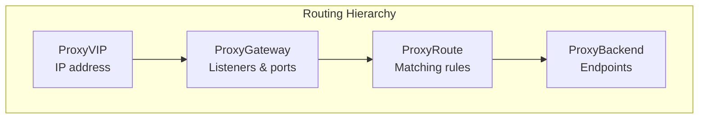
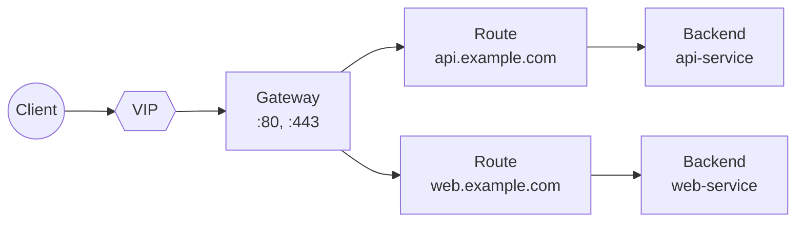
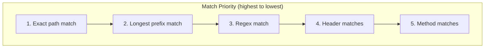

# Routing

Configure how NovaEdge routes traffic to your backend services.

## Overview

NovaEdge uses a hierarchical routing model:



## Resource Relationships



## Creating a Gateway

A Gateway defines listeners that accept traffic:

```yaml
apiVersion: novaedge.io/v1alpha1
kind: ProxyGateway
metadata:
  name: main-gateway
spec:
  vipRef: my-vip
  listeners:
    - name: http
      port: 80
      protocol: HTTP
      hostnames:
        - "*.example.com"

    - name: https
      port: 443
      protocol: HTTPS
      hostnames:
        - "*.example.com"
      tls:
        mode: Terminate
        certificateRefs:
          - name: example-tls-secret
```

### Listener Protocols

| Protocol | Port | TLS | Description |
|----------|------|-----|-------------|
| HTTP | 80 | No | Plain HTTP traffic |
| HTTPS | 443 | Yes | TLS-terminated HTTPS |
| TCP | Any | No | Raw TCP passthrough |
| TLS | Any | Yes | TLS passthrough (SNI routing) |

## Creating Routes

Routes match incoming requests and direct them to backends:

### Path-Based Routing

```yaml
apiVersion: novaedge.io/v1alpha1
kind: ProxyRoute
metadata:
  name: api-route
spec:
  parentRefs:
    - name: main-gateway
  hostnames:
    - api.example.com
  rules:
    - matches:
        - path:
            type: PathPrefix
            value: /v1
      backendRef:
        name: api-v1-backend

    - matches:
        - path:
            type: PathPrefix
            value: /v2
      backendRef:
        name: api-v2-backend
```

### Path Match Types

| Type | Example | Matches |
|------|---------|---------|
| Exact | `/api` | Only `/api` |
| PathPrefix | `/api` | `/api`, `/api/users`, `/api/v1` |
| RegularExpression | `/user/[0-9]+` | `/user/123`, `/user/456` |

### Header-Based Routing

Route based on HTTP headers:

```yaml
apiVersion: novaedge.io/v1alpha1
kind: ProxyRoute
metadata:
  name: header-route
spec:
  parentRefs:
    - name: main-gateway
  rules:
    - matches:
        - headers:
            - name: X-API-Version
              value: v2
      backendRef:
        name: api-v2-backend

    - matches:
        - headers:
            - name: X-API-Version
              value: v1
      backendRef:
        name: api-v1-backend
```

### Method-Based Routing

Route based on HTTP method:

```yaml
apiVersion: novaedge.io/v1alpha1
kind: ProxyRoute
metadata:
  name: method-route
spec:
  parentRefs:
    - name: main-gateway
  rules:
    - matches:
        - path:
            type: PathPrefix
            value: /api
          method: GET
      backendRef:
        name: read-service

    - matches:
        - path:
            type: PathPrefix
            value: /api
          method: POST
      backendRef:
        name: write-service
```

### Combined Matching

Combine multiple match conditions:

```yaml
apiVersion: novaedge.io/v1alpha1
kind: ProxyRoute
metadata:
  name: combined-route
spec:
  parentRefs:
    - name: main-gateway
  hostnames:
    - api.example.com
  rules:
    - matches:
        - path:
            type: PathPrefix
            value: /admin
          headers:
            - name: X-Admin-Token
              type: Present
          method: POST
      backendRef:
        name: admin-backend
```

## Request Filters

Modify requests before forwarding to backends.

### Header Modification

```yaml
apiVersion: novaedge.io/v1alpha1
kind: ProxyRoute
metadata:
  name: header-filter-route
spec:
  parentRefs:
    - name: main-gateway
  rules:
    - matches:
        - path:
            type: PathPrefix
            value: /
      filters:
        - type: RequestHeaderModifier
          requestHeaderModifier:
            add:
              - name: X-Forwarded-By
                value: novaedge
              - name: X-Request-ID
                value: "%REQ_ID%"
            remove:
              - X-Internal-Header
      backendRef:
        name: my-backend
```

### URL Rewrite

```yaml
apiVersion: novaedge.io/v1alpha1
kind: ProxyRoute
metadata:
  name: rewrite-route
spec:
  parentRefs:
    - name: main-gateway
  rules:
    - matches:
        - path:
            type: PathPrefix
            value: /old-api
      filters:
        - type: URLRewrite
          urlRewrite:
            path:
              type: ReplacePrefixMatch
              replacePrefixMatch: /api/v2
      backendRef:
        name: api-backend
```

### Redirect

```yaml
apiVersion: novaedge.io/v1alpha1
kind: ProxyRoute
metadata:
  name: redirect-route
spec:
  parentRefs:
    - name: main-gateway
  rules:
    - matches:
        - path:
            type: Exact
            value: /old-page
      filters:
        - type: RequestRedirect
          requestRedirect:
            scheme: https
            hostname: new.example.com
            path:
              type: ReplaceFullPath
              replaceFullPath: /new-page
            statusCode: 301
```

## Creating Backends

Backends define the upstream services:

```yaml
apiVersion: novaedge.io/v1alpha1
kind: ProxyBackend
metadata:
  name: api-backend
spec:
  serviceRef:
    name: api-service
    port: 8080
  lbPolicy: RoundRobin
  healthCheck:
    interval: 10s
    httpHealthCheck:
      path: /health
```

## Routing Priority

When multiple routes match, NovaEdge uses this priority:



1. **Exact** path matches before prefix
2. **Longer prefixes** before shorter
3. **More specific** header matches
4. **Explicit method** matches before wildcard

## Traffic Splitting

Split traffic between backends (canary deployments):

```yaml
apiVersion: novaedge.io/v1alpha1
kind: ProxyRoute
metadata:
  name: canary-route
spec:
  parentRefs:
    - name: main-gateway
  rules:
    - matches:
        - path:
            type: PathPrefix
            value: /api
      backendRefs:
        - name: api-v1-backend
          weight: 90
        - name: api-v2-backend
          weight: 10
```

## Hostname Wildcards

```yaml
# Match any subdomain
hostnames:
  - "*.example.com"    # Matches api.example.com, www.example.com

# Match specific subdomain
hostnames:
  - "api.example.com"  # Exact match only

# Match multiple patterns
hostnames:
  - "*.api.example.com"
  - "*.web.example.com"
```

## Example: Complete Setup

```yaml
---
apiVersion: novaedge.io/v1alpha1
kind: ProxyVIP
metadata:
  name: main-vip
spec:
  address: 192.168.1.100/32
  mode: L2
  interface: eth0
---
apiVersion: novaedge.io/v1alpha1
kind: ProxyGateway
metadata:
  name: main-gateway
spec:
  vipRef: main-vip
  listeners:
    - name: http
      port: 80
      protocol: HTTP
      hostnames:
        - "*.example.com"
---
apiVersion: novaedge.io/v1alpha1
kind: ProxyBackend
metadata:
  name: api-backend
spec:
  serviceRef:
    name: api-service
    port: 8080
  lbPolicy: P2C
  healthCheck:
    interval: 5s
    httpHealthCheck:
      path: /healthz
---
apiVersion: novaedge.io/v1alpha1
kind: ProxyRoute
metadata:
  name: api-route
spec:
  parentRefs:
    - name: main-gateway
  hostnames:
    - api.example.com
  rules:
    - matches:
        - path:
            type: PathPrefix
            value: /
      filters:
        - type: RequestHeaderModifier
          requestHeaderModifier:
            add:
              - name: X-Forwarded-Proto
                value: http
      backendRef:
        name: api-backend
```

## Next Steps

- [Load Balancing](load-balancing.md) - Configure LB algorithms
- [Policies](policies.md) - Add rate limiting and auth
- [TLS](tls.md) - Configure TLS termination
