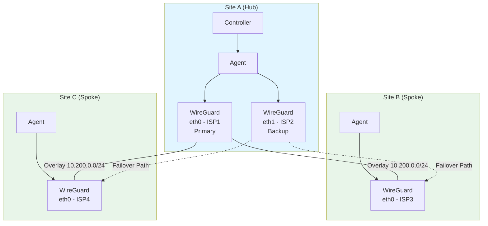
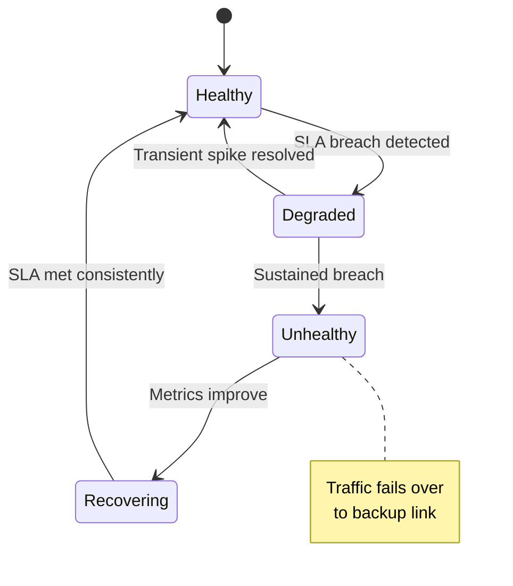

# SD-WAN

Software-Defined Wide Area Networking for intelligent multi-link site-to-site connectivity.

## Overview

NovaEdge SD-WAN extends the federation and tunneling capabilities with application-aware WAN path selection. Instead of treating all WAN links equally, SD-WAN lets you define SLA requirements per application and automatically routes traffic over the optimal link based on real-time measurements.

Key capabilities:

- **Multi-link management** -- Define multiple WAN links per site with primary, backup, and load-balanced roles
- **SLA-based monitoring** -- Continuously measure latency, jitter, and packet loss against configurable thresholds
- **Application-aware routing** -- Match traffic by host, path, or headers and apply per-application path selection strategies
- **Automatic failover** -- Detect link degradation and transparently reroute traffic to healthy links
- **DSCP marking** -- Tag packets with Differentiated Services Code Points for QoS enforcement on the underlay network
- **WireGuard tunnels** -- Encrypted site-to-site connectivity with NAT traversal

## Architecture

SD-WAN builds on two layers: a **transport layer** that manages WAN links and tunnels, and an **intelligence layer** that makes per-flow routing decisions.



The controller watches `ProxyWANLink` and `ProxyWANPolicy` CRDs, incorporates them into the `ConfigSnapshot`, and pushes the configuration to agents. Each agent then:

1. Establishes WireGuard tunnels to peer sites
2. Runs periodic SLA probes (ICMP echo, UDP jitter) on each WAN link
3. Evaluates `ProxyWANPolicy` rules against incoming traffic
4. Selects the optimal outbound link based on the policy's strategy and live measurements
5. Applies DSCP marking before forwarding

## Quick Start

### Prerequisites

- A running NovaEdge deployment with at least two sites (hub + spoke)
- WireGuard kernel module loaded on all nodes (`modprobe wireguard`)
- UDP port 51820 (or your chosen port) open between sites

Verify WireGuard is available:

```bash
lsmod | grep wireguard
# If not loaded:
sudo modprobe wireguard
```

### Step 1: Register the Remote Site

Create a `NovaEdgeRemoteCluster` resource with an `overlayCIDR` to assign an overlay network range to the remote site:

```yaml
apiVersion: novaedge.io/v1alpha1
kind: NovaEdgeRemoteCluster
metadata:
  name: site-b
  namespace: nova-system
spec:
  clusterName: site-b
  region: us-west-2
  zone: us-west-2a
  overlayCIDR: "10.200.1.0/24"
  connection:
    apiEndpoint: "https://site-b.example.com:6443"
    authSecretRef:
      name: site-b-kubeconfig
  tunnel:
    type: WireGuard
    wireGuard:
      publicKey: "dGVzdC1wdWJsaWMta2V5LWJhc2U2NA=="
      endpoint: "203.0.113.2:51820"
      allowedIPs:
        - "10.200.1.0/24"
      persistentKeepalive: 25
      listenPort: 51820
  routing:
    allowCrossClusterTraffic: true
    priority: 100
    weight: 100
  healthCheck:
    interval: 10s
    timeout: 5s
    failureThreshold: 3
```

Apply it:

```bash
kubectl apply -f novaedgeremotecluster_sdwan_sample.yaml
```

### Step 2: Define WAN Links

Create a `ProxyWANLink` for each ISP connection at each site. At minimum, define a primary link:

```yaml
apiVersion: novaedge.io/v1alpha1
kind: ProxyWANLink
metadata:
  name: site-a-isp1
  namespace: nova-system
spec:
  site: site-a
  interface: eth0
  provider: "Acme ISP"
  bandwidth: "1Gbps"
  cost: 100
  role: primary
  sla:
    maxLatency: 50ms
    maxJitter: 10ms
    maxPacketLoss: 1.0
  tunnelEndpoint:
    publicIP: "203.0.113.1"
    port: 51820
```

Optionally add a backup link:

```yaml
apiVersion: novaedge.io/v1alpha1
kind: ProxyWANLink
metadata:
  name: site-a-isp2
  namespace: nova-system
spec:
  site: site-a
  interface: eth1
  provider: "Backup Broadband"
  bandwidth: "500Mbps"
  cost: 200
  role: backup
  sla:
    maxLatency: 100ms
    maxJitter: 20ms
    maxPacketLoss: 2.0
  tunnelEndpoint:
    publicIP: "198.51.100.1"
    port: 51821
```

Apply both:

```bash
kubectl apply -f config/samples/proxywanlink_primary_sample.yaml
kubectl apply -f config/samples/proxywanlink_backup_sample.yaml
```

### Step 3: Create WAN Policies

Define application-aware routing policies. For example, route voice traffic over the lowest-latency link:

```yaml
apiVersion: novaedge.io/v1alpha1
kind: ProxyWANPolicy
metadata:
  name: voice-low-latency
  namespace: nova-system
spec:
  match:
    hosts:
      - "voip.example.com"
      - "sip.example.com"
    headers:
      content-type: "application/sdp"
  pathSelection:
    strategy: lowest-latency
    failover: true
    dscpClass: EF
```

```bash
kubectl apply -f config/samples/proxywanpolicy_voice_sample.yaml
```

### Step 4: Verify

Check the status of your WAN links and policies:

```bash
# View WAN link status
kubectl get proxywanlinks -n nova-system

# View WAN policy status
kubectl get proxywanpolicies -n nova-system

# Detailed link health
kubectl describe proxywanlink site-a-isp1 -n nova-system
```

## WAN Link Management

### Link Roles

Each `ProxyWANLink` has a `role` that determines how it participates in path selection:

| Role | Behavior |
|------|----------|
| `primary` | Preferred link for all traffic. Used unless SLA thresholds are breached. |
| `backup` | Standby link activated only when all primary links fail or breach SLA. |
| `loadbalance` | Actively participates in load distribution alongside other `loadbalance` links. |

### SLA Thresholds

SLA fields define the maximum acceptable values for each metric. When a link breaches any threshold, it is marked unhealthy and traffic fails over to the next available link.

| Field | Type | Description |
|-------|------|-------------|
| `maxLatency` | Duration | Maximum one-way latency (e.g., `50ms`) |
| `maxJitter` | Duration | Maximum jitter (e.g., `10ms`) |
| `maxPacketLoss` | Float (0.0-1.0) | Maximum packet loss ratio (e.g., `0.01` for 1%) |

!!! note
    SLA thresholds are optional. If not specified, the link is considered healthy as long as the tunnel is up.

### Automatic Failover

When a primary link breaches its SLA thresholds:

1. The agent marks the link as unhealthy in `status.healthy`
2. Traffic shifts to the next available link (another primary, or backup if no primaries are healthy)
3. The original link is re-evaluated periodically
4. When the link recovers and meets SLA for a sustained period, traffic shifts back



## Application-Aware Routing

### Traffic Matching

`ProxyWANPolicy` resources match traffic using three criteria, all of which are optional and combined with AND logic:

| Field | Type | Description |
|-------|------|-------------|
| `hosts` | `[]string` | Hostnames to match (exact match) |
| `paths` | `[]string` | URL path prefixes to match |
| `headers` | `map[string]string` | HTTP headers to match (exact key-value) |

If no match criteria are specified, the policy matches all traffic.

### Path Selection Strategies

The `strategy` field determines how the agent selects the outbound WAN link:

| Strategy | Selection Criteria | Best For |
|----------|-------------------|----------|
| `lowest-latency` | Link with the lowest measured one-way latency | VoIP, video conferencing, real-time APIs |
| `highest-bandwidth` | Link with the highest provisioned bandwidth | Large file transfers, streaming |
| `most-reliable` | Link with the lowest measured packet loss | Database replication, financial transactions |
| `lowest-cost` | Link with the lowest administrative cost | Bulk backups, non-critical batch jobs |

### DSCP Marking

DSCP (Differentiated Services Code Point) marking tags outbound packets so that upstream routers and switches can apply QoS policies. Common classes:

| DSCP Class | Per-Hop Behavior | Typical Use |
|------------|-----------------|-------------|
| `EF` | Expedited Forwarding | VoIP, real-time media |
| `AF41` | Assured Forwarding 4.1 | Video conferencing |
| `AF31` | Assured Forwarding 3.1 | Business-critical apps |
| `AF21` | Assured Forwarding 2.1 | Transactional data |
| `CS6` | Class Selector 6 | Network control |
| `CS1` | Class Selector 1 | Bulk/scavenger traffic |
| `BE` (default) | Best Effort | Everything else |

### Example: Multi-Policy Setup

A typical deployment uses multiple policies to classify different traffic types:

```yaml
# Voice traffic: lowest latency, highest priority
apiVersion: novaedge.io/v1alpha1
kind: ProxyWANPolicy
metadata:
  name: voice
  namespace: nova-system
spec:
  match:
    hosts: ["voip.example.com"]
  pathSelection:
    strategy: lowest-latency
    failover: true
    dscpClass: EF
---
# Database replication: most reliable path
apiVersion: novaedge.io/v1alpha1
kind: ProxyWANPolicy
metadata:
  name: db-replication
  namespace: nova-system
spec:
  match:
    hosts: ["db-replica.internal"]
  pathSelection:
    strategy: most-reliable
    failover: true
    dscpClass: AF31
---
# Bulk backups: cheapest path
apiVersion: novaedge.io/v1alpha1
kind: ProxyWANPolicy
metadata:
  name: backups
  namespace: nova-system
spec:
  match:
    hosts: ["backup.example.com"]
  pathSelection:
    strategy: lowest-cost
    failover: true
    dscpClass: CS1
```

## NAT Traversal

### STUN Discovery

When WAN links are behind NAT, the agent uses STUN to discover the public IP and port. Set the `tunnelEndpoint` to the expected public-facing address. If the NAT assigns a different port, the WireGuard `PersistentKeepalive` ensures the NAT mapping stays open.

### PersistentKeepalive

Set `persistentKeepalive` in the `NovaEdgeRemoteCluster` tunnel configuration to keep NAT mappings alive. A value of 25 seconds works for most NAT devices:

```yaml
tunnel:
  type: WireGuard
  wireGuard:
    persistentKeepalive: 25
```

### When Static Endpoints Are Needed

Static public IPs are recommended when:

- Both sides are behind symmetric NAT (STUN cannot help)
- Corporate firewalls perform deep packet inspection that interferes with UDP hole punching
- You need deterministic connectivity for compliance or audit requirements

In these cases, assign a static public IP or use a cloud NAT gateway with a fixed IP allocation and configure it in `tunnelEndpoint.publicIP`.

## Monitoring

### Prometheus Metrics

The agent exposes SD-WAN metrics on its Prometheus endpoint:

| Metric | Type | Description |
|--------|------|-------------|
| `novaedge_sdwan_link_latency_ms` | Gauge | Current measured latency per link |
| `novaedge_sdwan_link_jitter_ms` | Gauge | Current measured jitter per link |
| `novaedge_sdwan_link_packet_loss_ratio` | Gauge | Current packet loss ratio per link |
| `novaedge_sdwan_link_healthy` | Gauge | Whether the link meets SLA (1=healthy, 0=unhealthy) |
| `novaedge_sdwan_path_selections_total` | Counter | Total path selection decisions per policy |
| `novaedge_sdwan_failovers_total` | Counter | Total failover events per link |

All metrics include labels for `site`, `link`, `provider`, and `role`.

### Example Alert Rules

```yaml
groups:
  - name: sdwan
    rules:
      - alert: WANLinkUnhealthy
        expr: novaedge_sdwan_link_healthy == 0
        for: 5m
        labels:
          severity: warning
        annotations:
          summary: "WAN link {{ $labels.link }} at {{ $labels.site }} is unhealthy"
      - alert: AllPrimaryLinksDown
        expr: sum by (site) (novaedge_sdwan_link_healthy{role="primary"}) == 0
        for: 1m
        labels:
          severity: critical
        annotations:
          summary: "All primary WAN links at {{ $labels.site }} are down"
```

### WebUI Topology Dashboard

The NovaEdge WebUI includes an SD-WAN topology view showing:

- Sites and their interconnections
- Per-link health status and live metrics
- Active path selection decisions
- Failover events timeline

Access it at **Operations > SD-WAN Topology** in the web interface.

## Troubleshooting

### Tunnel Not Establishing

**Symptoms**: Remote cluster shows as disconnected, no overlay traffic flows.

1. Verify WireGuard is loaded: `lsmod | grep wireguard`
2. Check the tunnel endpoint is reachable: `nc -zu <publicIP> <port>`
3. Verify the WireGuard public key matches: `kubectl get secret -n nova-system`
4. Check firewall rules allow UDP on the tunnel port
5. Inspect agent logs: `kubectl logs -n nova-system -l app=novaedge-agent | grep wireguard`

### High Latency on a Link

**Symptoms**: Link shows high latency in status, policies avoid it.

1. Check the link status: `kubectl describe proxywanlink <name> -n nova-system`
2. Verify the SLA thresholds are realistic for the link type (e.g., satellite links have inherently high latency)
3. Run a manual latency test from the node: `ping -c 10 <peer-endpoint>`
4. Check for congestion on the underlying interface: `ip -s link show <interface>`

### Path Not Switching

**Symptoms**: Traffic stays on a degraded link instead of failing over.

1. Confirm the `ProxyWANPolicy` has `failover: true`
2. Verify there is an alternative link available (check `kubectl get proxywanlinks`)
3. Check that the alternative link is healthy: `status.healthy` should be `true`
4. Inspect agent logs for path selection decisions: `kubectl logs -n nova-system -l app=novaedge-agent | grep "path selection"`
5. Ensure the policy matches the traffic (check `hosts`, `paths`, and `headers` fields)

### DSCP Marks Not Applied

**Symptoms**: Upstream routers do not apply QoS despite DSCP configuration.

1. Verify the policy has a `dscpClass` set
2. Check that the upstream network honors DSCP (many cloud providers strip DSCP marks)
3. Capture packets to confirm marking: `tcpdump -i <interface> -v | grep tos`
4. Some ISPs re-mark traffic at ingress -- coordinate with your provider

## What's Next

- [ProxyWANLink CRD Reference](../reference/proxywanlink.md) -- Full field reference
- [ProxyWANPolicy CRD Reference](../reference/proxywanpolicy.md) -- Full field reference
- [Federation Tunnels](federation-tunnels.md) -- Underlying tunnel configuration
- [Cross-Cluster Routing](cross-cluster-routing.md) -- Routing traffic between clusters
