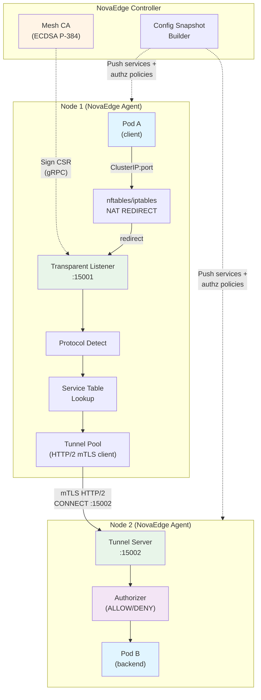
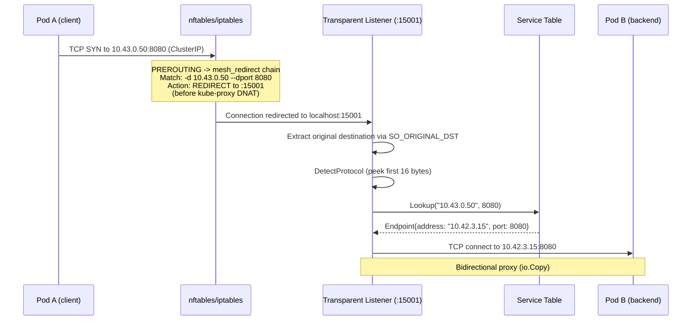
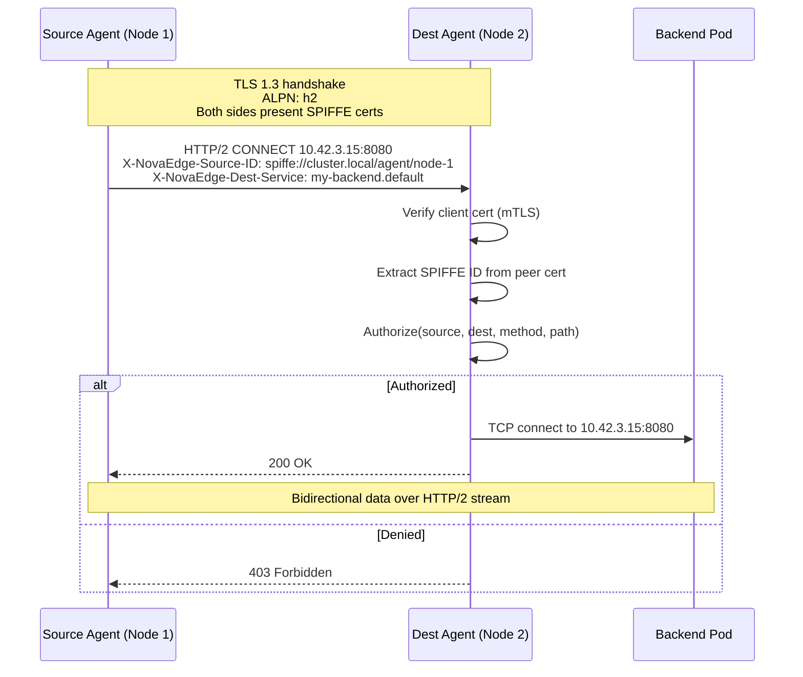
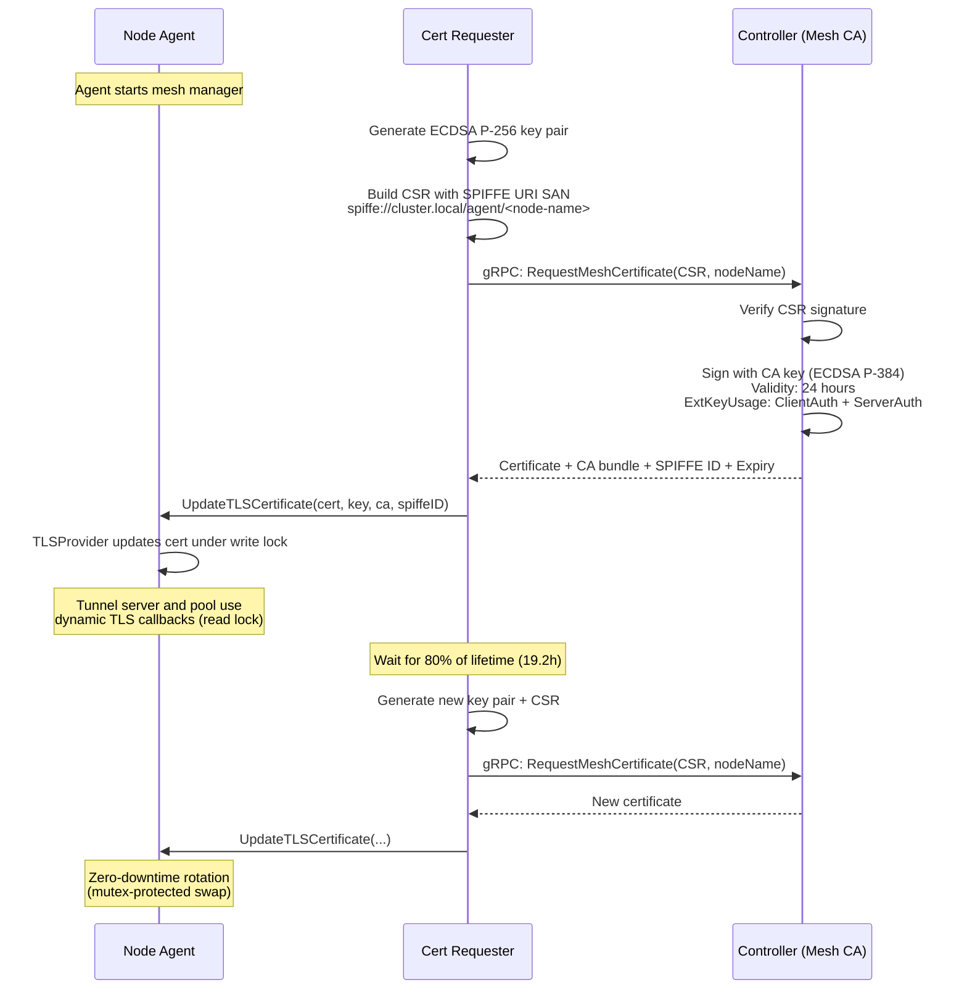

# Service Mesh

NovaEdge includes a sidecar-free service mesh for east-west (pod-to-pod) traffic. It intercepts ClusterIP traffic transparently using nftables (preferred) or iptables NAT REDIRECT rules, authenticates services with SPIFFE-based mTLS, and enforces authorization policies -- all without injecting sidecar containers.

## Overview

Traditional service meshes inject a sidecar proxy into every pod, adding latency, memory overhead, and operational complexity. NovaEdge takes a different approach: the node agent (DaemonSet) intercepts service traffic at the kernel level using NAT REDIRECT rules and tunnels it over mTLS HTTP/2 connections between nodes.

Key properties:

- **No sidecars** -- traffic interception happens at the node level via nftables/iptables NAT REDIRECT
- **Opt-in per service** -- annotate services with `novaedge.io/mesh: "enabled"` to enroll them
- **SPIFFE identities** -- each agent gets a workload certificate with a SPIFFE URI SAN
- **mTLS everywhere** -- node-to-node tunnel traffic is encrypted with TLS 1.3
- **Authorization policies** -- control which services can communicate using ALLOW/DENY rules
- **Automatic certificate rotation** -- certificates are renewed at 80% of their 24-hour lifetime

## Architecture



### Components

| Component | File | Port | Purpose |
|-----------|------|------|---------|
| TPROXY Manager | `internal/agent/mesh/tproxy.go` | -- | Manages nftables/iptables REDIRECT rules via `RuleBackend` interface |
| Transparent Listener | `internal/agent/mesh/listener.go` | 15001 | Accepts redirected connections |
| Protocol Detector | `internal/agent/mesh/detect.go` | -- | Peeks at first bytes to identify HTTP/1, HTTP/2, TLS, or opaque TCP |
| Service Table | `internal/agent/mesh/manager.go` | -- | Maps ClusterIP:port to backend endpoints with round-robin LB |
| Tunnel Server | `internal/agent/mesh/tunnel.go` | 15002 | HTTP/2 CONNECT server for incoming mTLS tunnels |
| Tunnel Pool | `internal/agent/mesh/tunnel.go` | -- | Persistent HTTP/2 client pool for outbound tunnels |
| TLS Provider | `internal/agent/mesh/tls.go` | -- | Manages TLS certificates with mutex-protected rotation |
| Certificate Requester | `internal/agent/mesh/cert.go` | -- | Generates CSR, requests cert from controller, auto-renews |
| Authorizer | `internal/agent/mesh/authz.go` | -- | Evaluates ALLOW/DENY policies per service |
| Mesh CA | `internal/controller/meshca/ca.go` | -- | Controller-side CA that signs workload certificates |

## Enabling the Service Mesh

### Annotate services

Add the `novaedge.io/mesh` annotation to any Kubernetes Service you want to enroll:

```yaml
apiVersion: v1
kind: Service
metadata:
  name: my-backend
  annotations:
    novaedge.io/mesh: "enabled"
spec:
  selector:
    app: my-backend
  ports:
    - port: 8080
      targetPort: 8080
```

When the NovaEdge controller detects this annotation, it includes the service in the `InternalService` list pushed to agents via ConfigSnapshot. The agent then creates NAT REDIRECT rules to intercept traffic to the service's ClusterIP.

### Disable mesh for a service

Remove the annotation or set it to any value other than `"enabled"`:

```yaml
annotations:
  novaedge.io/mesh: "disabled"
```

The agent will remove the corresponding REDIRECT rules on the next config reconciliation.

## How Traffic Interception Works

NovaEdge uses NAT REDIRECT to intercept traffic destined to mesh-enrolled ClusterIP services. The REDIRECT rule rewrites the destination port to the agent's transparent listener while conntrack records the original ClusterIP destination, which the listener retrieves via `SO_ORIGINAL_DST`. The agent auto-detects and uses **nftables** (preferred, atomic rule updates via netlink) or falls back to **iptables** (exec-based) if nftables is not available.

### Packet flow



### Rules created

The TPROXY manager creates NAT REDIRECT rules. The agent auto-selects the backend at startup and logs `"Selected TPROXY backend" backend=nftables` (or `iptables`).

#### nftables (preferred)

Rules are applied atomically in a single netlink batch -- no brief inconsistency windows:

```bash
# Table and chain (created once at startup)
nft add table ip novaedge_mesh
nft add chain ip novaedge_mesh mesh_redirect \
  '{ type nat hook prerouting priority dstnat - 1; }'

# Per-service REDIRECT rules (one per ClusterIP:port, replaced atomically)
nft add rule ip novaedge_mesh mesh_redirect \
  ip protocol tcp ip daddr 10.43.0.50 tcp dport 8080 \
  redirect to :15001
```

The chain priority `dstnat - 1` (-101) ensures our REDIRECT fires before kube-proxy's DNAT rules at priority -100, preserving the original ClusterIP in conntrack.

#### iptables (fallback)

Used when the kernel does not support nftables or the `nft` subsystem is unavailable:

```bash
# 1. Custom chain in the nat table
iptables -t nat -N NOVAEDGE_MESH

# 2. Insert at top of PREROUTING (before kube-proxy's KUBE-SERVICES)
iptables -t nat -I PREROUTING 1 -j NOVAEDGE_MESH

# 3. Per-service REDIRECT rules (one per ClusterIP:port)
iptables -t nat -A NOVAEDGE_MESH \
  -p tcp -d 10.43.0.50 --dport 8080 \
  -j REDIRECT --to-ports 15001
```

Rules are reconciled on every config update. On shutdown, all rules are cleaned up.

### Why REDIRECT instead of TPROXY

REDIRECT uses standard NAT conntrack to record the original destination before rewriting the port. The transparent listener retrieves the original ClusterIP:port via `getsockopt(SO_ORIGINAL_DST)`. This approach is compatible with all CNI plugins (Flannel, Calico, Cilium, etc.) and bridge-based network topologies, unlike TPROXY which requires specific kernel socket lookup behavior that varies across network configurations. REDIRECT also eliminates the need for policy routing (`ip rule`/`ip route`), fwmark management, and conntrack bypass (notrack) rules -- resulting in a simpler, more portable implementation.

## How the mTLS Tunnel Works

When a connection needs to reach a pod on a different node, the agent establishes an HTTP/2 CONNECT tunnel through the peer agent's tunnel server. All tunnel traffic is encrypted with mTLS using SPIFFE certificates.



### Tunnel configuration

| Parameter | Value | Description |
|-----------|-------|-------------|
| Port | 15002 | Tunnel server listen port |
| TLS version | TLS 1.3 minimum | Enforced via `MinVersion: tls.VersionTLS13` |
| Client auth | `RequireAndVerifyClientCert` | Both sides must present valid certificates |
| ALPN | `h2` | HTTP/2 protocol negotiation |
| Connect timeout | 5 seconds | Timeout for dialing backend pods |

### Connection pooling

The `TunnelPool` maintains persistent HTTP/2 connections to peer agents, keyed by node address. Multiple tunnel streams are multiplexed over a single TLS connection, reducing handshake overhead for subsequent requests to the same node.

## Certificate Lifecycle

NovaEdge uses SPIFFE-compatible workload certificates for mesh identity. The certificate lifecycle is fully automatic.



### Certificate properties

| Property | Value |
|----------|-------|
| Key algorithm | ECDSA P-256 (workload), ECDSA P-384 (CA) |
| SPIFFE URI SAN | `spiffe://<trust-domain>/agent/<node-name>` |
| Default trust domain | `cluster.local` |
| Workload cert validity | 24 hours |
| Root CA validity | ~10 years |
| Renewal threshold | 80% of lifetime (19.2 hours for 24h certs) |
| Minimum renewal interval | 30 seconds (prevents tight loops) |
| CSR request timeout | 30 seconds |
| Retry delay on failure | 5 seconds |

### Mesh CA

The controller runs an embedded Mesh CA (`internal/controller/meshca/`) that signs workload certificates:

- Root CA key: ECDSA P-384, stored in Kubernetes Secret `novaedge-mesh-ca` in namespace `novaedge-system`
- On first startup, the CA generates a new root key and persists it to the Secret
- On subsequent startups, it loads the existing key from the Secret
- Issued certificates include SPIFFE URI SANs and both `ClientAuth` and `ServerAuth` extended key usage

### TLS rotation

The `TLSProvider` uses dynamic TLS callbacks (`GetCertificate`, `GetClientCertificate`, `GetConfigForClient`) so that certificate rotation is transparent to active connections. New connections automatically use the latest certificate without restarting the tunnel server or pool.

## Authorization Policies

The mesh authorizer enforces service-level access control. Policies are pushed by the controller as part of the ConfigSnapshot.

### Policy evaluation order

1. **DENY policies are evaluated first.** If any DENY rule matches, the request is denied immediately.
2. **ALLOW policies are evaluated next.** If any ALLOW rule matches, the request is allowed.
3. **If ALLOW policies exist but none match**, the request is denied (default-deny when explicit ALLOW rules are present).
4. **If only DENY policies exist and none match**, the request is allowed.
5. **If no policies exist for the destination service**, the request is allowed (default-allow).

### Policy structure

Policies are defined per target service and include source (from) and destination (to) constraints:

```
MeshAuthorizationPolicy:
  name: string
  action: "ALLOW" | "DENY"
  target_service: string        # e.g., "my-backend"
  target_namespace: string      # e.g., "default"
  rules:
    - from:                     # Source constraints (empty = match all)
        - namespaces: [...]
          serviceAccounts: [...]
          spiffeIds: [...]      # Glob patterns
      to:                       # Destination constraints (empty = match all)
        - methods: [...]        # HTTP methods (case-insensitive)
          paths: [...]          # Glob patterns
```

### Source matching

| Field | Match type | Example |
|-------|-----------|---------|
| `namespaces` | Exact | `["production", "staging"]` |
| `serviceAccounts` | Exact | `["frontend-sa"]` |
| `spiffeIds` | Glob | `["spiffe://cluster.local/ns/*/sa/frontend-*"]` |

### Destination matching

| Field | Match type | Example |
|-------|-----------|---------|
| `methods` | Case-insensitive exact | `["GET", "POST"]` |
| `paths` | Glob | `["/api/*", "/health"]` |

For opaque TCP connections (non-HTTP), destination rules with `methods` or `paths` set will not match. Use source-only rules for L4 authorization.

### Example: allow only frontend to access backend

```yaml
# Pushed via ConfigSnapshot (protobuf MeshAuthorizationPolicy)
action: ALLOW
target_service: my-backend
target_namespace: default
rules:
  - from:
      - namespaces: ["default"]
        serviceAccounts: ["frontend-sa"]
    to:
      - methods: ["GET", "POST"]
        paths: ["/api/*"]
```

### Example: deny a specific namespace

```yaml
action: DENY
target_service: my-backend
target_namespace: default
rules:
  - from:
      - namespaces: ["untrusted"]
```

## Troubleshooting

### Check if mesh is active on a node

```bash
# nftables backend: list the novaedge_mesh table
nft list table ip novaedge_mesh

# Expected output:
# table ip novaedge_mesh {
#   chain mesh_redirect {
#     type nat hook prerouting priority dstnat - 1; policy accept;
#     ip daddr 10.43.0.50 tcp dport 8080 redirect to :15001
#   }
# }

# iptables fallback: check the NOVAEDGE_MESH chain
iptables -t nat -L NOVAEDGE_MESH -n -v

# Expected output shows per-service REDIRECT rules:
# Chain NOVAEDGE_MESH (1 references)
#  pkts bytes target     prot opt in     out     source     destination
#   142  8520 REDIRECT   tcp  --  *      *       0.0.0.0/0  10.43.0.50    tcp dpt:8080 redir ports 15001
```

### Check the transparent listener

```bash
# Verify port 15001 is listening
ss -tlnp | grep 15001
```

### Check the tunnel server

```bash
# Verify port 15002 is listening
ss -tlnp | grep 15002
```

### Check certificate status

```bash
# Check agent logs for certificate lifecycle events
kubectl logs -n novaedge-system -l app.kubernetes.io/name=novaedge-agent | grep "mesh.*cert"

# Expected log lines:
# "Mesh certificate obtained, scheduling renewal" expiry=... lifetime=24h0m0s renew_in=19h12m0s
# "Mesh certificate applied" spiffe_id=spiffe://cluster.local/agent/node-1

# Verify the CA secret exists
kubectl get secret novaedge-mesh-ca -n novaedge-system
```

### Check mesh service count

```bash
# Look for mesh config application in agent logs
kubectl logs -n novaedge-system -l app.kubernetes.io/name=novaedge-agent | grep "Mesh config applied"

# Expected: "Mesh config applied" services=5 intercept_rules=8 routing_entries=8 authz_policies=3
```

### Connection not being intercepted

If traffic to a mesh-enrolled service is not being intercepted:

1. Verify the service has the annotation: `kubectl get svc <name> -o jsonpath='{.metadata.annotations.novaedge\.io/mesh}'`
2. Check that the corresponding rule exists: `nft list table ip novaedge_mesh 2>/dev/null | grep <clusterIP>` or `iptables -t nat -L NOVAEDGE_MESH -n | grep <clusterIP>`
3. Verify the agent received the service in its config: check agent logs for `intercept_rules` count
4. Confirm the transparent listener is accepting connections: `ss -tlnp | grep 15001`

### Tunnel connection failures

```bash
# Check for tunnel errors in agent logs
kubectl logs -n novaedge-system -l app.kubernetes.io/name=novaedge-agent | grep -i tunnel

# Common issues:
# - "no mesh TLS certificate loaded" -> cert requester has not obtained a cert yet
# - "CONNECT ... returned status 403" -> authorization policy is denying the connection
# - "Failed to dial backend" -> backend pod is unreachable from the destination node
```

### Authorization denied unexpectedly

```bash
# Check authorizer debug logs (set log level to debug)
kubectl logs -n novaedge-system -l app.kubernetes.io/name=novaedge-agent | grep "mesh authorization"

# Expected for denials:
# "mesh authorization denied by DENY policy" policy=... source=... dest=...
# "mesh authorization denied: no ALLOW policy matched" source=... dest=...
```

## Protocol Detection

The transparent listener peeks at the first 16 bytes of each intercepted connection to detect the application protocol:

| Protocol | Detection method | Handling |
|----------|-----------------|----------|
| HTTP/1.x | Starts with `GET `, `POST `, `PUT `, etc. | L4 proxy (L7 routing planned) |
| HTTP/2 | Starts with `PRI * HTTP/2` (connection preface) | L4 proxy |
| TLS | Starts with `0x16 0x03` (ClientHello) | L4 proxy |
| Opaque TCP | None of the above | L4 proxy (passthrough) |

All protocols are currently proxied as L4 TCP. HTTP-aware routing (L7 mesh) is planned for a future release.

## Related Pages

- [TLS](tls.md) -- TLS certificate management for ingress traffic
- [Policies](policies.md) -- Rate limiting, authentication, and WAF policies for north-south traffic
- [VIP Management](vip-management.md) -- Virtual IP management for external access
