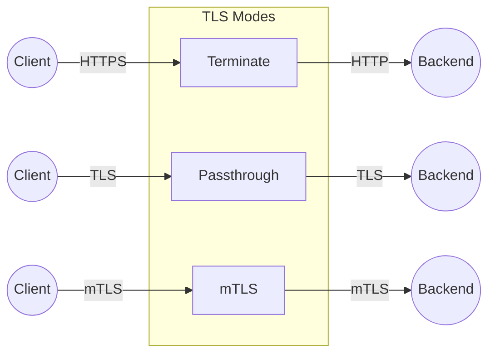
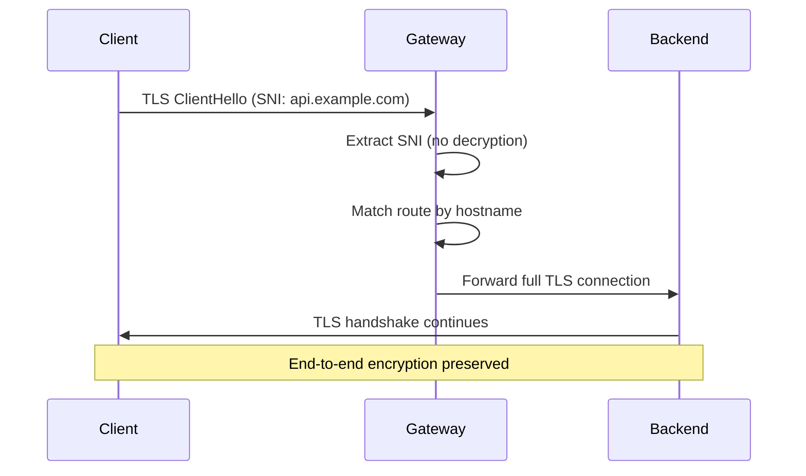

# TLS Configuration

Configure TLS termination, passthrough, and mutual TLS (mTLS).

## Overview



## TLS Termination

Terminate TLS at the gateway and forward plain HTTP to backends.

### Using Kubernetes Secrets

```yaml
# Create TLS secret
kubectl create secret tls example-tls \
  --cert=cert.pem \
  --key=key.pem \
  -n default

# Gateway configuration
apiVersion: novaedge.io/v1alpha1
kind: ProxyGateway
metadata:
  name: https-gateway
spec:
  vipRef: main-vip
  listeners:
    - name: https
      port: 443
      protocol: HTTPS
      hostnames:
        - "*.example.com"
      tls:
        secretRef:
          name: example-tls
          namespace: default
```

### Multiple Certificates (SNI)

```yaml
apiVersion: novaedge.io/v1alpha1
kind: ProxyGateway
metadata:
  name: multi-cert-gateway
spec:
  vipRef: main-vip
  listeners:
    - name: https
      port: 443
      protocol: HTTPS
  tlsCertificates:
    api.example.com:
      secretRef:
        name: api-tls
    www.example.com:
      secretRef:
        name: web-tls
    admin.example.com:
      secretRef:
        name: admin-tls
```

NovaEdge automatically selects the correct certificate based on SNI.

### TLS Versions

```yaml
apiVersion: novaedge.io/v1alpha1
kind: ProxyGateway
metadata:
  name: tls-config-gateway
spec:
  vipRef: main-vip
  listeners:
    - name: https
      port: 443
      protocol: HTTPS
      tls:
        secretRef:
          name: example-tls
        minVersion: "TLS1.2"  # Minimum TLS version
        cipherSuites:
          - TLS_AES_128_GCM_SHA256
          - TLS_AES_256_GCM_SHA384
          - TLS_CHACHA20_POLY1305_SHA256
```

### TLS Options

| Field | Default | Description |
|-------|---------|-------------|
| `secretRef` | - | Reference to a Kubernetes TLS Secret |
| `certificateRef` | - | Reference to a ProxyCertificate resource |
| `acme` | - | Inline ACME certificate provisioning config |
| `selfSigned` | - | Generate a self-signed certificate |
| `vaultCertRef` | - | Reference to a Vault PKI certificate |
| `minVersion` | TLS1.2 | Minimum TLS version |
| `cipherSuites` | [] | Allowed cipher suites |

One of `secretRef`, `certificateRef`, `acme`, `selfSigned`, or `vaultCertRef` must be specified.

## TLS Passthrough

Pass encrypted traffic directly to backends without termination. NovaEdge reads the SNI (Server Name Indication) from the TLS ClientHello message without decrypting the connection, then routes the connection to the appropriate backend based on the hostname.

### How It Works

1. Client initiates a TLS connection to the listener port
2. NovaEdge reads the TLS ClientHello message and extracts the SNI hostname
3. The SNI hostname is matched against configured routes (exact match, then wildcard)
4. The entire TLS connection (including the ClientHello) is forwarded to the selected backend
5. The TLS handshake completes directly between client and backend (end-to-end encryption)



### Kubernetes Configuration

```yaml
apiVersion: novaedge.io/v1alpha1
kind: ProxyGateway
metadata:
  name: passthrough-gateway
spec:
  vipRef: main-vip
  listeners:
    - name: tls
      port: 443
      protocol: TLS
      hostnames:
        - "api.example.com"
        - "app.example.com"
        - "*.internal.example.com"
```

### Route Configuration

TLS passthrough routes use the `ProxyRoute` resource with hostname-based matching:

```yaml
apiVersion: novaedge.io/v1alpha1
kind: ProxyRoute
metadata:
  name: api-tls-route
spec:
  hostnames:
    - "api.example.com"
  rules:
    - backendRefs:
        - name: api-backend
---
apiVersion: novaedge.io/v1alpha1
kind: ProxyRoute
metadata:
  name: app-tls-route
spec:
  hostnames:
    - "app.example.com"
  rules:
    - backendRefs:
        - name: app-backend
```

### Hostname Matching

TLS passthrough supports two types of hostname matching:

| Match Type | Example | Matches |
|------------|---------|---------|
| Exact | `api.example.com` | Only `api.example.com` |
| Wildcard | `*.example.com` | `foo.example.com`, `bar.example.com` (not `example.com`) |

Exact matches take priority over wildcard matches.

### Gateway API TLSRoute

NovaEdge also supports the Gateway API `TLSRoute` resource for TLS passthrough:

```yaml
apiVersion: gateway.networking.k8s.io/v1alpha2
kind: TLSRoute
metadata:
  name: api-tlsroute
spec:
  parentRefs:
    - name: tls-gateway
      sectionName: tls
  hostnames:
    - "api.example.com"
  rules:
    - backendRefs:
        - name: api-service
          port: 443
```

See [Gateway API - L4 Routes](../advanced/gateway-api.md#l4-routes) for details.

### Standalone Configuration

```yaml
l4Listeners:
  - name: tls-passthrough
    port: 443
    protocol: TLS
    tlsRoutes:
      - hostname: "api.example.com"
        backend: api-backend
      - hostname: "*.internal.example.com"
        backend: internal-backend
```

### TLS Passthrough Metrics

| Metric | Type | Description |
|--------|------|-------------|
| `novaedge_l4_tls_passthrough_total` | Counter | TLS passthrough connections by SNI |
| `novaedge_l4_sni_routing_errors_total` | Counter | SNI routing errors |
| `novaedge_l4_connections_total` | Counter | Total L4 connections |
| `novaedge_l4_active_connections` | Gauge | Currently active connections |

For comprehensive L4 proxying documentation including TCP and UDP, see [Layer 4 TCP/UDP Proxying](l4-proxying.md).

## Backend TLS (Upstream TLS)

Encrypt traffic between NovaEdge and backends.

```yaml
apiVersion: novaedge.io/v1alpha1
kind: ProxyBackend
metadata:
  name: secure-backend
spec:
  serviceRef:
    name: api-service
    port: 8443
  tls:
    enabled: true
    serverName: "api.internal.example.com"
    insecureSkipVerify: false
    caSecretRef:
      name: backend-ca
```

### Backend TLS Options

| Field | Default | Description |
|-------|---------|-------------|
| `enabled` | false | Enable TLS to backend |
| `serverName` | - | SNI server name |
| `insecureSkipVerify` | false | Skip certificate verification |
| `caSecretRef` | - | CA certificate secret |

## Mutual TLS (mTLS)

Require client certificates for authentication.

### Client Certificate Validation

```yaml
apiVersion: novaedge.io/v1alpha1
kind: ProxyGateway
metadata:
  name: mtls-gateway
spec:
  vipRef: main-vip
  listeners:
    - name: https
      port: 443
      protocol: HTTPS
      tls:
        secretRef:
          name: server-tls
      clientAuth:
        mode: require  # none, optional, or require
        caCertRef:
          name: client-ca
```

### Client Validation Modes

| Mode | Description |
|------|-------------|
| Require | Reject if no valid client cert |
| Request | Request cert, allow if missing |
| Optional | Accept any cert or none |

### Forward Client Certificate

Forward client certificate info to backends:

```yaml
apiVersion: novaedge.io/v1alpha1
kind: ProxyGateway
metadata:
  name: mtls-forward-gateway
spec:
  vipRef: main-vip
  listeners:
    - name: https
      port: 443
      protocol: HTTPS
      tls:
        secretRef:
          name: server-tls
      clientAuth:
        mode: require
        caCertRef:
          name: client-ca
        requiredCNPatterns:
          - "^.*$"
```

## Certificate Management

### Generate Self-Signed Certificate

```bash
# Generate CA
openssl genrsa -out ca.key 4096
openssl req -x509 -new -nodes -key ca.key -sha256 -days 1024 -out ca.crt \
  -subj "/CN=NovaEdge CA"

# Generate server certificate
openssl genrsa -out server.key 4096
openssl req -new -key server.key -out server.csr \
  -subj "/CN=*.example.com"
openssl x509 -req -in server.csr -CA ca.crt -CAkey ca.key \
  -CAcreateserial -out server.crt -days 365 -sha256

# Create Kubernetes secret
kubectl create secret tls example-tls \
  --cert=server.crt \
  --key=server.key
```

### Using cert-manager

```yaml
# Certificate request
apiVersion: cert-manager.io/v1
kind: Certificate
metadata:
  name: example-tls
spec:
  secretName: example-tls
  issuerRef:
    name: letsencrypt-prod
    kind: ClusterIssuer
  dnsNames:
    - "*.example.com"
    - "example.com"
```

NovaEdge automatically reloads certificates when secrets are updated.

## HTTP to HTTPS Redirect

Redirect HTTP traffic to HTTPS:

```yaml
---
apiVersion: novaedge.io/v1alpha1
kind: ProxyGateway
metadata:
  name: redirect-gateway
spec:
  vipRef: main-vip
  listeners:
    - name: http
      port: 80
      protocol: HTTP
    - name: https
      port: 443
      protocol: HTTPS
      tls:
        secretRef:
          name: example-tls
---
apiVersion: novaedge.io/v1alpha1
kind: ProxyRoute
metadata:
  name: https-redirect
spec:
  parentRefs:
    - name: redirect-gateway
      sectionName: http  # HTTP listener only
  rules:
    - filters:
        - type: RequestRedirect
          requestRedirect:
            scheme: https
            statusCode: 301
```

## TLS Metrics

| Metric | Description |
|--------|-------------|
| `novaedge_tls_handshakes_total` | TLS handshakes |
| `novaedge_tls_handshake_errors_total` | TLS handshake errors |
| `novaedge_tls_version` | TLS version used |
| `novaedge_mtls_client_auth_total` | mTLS authentications |
| `novaedge_mtls_client_auth_failed_total` | Failed mTLS auths |

## Troubleshooting

### Certificate Issues

```bash
# Verify secret contains correct data
kubectl get secret example-tls -o yaml

# Check certificate validity
kubectl get secret example-tls -o jsonpath='{.data.tls\.crt}' | base64 -d | openssl x509 -noout -dates

# Check certificate chain
openssl s_client -connect example.com:443 -servername example.com
```

### TLS Version Issues

```bash
# Test specific TLS version
openssl s_client -connect example.com:443 -tls1_2
openssl s_client -connect example.com:443 -tls1_3
```

### mTLS Issues

```bash
# Test with client certificate
openssl s_client -connect example.com:443 \
  -cert client.crt \
  -key client.key \
  -CAfile ca.crt
```

## Next Steps

- [Health Checks](health-checks.md) - Backend health checking
- [Policies](policies.md) - Security policies
- [Observability](../operations/observability.md) - TLS metrics

## Mutual TLS (mTLS) Client Authentication

NovaEdge supports frontend mTLS, where clients present TLS certificates that are validated by the proxy before allowing access.

### Configuration

#### Kubernetes CRD

```yaml
apiVersion: novaedge.io/v1alpha1
kind: ProxyGateway
metadata:
  name: mtls-gateway
spec:
  vipRef: internal-vip
  listeners:
    - name: https-mtls
      port: 443
      protocol: HTTPS
      tls:
        secretRef:
          name: server-tls-cert
      clientAuth:
        mode: require         # "none", "optional", or "require"
        caCertRef:
          name: client-ca-cert  # Secret with ca.crt key
        requiredCNPatterns:
          - "^service\\.internal\\..*$"
        requiredSANs:
          - "service.internal.example.com"
```

#### Standalone Mode

```yaml
listeners:
  - name: https-mtls
    port: 443
    protocol: HTTPS
    tls:
      certFile: /etc/tls/server.crt
      keyFile: /etc/tls/server.key
    clientAuth:
      mode: require
      caFile: /etc/tls/client-ca.crt
      requiredCNPatterns:
        - "^service\\.internal\\..*$"
      requiredSANs:
        - "service.internal.example.com"
```

### Client Authentication Modes

| Mode | Behavior |
|------|----------|
| `none` | No client certificate requested (default) |
| `optional` | Client certificate requested but not required; if provided, it must be valid |
| `require` | Client must present a valid certificate signed by the configured CA |

### Client Certificate Headers

When a client certificate is presented, NovaEdge injects the following headers before forwarding to backends:

| Header | Value |
|--------|-------|
| `X-Client-Cert-CN` | Subject Common Name |
| `X-Client-Cert-SAN-DNS` | Comma-separated DNS SANs |
| `X-Client-Cert-SAN-Email` | Comma-separated email SANs |
| `X-Client-Cert-SAN-URI` | Comma-separated URI SANs |
| `X-Client-Cert-Fingerprint` | SHA-256 fingerprint (hex) |
| `X-Client-Cert-Serial` | Certificate serial number |
| `X-Client-Cert-Issuer` | Certificate issuer |
| `X-Client-Cert-Subject` | Certificate subject |

### Policy Validation

The `requiredCNPatterns` and `requiredSANs` fields provide policy-based access control:

- **requiredCNPatterns**: Regex patterns that the client certificate Common Name must match (at least one must match)
- **requiredSANs**: Subject Alternative Names that must be present on the client certificate (all must match)

Requests that fail policy validation receive a `403 Forbidden` response.

## OCSP Stapling

OCSP (Online Certificate Status Protocol) stapling improves TLS handshake performance and privacy by having the server fetch and cache the certificate's revocation status, rather than requiring clients to check it themselves.

### Configuration

#### Kubernetes CRD

```yaml
apiVersion: novaedge.io/v1alpha1
kind: ProxyGateway
metadata:
  name: ocsp-gateway
spec:
  vipRef: public-vip
  listeners:
    - name: https
      port: 443
      protocol: HTTPS
      tls:
        secretRef:
          name: server-tls-cert
      ocspStapling: true
```

#### Standalone Mode

```yaml
listeners:
  - name: https
    port: 443
    protocol: HTTPS
    tls:
      certFile: /etc/tls/server.crt
      keyFile: /etc/tls/server.key
    ocspStapling: true
```

### How It Works

1. NovaEdge fetches the OCSP response from the certificate's OCSP responder URL
2. The response is cached and attached to TLS handshakes (stapled)
3. A background goroutine refreshes the OCSP response before expiry (24 hours before)
4. If the OCSP fetch fails, the server continues serving without a staple (graceful degradation)

### Requirements

- The server certificate must include OCSP responder URLs (most CA-issued certificates do)
- The issuer certificate must be available (either in the certificate chain or in the CA bundle)
- Network access to the OCSP responder from the proxy nodes

### Monitoring

OCSP status is available through the health/status endpoint and includes:
- Whether stapling is active per certificate
- Next OCSP response update time
- Last refresh time and any errors

## DNS-01 ACME Challenges

DNS-01 challenges are useful for:
- Wildcard certificates (e.g., `*.example.com`)
- Environments where HTTP-01 is not possible (private networks, firewalls)
- Multi-domain certificates

### Supported DNS Providers

| Provider | Credentials Required |
|----------|---------------------|
| Cloudflare | `api_token` |
| Route53 | `access_key_id`, `secret_access_key`, `hosted_zone_id` |
| Google Cloud DNS | `project`, `managed_zone`, `access_token` or `service_account_json` |

### Kubernetes Configuration

```yaml
apiVersion: novaedge.io/v1alpha1
kind: ProxyCertificate
metadata:
  name: wildcard-cert
spec:
  domains:
    - "*.example.com"
    - "example.com"
  issuer:
    type: acme
    acme:
      email: admin@example.com
      challengeType: dns-01
      dnsProvider: cloudflare
      dnsCredentialsRef:
        name: cloudflare-api-token
        namespace: nova-system
      dns01:
        provider: cloudflare
        credentialsRef:
          name: cloudflare-api-token
        propagationTimeout: "120s"
        pollingInterval: "5s"
  secretName: wildcard-tls
```

DNS provider credentials Secret:

```yaml
apiVersion: v1
kind: Secret
metadata:
  name: cloudflare-api-token
  namespace: nova-system
type: Opaque
stringData:
  api_token: "your-cloudflare-api-token"
```

### Standalone Mode Configuration

```yaml
certificates:
  - name: wildcard
    domains:
      - "*.example.com"
      - "example.com"
    issuer:
      type: acme
      acme:
        email: admin@example.com
        challengeType: dns-01
        dnsProvider: cloudflare
        dns01:
          provider: cloudflare
          credentials:
            api_token: "${CLOUDFLARE_API_TOKEN}"
          propagationTimeout: "120s"
        acceptTOS: true
```

## TLS-ALPN-01 ACME Challenges

TLS-ALPN-01 challenges validate domain ownership over TLS on port 443 using the `acme-tls/1` ALPN protocol. This is useful when:

- Port 80 is not available (HTTP-01 requires port 80)
- DNS API access is not available (DNS-01 requires DNS provider API)

### Kubernetes Configuration

```yaml
apiVersion: novaedge.io/v1alpha1
kind: ProxyCertificate
metadata:
  name: api-cert
spec:
  domains:
    - api.example.com
  issuer:
    type: acme
    acme:
      email: admin@example.com
      challengeType: tls-alpn-01
      tlsAlpn01:
        port: 443
  secretName: api-tls
```

### How TLS-ALPN-01 Works

1. ACME server sends a challenge token
2. NovaEdge creates a temporary self-signed certificate containing the challenge token as an ACME identifier extension
3. The certificate is served on port 443 with the `acme-tls/1` ALPN protocol
4. ACME server validates and issues the certificate

### TLS-ALPN-01 Requirements

- Port 443 must be accessible from the ACME server
- No other TLS service can be using port 443 during the challenge
- The domain must resolve to the NovaEdge node
