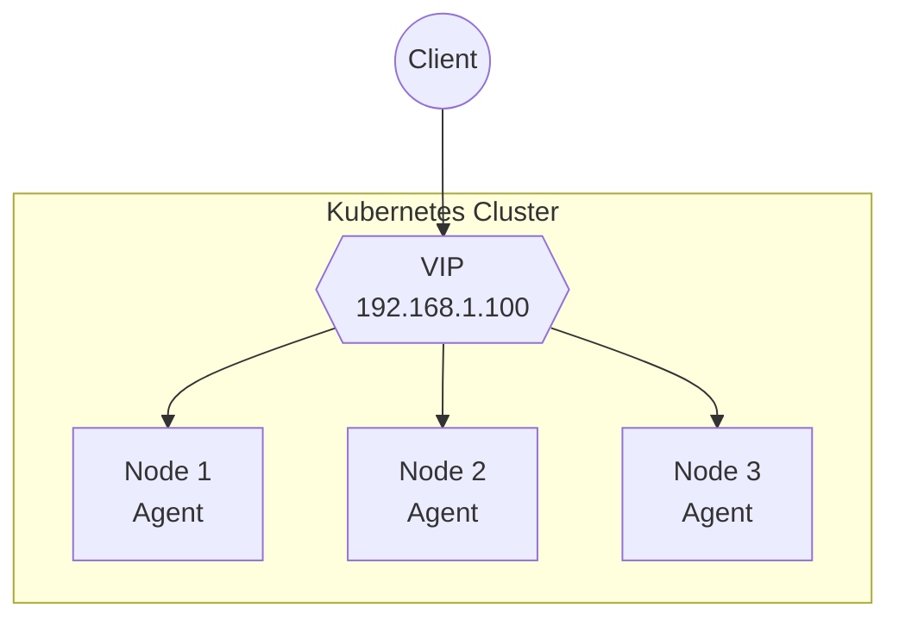
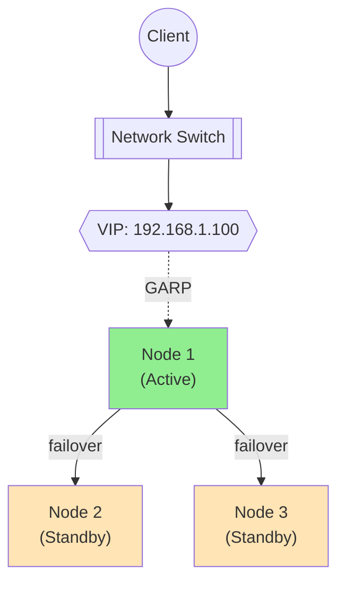
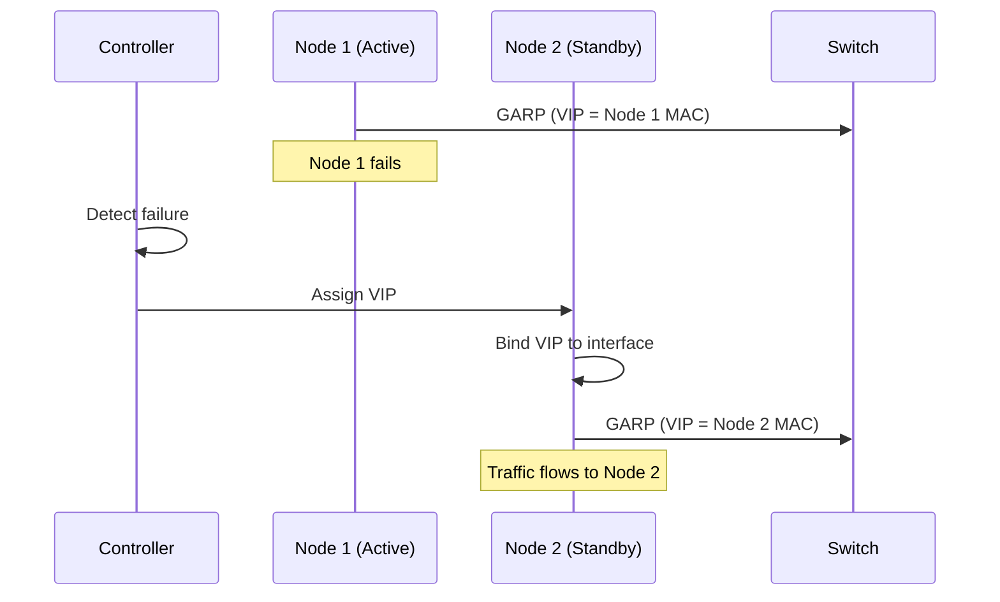
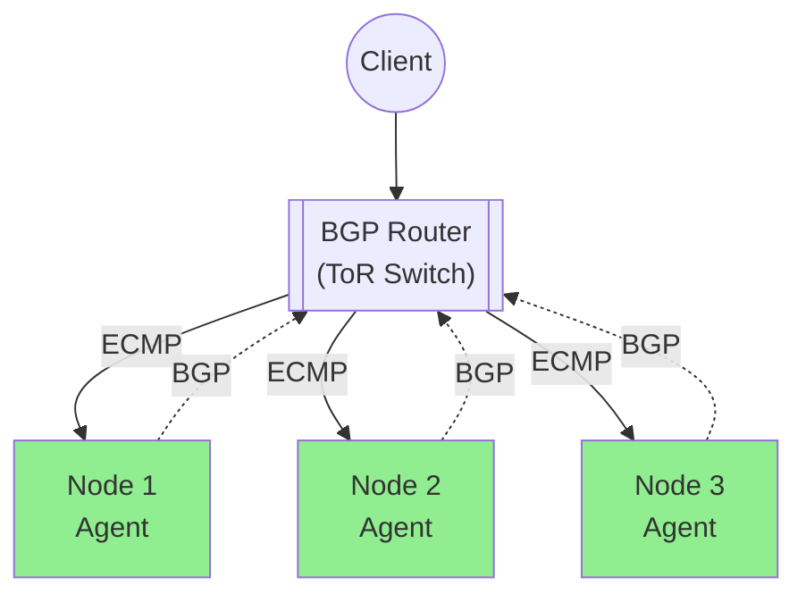
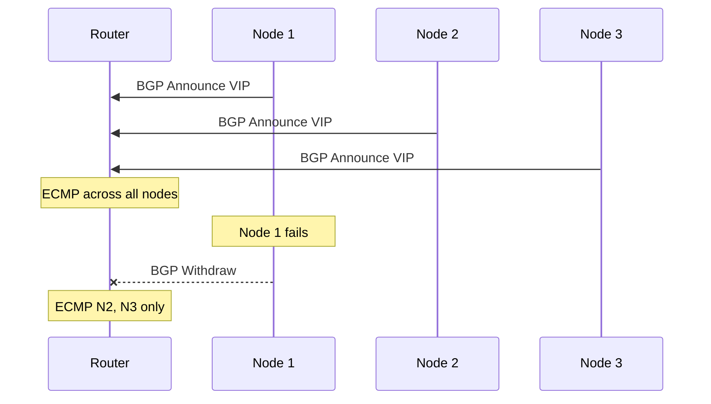
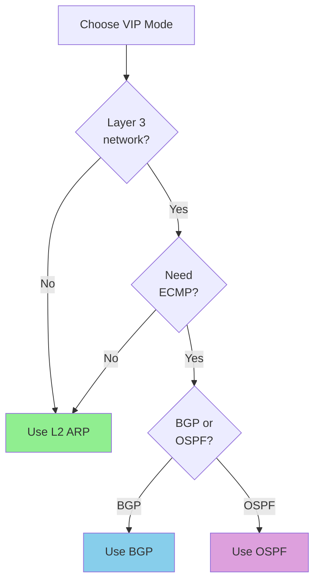

# VIP Management

Configure Virtual IP addresses for bare-metal and on-premises deployments.

## Overview

NovaEdge manages VIPs to provide external access to your services without cloud load balancers.



## VIP Modes

| Mode | Description | Network | Availability |
|------|-------------|---------|--------------|
| L2 ARP | Single active node | Layer 2 | Active/Standby |
| BGP | All nodes announce | Layer 3 | Active/Active |
| OSPF | OSPF routing | Layer 3 | Active/Active |

## L2 ARP Mode

Single node owns the VIP at a time. Uses Gratuitous ARP for failover.



### Configuration

```yaml
apiVersion: novaedge.io/v1alpha1
kind: ProxyVIP
metadata:
  name: main-vip
spec:
  address: 192.168.1.100/32
  mode: L2
  interface: eth0
```

### L2 Options

| Field | Default | Description |
|-------|---------|-------------|
| `address` | - | VIP address with CIDR |
| `mode` | L2 | VIP mode |
| `interface` | - | Network interface to bind |
| `arpInterval` | 3s | ARP announcement interval |

### Requirements

- All nodes on same Layer 2 network
- Network allows Gratuitous ARP
- `NET_ADMIN` and `NET_RAW` capabilities

### Failover Process



## BGP Mode

All healthy nodes announce the VIP via BGP. Router performs ECMP.



### Configuration

```yaml
apiVersion: novaedge.io/v1alpha1
kind: ProxyVIP
metadata:
  name: bgp-vip
spec:
  address: 192.168.1.100/32
  mode: BGP
  bgp:
    asn: 65000
    routerID: "10.0.0.1"
    peers:
      - address: "10.0.0.254"
        asn: 65001
        port: 179
      - address: "10.0.0.253"
        asn: 65001
        port: 179
```

### BGP Options

| Field | Default | Description |
|-------|---------|-------------|
| `asn` | - | Local BGP AS number |
| `routerID` | - | BGP router ID |
| `peers` | [] | List of BGP peers |
| `peers[].address` | - | Peer IP address |
| `peers[].asn` | - | Peer AS number |
| `peers[].port` | 179 | Peer BGP port |
| `peers[].password` | - | MD5 password (optional) |
| `holdTime` | 90s | BGP hold time |
| `keepaliveTime` | 30s | Keepalive interval |

### Cluster Configuration

Configure BGP at the cluster level:

```yaml
apiVersion: novaedge.io/v1alpha1
kind: NovaEdgeCluster
metadata:
  name: novaedge
spec:
  agent:
    vip:
      enabled: true
      mode: BGP
      bgp:
        asn: 65000
        peers:
          - address: "10.0.0.254"
            asn: 65001
```

### Router Configuration (Example: FRRouting)

```
router bgp 65001
 neighbor 10.0.0.1 remote-as 65000
 neighbor 10.0.0.2 remote-as 65000
 neighbor 10.0.0.3 remote-as 65000

 address-family ipv4 unicast
  maximum-paths 16
 exit-address-family
```

### Failover Process



## OSPF Mode

Similar to BGP but uses OSPF routing protocol.

```yaml
apiVersion: novaedge.io/v1alpha1
kind: ProxyVIP
metadata:
  name: ospf-vip
spec:
  address: 192.168.1.100/32
  mode: OSPF
  ospf:
    area: "0.0.0.0"
    interface: eth0
    helloInterval: 10s
    deadInterval: 40s
```

## Multiple VIPs

Create multiple VIPs for different services:

```yaml
---
apiVersion: novaedge.io/v1alpha1
kind: ProxyVIP
metadata:
  name: web-vip
spec:
  address: 192.168.1.100/32
  mode: L2
  interface: eth0
---
apiVersion: novaedge.io/v1alpha1
kind: ProxyVIP
metadata:
  name: api-vip
spec:
  address: 192.168.1.101/32
  mode: L2
  interface: eth0
```

## VIP Status

Check VIP status:

```bash
# Get VIP status
kubectl get proxyvip

# Detailed status
kubectl describe proxyvip main-vip
```

Example status:

```yaml
status:
  phase: Bound
  currentNode: node-1
  lastTransition: "2024-01-15T10:30:00Z"
  conditions:
    - type: Bound
      status: "True"
      reason: VIPAssigned
      message: VIP assigned to node-1
```

## Choosing a Mode



| Scenario | Recommended Mode |
|----------|------------------|
| Simple L2 network | L2 ARP |
| Data center with ToR switches | BGP |
| OSPF-only environment | OSPF |
| Need active/active | BGP or OSPF |
| Cloud environment | Use cloud LB instead |

## Node Affinity

Control which nodes can own VIPs:

```yaml
apiVersion: novaedge.io/v1alpha1
kind: ProxyVIP
metadata:
  name: main-vip
spec:
  address: 192.168.1.100/32
  mode: L2
  interface: eth0
  nodeSelector:
    node-role.kubernetes.io/loadbalancer: "true"
```

## Troubleshooting

### VIP Not Reachable

```bash
# Check VIP status
kubectl get proxyvip main-vip -o yaml

# Check agent logs
kubectl logs -n novaedge-system -l app.kubernetes.io/name=novaedge-agent | grep -i vip

# Verify interface binding (on the active node)
ip addr show eth0
```

### L2 ARP Issues

```bash
# Check ARP table on client
arp -a | grep 192.168.1.100

# Send test ARP from node
arping -I eth0 192.168.1.100
```

### BGP Issues

```bash
# Check BGP session status
kubectl exec -n novaedge-system <agent-pod> -- novactl bgp status

# Verify routes on router
show ip bgp summary
show ip route 192.168.1.100
```

## Metrics

| Metric | Description |
|--------|-------------|
| `novaedge_vip_bound` | VIP bound status (1=bound) |
| `novaedge_vip_failovers_total` | Number of failovers |
| `novaedge_bgp_session_state` | BGP session state |
| `novaedge_bgp_routes_announced` | Routes announced via BGP |

## Next Steps

- [Routing](routing.md) - Configure routes
- [Load Balancing](load-balancing.md) - LB algorithms
- [Observability](../operations/observability.md) - Monitoring
